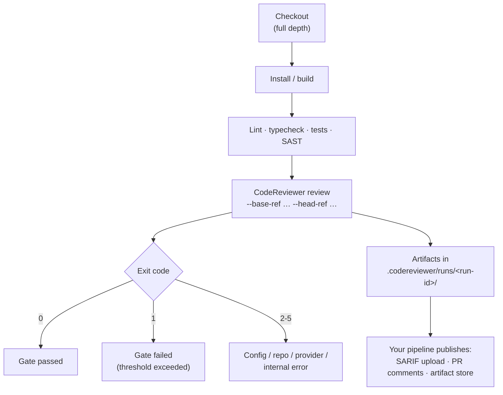

# How It Fits Your Pipeline

This page is about scope: what CodeReviewer is aimed at, what it assumes you
already run, and where it sits in a CI pipeline.

---

## The assumption

The engine is designed on the assumption that your pipeline **already** runs
linters, formatters, type checks, unit tests, build checks, and static analysis.
It does not compete with those and does not reimplement them. Duplicating them is
an explicit non-goal.

What it targets is the layer those tools structurally cannot reach: **semantic
defects** — code that parses, type-checks, passes the linter and the existing
tests, and is still wrong for this change.

| Question | Answered by |
| --- | --- |
| Is it formatted / stylistically consistent? | Formatter, linter |
| Does it type-check? | Compiler / type checker |
| Does it match a known dangerous pattern? | SAST (e.g. CodeQL, Semgrep) |
| Does it still pass the tests we wrote? | Test suite |
| **Does it do what this change intended, on every path?** | **CodeReviewer** |
| **Does the caller's assumption still hold after this edit?** | **CodeReviewer** |
| **Is this authorization check reachable, and does it cover the new case?** | **CodeReviewer** |
| **Does the error path leave state consistent?** | **CodeReviewer** |

The defect classes discovery sweeps are correctness/logic, side effects and
control flow, concurrency and state, interface/type alignment, security, memory
and resources, and data leaks/privacy.

---

## Local structural analysis is support, not a second SAST

The engine does parse your changed files locally (TypeScript, JavaScript, Python,
Go, Rust, Java and Ruby, all through ast-grep). That
stage produces **deterministic support signals** — line anchors, symbol spans,
import/reference hints, related test/config hints, de-duplication keys, and
contradiction checks.

Their job is narrow and deliberate:

- **cluster** related changed files into review tasks so cross-file effects are
  visible in one packet;
- **anchor** findings to real lines and reject invalid locations;
- **contradict** weak claims at admission without spending a provider call;
- **de-duplicate** and produce baseline fingerprints.

They are not the primary detection surface, and with one narrow exception (a
trusted-rule allowlist whose rules carry their own local evidence and a concrete
remediation) they cannot produce an actionable finding on their own. Parser
absence degrades to *fewer hints*, never to a blocked review — the core contracts
are language-neutral, so a language with no extractor still gets a full model
review, just with less structural context.

See [Concepts: deterministic support signals](../03-concepts/pipeline/) for the
full stage description.

---

## Overlap is actively suppressed

The admission gate rejects a candidate that is only a restatement of what an
external linter/SAST/test/build pipeline already reports, unless the semantic
context adds a distinct issue. This is a gate rule, not a guideline — the point is
that adopting CodeReviewer should not double the comment count on findings your
existing tools already own.

---

## Where it sits in CI

Two integration facts follow from the security posture:

- **Generation and publishing are separate.** The engine has no network access
  beyond the configured model provider and no filesystem writes outside the run
  artifact directory. It emits SARIF and inline-comment drafts; the step that
  posts them is yours, and it is the step that needs the write token. Keep the
  review step unprivileged — it is the step that processes untrusted PR content.
- **The reviewed change set is a merge base.** Intake resolves
  `git merge-base <baseRef> <headRef>` and diffs from there, so commits that
  landed on the base branch after divergence do not appear as changed files. If
  no merge base is reachable — typically a shallow clone — the run fails with
  `merge_base_unavailable` (exit 3) rather than silently reviewing unrelated
  commits. Check out with full history.

Exit codes: `0` gate passed, `1` gate failed, `2` config/usage, `3`
repository/filesystem, `4` provider, `5` internal/report. See
[Reference](../06-reference/) for the full contract.

---

## Adopting on an existing codebase

The default quality gate is strict (`maxCritical: 0`, `maxHigh: 0`), so a first
run against a mature repository can fail immediately on pre-existing issues. The
intended workflow is the **baseline**:

1. Run a review.
2. `baseline write` reads that report and records every admitted finding's
   fingerprints to `.codereviewer/baseline.json`.
3. Later runs classify findings as `new`, `existing`, or `resolved`, and
   `failOnNewOnly` (default true) fails the gate only on `new` ones.

Writing the baseline is always an explicit command — the `review` command never
writes it, so a review cannot suppress its own findings.

---

## What "reviewing a change" covers

`review` is scoped to the reviewed diff: the unified diff plus the full
content of every changed file. That answers "does this change introduce a
defect", and it is the job this tool is built for.

It is a different question from "does this codebase contain a defect, changed
or not" — a full repository audit. Measured on the 37-case real-repository
corpus (`openai/gpt-5.3-codex`, engine pinned), `review` finds roughly
60-67% of defects sitting inside the reviewed diff and **0%** of defects
sitting in the untouched part of a changed file, even though it was shown
that file in full — 0 of 27 on one measured denominator, replicated as 0 of
81 against an independently labeled answer key. See
[Status and limitations](status-and-limitations.md) for the numbers and their
replication. A repository-audit mode is not built, and this document makes no
commitment to build one — plan for your existing lint/SAST coverage to keep
owning pre-existing, untouched code.

## Scope boundaries to plan around

Specified as future work, deliberately **not** implemented today:

- CI-native check annotations (a shipped GitHub Action posts PR comments and
  reports pass/fail through the job's exit code — see
  [GitHub integration](../04-guides/github-integration.md) — but it does not
  create Checks-API annotations);
- automatic fix application;
- full-codebase trend dashboards;
- a hosted service or UI.

Network PR-comment publishing is implemented, outside the engine, by the
optional GitHub Actions integration (`scripts/github/` plus
`.github/workflows/code-review.yml`); see
[GitHub integration](../04-guides/github-integration.md). The engine itself
still makes no network call.

See [Status and limitations](status-and-limitations.md) for the current state,
and [Operations](../08-operations/) for CI wiring details.
