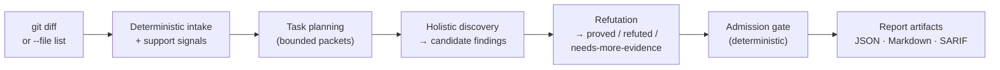

# What CodeReviewer Is

This page explains what the tool does, what it produces, and what it
deliberately does not do. Read it before anything else in these docs.

---

## In one paragraph

CodeReviewer is a local-first, LLM-centric **semantic** code review engine that
runs as a command-line tool. It takes a git diff (or an explicit file list),
reviews the changed files with a model, then puts every proposed problem through
an independent verification step and a deterministic gate before it is allowed
into the report. It writes JSON, Markdown, and SARIF artifacts to a local
directory. It never publishes anything, never modifies your code, and never
executes it.

---

## The shape of a run

The three model-relevant ideas, in order:

1. **Holistic discovery.** For each review task the model reads the task's
   unified-diff segment plus the *full, line-numbered content* of the changed
   files and proposes **candidate findings**. Whole files, not isolated hunks,
   so a defect that a change merely *exposes* elsewhere in the same file stays
   visible.
2. **Refutation.** An independent step tries to prove or disprove each
   candidate from the same bounded context, returning `proved`, `refuted`, or
   `needs-more-evidence`. It is batched per task: one call adjudicates all of
   that task's candidates and returns one verdict each.
3. **Admission.** Deterministic code — not the model — decides what becomes an
   actionable finding: schema valid, location resolves to a reviewed file,
   `proved` verdict, at least one evidence record, in scope, not a duplicate,
   not contradicted, severity allowed.

A candidate is **not** a finding. Only survivors of all three stages appear as
actionable output. See [Why precision first](why-precision-first.md).

---

## What it produces

Every run writes a directory under `.codereviewer/runs/<run-id>/`:

| Artifact | Contents |
| --- | --- |
| `report.json` | Canonical machine-readable report (findings, evidence, candidates, refutation results, coverage). |
| `report.md` | Human-readable report. See [Reading a report](../02-getting-started/reading-a-report.md). |
| `report.sarif` | SARIF 2.1.0 export for code-scanning consumers. |
| `run-summary.json` | Run metadata (ids, timings, warnings, token/cost data when available). |
| `context-ledger.json` | Redacted record of every context item considered, included, skipped, or truncated. |
| `shared-context.json` | Append-only task events, candidates, refutation results, admission decisions. |
| `observability.json` | No-content pipeline step and task-event trace. |

`review-comments.json` and `review-comments.<platform>.json` are written only
when `reporting.reviewComments.enabled` is true. The engine *renders* inline
comment drafts; publishing them is your pipeline's job.

The default report formats are `json`, `markdown`, and `sarif`
(`reporting.formats`).

---

## What it measures at

On a 37-case corpus of real repositories, `review` finds **~61%** of the in-diff known
defects at **100% adjusted precision** for about **$2.24** per run. Split by where
the defect lives: **66.7%** for the 60 expectations inside the diff, **0 of 27**
for the ones sitting elsewhere in a changed file.

Read the second half of that sentence as the product's actual shape. What it
reports is almost always real; it finds fewer than half the defects present; and
it finds essentially nothing the change does not point at — even when it was shown
the whole file. → [Current results](../05-quality/current-results.md)

---

## Three advisory commands alongside the review

`review` is the only command that can block. Three others run independently, share
no context with it and with each other, and **always exit `0` whatever they
report**:

| Command | What it produces |
| --- | --- |
| `intent check` | A mapping between a stated intent and the change: the obligations the intent states, each citing the line it was read from, and for each one either the changed lines that evidence it or nothing. Not a verdict. |
| `impact check` | A deterministic reference report — which symbols the change touched and where they are used. No provider call, so it costs nothing and its output is reproducible. |
| `conformance check` | Divergences between a changed declaration and its peers: "these N peers do X; this declaration does not", with the peers listed so a human judges. No verdict, no severity. |

**None of the three has an accuracy measurement.** They are implemented and
runnable; they are not validated. Advisory-only is a spec requirement for
`intent check` and `conformance check` rather than a default — there is no
`blocking` key to find, and adding one would be a switch that lies.

---

## Two properties that hold everywhere

- **Model output is untrusted until admitted.** Candidates, refutation
  rationales, instruction files, skill files, and repository content are all
  treated as untrusted input. Nothing a model says can grant itself authority,
  change severity, bypass the gate, or alter the baseline.
- **External processing is bounded and auditable.** Every byte of source sent to
  a provider is selected under explicit budgets and recorded (redacted) in the
  context ledger. A completed report carries a **coverage certificate** proving
  which files and how many bytes were actually reviewed; a run that could not
  cover its declared scope fails closed rather than reporting success.

By default, logs, traces, reports, and errors contain no prompt text, source
snippets, secrets, tokens, or raw provider payloads.

---

## What it is not

| Not | Detail |
| --- | --- |
| A linter / formatter / type checker | It assumes those already run in your pipeline and does not duplicate them. |
| A SAST replacement | It does not reimplement CodeQL/Semgrep-class analysis; local structural parsing is a *support* signal only. |
| A publisher | No network PR comments, no CI check annotations, no SARIF upload. It writes local files. |
| An auto-fixer | Suggested fixes are text/structured proposals. Nothing is ever applied to your files. |
| A service | No API server, no browser UI, no database, no daemon, no persisted session state. |
| A merge authority | Merge and publishing decisions stay deterministic and local; a model verdict alone never blocks or approves. |

It also runs no shell commands and executes no project code. Git usage is
read-only and allowlisted.

---

## Model provider is optional

With no `provider` configured, the run still works: intake, deterministic
support signals, planning, admission, reporting, quality gate, and drift checks
all execute — there is simply no model-backed discovery, so no model-origin
findings. This is useful for verifying plumbing and CI wiring without spending
tokens.

Provider adapters (OpenAI / OpenAI-compatible, AWS Bedrock, Azure AI Foundry)
are **optional peer packages**, imported dynamically only for the provider you
configure. The base install pulls in no provider SDK.

---

## Where to go next

- [Why precision first](why-precision-first.md) — the mechanism behind the low-noise contract.
- [How it fits your pipeline](how-it-fits-your-pipeline.md) — what this covers that your existing tools do not.
- [Status and limitations](status-and-limitations.md) — what is unfinished, unproven, or off by default. Read this before adopting.
- [Glossary](glossary.md) — the vocabulary used throughout these docs.
- [Install and run](../02-getting-started/install-and-run.md) — get it running from source.
- [Concepts: review lifecycle](../03-concepts/review-lifecycle.md) — the pipeline in depth.
