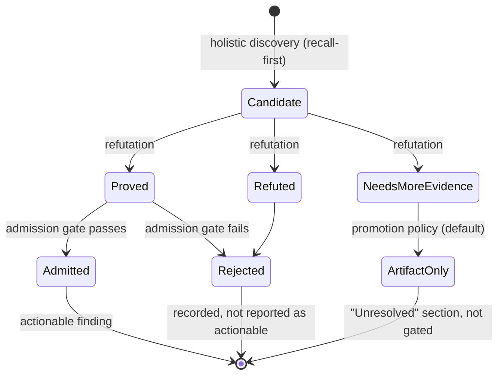

# Why Precision First

This page explains the design decision that shapes everything else: the engine
would rather stay quiet than be wrong, and it enforces that with code, not with
prompt wording.

---

## The problem being solved

A review tool that comments generously is easy to build and easy to ignore. Once
a reviewer has dismissed a handful of confident-sounding non-issues, it stops
being read at all — and the real defect in the eleventh comment goes with it.
Comment volume is therefore not the objective. The stated product goal is
correctness, traceability, privacy, and **low noise** over comment volume.

So the engine is built around one question: *what has to be true before a
suggestion is allowed to take a human's attention?*

---

## Three independent filters

Recall and precision pull against each other, so the engine separates them into
different stages instead of asking one prompt to balance both.

### 1. Discovery is deliberately recall-first

Discovery's job is to *find things*, not to be right. It reads the whole changed
file plus the diff, follows a fixed method (understand the intent → trace control
and data flow → verify against that intent → sweep defect classes), and emits
candidates. It is explicitly told to skip style, naming, formatting,
documentation, and cleanup-only concerns, but within the space of concrete
defects it is allowed to be aggressive.

Nothing it produces is user-visible yet. Candidates are quarantined: they do not
even reach later workers' shared digest until they pass the safe-digest
boundary.

### 2. Refutation is the precision lever

An independent step re-examines each candidate and returns a verdict:

| Verdict | Disposition |
| --- | --- |
| `proved` | Continues to the admission gate; may become actionable. |
| `refuted` | Rejected. |
| `needs-more-evidence` | Dispositioned by `promotionPolicy.modelWeakOrRefuted` — default `artifact-only` (surfaced for a human, excluded from the gate and from inline comments); set `rejected` to drop it entirely. |

Two details matter:

- **A candidate with no verdict is not admitted.** Each verdict carries the
  `candidateId` it belongs to; a verdict matching no candidate is discarded, and
  a candidate the model failed to adjudicate is treated as
  `needs-more-evidence`. Absence of a verdict is absence of signal, never an
  admission.
- **Refutation cannot be turned off.** `aiReview.requireRefutation` is a literal
  `true` in the config schema — it is not a toggle.

One refutation rule is load-bearing and documented as such: a finding that is
reachable only by violating a declared type, signature, schema, or contract is
refuted. Relaxing that rule was measured on the real-repository corpus. It
admitted one correct finding the rule had been suppressing, but adjusted
precision fell from 100% to 86.7% with two genuine false positives and no net
recall gain, so the change was reverted.

That measurement, and every other rate on this page, ran on
`openai/gpt-5.3-codex`. Each one is a property of that model rather than of the
engine, and says nothing about another provider or model.

### 3. Admission is deterministic

The final gate is ordinary code. A candidate becomes an actionable finding only
when **all** of these hold:

1. it validates against the finding schema;
2. its location resolves to a reviewed file, inside source-derived reviewed line
   ranges;
3. for model-origin candidates, a refutation verdict of `proved` exists;
4. at least one redacted evidence record supports it (model-generated confidence
   scores are not evidence and are not a report field at all);
5. it is in scope — blast radius is the changed file, so a defect the change
   exposed counts, and only files with no reviewed change are out of scope;
6. it is not a duplicate of an already-admitted finding;
7. it is not contradicted by a deterministic safety check;
8. it is not merely a restatement of what an external linter/SAST/test/build
   pipeline already reports, unless semantic context adds a distinct issue;
9. its severity is allowed by policy;
10. its evidence summaries are redacted;
11. reporter eligibility (`inline` / `summary-only` / `artifact-only`) is
    computed deterministically.

Deterministic support signals can *corroborate* a candidate, but corroboration
never bypasses refutation for model-origin output.

---

## The severity floor

Model-origin candidates below `aiReview.actionableSeverityThreshold` (default
`medium`) are rejected as `below-threshold` rather than admitted. They remain in
the report's rejected list, so they are auditable, but they do not take reviewer
attention. Lower the threshold to `low` or `info` if you want more surfaced.

Separately, `review.inlineSeverityThreshold` (default `high`) decides which
admitted findings are eligible to become inline comments at all.

---

## What precision-first costs, and how that cost is contained

Being strict means real defects get filtered out too. Two mechanisms keep that
from becoming a silent loss:

- **Nothing is deleted quietly.** Rejected candidates and their reject reasons,
  every refutation verdict with its rationale, and every evidence ID are written
  into `report.json` and rendered into `report.md`. You can audit precisely why a
  suggestion did not make it.
- **Undecidable suspicions get their own section.** A candidate the refuter could
  neither prove nor disprove — usually because the evidence lives outside the
  context it could reach — is rendered under
  **"Unresolved - Needs Human Decision"** with its severity, location,
  description, and the recorded reason it stayed unresolved. Those items are
  excluded from the quality gate and from inline comments, so surfacing them
  neither blocks a build nor adds review noise.

---

## How precision is measured, not asserted

Precision claims are only as good as their measurement, and the evaluation
harness is built to avoid flattering itself:

- **Unmatched is not the same as wrong.** A fixture's expected-finding list is a
  curated subset of the defects in a change, so a precision-first reviewer
  routinely surfaces genuine defects the list omits. A second, independent
  plausibility judge decides whether an unmatched finding is a real defect;
  `adjustedPrecision` is the trustworthy figure, and `genuineFalsePositiveCount`
  the trustworthy noise count. Judgments that cannot be completed fail closed —
  counted as false positives.
- **Judges are themselves scored.** Semantic matching is decided by a judge, not
  by word overlap, and the judge is calibrated each run against a committed
  human-labeled set. Below the configured agreement minimum, the run reports its
  own metrics as untrustworthy (`scoring.judgeTrustworthy`).
- **One run is not a result.** Model-backed evaluation is non-deterministic. Four
  seeds of one identical configuration on the real-repository corpus produced
  recall of 81.3%, 87.5%, 81.3%, and 75.0% — mean 81.3%, standard deviation 4.4
  percentage points. A headline figure is the mean across seeds, never the best
  observed run, and a change smaller than roughly twice that deviation cannot be
  distinguished from noise on a single seed.

See [Quality and evaluation](../05-quality/) for the metric definitions and how
to run a comparison, and [Status and limitations](status-and-limitations.md) for
what is currently *not* proven.

---

## See also

- [What it is](what-it-is.md)
- [Glossary](glossary.md) — `candidate`, `refutation`, `admission`, `artifact-only`, `adjusted precision`.
- [Concepts: trust model](../03-concepts/trust-model.md)
- [Concepts: review lifecycle](../03-concepts/review-lifecycle.md)
