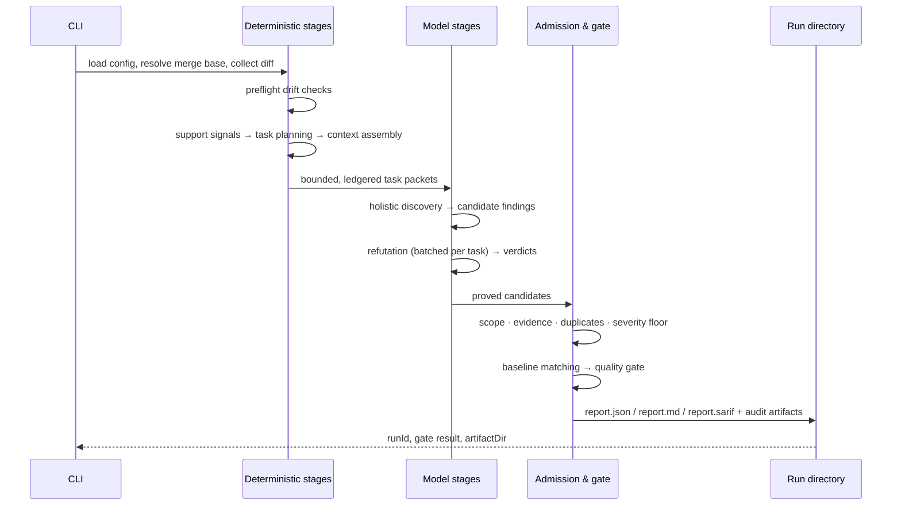

# Your First Review

Run a review end to end, understand what the engine did, and know what to do
with the exit code. Assumes you have followed
[Install and run](install-and-run.md).

---

## Step 1 — Run without a provider first

Do this before spending any tokens. With no `provider` configured, the run
executes intake, deterministic support signals, task planning, admission,
reporting, the quality gate, and the drift preflight — everything except
model-backed discovery. It is the cheapest way to prove your wiring, paths, and
git refs are right.

```bash
codereviewer review --base-ref origin/main --head-ref HEAD
```

(Substitute your invocation from [Install and run](install-and-run.md) — either
`npm run cli -- review …` or `node /path/to/codereviewer/dist/cli/main.js review …`.)

On success the command prints JSON to stdout:

```json
{
  "runId": "run-3f2c…",
  "qualityGatePassed": true,
  "artifactDir": ".codereviewer/runs/run-3f2c…"
}
```

Expect **no findings**: without a provider there is no model-backed discovery, so
`report.md` says so in as many words rather than rendering an empty section. What
you are checking is that the run completed, that `report.md` shows the file count
you expected under `Scope of this search`, and that nothing landed in `Skipped
Files` by surprise:

```text
## Scope of this search

- Run: `run-3f2c…` (mode local, depth balanced)
- Files read in full: 1 of 1 reviewable (116 of 116 bytes). Coverage status: complete — a statement that the source reached a model, not that every defect in it was found.
```

Getting this wrong is cheap here and expensive one step later — a scope mistake
discovered after a paid run is the same information for money.

---

## Step 2 — Add a provider and review for real

Configure `provider.id` and `provider.model` (plus credentials) as described in
[Install and run](install-and-run.md) — that is the whole configuration needed —
then run the same command. Useful variations:

```bash
# Review specific files, bypassing the git diff entirely
codereviewer review --file src/payments/charge.ts --file src/payments/refund.ts

# Review the working branch against its base, with debug logging to a file
codereviewer review --base-ref origin/main --head-ref HEAD \
  --debug --log-file .codereviewer/review.log
```

---

### What a first real review should look like

Calibrate before you read it, or you will misread a working install as a broken
one. On a 37-case corpus of real repositories, against `openai/gpt-5.3-codex`,
the engine finds **~61%** of the in-diff known defects at **100% adjusted
precision**. A short report is the normal case — a long one would be the
surprise. Both rates here were measured on that model; on a different one they
are not a calibration.

Two consequences for a first run:

- **Few or no findings on a small, clean change is expected**, not a
  misconfiguration. Check `Scope of this search` and `Skipped Files` to confirm
  it actually looked, then move on. The report states these same rates in its own
  header, so a reader who never opens this page is calibrated too.
- **A defect elsewhere in a file you changed will probably not be reported.**
  Measured: recall on those is 0 of 27, in files the reviewer was shown in full.
  Don't tune for it; re-run after fixing what it *did* find, which moves the diff
  and therefore what it looks at next.

---

## What happens during the run



Three things worth knowing on a first run:

- **The reviewed change set is measured from the merge base** of your base and
  head refs, not from the base branch tip. Commits that landed on the base after
  you branched are not part of your diff.
- **Discovery reads whole changed files**, not just the diff hunks, so a defect
  the change *exposes* elsewhere in a changed file is in scope.
- **Every model-proposed issue is verified independently** before it can be
  reported as actionable. See [Why precision first](../01-overview/why-precision-first.md).

---

## The run directory

```text
.codereviewer/runs/<run-id>/
├── report.json           # canonical report
├── report.md             # human-readable report
├── report.sarif          # SARIF 2.1.0 export
├── run-summary.json      # ids, timings, warnings, token/cost data
├── context-ledger.json   # what context was considered / included / skipped
├── shared-context.json   # task events, candidates, verdicts, decisions
└── observability.json    # no-content step and task-event trace
```

Plus `review-comments.json` and `review-comments.<platform>.json` when
`reporting.reviewComments.enabled` is true.

An `index.json` at the root of the artifact directory lists recent runs (newest
first, capped at 50 entries) so tooling can find the latest report.

Start with `report.md` — see [Reading a report](reading-a-report.md).

---

## Exit codes

| Code | Meaning | What to do |
| --- | --- | --- |
| `0` | Run completed, quality gate passed. | Nothing. |
| `1` | Run completed, quality gate failed. | Read the findings. This is a quality signal, not a crash. |
| `2` | Configuration, usage, or path error. | Fix the flag or config; `config validate` helps. |
| `3` | Repository or filesystem error. | See `merge_base_unavailable` below. |
| `4` | Provider/model runtime error. | Partial artifacts are written; see `error.json`. |
| `5` | Internal, admission, or report error. | A bug — capture the run directory. |

Errors are printed to stderr as JSON with a stable `code` and a redacted
`message`.

---

## Common first-run problems

**`merge_base_unavailable` (exit 3).**
Your checkout has no history connecting the two refs — almost always a shallow
clone. Fetch full history (`fetch-depth: 0` in CI). The engine refuses to fall
back to a direct base→head diff because that would report unrelated base-branch
commits as your change.

**The gate fails on pre-existing issues (exit 1).**
Defaults are strict: `maxCritical: 0`, `maxHigh: 0`. On an established codebase,
accept the current state as a baseline and fail only on new findings:

```bash
codereviewer review --base-ref origin/main --head-ref HEAD
codereviewer baseline write
```

`baseline write` reads the most recent completed report (override with
`--report <path>`) and writes the fingerprints of its admitted findings to
`baseline.path` (default `.codereviewer/baseline.json`). Subsequent runs mark
findings `new` / `existing` / `resolved`, and `failOnNewOnly` (default `true`)
gates only on `new`. The `review` command never writes the baseline itself.

**No findings at all, with a provider configured.**
Check `report.md`:

- `Skipped Files` — deleted, binary, oversized (`review.maxFileBytes`, default
  500000 bytes), or excluded by `paths.exclude` (lock files, minified bundles,
  source maps, and snapshots are excluded by default).
- `Rejected Candidates` — candidates that *were* raised and then filtered. A
  `below-threshold` reason means the severity floor
  (`aiReview.actionableSeverityThreshold`, default `medium`) rejected them.
- `Provider Issues` — a provider failure during refutation keeps candidates out
  of actionable output rather than admitting them unverified.
- The **"Unresolved - Needs Human Decision"** section — suspicions that could
  neither be proved nor disproved.

**Exit 4 with a partial run.**
When a provider fails after task execution began, the run writes
`run-summary.json`, `context-ledger.json`, `shared-context.json`,
`observability.json`, and `error.json`, and prints the artifact directory on
stderr. Runs are not resumable — rerun the command; it re-plans from scratch.

**Nothing is logged.**
Logging defaults to `silent`. Use `--log-level info` or `--debug`. Logs never
contain source, prompts, secrets, or provider payloads.

---

## Next

- [Reading a report](reading-a-report.md) — section by section.
- [Concepts: review lifecycle](../03-concepts/review-lifecycle.md) — what each stage does and why.
- [Guides](../04-guides/) — tuning depth, mode, thresholds, instructions, and skills.
- [Operations](../08-operations/) — CI integration and troubleshooting.
