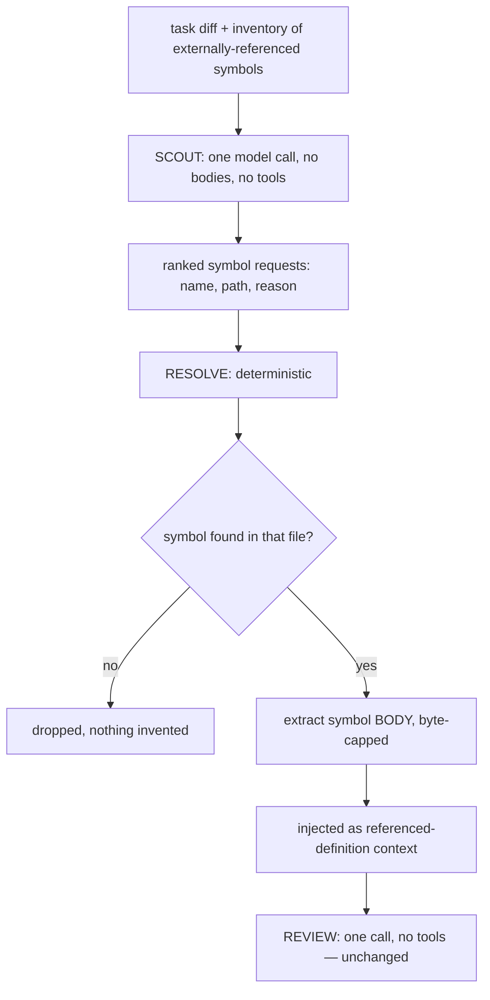

# Context Scout

> **Verdict: measured neutral.** It neither helped nor hurt. Safe to enable, but
> there is no demonstrated reason to.

Spec: [`specs/18-context-scout.md`](../../../specs/18-context-scout.md) — status
*Approved (capability off by default; measured neutral)*, 2026-07-25.

## The problem it addresses

Cross-file defects are the dominant remaining recall gap: of the five cases the
reviewer misses on the 16-case real-repository corpus, **four depend on evidence
outside the changed set**.

The obvious remedy — handing the discovery agent repository tools
([cross-file retrieval](cross-file-retrieval.md)) — lost recall in all three of its
measurements. The literature explains why: tool use costs accuracy when context
selection and reasoning happen in one step; the recommended remedy is to
pre-assemble context or delegate retrieval to a separate agent.

The scout applies that separation: **a cheap model call decides what extra code is
relevant, deterministic code fetches it, and the reviewer stays single-shot and
tool-free.**

## How it works

1. **Scout.** One model call receives the diff and a compact inventory of the
   symbols the changed files reference from outside themselves (name plus
   declaring file, from existing deterministic import/declaration facts). It gets
   **no file bodies and no tools**. It returns a bounded, ranked list with a short
   reason each.
2. **Resolve.** Deterministic code maps each requested symbol to a declaring file
   and extracts that symbol's **body** — not merely its signature. Unresolvable
   requests are dropped; nothing is invented. Every read goes through the mediated
   retriever, so eligibility, redaction, and containment apply as always.
3. **Review.** The bodies are injected as ordinary `referenced-definition` context,
   which the discovery prompt already frames as context-only, never a review
   target. Discovery runs exactly as it does today.

The scout never decides anything about findings. Its own output is untrusted
input. Its prompt says so, and it is told that returning an **empty list is the
common, expected, fully correct answer** for a self-contained change.

### Why this is not cross-file retrieval again

Spec 16 gave the *reviewing* agent tools, so one agent both chose context and
judged code. Here the reviewer's prompt shape and step count are unchanged; the
only difference is that its `referenced-definition` section contains bodies chosen
for *this* change instead of signature windows chosen by import frequency. If the
scout also failed to help, the failure would be attributable to the *content* of
the context rather than to tool-use behavior — which spec 16 could not separate.

## Configuration

| Key | Type | Default | Notes |
| --- | --- | --- | --- |
| `review.contextScout.enabled` | boolean | `false` | |
| `review.contextScout.maxSymbols` | integer 1–40 | `8` | A relevance ration, not a loop guard: the reproducible failure mode of extra context is dilution, so the scout must rank and spend its budget on decisive symbols |
| `review.contextScout.maxBytesPerSymbol` | integer 500–40000 | `4000` | Big enough for a whole ordinary function body, not a whole large file |

Budget pressure sheds scout context **before** it sheds changed-file source.
Disabled, no scout call is issued and the referenced-definition section is produced
exactly as before. Any scout failure degrades to no extra context — the scout is an
aid, so a scout that errors costs context, never the review.

## Measured evidence

2026-07-25, 16-case real-repository corpus, against the same-model baseline, single
variable, zero provider errors in both arms.

| Metric | Baseline | With scout |
| --- | --- | --- |
| Recall | 62.5% (10 matched) | **62.5%** (10 matched) |
| Adjusted precision | 100% | **100%** (0 genuine FP) |
| Severity accuracy | 70% | **70%** |
| Cost | — | **+27%** |
| Cases gained / lost | — | 4 / 4 |

Four gained and four lost is churn, not signal — and the engagement data shows why:

- The scout resolved a symbol on only **3 of 18 tasks**. On 13 of 16 cases it added
  nothing at all, so a flip on those cases cannot be attributed to it.
- Where it *did* engage it stayed focused: 1–3 symbols, 879–2255 bytes. That is
  exactly the intended behavior, and the opposite of the 162KB single reads that
  characterised the tool-enabled reviewer.

## Verdict

**Separating selection from judgment removed the harm; it has not yet produced a
gain.** Read against [cross-file retrieval](cross-file-retrieval.md), that
comparison is the informative result: giving the reviewer tools cost recall in
every measurement, while moving the same job into a separate selection call costs
nothing and damages nothing.

The actionable gap is **engagement, not safety**: either the scout is too
conservative about asking, or these cases' evidence is not reachable by naming a
symbol in an imported file. That is what a next iteration should attack, and a
wider corpus should confirm, before this ships enabled.

## Where it lives

- [`src/domains/review-workflow/pipeline/discovery/context-scout.ts`](../../../src/domains/review-workflow/pipeline/discovery/context-scout.ts)
- `modelContextScoutInstructions` in [`agent-instructions.ts`](../../../src/domains/review-workflow/pipeline/agent-instructions.ts)
- `ContextScoutConfigSchema` in [`config.schema.ts`](../../../src/shared/contracts/config/config.schema.ts)

## Related

- [Cross-file retrieval](cross-file-retrieval.md) — the mechanism this replaced
- [Decision table](README.md)
