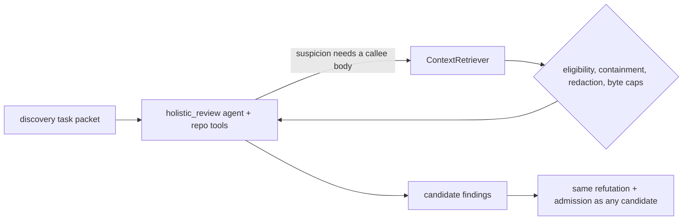

# Cross-File Retrieval

> **On by default since 2026-08-01. The earlier "net negative" verdict is
> withdrawn** — those three arms were measuring a per-read truncation the model
> was never told about, not the capability. Two re-runs with the cut disclosed led
> on every dimension measured. No specific gain is claimed for it.

Spec: [`specs/16-agentic-cross-file-discovery.md`](../../../specs/16-agentic-cross-file-discovery.md) —
status *Approved (capability enabled by default since 2026-08-01; the earlier
"measured net negative" verdict is overturned)*.

Every recall, precision and cost figure on this page was measured on
`openai/gpt-5.3-codex`. The verdict is a verdict for that model.

## The problem it addresses

Holistic discovery sees only the changed files, the diff, and bounded
signature-level digests of directly-imported unchanged files. A defect whose
presence depends on the *behavior* of code in another file is therefore invisible:
on the committed benchmark, cross-file recall is **0%**.

The dominant cross-file misses are high-severity authorization defects — a changed
file calls a helper defined elsewhere (`getOrCreateResource`, `findByName`) and the
bug is a mismatch between how that helper creates a resource and how the changed
code looks it up. Catching that requires the callee's **body**, not its signature.

## How it works

The discovery agent for a task is given the mediated `repo_read` / `repo_list` /
`repo_grep` tools and a per-task tool-call budget. This is the default; set
`enabled: false` to take the tools away.

- **Bounded by code, not by the model.** `maxToolCallsPerTask` is a runaway-loop
  guard enforced in code — its purpose is to stop a model that never stops
  requesting reads, not to ration context. Measurement showed the model self-limits
  well below the cap (0–7 calls when 8 were allowed, never exhausting it), so the
  cap is set generously.
- **Tool calls are agent *steps*,** bounded by the discovery agent's step
  allowance. They never count against the workflow's child-agent call budget.
- **Per-task isolation.** Tasks run concurrently in one workflow session, so the
  bounded tools are carried in an `AsyncLocalStorage` scope
  ([`mediated-repo-tools.ts`](../../../src/domains/review-workflow/pipeline/mediated-repo-tools.ts)) —
  each task gets an independent scope with an independent budget.
- **Additive to recall only, in principle.** Enabling it can only let the model see
  more; it never removes a finding the single-shot pass would make. What it can and
  did do is change what the model *attends to*.
- Retrieved content is untrusted repository data and the prompt is hardened against
  injection from it — see [trust model](../trust-model.md).

## Configuration

| Key | Type | Default | Notes |
| --- | --- | --- | --- |
| `review.crossFileRetrieval.enabled` | boolean | `true` | |
| `review.crossFileRetrieval.maxToolCallsPerTask` | integer 1–500 | `100` | Runaway-loop guard, not a context ration |
| `review.crossFileRetrieval.maxBytesPerRead` | integer 1000–4000000 | *unset* | A read is not cut in advance. The reviewer locates what it needs with `repo_grep` and re-reads that line range; when a real limit binds, the provider says so and the read budget is halved on retry. Setting this is a deliberate operator choice and still binds, with the cut disclosed to the reviewer |

Disabled, discovery issues no tool call and is configured with no tools and a
single step — the run is byte-for-byte identical to a build without the
capability.

## Measured evidence

### The three arms that produced the withdrawn verdict

All on the real-repository corpus, which exists precisely to give cross-file
retrieval a fair test (the checkouts are full repositories, so the evidence for a
cross-file defect is actually reachable). 2026-07-24 / 2026-07-25.

**Read these as a measurement of the per-read cap, not of the capability.** Every
retrieved file was cut at `maxBytesPerRead` and the model was never told, so a
reviewer concluded a guard was absent from code it had seen only part of — and
the files most worth consulting are exactly the large ones that were cut. The
numbers below are reported unchanged; what they measured is what changed.

| Corpus size | Baseline recall | With retrieval | Cases gained / lost | Cost | Precision |
| --- | --- | --- | --- | --- | --- |
| 4 cases | — | flat | 1 / 1 | **2.5×** | 100% adjusted, 0 genuine FP |
| 9 cases (per-read excerpt cap applied and verified) | 66.7% | **44.4%** | 0 / 2 | **+78%** | 100% adjusted, 0 genuine FP |
| 16 cases (11 carry cross-file evidence) | 68.8% | **56.3%** | 1 / 3 | **+71%** | 100% adjusted, 0 genuine FP |

- Adjusted precision stayed at 100% with zero genuine false positives in **every**
  arm, so the loss is recall, not noise.
- Which individual case flips varies between runs — one cross-file security case
  was gained at four cases, found by the baseline unaided at nine, and lost at
  sixteen. No single case is evidence either way; the aggregate direction is what
  holds. An earlier reading that credited the mechanism with flipping that case is
  **withdrawn**.

### The two runs that reversed it

The second of the two hypotheses below — *a truncated excerpt of an unfamiliar
file misleads more than it informs* — turned out to be the whole effect. The cap
was removed (spec 28) and the remaining cut disclosed to the reviewer, and two
independent runs then put retrieval ahead on **every** measured dimension: recall
up both times (**+5.7pp, +2.3pp**), adjusted precision at **100%** both times
against 97.4% and 95.0%, cost **down** both times (**−8%, −5%**), latency inside
noise, and zero provider errors across all four arms.

## Verdict

**On by default.** Neither run's recall gain is statistically significant, and no
specific improvement is claimed — one model, one corpus. But significance is the
bar for *claiming* a benefit, not for permitting a default that is free, harmless
and directionally positive twice. If a regression ever appears, this is the first
switch to flip.

What this does **not** fix is the larger blind spot. Measured on the 37-case
corpus, recall on defects outside the diff is **0 of 27**, and every one of those
27 sat in a file the reviewer had already been shown in full — none needed
retrieval at all. That is an attention failure, not an information failure.

The remaining open hypothesis is the first of the two this page originally listed:
that tool-use mode itself diverts attention from the diff to retrieval. The public
literature names the effect — tool use costs accuracy when context selection and
reasoning happen in one step — and its recommended remedy, delegating retrieval to
a separate agent, was built here as the [context scout](context-scout.md) and then
[removed](context-scout.md) without ever being validly measured, once a controlled
experiment showed the reviewer largely does not read the context it already has.

## Where it lives

- [`src/domains/review-workflow/pipeline/mediated-repo-tools.ts`](../../../src/domains/review-workflow/pipeline/mediated-repo-tools.ts)
- `crossFileRetrievalInstructions` in [`agent-instructions.ts`](../../../src/domains/review-workflow/pipeline/agent-instructions.ts)
- `CrossFileRetrievalConfigSchema` in [`config.schema.ts`](../../../src/shared/contracts/config/config.schema.ts)

## Related

- [Context scout (removed)](context-scout.md) — the same job separated into its own
  call, removed on mechanism without a valid measurement
- [Decision table](README.md)
