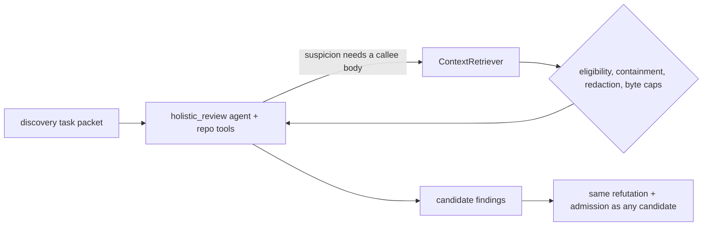

# Cross-File Retrieval

> **Verdict: net negative. Do not enable.** Built, bounded, hardened, and measured
> three times on the corpus designed to favour it. It lost recall every time.

Spec: [`specs/16-agentic-cross-file-discovery.md`](../../../specs/16-agentic-cross-file-discovery.md) —
status *Approved (capability off by default; measured net negative)*, 2026-07-24.

## The problem it addresses

Holistic discovery sees only the changed files, the diff, and bounded
signature-level digests of directly-imported unchanged files. A defect whose
presence depends on the *behavior* of code in another file is therefore invisible:
on the committed benchmark, cross-file recall is **0%**.

The dominant cross-file misses are high-severity authorization defects — a changed
file calls a helper defined elsewhere (`getOrCreateResource`, `findByName`) and the
bug is a mismatch between how that helper creates a resource and how the changed
code looks it up. Catching that requires the callee's **body**, not its signature.

## How it works

When enabled, the discovery agent for a task is given the mediated
`repo_read` / `repo_list` / `repo_grep` tools and a per-task tool-call budget.

- **Bounded by code, not by the model.** `maxToolCallsPerTask` is a runaway-loop
  guard enforced in code — its purpose is to stop a model that never stops
  requesting reads, not to ration context. Measurement showed the model self-limits
  well below the cap (0–7 calls when 8 were allowed, never exhausting it), so the
  cap is set generously.
- **Tool calls are agent *steps*,** bounded by the discovery agent's step
  allowance. They never count against the workflow's child-agent call budget.
- **Per-task isolation.** Tasks run concurrently in one workflow session, so the
  bounded tools are carried in an `AsyncLocalStorage` scope
  ([`cross-file-tools.ts`](../../../src/domains/review-workflow/pipeline/discovery/cross-file-tools.ts)) —
  each task gets an independent scope with an independent budget.
- **Additive to recall only, in principle.** Enabling it can only let the model see
  more; it never removes a finding the single-shot pass would make. What it can and
  did do is change what the model *attends to*.
- Retrieved content is untrusted repository data and the prompt is hardened against
  injection from it — see [trust model](../trust-model.md).

## Configuration

| Key | Type | Default | Notes |
| --- | --- | --- | --- |
| `review.crossFileRetrieval.enabled` | boolean | `false` | |
| `review.crossFileRetrieval.maxToolCallsPerTask` | integer 1–500 | `100` | Runaway-loop guard, not a context ration |
| `review.crossFileRetrieval.maxBytesPerRead` | integer 1000–200000 | `24000` | Retrieval reads whole files; one oversized read measurably diluted a review, so a retrieved file is bounded to an excerpt and the model narrows with `repo_grep` |

Disabled, discovery issues no tool call and is configured with no tools and a
single step — the run is byte-for-byte unchanged.

## Measured evidence

All arms on the real-repository corpus, which exists precisely to give cross-file
retrieval a fair test (the checkouts are full repositories, so the evidence for a
cross-file defect is actually reachable). 2026-07-24 / 2026-07-25.

| Corpus size | Baseline recall | With retrieval | Cases gained / lost | Cost | Precision |
| --- | --- | --- | --- | --- | --- |
| 4 cases | — | flat | 1 / 1 | **2.5×** | 100% adjusted, 0 genuine FP |
| 9 cases (per-read excerpt cap applied and verified) | 66.7% | **44.4%** | 0 / 2 | **+78%** | 100% adjusted, 0 genuine FP |
| 16 cases (11 carry cross-file evidence) | 68.8% | **56.3%** | 1 / 3 | **+71%** | 100% adjusted, 0 genuine FP |

- Adjusted precision stayed at 100% with zero genuine false positives in **every**
  arm, so the loss is recall, not noise.
- Which individual case flips varies between runs — one cross-file security case
  was gained at four cases, found by the baseline unaided at nine, and lost at
  sixteen. No single case is evidence either way; the aggregate direction is what
  holds. An earlier reading that credited the mechanism with flipping that case is
  **withdrawn**.

## Verdict

Three measurements, all on the corpus built to favour the capability, all pointing
the same way. It stays off.

Re-enabling requires a **changed mechanism and a multi-seed measurement**, not a
configuration change. Two hypotheses are worth testing first:

1. tool-use mode itself diverts the model's attention from the diff to retrieval;
2. a truncated excerpt of an unfamiliar file misleads more than it informs.

The public literature names the same effect: tool use costs accuracy when context
selection and reasoning happen in one step, and the recommended remedy is to
pre-assemble context or delegate retrieval to a separate agent. That remedy is what
the [context scout](context-scout.md) implements — and the scout, which separates
selection from judgment, costs nothing and damages nothing while this one does.

## Where it lives

- [`src/domains/review-workflow/pipeline/discovery/cross-file-tools.ts`](../../../src/domains/review-workflow/pipeline/discovery/cross-file-tools.ts)
- `crossFileRetrievalInstructions` in [`agent-instructions.ts`](../../../src/domains/review-workflow/pipeline/agent-instructions.ts)
- `CrossFileRetrievalConfigSchema` in [`config.schema.ts`](../../../src/shared/contracts/config/config.schema.ts)

## Related

- [Context scout](context-scout.md) — the same job, separated into its own call
- [Decision table](README.md)
