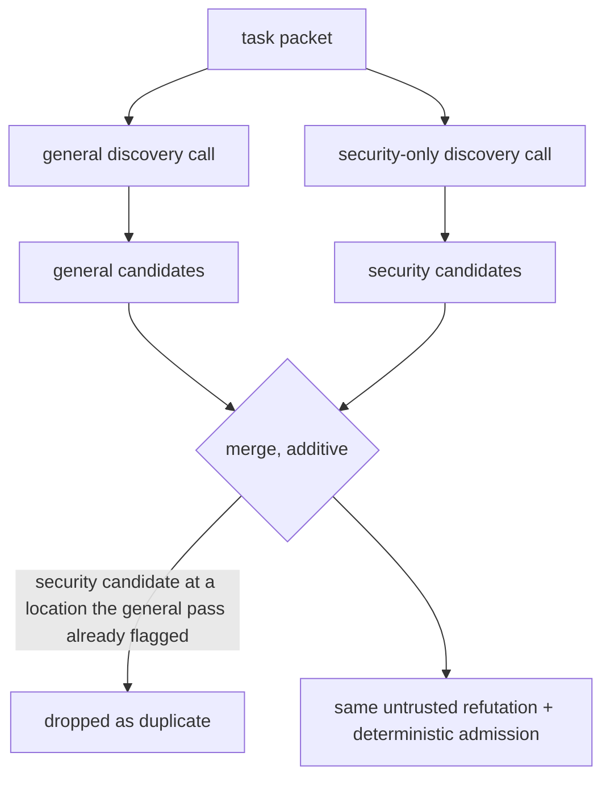

# Dedicated Security Pass

> **Verdict: mixed.** It is a validated *general*-recall booster at +61% cost. The
> **security-specific lift it was built for is unproven** at n=1. Do not claim a
> security win from it.

Spec: [`specs/15-security-focused-review.md`](../../../specs/15-security-focused-review.md), 2026-07-24.

## The problem it addresses

Two evidence sources shaped this design, and neither one was intuition:

- **Our own data.** On the committed benchmark, security-labeled findings are
  dominated by **authorization / access-control / credential logic (~59%)**.
  Classic injection/taint sinks are a small minority and the obvious ones are
  already found — so a sink scanner alone would target the wrong majority.
- **The literature.** The reproducible security lift (IRIS, RepoAudit) comes from a
  hybrid: a deterministic engine finds candidate source→sink paths and the model
  judges reachability and triages false positives — triage being the dominant
  precision lever. Separately, PR-review research shows more context *reduces*
  quality.

## Why a dedicated pass and not a checklist in the main prompt

An earlier realization appended the OWASP/CWE checklist to the **general**
discovery prompt. It was measured (full benchmark A/B, 2026-07-24) and **rejected**:

| Class | In-prompt checklist |
| --- | --- |
| SSRF | 0% → 50% |
| XSS | 0% → 33% |
| **Authorization (the dominant class)** | **41% → 27%** |

One prompt's attention is finite. The checklist pulled focus away from the
access-control reasoning the general prompt already did well. The *mechanism* —
make the model check under-weighted classes — works; folding it into the shared
prompt is the wrong integration. Giving security its own **separate discovery
call** removes the attention tradeoff by construction.

## How it works

- The security call reuses the **same** discovery agent with a security-only
  `reviewText`: the generic OWASP/CWE checklist plus a compact source→sink method
  (identify the trust boundary; trace each untrusted value to every sensitive sink;
  report only when a concrete input or path reaches a sink unsafely). It is not a
  new agent, role, or pipeline.
- Its candidates are **additive** — merged at locations the general pass did not
  claim, capped at `SECURITY_MAX_CANDIDATES = 8`, and never substituted for a
  general candidate. So the pass can only add security findings; it can never
  reduce the general reviewer's recall.
- They pass the **same** untrusted refutation and deterministic admission as any
  other candidate. The pass never bypasses scope, location, baseline, severity, or
  the gate.
- The checklist is generic and public-derived (OWASP A01/A02/A03/A05, CWE-22/78/79/
  89/94/284/285/327/330/362/502/532/798/918). Tuning any rule to the identity of an
  eval finding is forbidden and treated as a defect.
- The prompt carries the [injection guard](../trust-model.md#the-shipped-prompt-injection-guard):
  the changed code it reviews is untrusted.

## Configuration

| Key | Type | Default |
| --- | --- | --- |
| `security.dedicatedPass.enabled` | boolean | `false` |
| `security.signals.enabled` | boolean | `false` |

With both disabled, no security pass or signal runs and the general review is
byte-for-byte unchanged (the same task set, the same single discovery call per
task).

## Measured evidence

Paired A/B, 2026-07-24, full `crb-*` benchmark, one seed per arm.

| Metric | Pass off | Pass on | Read |
| --- | --- | --- | --- |
| Overall recall | 24.8% | **29.3%** | up; large denominator, trustworthy |
| Product recall | 29.8% | **34.6%** | up |
| Unlisted-real findings | 45 | **67** | +22 genuine defects the answer key does not list |
| Adjusted precision | 97.1% | 95.1% | held high |
| Genuine false positives | 1 | 2 | |
| **Labeled security total** | **14/41** | **12/41** | **down** |
| **Authorization** | **8/22** | **6/22** | **down** |
| Cost | $22.48 | $36.18 | **+61%** |

**Why the security drop is not the pass hurting:** the pass is additive by
construction, so within a single run it can only *add* security findings. The 8→6
authorization drop is between two *different general-pass runs* — the general
pass's own run-to-run variance on small security denominators (n=22; matched counts
swing 6–9 on noise) swamps the dedicated pass's additive contribution. At n=1 per
arm the security-mechanism deltas are uninterpretable.

**Why that does not rescue the claim either:** an uninterpretable number is not a
positive number. The overall-recall gain has the large denominator and is the
trustworthy signal; the security-specific benefit has not been demonstrated.

## Verdict

- **What we know:** enabling it raises overall recall by about 4.5pp and surfaces
  22 more real defects on this benchmark, at +61% cost and slightly lower precision.
- **What we do not know:** whether it improves *security* recall — the reason it
  was built. The labeled-security data (14 → 12) does not support that claim.
- Proving the security-specific benefit needs a multi-seed A/B (≥3 seeds per arm) to
  average out the authorization noise. That has not been run.
- Spec 15's acceptance bar is stricter still: it ships enabled by default only if a
  **held-out** A/B (under the anti-contamination policy: temporal cutoff,
  chronological split, dedup, no famous CVEs, answer key withheld from the prompt)
  shows a net recall gain without an authorization regression.

If you enable it, enable it for the general recall — and budget for it.

## Mechanism 2: deterministic security signals (not yet implemented)

`security.signals.enabled` is wired as configuration only and **carries no behavior
in this phase**. The specified design: language-neutral source/sink/sanitizer
detection grounded in public rule catalogs, emitting typed `EvidenceRecord`s that
populate the already-defined `ruleId` / `cwe` / `helpUri` / `relatedLocations` /
`dataFlow` / `securitySeverity` fields. By default those would be **evidence for the
model to judge**, not auto-admitted findings — matching the research finding that
the model's judgment, not the analyzer, is the precision lever.

## Where it lives

- `securityReviewChecklist`, `securityReviewInstruction`, `buildSecurityReviewText`,
  and the additive merge in
  [`discovery/holistic-task-review.ts`](../../../src/domains/review-workflow/pipeline/discovery/holistic-task-review.ts)
- `SecurityConfigSchema` in [`config.schema.ts`](../../../src/shared/contracts/config/config.schema.ts)

## Related

- [Trust model](../trust-model.md) — the prompt-injection guard, which is *not*
  optional and *is* shipped on
- [Decision table](README.md)
