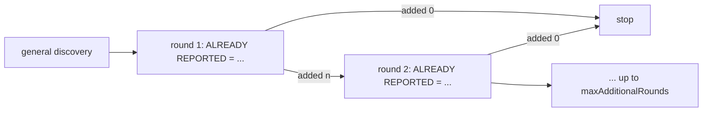

# Extra Discovery Passes

Two capabilities that add more discovery calls per task. **Both are off by default
and both are currently unproven.** One has been measured and showed no gain; the
other has not been measured at all.

| | Diverse-lens pass | Enumeration sweep |
| --- | --- | --- |
| Config key | `review.discoveryLensPass.enabled` | `review.discoverySweep.maxAdditionalRounds` |
| Default | `false` | `0` |
| Asks | a **different** question | the **same** question again, minus what was already found |
| Calls added | 1 per task | up to 4 per task, stopping early |
| Status | **unproven — measurement in progress** | **measured: no measurable gain** |

## The problem both address

The 30-case / 42-finding real-repository baseline (2026-07-26) exposed a stopping
behaviour, and it is the highest-value recall lever the project has found:

| Cases carrying… | Recall |
| --- | --- |
| one expected finding | 16 / 24 = **66.7%** |
| two expected findings | 7 / 18 = **38.9%** |

In **7 of those 9** two-finding cases the review found exactly one of the two and
never both. Per-case "found at least one" is comparable across both groups, so this
is not a discovery-quality gap — **the engine reports the most salient defect in a
file and moves on.** Instrumentation confirmed it: every task logged
`finding_count 1`, `general_candidate_count 1`, `dropped_count 0`. Nothing in the
pipeline was losing findings; there simply was one.

The prompt already says to report every instance you can justify, so this is not an
instruction the model is disobeying. A single response tends toward a single answer
regardless of wording. Both capabilities are structural responses to that.

## The enumeration sweep

After the first call, ask again. Each round states what has already been reported
and asks only for further, **distinct** defects.

- Rounds stop as soon as one adds nothing, so an exhausted file costs one extra
  call rather than the configured maximum.
- Additive by construction: a round may only add candidates at locations no earlier
  round claimed, so it can never cost a finding the single call already had and
  cannot inflate the count by restating itself.
- The prompt states explicitly that returning `{"findings": []}` is the correct and
  expected answer when the previous pass found everything, so a clean file cannot
  pressure the model into inventing a second defect to justify the call.
- Every candidate it adds still faces the same refutation and admission.
- The child-agent budget reserves a call per configured round — a sweep that ran out
  of budget would starve refutation.

### Configuration

| Key | Type | Default |
| --- | --- | --- |
| `review.discoverySweep.maxAdditionalRounds` | integer 0–4 | `0` (off) |

### Measured evidence

30-case / 42-finding real-repository corpus.

| Arm | Recall | Cost |
| --- | --- | --- |
| Baseline (single seed) | 54.8% | — |
| Sweep, **mean of 3 seeds** | **54.8%** | ≈ **+41%** |

Measured seed-to-seed standard deviation on this configuration: **≈6 percentage
points**.

**There is no measurable gain.** The means are identical, and the run-to-run band
is wide enough that a real effect would have to be substantial to be visible at
all. What the sweep costs is certain; what it buys is not detectable.

### Verdict

Off. The hypothesis — that a second ask overcomes the single-answer pull — is not
supported by the measurement we have. Do not present this as a recall improvement.

The one thing the sweep result *did* inform: a second look from the same vantage
largely reproduces the first. That is the argument for asking a different question
instead, which is the lens pass.

## The diverse-lens pass

[`specs/05-review-workflow-and-runtime.md`](../../../specs/05-review-workflow-and-runtime.md)
specifies **two serial diverse-lens whole-file reviews per task**. Only one was
implemented: the pipeline had exactly one discovery call site and the word "lens"
appeared nowhere in it. The engine had been running half its specified discovery —
and the missing half is precisely the one aimed at defect classes a general read
walks past.

The lens pass re-reads the same change hunting:

- concurrency and atomicity — non-atomic read-modify-write, check-then-act races,
  missing or incorrect locking;
- asynchrony — work started and never awaited, dropped promises, fire-and-forget
  paths that discard errors or ordering;
- error and failure paths — swallowed errors, cleanup skipped on the failure
  branch, work committed after a partial failure;
- resource lifetime — handles, connections, listeners that leak, are used after
  release, or grow without bound;
- interface and contract violations — caller/callee disagreement on signature,
  nullability, or return shape; one call site updated while a sibling is not;
- edge cases — empty, zero, negative, boundary, absent, maximum inputs, and the
  first and last iteration of a loop.

It runs **serially** (to stay inside the parallel child-agent budget) and merges
additively at locations the general pass did not claim, so it can only add. It
applies the same standard of evidence and is told that `{"findings": []}` is a
correct answer.

### Configuration

| Key | Type | Default |
| --- | --- | --- |
| `review.discoveryLensPass.enabled` | boolean | `false` |

### Measured evidence

**None yet.** The pass was only recently implemented and its measurement is still
in progress.

### Verdict

**We do not know whether it helps.** It is off pending measurement.

Do not infer a result from the sweep's: the two ask structurally different
questions, and the sweep's null result is arguably an argument *for* trying a
different question rather than evidence against it. That is a hypothesis, not a
finding.

## Where they live

- `lensReviewInstruction`, `sweepReviewInstruction`, and the merge loops in
  [`discovery/holistic-task-review.ts`](../../../src/domains/review-workflow/pipeline/discovery/holistic-task-review.ts)
- `DiscoverySweepConfigSchema` / `DiscoveryLensPassConfigSchema` in
  [`config.schema.ts`](../../../src/shared/contracts/config/config.schema.ts)

## Related

- [Dedicated security pass](dedicated-security-pass.md) — the third additive pass, which reuses the same merge
- [Decision table](README.md)
