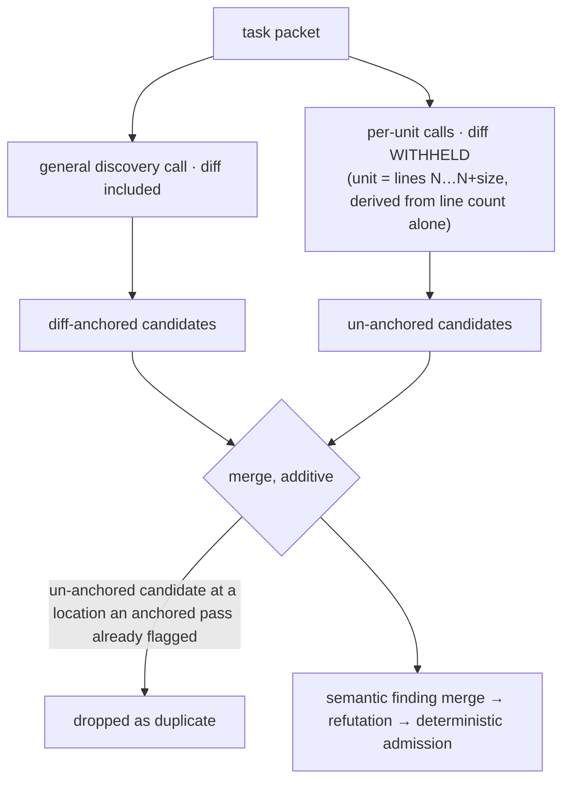

# Un-Anchored Discovery Pass

> **Verdict: unproven.** The mechanism it is built on was measured; the pass
> itself has not been A/B'd. It is off by default and it is the most expensive
> option in the engine. Do not claim a recall number for it.

Spec: [`specs/19-unanchored-discovery-pass.md`](../../../specs/19-unanchored-discovery-pass.md), 2026-07-27.

## The problem it addresses

The primary discovery call is anchored to the diff. That anchor is what makes it
precise, and it is also why it reports at most one defect per changed region.
Corpus-level recall on expectations that sit *later in a file* is 4.7%, against
72.8% for the first expectation in a file.

A controlled experiment (2026-07-27, production model, prompt and temperature,
units derived mechanically from a file's line count alone) established the
mechanism rather than guessing at it:

| Observation | Diff-bearing units | Un-anchored units |
| --- | --- | --- |
| Candidates that pointed at a line **inside the unit they were shown** | 16 of 76 (21%) | 50 of 50 (100%) |
| One 1251-line file | The same finding at line 820 from **all 31 units** — including the unit covering lines 1201–1251, where line 820 was not in the packet | — |

**The engine answers the diff and does not read the rest of the file.** Shrinking
or widening the file section changes nothing, because the file section was never
the binding constraint.

## Why the diff is withheld, and why that is not negotiable

Removing the anchor *is* the intervention. The decomposition is not.

- **Widening or shrinking the primary pass's window** is the diff-bearing arm
  above. It recovered almost nothing at N× the cost.
- **Dropping the diff from the primary pass** is not on the table: the un-anchored
  arm lost 6 of 7 controls. With no diff it has no reason to prioritise the
  changed line, which is the reviewer's principal job.

So the un-anchored pass is a **candidate generator, not a reviewer**. It feeds the
existing gate and replaces no part of it.

## How it works



- The pass reuses the **same** discovery agent and the **same** prompt builder as
  the general call. It asks nothing extra: no checklist, no defect classes, no
  "look harder" framing. It differs only in what it is shown. A test asserts the
  pass ships no prompt text of its own.
- The packet contains **no diff text and no changed-line range**. What it declares
  as the reviewed range is the unit's own span, which is coextensive with the code
  it shows — so it cannot point at a line the reviewer was not given.
- **Units are derived from the file's line count and nothing else.** Two files of
  the same length decompose identically in any language. The rule cannot see the
  syntax, the diff, or anything about the defect, because a rule that could see
  those could be tuned toward the answers and any measurement would be worthless.
- Candidates are **additive**: added only at locations no earlier pass claimed,
  capped at 8 per task, and never substituted for a diff-anchored candidate.
- They pass the **same** semantic merge, untrusted refutation, and deterministic
  admission as any other candidate.
- Failure is non-fatal. A failed unit costs that unit; a failure the call wrapper
  cannot classify ends the pass for that task. A review without the pass is a
  complete review.

## Configuration

| Key | Type | Default |
| --- | --- | --- |
| `review.unanchoredPass.enabled` | boolean | `false` |
| `review.unanchoredPass.unitLines` | integer 10–2000 | `60` |
| `review.unanchoredPass.strideLines` | integer 1–2000 | `40` |
| `review.unanchoredPass.maxUnitsPerFile` | integer 1–200 | `8` |
| `review.unanchoredPass.maxUnitsPerRun` | integer 1–2000 | `40` |

With it disabled, no unit call runs and the general review is byte-for-byte
unchanged.

**60/40 is arbitrary, and is recorded as such.** It is the only geometry that has
been measured, and it was chosen on budget grounds. Published work reports that
the safe input size is defect-class dependent, which implies no single value is
optimal — but selecting per class would require knowing the class before looking,
which is not available. Treat it as a starting point, not a finding.

A stride wider than a unit is rejected at config load: it would leave lines that
no unit ever covers.

## The bound, and why it is reported

A unit costs roughly one discovery call (~$0.008 when measured) and a 600-line
file at 60/40 is 15 units. The bound is load-bearing, not hygiene.

Both caps are enforced in code. When either withholds work, the run records a
warning naming the applied bound:

```
unanchored-discovery-truncated: 12 of 40 units were not reviewed across 3 file(s) (per-file bound 8)
```

A bounded pass that reports nothing about its bound reads as full coverage — to a
reader of the report, and to anyone measuring the pass.

## What has not been measured

The A/B has not been run. Its terms are fixed in advance in the spec: default
config against the pass enabled, three seeds each, on the real-repository corpus.

- **Ship enabled** only if recall rises with the paired finding-level test
  clearing significance, `adjustedPrecision` and `genuineFalsePositiveCount` do
  not degrade, and cost per additional matched expectation is defensible.
- **Ship disabled but retained** if recall rises without significance at n=3.
- **Remove entirely** if recall does not rise. Two structural passes have already
  been built and removed on this rule.

Refutation's kill rate must also rise. It is 1.4% today. A pass that adds
speculative candidates without moving that number means the gate is not filtering
them, and precision will fall in place of recall rising.

## How to read the result when it exists

The corpus has a median of 7 changed lines and 2 hunks per case, and 17 of its 36
cases are single-hunk, because it is built from upstream fix commits, which are
minimal by nature. Real pull requests are larger.

A small diff is where the anchor pulls hardest and therefore where this pass has
the most to add. **The corpus is close to the best case for this change.** It is a
sound screening instrument — a pass that does not help there will not help
anywhere — but a poor estimator of production gain, and the figure it produces
must not be reported as an expected real-world improvement.

## Where it lives

- [`discovery/unanchored-units.ts`](../../../src/domains/review-workflow/pipeline/discovery/unanchored-units.ts) — the unit geometry
- [`discovery/unanchored-run-budget.ts`](../../../src/domains/review-workflow/pipeline/discovery/unanchored-run-budget.ts) — the per-file and per-run bound, and the truncation record
- [`discovery/unanchored-pass.ts`](../../../src/domains/review-workflow/pipeline/discovery/unanchored-pass.ts) — the pass, including the diff-withheld packet
- [`discovery/review-packet.ts`](../../../src/domains/review-workflow/pipeline/discovery/review-packet.ts) — the shared prompt builder every discovery call uses
- `UnanchoredDiscoveryPassConfigSchema` in [`config.schema.ts`](../../../src/shared/contracts/config/config.schema.ts)

## Related

- [Holistic discovery](../pipeline/04-holistic-discovery.md) — where the pass sits
- [Extra discovery passes (removed)](extra-discovery-passes.md) — the two passes
  that re-asked over the same artifact and failed
- [Decision table](README.md)
