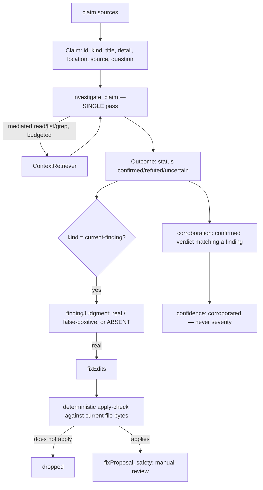

# Verification And Fix

> **Verdict: unmeasured as a quality lever.** These are product features, not
> recall knobs. Both are advisory by construction: nothing they produce can change
> which defects are reported, their severity, admission, or the quality gate.

Spec: [`specs/12-verification-flow.md`](../../../specs/12-verification-flow.md), 2026-07-23.
This is the entire [investigation flow](../two-flows.md) — the bounded agentic half
of the architecture.

## The problem it addresses

Two jobs the single-shot review flow structurally cannot do:

1. **Verification** — validate an external or prior claim against the real code. Is
   this analyzer alert valid? Does the new commit fix a previously reported
   finding? Does a proposed fix resolve the issue without introducing a new one?
2. **Finding investigation and fix** — for this run's admitted findings, judge real
   vs false positive against the actual file, and, when real, propose a precise,
   apply-checked fix.

Both need to read the real repository. The review flow deliberately does not.

## How it works

One agent (`investigate_claim`), one tool set, one set of bounds. Only the prompt
and which output fields are populated differ between the two jobs.



### Claim sources

| Provider | What it does | Network |
| --- | --- | --- |
| `claims-file` | reads a neutral claims file a pipeline wrote before the run — the decoupled path for any source | none |
| `prior-findings` | derives "does this still hold / is it fixed?" claims from a previous run's report or the baseline | none |
| `current-findings` | turns this run's admitted findings at or above `fix.minSeverity` into `current-finding` claims | none |

`analyzer` and `comment` claims are planned adapters (normalizing SARIF or
pipeline-provided review comments); they add a source without changing the flow.
Provider failures are non-fatal run warnings.

### Bounds — enforced by code, not the model

- `verification.maxToolCallsPerClaim` (default `12`, range 1–50)
- per-call byte and match caps (`maxBytesPerRead` `20000`, `maxMatches` `20`)
- a per-claim token budget and the run timeout

Exceeding a bound ends the claim with an `uncertain` status and no
`findingJudgment` or `fixEdits`, recording the reason. **There is no open-ended
loop.**

### Tools

Only the mediated repository tools: `read` (bounded, line-numbered), `list`, and
`grep` (in-process, recursive — never a shell). Every call resolves through
`path-service` under the repository root, respects include/exclude eligibility so
secret and ignored files are never read, redacts output, records a context-ledger
entry and an evidence record, and decrements a bounded budget. **No shell, network,
filesystem write, or environment access exists for this agent.**

### One pass, not three

The conceptual phases for a finding — investigate, propose a fix, re-evaluate — are
phases of one prompt and one output, not separate model calls. Reading the file
once and emitting judgment plus fix together avoids redundant tool spend and skips
fix work for a finding judged a false positive.

There is **no numeric confidence field**: an LLM-authored score is not reproducible
and is treated as noise. `findingJudgment` is absent when the agent cannot
establish either answer from the code it read — **absence means "no signal", not a
guess**.

## The fix lane

`fix.enabled` is the single switch for the whole pass (judgment and fix together).

- Before a `fixEdits` set is attached, **code** applies it to the current file
  bytes. An edit that does not apply cleanly is dropped and the fix is recorded as
  not produced. This rejects hallucinated line numbers and stale-location edits
  without a model call.
- Fixes are always `safety: manual-review`. The flow **never** applies an edit to
  the working tree.
- A passing fix replaces the finding's `fixProposal` and flows to every reporter
  (Markdown, SARIF, review comments), so the better, real-file-grounded fix is the
  one users see. Category, severity, admission, and the gate are untouched.
- The `false-positive` judgment is a separate advisory signal. It never removes a
  finding from the gate or changes severity in the default mode. A future opt-in
  filtering mode is explicitly gated on eval evidence that the judgment is
  trustworthy — and is out of scope until then.

## Corroboration

Each `confirmed` verdict is matched against the admitted findings by shared
fingerprint or by fuzzy match (same file, overlapping line ranges). A match yields
a `FindingCorroboration` — finding id, `confidence: corroborated`, match kinds, and
the witnessing claim ids, surfaced in the flow's own report.

**Corroboration raises confidence only; it never raises severity.** Only
`confirmed` verdicts corroborate — `refuted` and `uncertain` never do.

## Configuration

| Key | Type | Default |
| --- | --- | --- |
| `verification.enabled` | boolean | `false` |
| `verification.providers` | array of `claims-file` / `prior-findings` | `[]` |
| `verification.maxToolCallsPerClaim` | integer 1–50 | `12` |
| `verification.maxBytesPerRead` | integer ≥1 | `20000` |
| `verification.maxMatches` | integer ≥1 | `20` |
| `fix.enabled` | boolean | `false` |
| `fix.minSeverity` | severity | unset → resolves to `aiReview.actionableSeverityThreshold` (default `medium`) |

```json
{
  "verification": {
    "enabled": true,
    "providers": [{ "type": "prior-findings", "report": ".codereviewer/runs/last/report.json" }]
  },
  "fix": { "enabled": true, "minSeverity": "high" }
}
```

Leaving `fix.minSeverity` unset means the lane runs on exactly the findings that
can block the pipeline, not on nits. Set `info` to cover every finding, `critical`
for blockers only.

With both blocks disabled, no flow runs and the general review and gate are
byte-for-byte unchanged.

## Cost accounting

This lane runs after the review's run cost is finalized, so its token usage and
cost are accounted in **this flow's report** (`usage`), not the run summary — the
spend is never dropped, and it never contaminates the review's cost figures.

## Measured evidence

None as a quality lever. There is no A/B showing what verification or the fix lane
does to recall or precision, and by design there could not be a gate effect to
measure: the outputs never enter the defect quality gate.

Spec 12 argues that because the agent reads actual files instead of a review
packet, its false-positive judgment is better grounded than the deterministic
review can be — that is a design argument, and it has not been quantified.

## Verdict

- Enable **verification** when you have claims to adjudicate: prior findings to
  re-check, analyzer alerts to triage, or a fix to validate. That is a capability
  the review flow does not have at all.
- Enable **fix** when you want apply-checked fix guidance in your reports and are
  willing to pay for one bounded agent run per eligible finding.
- Do not enable either expecting a better recall or precision number. They do not
  touch the gate, and no measurement claims they improve it.

## Where it lives

- [`src/domains/verification/`](../../../src/domains/verification/) —
  `investigate-claim-agent.ts`, `apply-check.ts`, `corroboration.ts`,
  `fix-run.ts`, `verification-run.ts`, the claim providers
- Lane wiring in [`src/cli/index.ts`](../../../src/cli/index.ts)
  (`runVerificationForReview`, `runFixForReview`)
- `VerificationConfigSchema` / `FixConfigSchema` in
  [`config.schema.ts`](../../../src/shared/contracts/config/config.schema.ts)

## Related

- [The two flows](../two-flows.md) — why this is a separate machine
- [Trust model](../trust-model.md) — claims and tool output are untrusted
- [Decision table](README.md)
