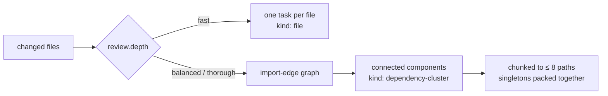

# 3 · Task Clustering and Context Assembly

← [Deterministic support signals](02-deterministic-support-signals.md) · next → [Holistic discovery](04-holistic-discovery.md)

Two deterministic steps that decide *what is reviewed together* and *what the
model is actually allowed to see*. Together they define the unit of work for the
rest of the pipeline: the **review task**.

## What it receives

- The changed source files (path + full content).
- Facts and evidence from [deterministic signals](02-deterministic-support-signals.md).
- The validated configuration (`review.depth` is the dominant input).

## 3a · Task clustering

The goal is a task that is big enough to expose cross-file defects and small
enough to fit a packet budget.

- At `depth: fast`, every changed file becomes its own task (`kind: file`).
- At `balanced` and `thorough`, an undirected graph is built from `import` facts.
  Relative specifiers are resolved against the changed set by trying the literal
  path and a list of source extensions; non-relative specifiers are additionally
  resolved by path suffix, which is what lets Python dotted, Java package, and
  Go/Ruby slashed imports cluster the same way relative TS/JS imports do.
  Connected components become `dependency-cluster` tasks.
- A component larger than **8 paths** is split into chunks of 8. Single-file
  components are packed together, up to 8 per task, so a change with many
  unrelated files does not explode into one task each.

Each task carries the ids of the facts, evidence, and candidates that belong to
its paths, plus a deterministic id derived from its kind and path list.

## 3b · Context assembly

Each planned task is turned into one or more *workflow tasks*, each with a
bounded `reviewContext`. What goes in:

| Section | Source | Notes |
| --- | --- | --- |
| Diff | Per-path segments of the raw unified diff | Falls back to reviewed line ranges when no raw diff exists (for example `--files` runs) |
| Changed files | Full file content, line-numbered | Sent WHOLE; split only if the provider refuses the packet |
| Support-signal output | Serialized facts + test mappings | Only when `aiReview.deterministicSignalMode: 'support'` |
| Referenced definitions | Bounded digests of imported, **unchanged** files | Context only — never review targets |
| Change intent | External ticket/PR brief | Only when `contextSources.enabled` |

Everything is redacted before it becomes a context document.

### Packet size: the provider decides, not a budget

The change is assembled **whole**. There is no byte budget that splits a file or a
task in advance — the packet is sent, and it is split only if the provider itself
refuses it as exceeding its context length (spec 26).

This replaced a per-depth budget (60 / 120 / 240 KB) that was wrong in two ways at
once: bytes are a poor proxy for tokens, so the guess erred by a content-dependent
factor, and the values were small enough to fire on **37%** of this repository's
last 60 commits against context windows of 200k to over 1M tokens. Every one of
those splits substituted several partial reviews for the whole-file review this
project measured as better, and charged an extra discovery-plus-refutation pair.

**Reactive splitting.** When a provider reports an oversized context, the task is
halved and each half retried, recursing until the pieces are accepted:

- Detection is the harness's normalised `context_length_exceeded` reason — never
  provider message text, which differs per vendor and changes without notice. A
  provider adapter that fails to classify its own overflow surfaces as an ordinary
  loud model error, and the fix belongs in that adapter.
- Halves are cut on line boundaries and keep their **absolute** line origin, so a
  finding in the second half carries the file's real line number and admission
  rejects a location outside the half the call was actually given.
- Splitting is bounded by recursion **depth** (6), never by a byte size. A unit that
  cannot be split further and is still refused fails loudly with
  `review_task_indivisible` — it is never truncated or silently dropped.
- The number of splits performed is reported (`context_overflow_split_count`), and
  is deliberately counted apart from transient retry: an oversize split and a
  rate-limit retry have different causes and different meanings.

| Depth | Cross-file retrieval caps (reads / searches / matches / depth / bytes per read) |
| --- | --- |
| `fast` | 200 / 100 / 50 / 4 / 60 000 B |
| `balanced` | 1 200 / 600 / 150 / 8 / 120 000 B |
| `thorough` | 4 800 / 2 400 / 320 / 12 / 240 000 B |

- These caps bound only the mediated repository retriever, exercised by the optional
  cross-file capabilities. They no longer size the review packet.
- The **packet ceiling** for one serialized model input is 8 MB — roughly 2M tokens,
  far beyond any current model. It is a runaway guard against serializing a
  pathological packet into memory, not a limit on how much review may be sent, and
  it **refuses** rather than truncating when it binds.
- An explicit `review.contextMaxBytes` still binds and lowers that ceiling, because
  it is a deliberate operator choice. When it binds, the run stops loudly.

### Referenced definitions

Holistic discovery sees only changed files, so a defect that hinges on the
contract of a callee in an unchanged file would be invisible. To close that gap,
each changed file's **relative** imports are resolved to existing unchanged repo
files, ranked by import frequency, and digested:

| Bound | Value |
| --- | --- |
| Files per task | 6 |
| Total section budget | 12 KB |
| Per-file digest cap | 4 KB |

A digest keeps a one-line window around each export / public-symbol /
declaration line (elided with `...`), falling back to the first 40 lines when no
facts could be extracted. The prompt states explicitly that these files are
context and must never be reported on.

### Context ledger and coverage

Every context item produces a **context ledger** entry recording kind, path,
task, reason, decision (`included` / `skipped` / `truncated` / `summarized`),
bytes considered, bytes included, and a **content hash — never the content
itself**. The ledger is written as a run artifact.

Coverage is computed from the ledger: for each source file, the bytes recorded
against `task-context-source-chunk` entries must be at least the file's size.
If any file is short, the run **fails** with `coverage incomplete` and writes
partial artifacts. The engine is not allowed to review part of a file and report
success.

## What it emits

| Output | Consumed by |
| --- | --- |
| Workflow tasks with bounded `reviewContext` | [Discovery](04-holistic-discovery.md) and [refutation](05-refutation.md) |
| Context ledger entries | Coverage check, [reporting](08-reporting.md) |
| Instruction and skill documents + their hashes | Provenance on every finding |
| Context evidence records (one per file context chunk) | [Admission](06-admission-and-severity-floor.md) |

## What can go wrong

| Situation | Behaviour |
| --- | --- |
| A file's bytes are not fully assigned to tasks | Run fails: `coverage incomplete` |
| A task packet exceeds the packet ceiling | The shared digest is dropped first; if it still does not fit, the task packet fails as a budget error |
| An instruction or skill file is not allowed | Run fails with a config error before any finding is produced |
| A dependency file cannot be read or resolved | Silently skipped — referenced definitions are best-effort |
| Very large single file | Split across several workflow tasks; each is reviewed independently |

## Configuration keys

| Key | Default | Effect |
| --- | --- | --- |
| `review.depth` | `balanced` | Clustering strategy and all byte budgets |
| `review.contextMaxBytes` | unset | Lowers the packet ceiling and the per-read cap. Unset means the provider decides packet size |
| `review.maxConcurrentTasks` | `4` | How many tasks run in parallel downstream |
| `aiReview.deterministicSignalMode` | `support` | Whether facts, test mappings, and referenced definitions enter the packet |
| `instructions.files` / `instructions.inline` | `[]` / `""` | Reviewer instructions added to every packet |
| `skills.enabled` / `skills.directories` / `skills.allowTools` | `false` / `.codereviewer/skills` / read,list,grep | Optional skill documents |
| `contextSources.*` | disabled | External change-intent brief — see [Optional capabilities](../optional-capabilities/README.md) |
