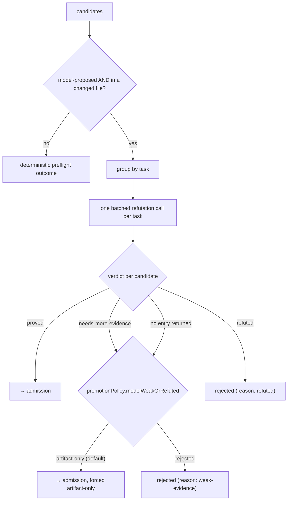

# 5 · Refutation

← [Holistic discovery](04-holistic-discovery.md) · next → [Admission and severity floor](06-admission-and-severity-floor.md)

The precision mechanism. Discovery is allowed to be generous; refutation is the
independent pass that tries to *disprove* each candidate and refuses to let
anything through that the provided context does not actually support.

## What it receives

All candidates produced by discovery, plus the workflow input (review context,
diff ranges, evidence, deterministic support-signal candidates, instructions,
skills metadata, shared digest, provenance).

## What it does

### Only some candidates cost a call

A candidate is sent to the refuter only when it is **model-proposed**
(`proposedBy: 'review-agent'`) **and** inside the reviewed scope — that is, its
file has at least one reviewed diff range. Everything else is decided by
deterministic preflight rules and never reaches the model:

| Candidate | Outcome without a model call |
| --- | --- |
| Support-signal candidate (non-model origin) | Passed to admission; artifact-only unless it is a trusted deterministic rule |
| Model candidate in a file with no reviewed change | Rejected as `not-in-scope` (`needs-more-evidence`) |
| Any candidate, when no refuter is available | Passed to admission unrefuted (this only happens when the model stages are not running) |

### One batched call per task

The refutable candidates are grouped by the task that raised them, and **each
group is adjudicated by a single call**. Every candidate in a group shares one
review context, so batching sends that context once instead of once per
candidate — the per-candidate packet re-sent the changed file for every candidate
and dominated the run's input tokens.

The refuter must return exactly one verdict entry per candidate, each carrying
the `candidateId` copied verbatim, and is told explicitly to judge each candidate
on its own merits: a weak candidate next to a strong one must still be refuted,
and the number of candidates says nothing about how many are real.

### The verdicts

| Verdict | Meaning | Result |
| --- | --- | --- |
| `proved` | The provided context proves the finding *and its impact* | Proceeds to admission |
| `refuted` | The context contradicts the candidate | Rejected, reason `refuted` |
| `needs-more-evidence` | It might exist, but the context is not enough | Per `promotionPolicy.modelWeakOrRefuted` |
| *(missing)* | The model returned no entry for this candidate | Treated exactly like `needs-more-evidence` — never admitted as proved |

The prompt encodes several standing rules that shape precision. The load-bearing
one is the **static-type refutation rule**: a finding that can only occur by
violating a declared type, signature, schema, or documented contract is `refuted`
unless the provided context shows such a caller or input can actually happen.
Others push vague clarity/cleanup/style claims to `refuted`, and pre-existing
general concerns to `needs-more-evidence` unless the changed range itself creates
the concrete failure. Conversely the refuter is told *not* to demand proof of
concurrent requests when the context already shows a non-atomic read-modify-write
on shared mutable state.

Scope is stated the same way as in discovery: a real defect anywhere in a changed
file is in scope, whether introduced on the changed lines or exposed elsewhere in
that file. Only genuinely unrelated concerns in unchanged files are out of scope.

### Evidence

Every adjudicated candidate produces a **refutation evidence record**: a
redacted, location-anchored `model-rationale` record holding the refuter's
`rationaleSummary`. For a candidate that proceeds to admission, that evidence id
is attached to the candidate — which is how a model-origin candidate comes to
satisfy admission's "at least one evidence record" rule. When the refuter
supplies a `fixSummary` or scoped `fixEdits`, they are redacted and become the
candidate's fix proposal (`safety: manual-review`).

### Budget handling

If a batch packet exceeds the provider input budget, the packet sheds context in
a fixed order — shared digest, then deterministic support signals, then the
review context — and if it still does not fit, the batch is **split in half and
each half retried**. An oversized task therefore degrades into more calls rather
than losing its candidates. A single candidate that still does not fit is a
genuine packet failure.

## What it emits

| Output | Consumed by |
| --- | --- |
| Admission candidates (proved, and weak ones under the default policy) | [Admission](06-admission-and-severity-floor.md) |
| Rejected findings with reason `refuted` / `weak-evidence` / `not-in-scope` | [Reporting](08-reporting.md) — rejections stay auditable |
| Refutation evidence records and `refutationResults` | Admission, report |
| Artifact-only candidate ids | Admission (forces `reporterEligibility: artifact-only`) |
| Provider issues | Report |

## What can go wrong

| Situation | Behaviour |
| --- | --- |
| Provider error during the call | Every candidate in that batch is recorded as `needs-more-evidence` with reason `provider-error`, plus a **recovered** provider issue — the run continues rather than failing |
| Packet cannot be built even after shedding | Batch splits; a single unsplittable candidate becomes a `refutation-packet` provider error |
| Model omits a candidate from its verdict list | That candidate is `needs-more-evidence` — never silently admitted |
| Model invents a `candidateId` | Unmatched entries are discarded |
| Model tries to add findings of its own | The prompt forbids it; only listed candidates are adjudicated, and admission would reject anything without a candidate anyway |

## Configuration keys

| Key | Default | Effect |
| --- | --- | --- |
| `aiReview.requireRefutation` | `true` (literal — cannot be turned off) | Refutation is mandatory whenever the model stages run |
| `promotionPolicy.modelWeakOrRefuted` | `artifact-only` | Disposition of `needs-more-evidence`: keep it in the artifacts but out of the inline review, or drop it entirely (`rejected`) |
| `review.maxConcurrentTasks` | `4` | Refutation batches run with the same bounded concurrency as discovery |
| `provider.maxRetries`, `provider.timeoutMs` | `2`, `120000` | Transient-failure behaviour for the call |
