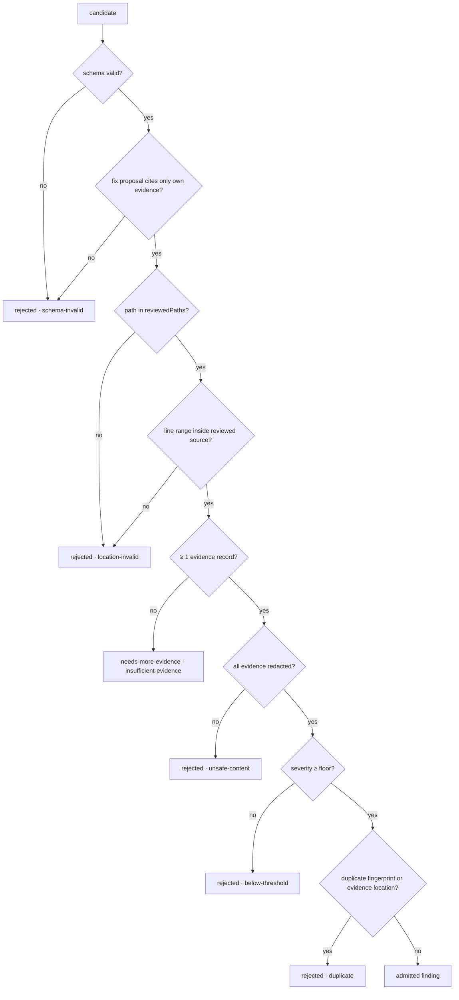

# 6 · Admission and the Severity Floor

← [Refutation](05-refutation.md) · next → [Baseline and quality gate](07-baseline-and-quality-gate.md)

The last place a candidate can be turned into a finding — and the last place it
can be thrown away. Admission is fully deterministic: no model is involved, the
same inputs always produce the same decision, and every rejection is recorded
with a reason instead of vanishing.

## What it receives

- The candidates that survived [refutation](05-refutation.md) (proved, plus
  `needs-more-evidence` ones under the default promotion policy).
- Their evidence records, including the refutation rationale evidence.
- The admission policy: reviewed paths, reviewed line ranges, reviewed diff
  ranges, severity thresholds, provenance, and the run's `admittedAt` timestamp.
- Pre-existing rejections and decisions from the earlier preflight rules.

## What it does

Each candidate runs through a fixed sequence. The **first** rule that fails ends
the candidate; there is no scoring and no override.

### The severity floor

| Candidate origin | Floor applied |
| --- | --- |
| Model (`proposedBy: 'review-agent'`) | `aiReview.actionableSeverityThreshold` (default `medium`) |
| Trusted deterministic rule | Exempt — falls back to the base minimum (`info`) |

A model finding below the floor is **not deleted**: it becomes a recorded
rejection with reason `below-threshold`, so it stays auditable in the report
while staying out of the actionable surface. This is the product's low-noise
position expressed as a rule — lower the threshold to `low` or `info` to surface
more.

### Fingerprints and duplicates

An admitted finding's fingerprint is
`sha256(category : path : normalized title : normalized anchor text)`, truncated,
under the algorithm id `v2-category-path-title-anchor`.

The **anchor text** is the content of the reported line, not its number. That is
what lets a finding keep its identity across pushes: edits above it shift the
line but not the fingerprint, while editing the reported line itself changes the
fingerprint — the intended signal that the finding was addressed. Only a hash is
emitted, so no source text is disclosed.

A candidate is a duplicate when its fingerprint matches an already-admitted
finding, or when an already-admitted finding shares its category, path, start
line, side, and at least one evidence record.

### Reporter eligibility

Every admitted finding is labelled with how it may be surfaced:

| Value | Meaning |
| --- | --- |
| `inline` | Eligible to become an inline review comment |
| `summary-only` | Reported, counted by the quality gate, but not inline |
| `artifact-only` | Present in the artifacts only; excluded from the gate and from the human-facing summary |

`inline` requires **all** of: location side `new`, a valid line range, overlap
with an actual diff hunk, and severity at or above
`review.inlineSeverityThreshold` (default `high`).

> Worth knowing: discovery stamps model candidates with location side `file`,
> so today model-origin findings resolve to `summary-only` and the review-comment
> renderer (which requires `inline` **and** side `new`) emits no drafts for them.
> Only candidates created with side `new` — the trusted deterministic-rule path,
> whose template table is currently empty — can reach `inline`.

`artifact-only` is applied after the fact to candidates the refuter marked
`needs-more-evidence` (under the default promotion policy) and to non-trusted
support-signal candidates.

### Redaction and provenance

Title, description, fix summary, and every fix edit are redacted before they
enter the admitted finding, and each is truncated back to its contract cap
afterwards (redaction can lengthen text). Every finding carries provenance:
reviewer, model provider and name, deterministic signal versions, config hash,
and the hashes of the instruction and skill documents that were in scope.

## What it emits

| Output | Consumed by |
| --- | --- |
| Admitted findings (with fingerprints, eligibility, provenance, `baselineStatus: 'new'`) | [Baseline and quality gate](07-baseline-and-quality-gate.md) |
| Rejected findings (candidate id, status, reason, redacted message, evidence ids) | [Reporting](08-reporting.md) |
| Admission decisions (one per candidate) | Shared-context artifact |

## What can go wrong

| Situation | Behaviour |
| --- | --- |
| Model reports a line beyond the file | `location-invalid` rejection |
| Model reports a file that was not reviewed | `location-invalid` rejection |
| Candidate arrives with no evidence | `insufficient-evidence` (`needs-more-evidence`) — normally impossible after refutation, which attaches its rationale evidence |
| Two passes found the same defect | Second one is a `duplicate` rejection |
| Correct but low-severity model finding | `below-threshold` rejection; visible in the report, not actionable |
| Unredacted evidence reaches admission | `unsafe-content` rejection — the report can never carry it |

## Configuration keys

| Key | Default | Effect |
| --- | --- | --- |
| `aiReview.actionableSeverityThreshold` | `medium` | Severity floor for model-origin findings |
| `review.inlineSeverityThreshold` | `high` | Severity needed for `inline` eligibility |
| `promotionPolicy.modelWeakOrRefuted` | `artifact-only` | Whether weak candidates reach admission at all |

See also: [Trust model](../trust-model.md) and [Data handling](../../07-security/).
