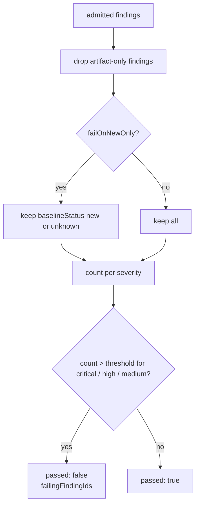

# 7 · Baseline and Quality Gate

← [Admission and severity floor](06-admission-and-severity-floor.md) · next → [Reporting](08-reporting.md)

Two deterministic steps that turn a set of admitted findings into a single
decision a pipeline can act on: *is this change allowed to proceed?*

## What it receives

- Admitted findings from [admission](06-admission-and-severity-floor.md), each
  carrying its fingerprints and `reporterEligibility`.
- The baseline fingerprint records, loaded earlier in the run (before the model
  stages, so a broken baseline file fails fast) from `baseline.path`.
- The quality-gate thresholds derived from configuration.

## 7a · Baseline matching

Each admitted finding is labelled by comparing its fingerprints against the
baseline file's:

| `baselineStatus` | When |
| --- | --- |
| `new` | No fingerprint match in the baseline |
| `existing` | A fingerprint matches a baseline entry |
| `unknown` | A baseline was explicitly configured but the file is absent |

`unknown` is the important case. A configured-but-missing baseline must never
silently suppress a failure, so those findings are treated as new by the gate and
the run warning `baseline-missing` is emitted. A baseline that is simply not
configured is not an error — findings are then classified normally against an
empty set (everything is `new`).

**Resolved entries.** Baseline fingerprints that no longer appear among the
admitted findings are reported as resolved — the findings that were fixed since
the baseline was recorded. They are included in the report when
`baseline.includeResolvedInReport` is true (the default).

Because fingerprints anchor on the *content* of the reported line rather than its
number (see [stage 6](06-admission-and-severity-floor.md)), unrelated edits above
a finding do not make it look new, while editing the reported line does.

## 7b · The quality gate

- **`artifact-only` findings never affect the gate.** That is what makes the
  default `needs-more-evidence` policy safe: weak candidates stay auditable
  without being able to block a pipeline.
- Only `critical`, `high`, and `medium` have thresholds. `maxMedium` is omitted
  by default, which means "no fail on medium".
- A severity fails the gate when its count is **greater than** its threshold, so
  the defaults `maxCritical: 0` / `maxHigh: 0` mean "any critical or high finding
  fails".
- `failOnNewOnly` defaults to the value of `baseline.failOnNewOnly` (`true`) when
  not set explicitly on the gate.

The result records `passed`, the `failingFindingIds`, the effective thresholds,
and whether baseline filtering was applied — so a failed gate is explainable from
the report alone.

### Where the run actually fails

| Failure | Mechanism |
| --- | --- |
| Quality gate not passed — on severity counts, or on an unrecovered provider issue | CLI exit code `1`; artifacts are still written in full |
| Coverage incomplete | Run fails before the gate; partial artifacts written |
| Cost over `review.maxCostUsd` | Run fails before the gate; partial artifacts written |
| Provider task failure or run timeout | Run fails; partial artifacts plus `error.json` |
| Drift gate | Run fails in preflight, before any provider call |

> `qualityGate.failOnProviderError` (default `true`) is enforced by this gate,
> not only recorded in `qualityGate.thresholds`. An **unrecovered** provider
> issue fails the gate on its own, with an empty `failingFindingIds` — there is
> no finding to name, because the failure is that findings are missing. An issue
> carrying no `recovered` field is read as unrecovered.
>
> The reason is the direction of the error. Without the check, a failed discovery
> call contributed no candidates and a failed refutation rejected its candidates
> unadjudicated, so the gate passed over the smaller set: a provider outage made
> a change MORE likely to clear the gate than a healthy run, at exit `0`.
> Findings that were never produced cannot be counted, so the gate has to be told
> the search was incomplete. Setting the flag to `false` turns the check off and
> changes nothing else.

## What it emits

| Output | Consumed by |
| --- | --- |
| Admitted findings with `baselineStatus` | [Reporting](08-reporting.md), SARIF `baselineStatus` property |
| `qualityGate` result | Report, CLI exit code |
| `resolvedBaselineEntries` | Report |
| `baseline-missing` warning | Run summary warnings |

## What can go wrong

| Situation | Behaviour |
| --- | --- |
| Baseline file absent but configured | All findings `unknown`; treated as new; warning emitted |
| Baseline file present but malformed | Schema error fails the run (it is parsed, not guessed) |
| `baseline.enabled: false` | No fingerprints are loaded and no filtering happens |
| Only `artifact-only` findings exist | Gate passes — by design |
| A finding's anchor line was edited | Its fingerprint changes, so it looks `new` again |

## Configuration keys

| Key | Default | Effect |
| --- | --- | --- |
| `baseline.enabled` | `true` | Whether a baseline is consulted at all |
| `baseline.path` | `.codereviewer/baseline.json` | Baseline file location |
| `baseline.failOnNewOnly` | `true` | Fallback for the gate's `failOnNewOnly` |
| `baseline.includeResolvedInReport` | `true` | Emit resolved baseline entries |
| `qualityGate.maxCritical` | `0` | Fail above this many critical findings |
| `qualityGate.maxHigh` | `0` | Fail above this many high findings |
| `qualityGate.maxMedium` | unset | Omitted means never fail on medium |
| `qualityGate.failOnNewOnly` | unset → `baseline.failOnNewOnly` | Restrict the gate to new/unknown findings |
| `qualityGate.failOnProviderError` | `true` | Fail the gate when the run carries an unrecovered provider issue |
| `review.maxCostUsd` | unset | Fails the run when exceeded |

See also: [Exit codes](../../06-reference/exit-codes-and-error-codes.md) and
[Quality and evaluation](../../05-quality/README.md).
