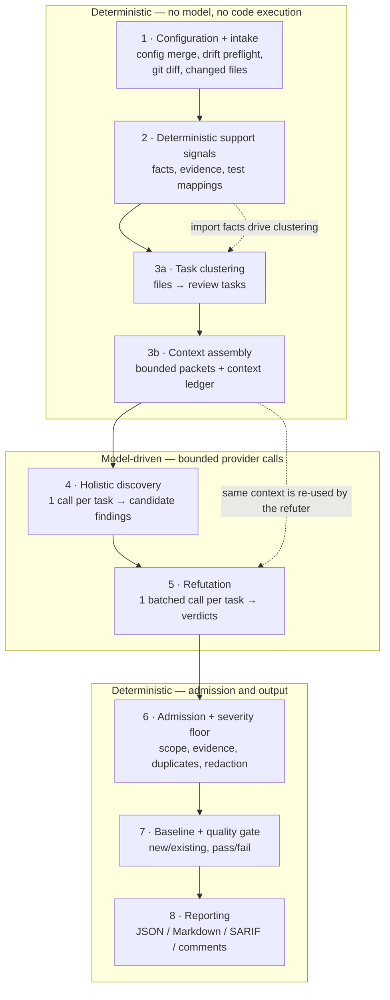

# The Review Lifecycle

This is the canonical end-to-end picture of a single review run. Every other page
in [`pipeline/`](pipeline/) zooms into one stage; this page is the spine that
connects them.

## The central idea: precision first

The engine is built around one asymmetry:

- **Discovery is recall-oriented.** One model call per task reads the whole
  changed file (not just the hunk) and is told to enumerate every concrete defect
  it can justify. It is allowed to be generous, because what it produces are
  *candidates*, not findings.
- **Everything after discovery removes what cannot be proven.** An independent
  refutation call adjudicates the candidates, and a deterministic admission gate
  applies scope, evidence, severity, and duplicate rules. Nothing reaches a
  report because a model felt confident about it.

That split is why the pipeline looks lopsided: one call finds things, and three
separate mechanisms (refutation, admission, quality gate) try to throw them away.

A second property holds throughout: **everything sent to a provider is bounded
and recorded.** Source is selected under explicit byte budgets and every item is
written (redacted) into the *context ledger*, and the run fails rather than
silently reviewing only part of a file. See [Trust model](trust-model.md).

## The flow

Without a configured `provider` (or with `aiReview.enabled: false`) the two
model stages are skipped entirely: the run goes intake → signals → clustering →
context → admission → gate → reporting and admits only deterministic candidates.
See [Two flows](two-flows.md).

## The stages

| # | Stage | Page |
| --- | --- | --- |
| 1 | Configuration and intake | [01-configuration-and-intake.md](pipeline/01-configuration-and-intake.md) |
| 2 | Deterministic support signals | [02-deterministic-support-signals.md](pipeline/02-deterministic-support-signals.md) |
| 3 | Task clustering and context assembly | [03-task-clustering-and-context-assembly.md](pipeline/03-task-clustering-and-context-assembly.md) |
| 4 | Holistic discovery | [04-holistic-discovery.md](pipeline/04-holistic-discovery.md) |
| 5 | Refutation | [05-refutation.md](pipeline/05-refutation.md) |
| 6 | Admission and severity floor | [06-admission-and-severity-floor.md](pipeline/06-admission-and-severity-floor.md) |
| 7 | Baseline and quality gate | [07-baseline-and-quality-gate.md](pipeline/07-baseline-and-quality-gate.md) |
| 8 | Reporting | [08-reporting.md](pipeline/08-reporting.md) |

### 1. Configuration and intake

The effective configuration is merged (file → environment → CLI), validated, and
hashed; the hash travels with every finding as provenance. The run then does its
preflight — a drift check that can abort the run before any provider call — and
turns a base/head ref pair (or an explicit file list) into the review's source
set: the changed files' full current content, the per-file `reviewedDiffRanges`,
and the raw unified diff text. Note that `review.mode` is **metadata only**; the
knob that changes budgets and clustering is `review.depth`.
→ [Details](pipeline/01-configuration-and-intake.md)

### 2. Deterministic support signals

Each changed file is parsed — never executed — into *facts* (imports, exports,
declarations, public symbols, modules), *evidence records*, and test mappings.
TypeScript/JavaScript go through the TypeScript compiler; Python, Go, Rust, Java
and Ruby go through `ast-grep`. These signals are support, not detection: they
supply the import graph that clustering needs and a structural summary for the
model packet. They do not, today, produce findings on their own.
→ [Details](pipeline/02-deterministic-support-signals.md)

### 3. Task clustering and context assembly

Changed files are grouped into **review tasks** — one task per file at
`depth: fast`, import-connected *dependency clusters* otherwise — so that
related files are reviewed together and cross-file defects stay visible. Each
task is then packed into a bounded packet: the task's diff segment, the full
line-numbered content of its changed files, optional support-signal facts,
bounded digests of imported-but-unchanged files, and (optionally) a change-intent
brief. Every item is written to the context ledger, and a file whose bytes were
not fully assigned to tasks fails the run as `coverage incomplete`.
→ [Details](pipeline/03-task-clustering-and-context-assembly.md)

### 4. Holistic discovery

By default this is **exactly one general model call per task**. The reviewer gets
the diff plus the whole changed files and follows a fixed method — understand the
intent, trace control and data flow on every path, verify against the intent,
then sweep defect classes — and returns findings that are converted into
*candidate findings* (deduplicated, capped at 12 per task). Three additional
passes exist and are **all off by default**: a diverse-lens second pass, an
enumeration sweep, and a dedicated security pass. All of them are purely additive
and none of them bypass anything downstream.
→ [Details](pipeline/04-holistic-discovery.md)

### 5. Refutation

An independent refuter adjudicates the candidates. The call is **batched per
task**: one call receives *all* of that task's candidates plus the shared review
context and must return exactly one verdict per candidate — `proved`, `refuted`,
or `needs-more-evidence`. Batching exists because the per-candidate packet resent
the same changed file once per candidate, which dominated the run's input tokens.
A candidate the model does not adjudicate is treated as `needs-more-evidence`,
never as proved.
→ [Details](pipeline/05-refutation.md)

### 6. Admission and severity floor

The deterministic gate. In order: schema validity, location inside the reviewed
paths, line range inside the reviewed source, at least one redacted evidence
record, the severity floor (`aiReview.actionableSeverityThreshold`, default
`medium`, applied to model-origin candidates only), and duplicate detection by
content-anchored fingerprint. Survivors become *admitted findings*, get a
`reporterEligibility` of `inline` / `summary-only` / `artifact-only`, and carry
redacted text plus full provenance.
→ [Details](pipeline/06-admission-and-severity-floor.md)

### 7. Baseline and quality gate

Admitted findings are matched against a saved baseline file and labelled `new`,
`existing`, or `unknown` (a configured-but-missing baseline never silently
suppresses a failure). The quality gate then counts gate-eligible findings per
severity against `qualityGate.maxCritical` / `maxHigh` / `maxMedium`, optionally
restricted to non-baselined findings. Its `passed` flag is what drives the CLI's
exit code.
→ [Details](pipeline/07-baseline-and-quality-gate.md)

### 8. Reporting

The run writes its artifacts into `<paths.artifactDir>/<runId>/`: `report.json`
always, plus Markdown, SARIF, and platform-neutral review comments according to
`reporting.*`, alongside the run summary, context ledger, shared context, and
observability snapshot. The engine only *emits* review comments — it never posts
them, because it holds no network or write permission.
→ [Details](pipeline/08-reporting.md)

## What runs beside the pipeline

| Lane | When | Where |
| --- | --- | --- |
| Drift check | Preflight, before any provider call; can abort the run | [01](pipeline/01-configuration-and-intake.md) |
| Change-intent ingestion | Between context assembly and the model stages; off by default | [Optional capabilities](optional-capabilities/README.md) |
| Fix lane, verification flow | After admission, before the reporters render; off by default | [Optional capabilities](optional-capabilities/README.md) |
| Evaluation harness | Separate command; runs the same pipeline over a corpus | [Quality](../05-quality/README.md) |

## Common misconceptions

| Claim | Reality |
| --- | --- |
| `review.mode` selects a review strategy | It is recorded in the report and in observability attributes and nothing branches on it. Budgets and clustering come from `review.depth`. |
| Refutation costs one call per candidate | One batched call per task adjudicates all of that task's candidates. |
| Discovery makes two passes | One general call per task. The lens pass, the sweep, and the security pass are separate opt-ins, all disabled by default. |
| Deterministic signals produce findings | They inform clustering and context. The trusted-rule promotion table is currently empty, so no signal becomes a finding by itself. |
