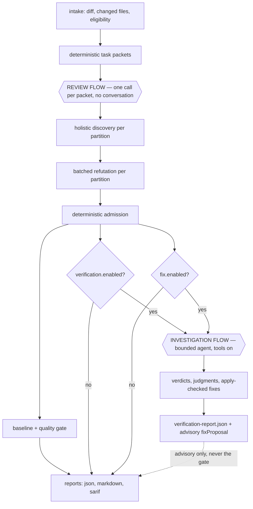

# The Two Flows

The engine has exactly two ways to look at code, and they are deliberately not the
same machine. Everything else in the architecture follows from this split.

| | **Review flow** (spec 05) | **Investigation flow** (spec 12) |
| --- | --- | --- |
| Job | discover defects in a change | verify claims; judge findings and propose fixes |
| Input | changed files + diff (a pre-assembled packet) | claims, and this run's admitted findings |
| Control | one model call per pre-assembled packet, no conversation carried | bounded agent loop |
| Tools | mediated `repo_read` / `repo_list` / `repo_grep` during discovery (`review.crossFileRetrieval`, on by default) | mediated `read` / `list` / `grep` |
| Determinism | reproducible packet; non-deterministic model output | non-deterministic (agentic) |
| Output | candidate findings → admitted findings → gate | verdicts, finding judgments, apply-checked fixes |
| Default | on (with a provider configured) | off (`verification.enabled`, `fix.enabled`) |
| Effect on the gate | decides it | **none** — advisory only |

Source: [`specs/12-verification-flow.md`](../../specs/12-verification-flow.md),
[`specs/05-review-workflow-and-runtime.md`](../../specs/05-review-workflow-and-runtime.md),
wiring in
[`src/cli/investigation-lanes.ts`](../../src/cli/investigation-lanes.ts).

## Why the split exists

- **Non-determinism is quarantined.** The review flow's packet is built by
  deterministic code; the model sees a fixed document and answers once. Agentic
  behaviour — loops, tool calls, retrieval decisions — lives only in the
  investigation flow, so its cost and variance cannot leak into the number that
  blocks a pipeline.
- **The gate stays deterministic.** Admission, severity, baseline, scope, and the
  quality gate are code paths. The investigation flow is advisory by construction:
  a `false-positive` judgment never removes a finding from the gate and never
  changes severity in the default mode.
- **Tool use is bounded, not banned.** The reviewing agent does hold repository
  tools, but it is still asked its question once, over a packet deterministic code
  assembled — the retrieval budget and step allowance are enforced in code. Three
  measurements once recorded the tools as costing recall; that verdict was
  measuring a per-read truncation and is withdrawn. See
  [cross-file retrieval](optional-capabilities/cross-file-retrieval.md).
- **Different jobs need different grounding.** The investigation agent reads the
  actual files rather than a review packet, so its false-positive judgment is
  better grounded than the single-shot review can be — but it runs after
  admission, on a handful of findings, not on every file.

## How a run is wired



- Both investigation lanes run **after** the review flow completes, share one
  agent (`investigate_claim`), one tool set, and one set of bounds.
- With both disabled, no lane runs and the review is byte-for-byte what it would
  be without the feature at all.

## The review flow in one paragraph

Deterministic code computes the diff, applies the eligibility gate, groups changed
files into tasks, cuts each task into partitions of
`aiReview.maxFilesPerDiscoveryCall` changed files (default `2`), and builds one
packet per partition: the unified diff segment, the full line-numbered changed
files, bounded referenced-definition digests, and — when enabled — a
change-intent brief. The model is asked **once per partition** to enumerate
concrete defects; the candidates are unioned. Refutation then adjudicates them in
one batched call per partition, and admission is deterministic code. The
[dedicated security pass](optional-capabilities/dedicated-security-pass.md) adds
another call per partition when enabled.

What the reviewer is *not* is tool-free. With
[cross-file retrieval](optional-capabilities/cross-file-retrieval.md) — **on by
default** — the discovery agent holds the mediated `repo_read` / `repo_list` /
`repo_grep` tools and a step allowance sized to its tool-call budget. Its old
"costs recall" verdict was measuring a per-read truncation and has been
withdrawn. Disable it and discovery is a single-step, tool-free call.

## The investigation flow in one paragraph

A claim is a single assertion to investigate: a prior finding ("is this fixed?"),
an analyzer alert, a review comment, or one of this run's own admitted findings.
The `investigate_claim` agent takes one claim at a time, may call mediated
`read`/`list`/`grep` against the real repository, and returns a single outcome —
`confirmed | refuted | uncertain`, optionally a `real | false-positive` judgment,
optionally an apply-ready edit set. Bounds are enforced by code, not the model:
`verification.maxToolCallsPerClaim` (default `12`), per-call byte and match caps,
a per-claim token budget, and the run timeout. Exceeding a bound ends the claim
`uncertain` — there is no open-ended loop. A produced fix is applied to the current
file bytes by code before it is attached; an edit that does not apply cleanly is
dropped. Details: [verification and fix](optional-capabilities/verification-and-fix.md).

## What crosses between the flows

| Crossing | Direction | Effect |
| --- | --- | --- |
| Admitted findings → claims | review → investigation | `current-findings` provider turns findings at or above `fix.minSeverity` into claims |
| Apply-checked fix → `fixProposal` | investigation → report | replaces advisory fix guidance only; `safety: manual-review`, never applied to the working tree |
| `findingJudgment` | investigation → report | advisory signal; never removes a finding or changes severity |
| Corroboration | investigation → report | a `confirmed` verdict matching a finding raises **confidence**, never severity |

Nothing crosses in the direction that would matter most for trust: no
investigation output can change admission, severity, the baseline, or the gate.

## Configuration

```json
{
  "verification": { "enabled": false, "providers": [], "maxToolCallsPerClaim": 12, "maxBytesPerRead": 20000, "maxMatches": 20 },
  "fix": { "enabled": false }
}
```

`fix.minSeverity` is optional and resolves at runtime to
`aiReview.actionableSeverityThreshold` (default `medium`), so out of the box the
fix lane runs on exactly the findings that can block a pipeline.

## Related

- [Trust model](trust-model.md) — what is untrusted, and what can never move a finding
- [Optional capabilities](optional-capabilities/README.md) — the decision table
- [Review lifecycle](review-lifecycle.md) — stage-by-stage walkthrough of the review flow
