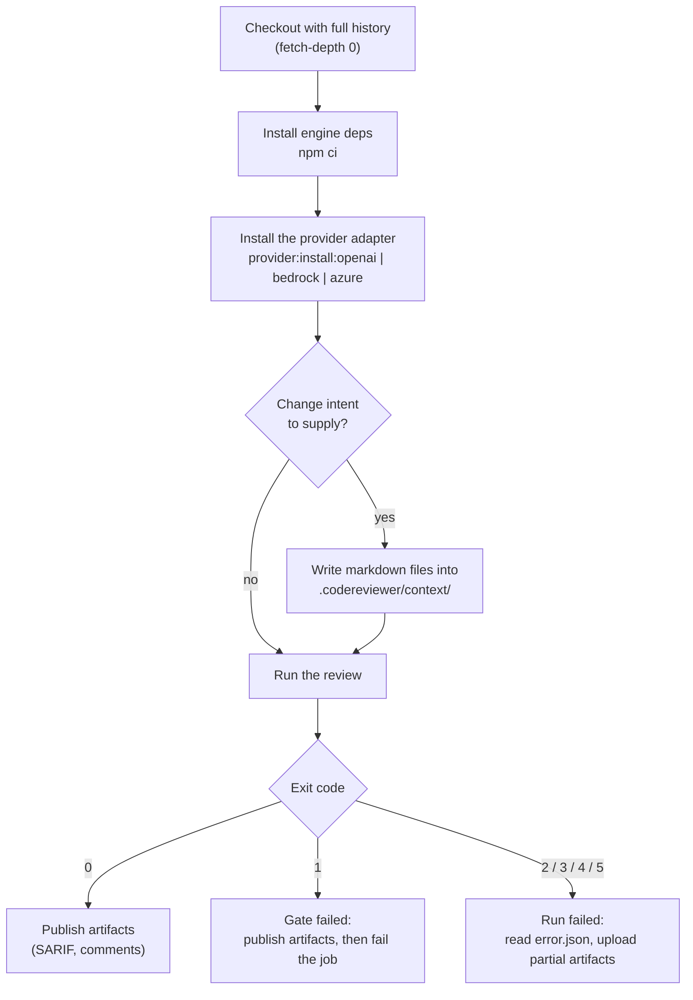

# Running in CI/CD

This guide covers the pipeline shape, the exit-code contract, baselines,
supplying change intent, and worked examples for GitHub Actions, GitLab CI and
Bitbucket Pipelines.

---

## Before you write a pipeline: two facts

**1. The package is not published.** `package.json` sets `"private": true` and
there is no registry artifact. There is no `npm install -g`, no `npx` form and
no published binary. Every CI job must check out this repository and run it
from source.

**2. The engine reviews the current working directory.** The repository root is
`process.cwd()` at CLI entry, and every read and write must resolve under it.
That single rule determines the two supported job shapes below.

### Shape A — the engine reviews its own repository

The job runs inside this checkout. This is the simplest form and is what the
repo's own npm scripts assume.

```bash
npm run cli -- review --base-ref origin/main --head-ref HEAD
```

### Shape B — the engine reviews a different repository

Check out both, install and build the engine once, then invoke the built entry
point with the **target repository as the working directory**.

```bash
npm --prefix "$ENGINE_DIR" ci
```

```bash
npm --prefix "$ENGINE_DIR" run build
```

```bash
cd "$TARGET_DIR" && node "$ENGINE_DIR/dist/cli/main.js" review --base-ref origin/main --head-ref HEAD
```

Artifacts land under `<target>/.codereviewer/runs/<runId>/`, because that is
where the working directory points.

> The build emits `dist/cli/main.js`, matching the `bin` entry in
> `package.json`. Invoking that file directly is what a published install would
> run, so this shape stays valid once the package ships.

---

## Pipeline shape



### Full history is mandatory

The engine resolves `git merge-base <baseRef> <headRef>` before diffing, so a
shallow checkout without both refs fails with `merge_base_unavailable` (exit
`3`). Use `fetch-depth: 0` on GitHub Actions, `GIT_DEPTH: 0` on GitLab, and
`git fetch --unshallow` plus an explicit fetch of the base branch on Bitbucket.

### Credentials

Set provider credentials as CI secrets in the real environment:

| Provider | Variables |
| --- | --- |
| `openai`, `openai-compatible` | `OPENAI_API_KEY` |
| `bedrock` | `AWS_REGION` plus the AWS credential chain |
| `azure` | `AZURE_AI_ENDPOINT`, `AZURE_AI_API_KEY` |

Beware: if a `.env` file exists in the checkout, the config loader reads it
**after** the process environment, so it wins. Do not ship a `.env` into a CI
image. (`eval run` deliberately does not read `.env` at all.)

---

## The exit-code contract

Branch your pipeline on the exit code, not on parsing stdout.

| Code | Meaning | Typical CI response |
| --- | --- | --- |
| `0` | Run completed, quality gate passed | Publish artifacts, continue |
| `1` | A gate failed: quality gate, drift gate, `coverage_incomplete`, `cost_budget_exceeded`, or the eval regression gate | Publish artifacts, then fail the job |
| `2` | Configuration or usage error | Fail fast; fix config or flags |
| `3` | Repository/filesystem error (missing merge base, unreadable report) | Fail; usually a checkout problem |
| `4` | Provider error (auth, rate limit, context length, timeout, 5xx) | Fail or retry the job |
| `5` | Admission, reporting or internal error | Fail; file a bug with `error.json` |

On success stdout carries a single JSON object:

```json
{ "runId": "…", "qualityGatePassed": true, "artifactDir": ".codereviewer/runs/<runId>" }
```

On failure stderr carries `{ "code": …, "message": … }`, plus `artifactDir`
when partial artifacts were written. Full mapping:
[exit-codes-and-error-codes.md](../06-reference/exit-codes-and-error-codes.md).

---

## Artifacts to keep

Everything is written under `<artifactDir>/<runId>/`. Always upload the whole
directory — it is the audit trail:

| File | Why keep it |
| --- | --- |
| `report.json` | The full record, including rejected findings |
| `report.md` | Human-readable summary for the job log |
| `report.sarif` | Upload to a code-scanning surface |
| `run-summary.json` | Run id, timings, token usage, cost, warnings |
| `context-ledger.json` | Exactly what was considered for provider transfer |
| `shared-context.json` | Candidates, verdicts, admission decisions |
| `observability.json` | No-content run events |
| `error.json` | Present only on a failed run |
| `review-comments.json`, `review-comments.<platform>.json` | Present when review comments are enabled |

See [artifacts.md](../06-reference/artifacts.md) and
[partial-and-failed-runs.md](../08-operations/partial-and-failed-runs.md).

---

## Baselines: adopting the tool on an existing codebase

Turning the gate on for a repository with existing debt fails every build.
Record the current state once and gate only on new findings.

Run a review on the default branch, then:

```bash
npm run cli -- baseline write
```

This reads the newest run with a report from `<artifactDir>/index.json` (or an
explicit `--report <path>`) and writes `.codereviewer/baseline.json`. Commit
that file.

```json
{
  "baseline": {
    "enabled": true,
    "path": ".codereviewer/baseline.json",
    "failOnNewOnly": true,
    "includeResolvedInReport": true
  }
}
```

With `failOnNewOnly` on, only findings whose baseline status is `new` or
`unknown` count toward the gate. A finding whose fingerprint is missing from a
configured-but-absent baseline is treated as `unknown`, so a deleted baseline
file never silently disables the gate.

Fingerprints anchor on the **content** of the reported line, not its number, so
edits elsewhere in the file do not resurrect a suppressed finding — but editing
the anchored line does, which is the intended signal that it was addressed.

Refresh the baseline on the default branch after each merge that legitimately
changes it.

---

## Supplying change intent

The reviewer works better when it knows what the change was supposed to do.
The engine never calls a tracker or a forge API: **your pipeline fetches the
context and writes it to disk**, so it owns the credentials and the engine
holds none.

```json
{
  "contextSources": {
    "enabled": true,
    "providers": [
      { "type": "inbox", "dir": ".codereviewer/context" },
      { "type": "changed-files", "include": ["docs/**/*.md", "specs/**/*.md"] }
    ],
    "summary": { "maxBytes": 4000 }
  }
}
```

Write one markdown file per context item into the inbox directory before the
run. Frontmatter is optional; `id`, `title` and `source` are read:

```bash
mkdir -p .codereviewer/context
```

```bash
printf -- '---\nid: %s\ntitle: %s\nsource: pull-request\n---\n%s\n' "$PR_NUMBER" "$PR_TITLE" "$PR_BODY" > .codereviewer/context/pull-request.md
```

The gathered text is redacted, bounded and summarized into a short brief that
is injected as **untrusted, informational context**. It cannot approve a
finding, change a severity, or affect the baseline or the gate. See
[prompt-injection-and-untrusted-input.md](../07-security/prompt-injection-and-untrusted-input.md).

---

## Inline review comments on GitHub, GitLab and Bitbucket

```json
{
  "reporting": {
    "reviewComments": { "enabled": true, "platform": "auto" }
  }
}
```

The run writes a neutral `review-comments.json` and a rendered
`review-comments.<platform>.json`. **It publishes nothing** — no network call,
no forge API. Posting is your pipeline's step, which keeps report generation
and publishing on separate permissions.

`platform: "auto"` resolves locally, first match wins:

1. Explicit config value other than `auto`.
2. A CI environment signal: `GITHUB_ACTIONS` → `github`, `GITLAB_CI` →
   `gitlab`, `BITBUCKET_PIPELINE_UUID` or `BITBUCKET_WORKSPACE` → `bitbucket`.
   A value of empty, `false` or `0` is not a signal.
3. The `origin` git remote host: `github.com` → `github`, `gitlab.com` or a
   `gitlab.*` host → `gitlab`, `bitbucket.org` → `bitbucket`.
4. Otherwise `generic`.

What each renderer emits:

| Platform | Anchor | Suggestion block |
| --- | --- | --- |
| `github` | `line` = range end, `side: RIGHT`; multi-line ranges add `startLine`/`startSide` | Native ` ```suggestion ` — one-click apply |
| `gitlab` | `line` = range end | ` ```suggestion:-<above>+0 `, extending upward from the anchored line |
| `bitbucket` | `line` = range end | Plain fenced code block — Bitbucket has no one-click apply |
| `generic` | `startLine` + `endLine` | Plain fenced code block |

Only findings that are `reporterEligibility: inline`, on the new side, and
inside a reviewed diff range become drafts. Raise or lower
`review.inlineSeverityThreshold` (default `high`) to change the volume.

---

## GitHub Actions

Shape A (this repository reviewing itself). Pin actions by commit SHA in
anything you ship; tags are shown here for readability.

```yaml
name: code-review
on:
  pull_request:

permissions:
  contents: read

jobs:
  review:
    runs-on: ubuntu-latest
    permissions:
      contents: read
      security-events: write
    steps:
      - uses: actions/checkout@v4
        with:
          fetch-depth: 0

      - uses: actions/setup-node@v4
        with:
          node-version-file: .nvmrc
          cache: npm

      - run: npm ci

      - run: npm run provider:install:openai

      - name: Supply change intent
        env:
          PR_NUMBER: ${{ github.event.number }}
          PR_TITLE: ${{ github.event.pull_request.title }}
          PR_BODY: ${{ github.event.pull_request.body }}
        run: |
          mkdir -p .codereviewer/context
          printf -- '---\nid: %s\ntitle: %s\nsource: pull-request\n---\n%s\n' \
            "$PR_NUMBER" "$PR_TITLE" "$PR_BODY" \
            > .codereviewer/context/pull-request.md

      - name: Review
        id: review
        env:
          OPENAI_API_KEY: ${{ secrets.OPENAI_API_KEY }}
        run: npm run cli -- review --base-ref "origin/${{ github.base_ref }}" --head-ref HEAD

      - uses: actions/upload-artifact@v4
        if: always()
        with:
          name: codereviewer-run
          path: .codereviewer/runs/

      - uses: github/codeql-action/upload-sarif@v3
        if: always()
        with:
          sarif_file: .codereviewer/runs
          category: codereviewer
```

Set `reporting.sarif.target` to `github` when you upload SARIF to code
scanning; that target enforces GitHub's partial-fingerprint requirement and
rule-count limit.

Security notes for this workflow:

- The job runs on `pull_request`, which checks out the merge ref **without**
  repository secrets for fork pull requests. Do not switch to
  `pull_request_target` and then check out untrusted head code: that
  combination runs fork code with your secrets.
- Keep `permissions` minimal at the workflow level and widen per job.
- Pull-request titles and bodies are attacker-controlled. Pass them through
  `env:` rather than interpolating `${{ ... }}` directly into a `run:` script,
  which would let a crafted title execute shell commands on the runner.
- Publish comments in a separate job with its own token scope rather than
  granting write permissions to the job that runs the model.
- Prefer OIDC over long-lived cloud keys for the Bedrock provider.

---

## GitLab CI

```yaml
stages: [review]

code-review:
  stage: review
  image: node:24
  variables:
    GIT_DEPTH: 0
  before_script:
    - npm ci
    - npm run provider:install:openai
    - mkdir -p .codereviewer/context
    - |
      printf -- '---\nid: %s\ntitle: %s\nsource: merge-request\n---\n%s\n' \
        "$CI_MERGE_REQUEST_IID" \
        "$CI_MERGE_REQUEST_TITLE" \
        "$CI_MERGE_REQUEST_DESCRIPTION" > .codereviewer/context/merge-request.md
  script:
    - npm run cli -- review --base-ref "origin/$CI_MERGE_REQUEST_TARGET_BRANCH_NAME" --head-ref HEAD
  artifacts:
    when: always
    paths:
      - .codereviewer/runs/
  rules:
    - if: $CI_PIPELINE_SOURCE == "merge_request_event"
```

`GITLAB_CI` is set by the runner, so `reporting.reviewComments.platform: "auto"`
resolves to `gitlab` and the rendered file uses GitLab's
` ```suggestion:-x+y ` syntax. Mask `OPENAI_API_KEY` as a protected, masked CI
variable so it is not exposed to pipelines on unprotected branches.

---

## Bitbucket Pipelines

```yaml
image: node:24

pipelines:
  pull-requests:
    '**':
      - step:
          name: Code review
          caches: [node]
          script:
            - git fetch --unshallow || true
            - git fetch origin "$BITBUCKET_PR_DESTINATION_BRANCH"
            - npm ci
            - npm run provider:install:openai
            - npm run cli -- review --base-ref "origin/$BITBUCKET_PR_DESTINATION_BRANCH" --head-ref HEAD
          artifacts:
            - .codereviewer/runs/**
```

Bitbucket clones shallow by default, so the two `git fetch` lines are required
for `merge-base` to resolve. `BITBUCKET_PIPELINE_UUID` and
`BITBUCKET_WORKSPACE` are set by the runner, so `auto` resolves to
`bitbucket`.

---

## Cost in CI

A default run costs **two provider calls per review task**: one holistic
discovery call and one refutation call. Refutation is batched — a single call
adjudicates every candidate of that task and returns one verdict per candidate
— so cost scales with tasks, not with findings.

Each optional pass you enable (context scout, dedicated security pass) adds
another call per task. Set
`review.maxCostUsd` so a pathological change fails the job instead of quietly
spending. Full arithmetic: [controlling-cost.md](controlling-cost.md).

---

## Hardening checklist

- Least-privilege repository token; no write scope on the job that runs the
  model.
- No secrets exposed to untrusted fork pull requests.
- Never check out and execute untrusted code in a privileged
  `pull_request_target`-style context.
- Pin third-party actions and images by digest in release pipelines.
- Use OpenID Connect for cloud credentials instead of long-lived static keys
  when the platform supports it.
- Use ephemeral runners or clean the workspace between sensitive runs.
- Keep review/report generation separate from publishing permissions.
- Treat run artifacts as sensitive: they are redacted by default, but they
  describe your source. If a leak is ever found in one, delete the local run
  directory, rotate the affected credential outside the tool, and add a
  regression fixture to the redaction tests.

More detail: [threat-model.md](../07-security/threat-model.md) and
[data-handling-and-redaction.md](../07-security/data-handling-and-redaction.md).
