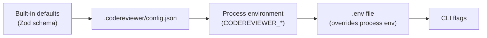

# Configuration Recipes

Task-oriented recipes for `.codereviewer/config.json`. Each recipe shows the
smallest configuration that achieves one goal.

For the exhaustive list of keys, types, ranges and defaults, see the
[configuration reference](../06-reference/configuration/README.md). For environment
variables, see [environment.md](../06-reference/environment.md).

---

## How configuration is resolved

Configuration comes from four layers. Later layers win:



Facts worth knowing before you start:

| Fact | Detail |
| --- | --- |
| The config file is optional | A missing file is not an error. The run records a `config-file-missing` warning and uses defaults. |
| Unknown keys are rejected | Every object is a Zod `strictObject`. A typo fails validation with exit code `2`. |
| Objects merge, arrays replace | Nested objects deep-merge across layers; an array you set replaces the default array entirely. |
| `.env` beats process env | The loader reads `.env` last, so a value there overrides the same variable in the real environment. `eval run` does **not** read `.env`. |
| Only some keys have env overrides | The `CODEREVIEWER_*` variables cover a deliberate subset. Everything else must go in the config file. |
| `__proto__`, `constructor`, `prototype` | Rejected as configuration keys. |

Validate whatever you write before you rely on it:

```bash
npm run cli -- config validate
```

The command prints the fully merged, defaulted config with secrets masked and
`baseUrl`/`endpoint` reduced to `scheme://host`.

---

## Recipe: the smallest useful config

You want model-backed review with the defaults for everything else.

```json
{
  "provider": {
    "id": "openai",
    "model": "gpt-4o-mini"
  }
}
```

Credentials never live in the config file. See
[providers.md](providers.md) and
[secrets-and-credentials.md](../07-security/secrets-and-credentials.md).

---

## Recipe: run with no model provider at all

You want to try the tool, or run in a network-restricted job, without a
provider. Omit the `provider` block entirely — it is optional.

```json
{
  "reporting": { "formats": ["json", "markdown"] }
}
```

With no provider configured the run performs no network IO: it collects the
diff, computes deterministic support signals, plans tasks, writes artifacts and
evaluates the gate. No model discovery or refutation runs, so the report
contains no model-origin findings.

---

## Recipe: point at a different config file

```bash
npm run cli -- config validate --config config/codereviewer.ci.json
```

`--config` is a global option: it works on every command, alongside `--debug`,
`--log-level` and `--log-file`. `CODEREVIEWER_CONFIG_PATH` does the same thing
from the environment. The path must resolve inside the repository root.

An unrecognised flag is rejected before any work happens — `--config` with no
value, or a misspelled option, exits `2` naming the problem. That is deliberate: a
parser that silently ignores a flag it does not implement has already cost this
project a ~$11.50 A/B comparison of a build against itself — that figure, like
every cost published in these docs, was spent on `openai/gpt-5.3-codex`.

---

## Recipe: choose what gets reviewed

`paths.include` and `paths.exclude` are glob lists applied to changed files.
Setting `exclude` **replaces** the built-in exclude list, so re-state the
defaults you still want.

```json
{
  "paths": {
    "include": ["src/**/*", "packages/**/*"],
    "exclude": [
      ".git/**",
      "node_modules/**",
      "dist/**",
      "coverage/**",
      ".codereviewer/**",
      "**/package-lock.json",
      "**/*.min.js",
      "**/*.map",
      "**/*.snap",
      "locales/**"
    ]
  }
}
```

The built-in list already skips VCS, dependency, build and artifact
directories plus lock files, minified bundles, source maps and test snapshots.
Add your own generated or data-only directories to keep them out of the model
context.

Two more scope limits live under `review`:

| Key | Default | Meaning |
| --- | --- | --- |
| `review.maxFiles` | `500` | Upper bound on reviewed files. |
| `review.maxFileBytes` | `500000` | Files larger than this are skipped and listed in `skippedFiles`. |

---

## Recipe: review a branch against its merge base

```json
{
  "review": {
    "baseRef": "origin/main",
    "headRef": "HEAD"
  }
}
```

The engine resolves `git merge-base <baseRef> <headRef>` first and diffs from
there, so commits that landed on the base branch after you branched are not
attributed to your change. Refs must not start with `-`.

Both refs can be overridden per invocation:

```bash
npm run cli -- review --base-ref origin/main --head-ref HEAD
```

---

## Recipe: review specific files instead of a diff

```bash
npm run cli -- review --file src/app.ts --file src/router.ts
```

Explicit-file runs skip git diffing entirely. There is no merge base and no
diff ranges, so every finding is judged against whole-file context.

---

## Recipe: tune the noise floor

The two severity dials do different jobs:

| Key | Default | Effect |
| --- | --- | --- |
| `aiReview.actionableSeverityThreshold` | `medium` | A model-origin candidate below this severity is **rejected** at admission (recorded as a rejected finding, so it stays auditable). |
| `review.inlineSeverityThreshold` | `high` | An admitted finding below this severity is `summary-only` instead of `inline`, so it never becomes an inline review comment. |

See [tuning-noise-and-recall.md](tuning-noise-and-recall.md) for how to move
them safely.

---

## Recipe: set the quality gate

```json
{
  "qualityGate": {
    "maxCritical": 0,
    "maxHigh": 0,
    "maxMedium": 5,
    "failOnProviderError": true
  }
}
```

`maxMedium` is omitted by default, which means medium findings never fail the
gate. A gate failure exits `1`; see
[ci-cd.md](ci-cd.md) and
[exit-codes-and-error-codes.md](../06-reference/exit-codes-and-error-codes.md).

---

## Recipe: suppress pre-existing findings with a baseline

```json
{
  "baseline": {
    "enabled": true,
    "path": ".codereviewer/baseline.json",
    "failOnNewOnly": true,
    "includeResolvedInReport": true
  }
}
```

Generate the file from a completed run:

```bash
npm run cli -- baseline write
```

`baseline write` reads the newest run that has a report from
`<artifactDir>/index.json`, or an explicit `--report <path>`. With
`failOnNewOnly` on, the gate only counts findings whose baseline status is
`new` or `unknown` — a configured-but-missing baseline is treated as `unknown`,
so a lost baseline file never silently disables the gate.

---

## Recipe: choose report formats

```json
{
  "reporting": {
    "formats": ["json", "markdown", "sarif"],
    "sarif": {
      "target": "github",
      "category": "codereviewer",
      "maxResults": 5000
    }
  }
}
```

There is no `sarif.redact` key — the SARIF reporter redacts unconditionally, so a
toggle would only be able to lie. Writing one exits `2`.

`sarif.target: "github"` applies GitHub Code Scanning constraints (partial
fingerprints required, rule-count limit). Use `generic` for any other SARIF
consumer. Artifact names are fixed; see
[artifacts.md](../06-reference/artifacts.md).

---

## Recipe: emit inline review comments for your platform

**On by default.** `reporting.reviewComments.enabled` is `true` out of the box,
so a default run already writes a neutral `review-comments.json` plus a rendered
`review-comments.<platform>.json`. It publishes nothing — posting the comments
is your pipeline's job. The recipe below is for pinning the platform instead of
relying on auto-detection:

```json
{
  "reporting": {
    "reviewComments": {
      "platform": "github"
    }
  }
}
```

`auto` (the default) detection is local only (CI environment variables, then the
`origin` git remote host, then `generic`); it makes no network call. Pin the
value to `github`, `gitlab`, `bitbucket` or `generic` to skip detection, or set
`"reviewComments": { "enabled": false }` to turn the drafts off entirely.
Details in [ci-cd.md](ci-cd.md).

---

## Recipe: add project review instructions

```json
{
  "instructions": {
    "files": [
      { "path": ".codereviewer/instructions/house-rules.md" },
      { "path": ".codereviewer/instructions/backend-rules.md", "scope": ["backend/**"] }
    ],
    "inline": "Treat any new public HTTP handler without an authorization check as critical."
  }
}
```

Instruction files resolve under the repository root, are redacted before use,
and are recorded in the context ledger and in each finding's provenance hashes.
An optional `scope` (glob patterns, same dialect as `paths.include`/`exclude`)
limits a file to review tasks that touch a matching path; omitted, it applies
everywhere, as in the first entry above. See
[instructions-and-skills.md](instructions-and-skills.md).

---

## Recipe: cap what a run may cost

```json
{
  "review": {
    "maxCostUsd": 2.5,
    "maxConcurrentTasks": 4
  }
}
```

`maxCostUsd` is checked **after** the review completes: exceeding it fails the
run with `cost_budget_exceeded` (exit `1`) and still writes partial artifacts.
It is a tripwire, not a mid-run brake. See
[controlling-cost.md](controlling-cost.md).

**There is no whole-run time limit, deliberately.** A deadline would abort work
that was progressing perfectly well, and a review takes as long as the change
needs. The one time bound that exists is `provider.timeoutMs`, so a single network
call cannot hang forever; a call that fails transiently is retried, and anything
unrecoverable fails loudly with a classified error.

---

## Recipe: turn on logging for one run

```bash
npm run cli -- review --debug --log-file .codereviewer/review.log
```

Logging defaults to `silent`. `--debug` sets level `debug`; `--log-level
<level>` sets any level. `--log-file` appends JSONL (it never truncates) and
writes a `log-run-start` header line per invocation. Logs carry run ids, step
names, timings, counts and error codes — never source, prompts, provider
responses or secrets.

Persist the level instead:

```json
{
  "observability": {
    "logging": { "level": "info" }
  }
}
```

---

## Recipe: feed pull-request or ticket context into the review

**On by default.** `contextSources.enabled` is `true` out of the box, with two
providers already configured: an `inbox` reading `.codereviewer/context`, and a
`changed-files` provider matching `**/*.md` in the reviewed diff. Neither needs
any config to work — write a markdown file into the inbox directory before the
run, or just let a changed `.md` file in the diff supply the brief. Both are
no-ops, not errors, when they find nothing: a missing inbox directory or a diff
with no matching Markdown is an ordinary review with no intent brief.

The recipe below is for **customizing** the default — narrowing the
`changed-files` globs to your own docs/specs layout, or raising the byte caps:

```json
{
  "contextSources": {
    "providers": [
      { "type": "inbox", "dir": ".codereviewer/context", "maxFiles": 20, "maxFileBytes": 64000 },
      { "type": "changed-files", "include": ["docs/**/*.md", "specs/**/*.md"] }
    ],
    "summary": { "mode": "model", "maxBytes": 4000 }
  }
}
```

Set `"contextSources": { "enabled": false }` to turn the whole capability off.

Both providers are filesystem-only: the product performs no tracker or platform
fetch and holds no tracker credentials. An inbox file is plain markdown with an
optional `---` frontmatter block (`id`, `title`, `source` are read). Gathered
text is redacted, bounded, summarized into a brief of at most `summary.maxBytes`
bytes, and injected as untrusted, informational context that cannot approve or
suppress a finding. With `summary.mode` unset the mode resolves at runtime to
`model` when a **model provider** (`provider`) is configured and `digest`
(deterministic, no model call) otherwise — it is `provider` that decides, not
these context providers. So a default run with a model configured resolves to
`model` mode, and spends a summarizer call whenever the providers actually find
something: zero fragments means no call at all. See
[Controlling cost](controlling-cost.md).

This flip is **not** a measured quality lever: enabling `contextSources` was not
gated on an A/B, and whether it helps or hurts recall or precision is unmeasured
either way. See [Status and limitations](../01-overview/status-and-limitations.md).

---

## Recipe: enable the optional discovery and investigation passes

Cross-file retrieval is **on** by default. The rest are off, and each one adds
provider calls:

```json
{
  "security": {
    "dedicatedPass": { "enabled": true }
  },
  "verification": { "enabled": true },
  "fix": { "enabled": true }
}
```

Read [tuning-noise-and-recall.md](tuning-noise-and-recall.md) before enabling
any of them, and [controlling-cost.md](controlling-cost.md) for what each one
adds to the bill.

---

## Recipe: the advisory lanes are on by default

`changeImpact.enabled` and `intentFulfilment.enabled` are both `true` out of the
box. Two things follow from that:

- The standalone `impact check` and `intent check` commands work with no config
  change.
- `review` itself now runs both lanes **in-process**, over the context it already
  built for the review, and writes `impact-report.json` / `intent-report.json`
  into the same run directory — not a separate one. Neither lane's report can
  fail the pipeline: nothing either one reports sets a non-zero exit code.

**Neither lane has an accuracy measurement.** `intent check` does exit `4` when
one of its three input limits binds, refusing to judge an input it cannot see
whole; see
[the CLI reference](../06-reference/cli.md#exit-codes-and-the-three-input-limits).

```json
{
  "changeImpact": { "enabled": false },
  "intentFulfilment": { "enabled": false }
}
```

Set either to `false` to turn that lane off — in `review` and in its standalone
command alike.

`changeImpact` makes no provider call in its default shape, so it costs nothing
and its output is reproducible. Its adjudication layer is a second switch
(`changeImpact.adjudication.enabled`, default `false`) and is the only part of it
that can spend.

`intentFulfilment` additionally needs a change-intent source, or it reports
`status: "no-intent"` (a warning, exit `0`) instead of running — see the
change-intent recipe above. Because `contextSources` is also on by default now,
an ordinary change that touches a Markdown file can supply that source with no
configuration at all, which means `intentFulfilment`'s extraction/judgement
calls are a real, non-zero cost on some default runs. See
[Controlling cost](controlling-cost.md).

Every limit inside these blocks is a **runaway guard, not a ration**. Two of them
were set as rations and both were measured as harmful: the old obligation cap was
being hit exactly by 24 of 28 corpus runs, and 43% of real commits exceeded the
old changed-line cap, so the judgement silently saw a partial diff and reported
what it could not see as unaddressed. Lowering them buys nothing you want.

---

## Recipe: keep the drift gate honest

```json
{
  "drift": {
    "enabled": true,
    "failOn": ["generated-artifact-drift", "security-drift"],
    "includeDocs": true,
    "includeSpecs": true,
    "includeGenerated": true
  }
}
```

The drift checker is deterministic and never sends anything to a provider. It
runs as a preflight step inside `review` and as its own command:

```bash
npm run cli -- drift check
```

---

## What you cannot configure

| Attempt | Result |
| --- | --- |
| `security.allowShell: true` | Validation error, exit `2`. The key accepts the literal `false` only. |
| `security.allowNetwork: true` | Validation error, exit `2`. |
| `security.allowFilesystemWrite: true` | Validation error, exit `2`. |
| `security.captureContentTelemetry: true` | Validation error, exit `2`. |
| `aiReview.requireRefutation: false` | Validation error, exit `2`. Refutation is not optional. |
| Any path escaping the repository root | Rejected before IO. |

See [permissions-and-path-containment.md](../07-security/permissions-and-path-containment.md).
