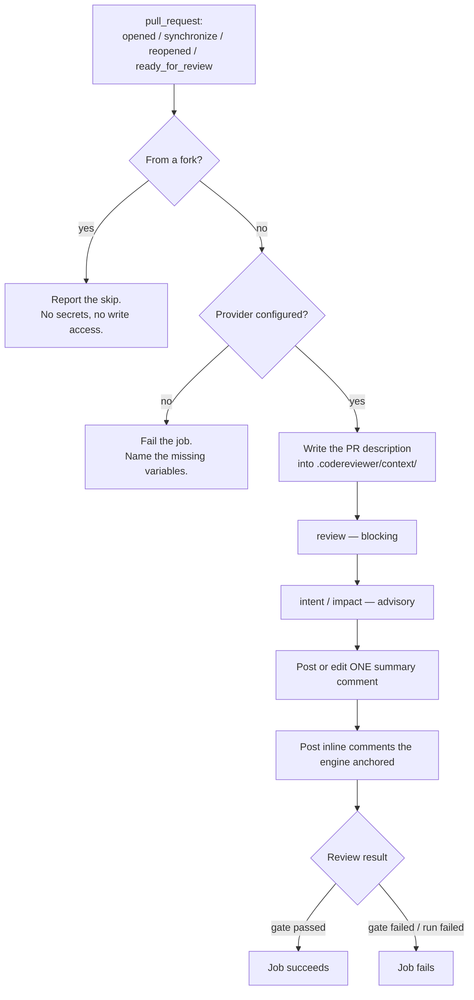

# GitHub pull-request integration

A ready-made GitHub Actions workflow that reviews a pull request with this
engine and reports back in **one comment that stays current**.

- Workflow: [`.github/workflows/code-review.yml`](../../.github/workflows/code-review.yml)
- Logic and tests: [`scripts/github/`](../../scripts/github/)
- Stage configuration: [`scripts/github/codereviewer.github.json`](../../scripts/github/codereviewer.github.json)

This is the concrete, opinionated form of the general recipes in
[ci-cd.md](ci-cd.md). Read that one if you are writing your own pipeline, or
running on GitLab or Bitbucket.

---

## What it does



1. **Triggers** on `opened`, `synchronize` (every push to the branch),
   `reopened` and `ready_for_review`. Draft pull requests are skipped — they
   cannot be merged and every run costs money; marking one ready fires
   `ready_for_review` and reviews it.
2. **Feeds the pull-request title and description in as change intent.** They
   are written as a frontmatter-markdown file into the inbox directory the
   [change-intent capability](../03-concepts/optional-capabilities/change-intent-context.md)
   reads, so the reviewer knows what the change was *supposed* to do and
   `intent check` has something to check the diff against.
3. **Runs three stages**: `review`, then `intent check` and `impact check`.
4. **Writes one summary comment**, created on the first run and edited in place
   on every run after that.
5. **Posts inline review comments** for the findings the engine anchored to a
   diff line, deduplicated so a re-run does not repeat itself.
6. **Fails the job** only when the review's quality gate failed or the review
   could not run.

---

## What to configure

### 1. Secrets and variables

| Kind | Name | Required | Purpose |
| --- | --- | --- | --- |
| Variable | `CODEREVIEWER_PROVIDER_ID` | yes | `openai`, `openai-compatible`, `bedrock` or `azure` |
| Variable | `CODEREVIEWER_PROVIDER_MODEL` | yes | Model id |
| Variable | `CODEREVIEWER_PROVIDER_BASE_URL` | for `openai-compatible` | Endpoint |
| Variable | `CODEREVIEWER_PROVIDER_REASONING_EFFORT` | no | `minimal` … `high`; leave unset for the provider default |
| Secret | `OPENAI_API_KEY` | for `openai` / `openai-compatible` | Credential |
| Secret | `AZURE_AI_ENDPOINT`, `AZURE_AI_API_KEY` | for `azure` | Credential |
| Variable / Secret | `AWS_REGION`, `AWS_ACCESS_KEY_ID`, `AWS_SECRET_ACCESS_KEY` | for `bedrock` | Credential (or use OIDC) |

Model choice lives in **repository variables** so it can be changed without
editing the workflow; credentials live in **secrets**. Nothing reads a secret's
value except the provider adapter: a missing credential is reported by variable
**name**, never by value.

### 2. Make it a required check

The whole argument for this integration is in
[ci-cd.md](ci-cd.md#why-the-gate-should-be-a-required-check-not-a-comment): a
comment can be scrolled past, a required check cannot, and each round of fixes
gives the reviewer a new diff to look at. Add **Code review** to the branch
protection rules for your default branch.

### 3. Optional environment knobs

| Variable | Default | Effect |
| --- | --- | --- |
| `CODEREVIEWER_GITHUB_CONFIG` | `scripts/github/codereviewer.github.json` | Which config file every stage runs with |
| `CODEREVIEWER_COMMENT_KEY` | `default` | Identity of the comment this workflow owns; give a second workflow a second key |
| `CODEREVIEWER_MAX_INLINE_COMMENTS` | `25` | Per-run cap on inline comments |
| `CODEREVIEWER_CONTEXT_DIR` | `.codereviewer/context` | Where the pull-request description is written; must match the `inbox` provider's `dir` |
| `CODEREVIEWER_COMMENT_AUTHOR` | `github-actions[bot]` | Login the workflow acts as, used to confirm a comment is ours before editing it |

> **Watch the `.env` precedence.** The config loader reads a `.env` file in the
> checkout **after** the process environment, so a committed `.env` would
> silently win over both the workflow's variables and
> `codereviewer.github.json`. Never ship one into a CI image.

---

## What each stage contributes

The stage table at the top of the comment names each stage's **role**, because
only one of them is allowed to block.

| Stage | Role | Spec | What it adds |
| --- | --- | --- | --- |
| `review` | **blocking** | 05 | Evidence-backed defects in the changed code, filtered by refutation and a deterministic admission gate. Exit code `1` means the quality gate failed. |
| `intent check` | advisory | [23](../../specs/23-intent-fulfilment-review.md) | Reads obligations out of the pull-request description and maps each to the changed lines that evidence it — or to nothing. |
| `impact check` | advisory | [22](../../specs/22-change-impact-review.md) | Lists the callers of every symbol the change touched. Deterministic; makes no model call. |

**The two advisory stages can never fail the job.** That is a specification
requirement, not a configuration default — spec 23 states it outright: the
command "MUST NOT be able to fail a pipeline on fulfilment grounds. This is not
configurable", because the measured spurious-rejection rate of model
requirement-conformance judgement is 26–36% and is not accurate enough to gate
on. Nothing either command reports can set a non-zero exit code — `intent check`
exits `4` only when an input limit binds and it declines to judge a partial
input, which is a refusal to answer rather than an answer — and
`jobExitCode` in [`stage-outcomes.ts`](../../scripts/github/stage-outcomes.ts)
reads the blocking stage and nothing else, so an advisory outcome has no way to
reach the job's exit code even if one of them errors.

### How intent is read

The engine holds no forge credentials and makes no network call. The workflow
writes the description to disk and the engine reads it:

```
.codereviewer/context/pull-request.md
---
source: pull-request
id: 7
title: Add a session guard to the admin route
url: https://github.com/acme/widget/pull/7
---
# Add a session guard to the admin route

Target branch: main

<the pull-request description, verbatim>
```

The text is **untrusted input**, and it is treated as such by
[spec 11](../../specs/11-external-context-ingestion.md): redacted, byte-capped,
summarized into one `change-intent` document, and presented to the model under
an explicit untrusted-content header. It can never approve a finding, move a
severity, change the baseline, or touch the quality gate. Read
[orientation, not authorization](../03-concepts/optional-capabilities/change-intent-context.md#orientation-not-authorization)
for what the reviewer is told about it.

A pull request with no title and no description is reported plainly — the
review runs without stated intent rather than against invented intent.

---

## How the comment is kept current

The comment body opens with a hidden marker:

```html
<!-- codereviewer:review-summary:default -->
```

On every run the workflow lists the pull request's comments, finds the one
carrying that marker, and **edits it**. A pull request pushed to ten times ends
with one current comment.

Three details make that reliable rather than approximate:

- **The marker is written first.** If the body ever reaches GitHub's size limit
  the renderer drops whole sections from the end, so the comment can never lose
  its own identity.
- **Untrusted text cannot forge a marker.** Every value rendered into the body —
  finding titles, descriptions, obligation statements — has its `<` escaped, so
  no model output and no pull-request text can emit an HTML comment.
- **A human's comment is never edited.** `pull-requests: write` can edit anyone's
  comment, so a user who pasted the marker into their own comment would otherwise
  have it silently overwritten. Candidates are restricted to the acting identity
  (`github-actions[bot]` by default), and the **oldest** match wins so two runs
  cannot alternate between two comments.

A `concurrency` group per pull request with `cancel-in-progress` means a push
that lands mid-review cancels the earlier run, so two runs never race to create
the comment in the first place.

---

## What the summary comment says

The comment is not a shortened `report.md`; it renders the same underlying
`report.json` so that a reviewer who never opens the run artifacts still gets
an honest picture, not a rosier one.

- **Findings** — every admitted finding whose `reporterEligibility` is
  `inline` or `summary-only`: the ones this run is prepared to stand behind.
- **Unresolved - Needs Human Decision** — findings admission marked
  `artifact-only`: a real suspicion refutation could neither prove nor
  disprove (verdict `needs-more-evidence`), kept as an open question instead
  of being dropped. Rendered in its own section, never mixed into the
  findings above — folding it in would read an undecided suspicion as a
  proved defect. It does not affect the quality gate and is never posted as
  an inline comment. This section is present only when the run produced at
  least one such finding.
- **Resolved since baseline** — a count, in the collapsed "Run details"
  block, of baseline entries that no longer match any current finding, i.e.
  fixed since the baseline was recorded. Shown only when
  `baseline.includeResolvedInReport` was enabled for the run; a run that
  never computed it shows nothing, not a zero. The baseline stores
  fingerprints only, never source, path, or finding text, so a count is
  genuinely all this line can say — it does not name which defect was fixed.
- **Candidates** — one line, also in "Run details", giving the precision
  story behind a short findings list: how many candidates were examined in
  total, how many were admitted, how many refutation or the deterministic
  admission gate rejected, and — when the run's discovery telemetry is
  present — how many were merged away as duplicates before that. The reasons
  for each rejection are not repeated here; they are in `report.json`'s
  `rejectedFindings`.

---

## Inline comments

When [`reporting.reviewComments`](../../specs/13-review-comments-and-suggestions.md)
is enabled — it is, in the shipped config — the run writes
`review-comments.github.json`, and the workflow posts those as a single
pull-request review (`event: COMMENT`).

- **No line position is invented.** The anchor is whatever spec 13's GitHub
  renderer produced: `line` at the target range's end with `side: RIGHT`, plus
  `startLine`/`startSide` for a multi-line range. Only findings admission marked
  `reporterEligibility: inline` — that is, whose reported line falls inside a
  reviewed diff range — get one at all. Everything else is in the summary
  comment.
- **Each comment can be checked.** The body states what refutation returned
  against that finding — or that no verdict was recorded, which it says rather
  than leaving out — and the evidence addresses the finding rests on. The
  measured reliability rates are not repeated per comment; they are in the
  summary comment once.
- **Suggestions stay applicable.** The rendered body is posted as-is. It is not
  re-escaped, because a ` ```suggestion ` block is code GitHub applies to the
  file and escaping it would silently corrupt every one-click fix. Spec 13's
  neutral layer has already escaped the prose and guarded the fence.
- **Re-runs do not repeat themselves.** Each comment carries a hidden marker
  keyed on the finding's content-anchored **fingerprint** — not its id, which is
  generated per run — and a finding already commented on is skipped.
- **The review is a comment, never a change request.** Blocking a merge is the
  quality gate's job, through the job's exit code and a required check, which is
  a deterministic decision a human configured.
- **Failure degrades to the summary.** GitHub rejects an entire review if any one
  comment does not land on a line it recognises. If that happens the summary
  comment says so and lists every finding; the job is not failed for it.

Raise or lower `review.inlineSeverityThreshold` (default `high`) to change the
volume, and `CODEREVIEWER_MAX_INLINE_COMMENTS` to change the per-run cap.

---

## Permission model

```yaml
permissions:
  contents: read        # workflow level

jobs:
  review:
    permissions:
      contents: read    # read the code under review
      pull-requests: write  # write the summary and inline comments
```

That is the whole grant. Not requested, deliberately:

- `security-events: write` — only needed to upload SARIF to code scanning. The
  run still writes `report.sarif` into the artifacts; add the permission and an
  upload step if you want that surface.
- `checks: write`, `statuses: write` — the job's own exit code is the check.
- `contents: write` — nothing here writes to the repository.

Other properties worth stating:

- **The trigger is `pull_request`, never `pull_request_target`.**
  `pull_request_target` runs with repository secrets and write access; combined
  with checking out the pull request's head it executes untrusted code with both.
  This workflow does not use it, and does not offer an option to.
- **No pull-request text is interpolated into shell.** The title and body are
  attacker-controlled, and `${{ github.event.pull_request.title }}` inside a
  `run:` block is a remote-code-execution primitive. The entry point reads the
  event payload from `GITHUB_EVENT_PATH` instead, and passes every CLI argument
  as an array element with `shell: false`.
- **Secrets are never printed.** `CODEREVIEWER_LOG_LEVEL` is `silent`, so the
  engine emits no prompts, source, or tool output into a public job log, and the
  missing-credential message names variables rather than values.

---

## Fork pull requests

**Fork pull requests are skipped, with a message.**

On a `pull_request` event from a fork GitHub withholds repository secrets and
downgrades `GITHUB_TOKEN` to read-only. So the provider call cannot be made and
the comment cannot be written — there is no configuration that changes this
short of `pull_request_target`, which this workflow refuses for the reason
above.

What happens instead: the job runs, detects the fork, writes the explanation to
the job summary, and **succeeds**. A fork pull request is not a failing pull
request; it is an unreviewed one. To review one, push the branch into this
repository and open a pull request from there, or run the engine locally against
the contributor's branch.

If you need fork coverage, the safe shape is a second, separate workflow on
`workflow_run` that has no checkout of untrusted code — that is not built here,
and building it is not a small change.

---

## Failure modes

| Situation | What happens | Job |
| --- | --- | --- |
| Fork pull request | Job summary explains the skip. No comment (the token cannot write one). | passes |
| No provider configured | Comment and log name the missing variables. **Nothing is reviewed, and the job fails** — a green tick for an empty review is the worst outcome available. | fails (`2`) |
| Provider error (auth, rate limit, context length) | Comment shows `Review — error` with the engine's message; advisory stages still reported. | fails |
| Quality gate failed | Comment headline says so; the findings that block are marked. | fails |
| Advisory stage errored (bad config, no merge base) | Comment shows that stage as `error` with its message. | passes |
| Inline comments rejected by GitHub | Note in the comment; every finding listed in the summary instead. | unchanged |
| Shallow checkout | `merge_base_unavailable`, exit `3`. `fetch-depth: 0` is set in the workflow; keep it. | fails |
| Comment body over GitHub's size limit | Trailing sections dropped whole, with a pointer to the artifacts. | unchanged |

Artifacts (`report.json`, `report.md`, `report.sarif`, `run-summary.json`,
`context-ledger.json`, `shared-context.json`, `observability.json`, the
review-comment files, and `error.json` on a failed run) are uploaded on every
outcome under `codereviewer-run-<pr number>` and kept for 14 days. See
[artifacts.md](../06-reference/artifacts.md).

---

## Cost

The blocking review dominates: two provider calls per discovery partition
(discovery and a batched refutation), where a partition is
`aiReview.maxFilesPerDiscoveryCall` changed files of a task, default `2`. Cost
therefore scales with changed files, not with findings.
`intent check` adds one extraction call, one judgement call per obligation, and
one explanation call — measured at roughly $0.008 per obligation on
`openai/gpt-5.3-codex`, which is the model every cost figure in these docs was
measured on. `impact check` makes **no** provider call at all.

Set `review.maxCostUsd` in `codereviewer.github.json` so a pathological change
fails the job instead of quietly spending. Full arithmetic:
[controlling-cost.md](controlling-cost.md).

---

## Working on the integration

The logic lives in `scripts/github/`, not in the YAML, so it can be tested. It is
covered by the repository's standard verification — no separate command:

```bash
npm run lint && npm test
```

The tests are hermetic — no process, no filesystem, no network. Every side
effect is injected into `runPipeline`, so the fork path, the missing-key path,
the provider-error path, the gate-failure path, the comment-update path and the
inline-comment fallback are all exercised against fixtures.

| Module | Responsibility |
| --- | --- |
| `main.ts` | The IO boundary: resolves the environment, spawns the CLI, reads artifacts, calls GitHub |
| `pipeline.ts` | The workflow as one function, with every side effect injected |
| `pull-request-context.ts` | Parses the event payload; decides `fromFork` |
| `change-intent-inbox.ts` | Renders the description into a spec 11 inbox file |
| `provider-credentials.ts` | Pre-flight check; reports missing variables by name |
| `stage-outcomes.ts` | The three stages and the exit-code contract |
| `report-digest.ts` | Reduces the three report shapes to what the comment renders |
| `summary-comment.ts` | Renders the body; owns the marker and comment selection |
| `inline-review.ts` | Maps rendered comments to review payloads; deduplicates by fingerprint |
| `github-api.ts` | The only module that performs network IO |
| `sanitize.ts` | The guards untrusted text passes through |

> This directory was briefly carrying a `tsconfig.json` and a `vitest.config.ts`
> of its own, which kept 103 tests out of `npm test` and the whole directory out
> of `npm run typecheck`. Both are now folded into the root configs and the local
> ones are gone. A suite CI does not run is a suite that rots.
>
> `tsconfig.build.json` restates `include` as `src/**/*.ts`, so type-checking
> these modules does not put them in the published package — verified: `dist/`
> contains nothing from `scripts/`.

---

## Hardening checklist

- All three actions are pinned by **commit SHA** with the tag in a trailing
  comment, matching the other workflows and what `specs/08` requires. A moving
  tag is a live write path into your repository from a third party.
- Keep `pull_request` as the trigger. Do not switch to `pull_request_target`.
- Keep the provider credential as a repository (or environment) secret, and
  prefer OIDC over long-lived cloud keys for Bedrock.
- Keep `CODEREVIEWER_LOG_LEVEL` at `silent` for public repositories.
- Treat run artifacts as sensitive: they are redacted by default, but they
  describe your source.
- Review [threat-model.md](../07-security/threat-model.md) and
  [prompt-injection-and-untrusted-input.md](../07-security/prompt-injection-and-untrusted-input.md)
  before enabling this on a repository that takes external contributions.

---

## Related

- [Running in CI/CD](ci-cd.md) — the general recipes, GitLab and Bitbucket
- [Exit codes](../06-reference/exit-codes-and-error-codes.md)
- [Artifacts](../06-reference/artifacts.md)
- [Change-intent context](../03-concepts/optional-capabilities/change-intent-context.md)
- [Controlling cost](controlling-cost.md)
