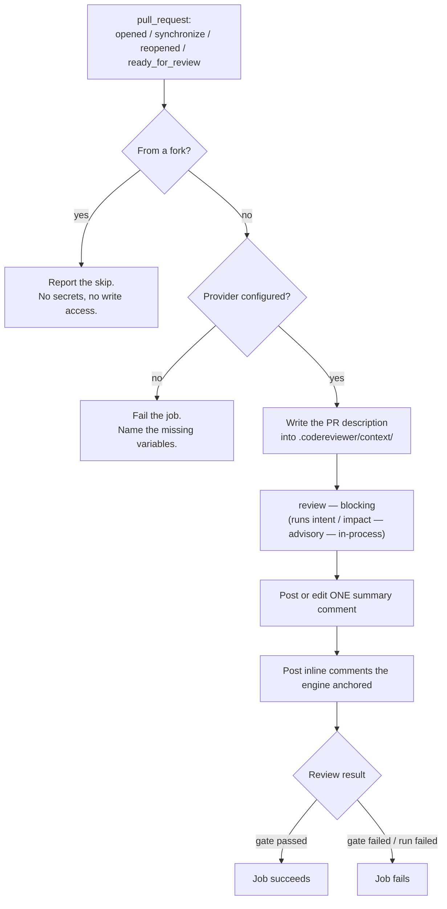
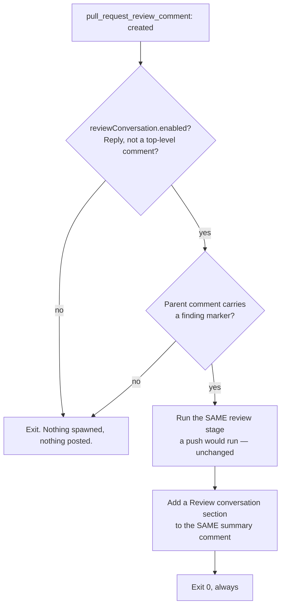

# GitHub pull-request integration

A ready-made GitHub Actions workflow that reviews a pull request with this
engine and reports back in **one comment that stays current**.

- Workflow: [`.github/workflows/code-review.yml`](../../.github/workflows/code-review.yml)
- Logic and tests: [`scripts/github/`](../../scripts/github/)
- Stage configuration: [`scripts/github/codereviewer.github.json`](../../scripts/github/codereviewer.github.json)

This is the concrete, opinionated form of the general recipes in
[ci-cd.md](ci-cd.md). Read that one if you are writing your own pipeline, or
running on GitLab or Bitbucket.

---

## What it does



1. **Triggers** on `opened`, `synchronize` (every push to the branch),
   `reopened` and `ready_for_review`. Draft pull requests are skipped — they
   cannot be merged and every run costs money; marking one ready fires
   `ready_for_review` and reviews it. It also triggers on
   `pull_request_review_comment` (`created`) — see
   [Review conversation](#review-conversation-spec-30) below; that trigger does
   nothing unless `reviewConversation.enabled` is set, which it is not by
   default.
2. **Feeds the pull-request title and description in as change intent.** They
   are written as a frontmatter-markdown file into the inbox directory the
   [change-intent capability](../03-concepts/optional-capabilities/change-intent-context.md)
   reads, so the reviewer knows what the change was *supposed* to do and
   `intent check` has something to check the diff against.
3. **Runs one CLI invocation**: `review`, which runs the two advisory
   reference lanes itself, in-process, over the same run context — see
   [What each stage contributes](#what-each-stage-contributes).
4. **Writes one summary comment**, created on the first run and edited in place
   on every run after that.
5. **Posts inline review comments** for the findings the engine anchored to a
   diff line, deduplicated so a re-run does not repeat itself.
6. **Fails the job** only when the review's quality gate failed or the review
   could not run — never on a `pull_request_review_comment`-triggered run,
   which cannot fail the job at all (see below).

---

## What to configure

### 1. Secrets and variables

| Kind | Name | Required | Purpose |
| --- | --- | --- | --- |
| Variable | `CODEREVIEWER_PROVIDER_ID` | yes | `openai`, `openai-compatible`, `bedrock` or `azure` |
| Variable | `CODEREVIEWER_PROVIDER_MODEL` | yes | Model id |
| Variable | `CODEREVIEWER_PROVIDER_BASE_URL` | for `openai-compatible` | Endpoint |
| Variable | `CODEREVIEWER_PROVIDER_REASONING_EFFORT` | no | `minimal` … `high`; leave unset for the provider default |
| Secret | `OPENAI_API_KEY` | for `openai` / `openai-compatible` | Credential |
| Secret | `AZURE_AI_ENDPOINT`, `AZURE_AI_API_KEY` | for `azure` | Credential |
| Variable / Secret | `AWS_REGION`, `AWS_ACCESS_KEY_ID`, `AWS_SECRET_ACCESS_KEY` | for `bedrock` | Credential (or use OIDC) |

Model choice lives in **repository variables** so it can be changed without
editing the workflow; credentials live in **secrets**. Nothing reads a secret's
value except the provider adapter: a missing credential is reported by variable
**name**, never by value.

### 2. Make it a required check

The whole argument for this integration is in
[ci-cd.md](ci-cd.md#why-the-gate-should-be-a-required-check-not-a-comment): a
comment can be scrolled past, a required check cannot, and each round of fixes
gives the reviewer a new diff to look at. Add **Code review** to the branch
protection rules for your default branch.

### 3. Optional environment knobs

| Variable | Default | Effect |
| --- | --- | --- |
| `CODEREVIEWER_GITHUB_CONFIG` | `scripts/github/codereviewer.github.json` | Which config file `review` — and the advisory lanes it runs — use |
| `CODEREVIEWER_COMMENT_KEY` | `default` | Identity of the comment this workflow owns; give a second workflow a second key |
| `CODEREVIEWER_MAX_INLINE_COMMENTS` | `25` | Per-run cap on inline comments |
| `CODEREVIEWER_CONTEXT_DIR` | `.codereviewer/context` | Where the pull-request description is written; must match the `inbox` provider's `dir` |
| `CODEREVIEWER_COMMENT_AUTHOR` | `github-actions[bot]` | Login the workflow acts as, used to confirm a comment is ours before editing it |

> **Watch the `.env` precedence.** The config loader reads a `.env` file in the
> checkout **after** the process environment, so a committed `.env` would
> silently win over both the workflow's variables and
> `codereviewer.github.json`. Never ship one into a CI image.

### 4. The stage config, and why it is eight lines

[`scripts/github/codereviewer.github.json`](../../scripts/github/codereviewer.github.json)
is the whole of it:

```json
{
  "review": {
    "mode": "pr"
  },
  "reporting": {
    "sarif": { "target": "github" },
    "reviewComments": { "platform": "github" }
  }
}
```

It used to be twenty-one lines, and what it lost is everything the defaults now
say: change-intent ingestion and its providers, the impact lane, the intent lane,
and inline review comments. **That shrinkage is the test of the defaults** — if
the file a pull-request pipeline needs is not nearly empty, the defaults are
describing a narrower tool than the one that exists.

What survives is only deployment-specific:

- `review.mode: "pr"` — this is a pull request, not a local working-tree run.
- `reporting.sarif.target: "github"` — the SARIF dialect GitHub code scanning
  accepts.
- `reporting.reviewComments.platform: "github"` — **load-bearing, not
  decorative.** The default is `auto`, which detects correctly under GitHub
  Actions; pinning it means `scripts/github/` reads `review-comments.github.json`
  by exact filename and can never silently find nothing because detection
  resolved to `generic`.

Add `review.maxCostUsd` here if you want a spend ceiling, and anything else you
want to differ from the defaults; the full key list is in
[configuration reference](../06-reference/configuration/README.md).

---

## What each stage contributes

The workflow spawns **one** process, `review`. It runs the two advisory
reference lanes itself, in the same process and over the same run context
(see [`src/cli/advisory-lanes.ts`](../../src/cli/advisory-lanes.ts)), and
writes all three reports — `report.json`, and, when their lane is enabled,
`impact-report.json` and `intent-report.json` — into the one run directory
`review` names on its stdout. Nothing here spawns a second or third
subprocess any more.

| Stage | Role | Spec | What it adds |
| --- | --- | --- | --- |
| `review` | **blocking** | 05 | Evidence-backed defects in the changed code, filtered by refutation and a deterministic admission gate. Exit code `1` means the quality gate failed. This is the only row in the comment's stage table — it is the only stage with a process of its own to report a status for. |
| Intent (`intentFulfilment.enabled`, on by default) | advisory | [23](../../specs/23-intent-fulfilment-review.md) | Reads obligations out of the pull-request description and maps each to the changed lines that evidence it — or to nothing. Rendered as its own `### Intent` section in the comment when its report is present; absent (not an error) when the lane is disabled. |
| Impact (`changeImpact.enabled`, on by default) | advisory | [22](../../specs/22-change-impact-review.md) | Lists the callers of every symbol the change touched, and — behind `changeImpact.adjudication.enabled`, which stays off — which of them rely on what changed. Makes no model call with that switch off. Rendered as its own `### Impact` section under the same rule. |

**The two advisory lanes can never fail the job.** That is a specification
requirement, not a configuration default — spec 23 states it outright: the
capability "MUST NOT be able to fail a pipeline on fulfilment grounds. This is
not configurable", because the measured spurious-rejection rate of model
requirement-conformance judgement is 26–36% and is not accurate enough to gate
on. A lane that throws is caught inside `review` itself
(`guardAdvisoryStage` in
[`src/cli/advisory-lanes.ts`](../../src/cli/advisory-lanes.ts)) and turned into
a warning on the review report — visible in the comment's run-details section —
rather than a process exit code of its own. `review`'s exit code is untouched
by either lane, and `jobExitCode` in
[`stage-outcomes.ts`](../../scripts/github/stage-outcomes.ts) reads only the
one stage this workflow still spawns, so an advisory failure has no way to
reach the job's exit code.

### How intent is read

The engine holds no forge credentials and makes no network call. The workflow
writes the description to disk and the engine reads it:

```
.codereviewer/context/pull-request.md
---
source: pull-request
id: 7
title: Add a session guard to the admin route
url: https://github.com/acme/widget/pull/7
---
# Add a session guard to the admin route

Target branch: main

<the pull-request description, verbatim>
```

The text is **untrusted input**, and it is treated as such by
[spec 11](../../specs/11-external-context-ingestion.md): redacted, byte-capped,
summarized into one `change-intent` document, and presented to the model under
an explicit untrusted-content header. It can never approve a finding, move a
severity, change the baseline, or touch the quality gate. Read
[orientation, not authorization](../03-concepts/optional-capabilities/change-intent-context.md#orientation-not-authorization)
for what the reviewer is told about it.

A pull request with no title and no description is reported plainly — the
review runs without stated intent rather than against invented intent.

---

## How the comment is kept current

The comment body opens with a hidden marker:

```html
<!-- codereviewer:review-summary:default -->
```

On every run the workflow lists the pull request's comments, finds the one
carrying that marker, and **edits it**. A pull request pushed to ten times ends
with one current comment.

Three details make that reliable rather than approximate:

- **The marker is written first.** If the body ever reaches GitHub's size limit
  the renderer drops whole sections from the end, so the comment can never lose
  its own identity.
- **Untrusted text cannot forge a marker.** Every value rendered into the body —
  finding titles, descriptions, obligation statements — has its `<` escaped, so
  no model output and no pull-request text can emit an HTML comment.
- **A human's comment is never edited.** `pull-requests: write` can edit anyone's
  comment, so a user who pasted the marker into their own comment would otherwise
  have it silently overwritten. Candidates are restricted to the acting identity
  (`github-actions[bot]` by default), and the **oldest** match wins so two runs
  cannot alternate between two comments.

A `concurrency` group per pull request with `cancel-in-progress` means a push
that lands mid-review cancels the earlier run, so two runs never race to create
the comment in the first place.

---

## What the summary comment says

The comment is not a shortened `report.md`; it renders the same underlying
`report.json` so that a reviewer who never opens the run artifacts still gets
an honest picture, not a rosier one.

**It is ordered the way a human reviewer works** (restructured 2026-08-11): what
happened, what the change was for and whether it got there, what it might affect,
what is wrong with it, and last what is only *maybe* wrong with it. Everything
describing the engine that produced it moved into one collapsed block — moved,
not deleted, because a reader who wants the stage result, the error rates or the
refuter's reasoning is one click from all three.

Top level, in this order:

- **The headline** — `Code review: no threshold crossed, N findings to read`,
  or `quality gate failed, …`, or `did not run` / `could not complete`. It
  states what the run *did*: neither "no findings" nor "the gate passed" appears,
  because both read as a clearance of the change. A run that performed no model
  search at all (`aiReview.enabled: false`) says
  `Code review: no model search ran` — "this search reported nothing" would be
  true of a search that never happened, and on the one line every reader sees
  that is a clearance.
- **One sentence about confidence**, carrying no number, replaced on a run with
  no model search by the statement that nothing searched the change. It says a finding is
  something to check and an empty list means *this search* found nothing. The
  measured rates, with the provider and model they were measured on, are in the
  collapsed block — a rate without its model means nothing, and that sentence is
  too long to open a comment somebody reads in ten seconds.
- **Why you are seeing less than a review**, when a stage did not run or could
  not complete, and any operational note (a fork pull request, a missing
  provider).
- **Review conversation** — only on a run a reply triggered; see below.
- **Intent** — the obligations read from the description and which changed lines
  evidence them. Present when the lane produced a report.
- **Impact** — the changed symbols and their callers, same rule.
- **Findings** — every admitted finding whose `reporterEligibility` is
  `inline` or `summary-only`: the ones this run is prepared to stand behind. A
  run with none renders the section anyway and says what the silence means.
- **Worth a look** — findings admission marked `artifact-only`: a real suspicion
  refutation could neither prove nor disprove (verdict `needs-more-evidence`),
  kept as an open question instead of being dropped. Never mixed into the
  findings above — folding it in would read an undecided suspicion as a proved
  defect. It does not affect the quality gate and is never posted as an inline
  comment, and the section is present only when the run produced one.
  `report.md` heads the same set **"Unresolved - Needs Human Decision"**; the
  divergence is deliberate, because this surface is read by someone deciding
  whether to spend two minutes and the heading is the whole invitation.
- **No longer reported** — findings this pull request's own earlier inline
  comments carry that this run did not report again. Never called fixed: this
  comparison cannot tell a repair from a finding the run did not reproduce.

Inside **How this review was produced** (one `<details>` block at the end):

- **How reliable this is** — the measured recall and adjusted-precision rates,
  naming the provider and model they were measured on. They are here rather than
  above the findings because a reviewer opened this comment to learn what to fix.
  A run that performed no model search prints the statement of that fact in their
  place: the rates are a property of a model search, and there was none for them
  to describe.
- **What was checked against each finding** — the refuter's own account, keyed
  by the location the finding was listed under. It is evidence and is never
  dropped; it is written in the engine's vocabulary ("Survived refutation —
  proved: …"), which is why it is one expand away rather than beside the finding.
- **Pipeline** — the one-row stage table. One row because one process runs; the
  advisory lanes report through their own sections above, and a row claiming they
  were separately executed would describe a pipeline that no longer exists.
- **Run details** — head commit, run id, coverage, the candidate line, the
  baseline count, skipped files, cost, warnings, provider issues, inline comments
  posted, and a link to the full artifacts.

Two of those run-details lines are worth stating in full:

- **The baseline count** — baseline entries that no longer match any current
  finding. Shown only when `baseline.includeResolvedInReport` was enabled for the
  run; a run that never computed it shows nothing, not a zero. The baseline
  stores fingerprints only, never source, path, or finding text, so a count is
  genuinely all this line can say — it does not name which defect was fixed, and
  it does not claim one was.
- **Candidates** — the precision story behind a short findings list: how many
  candidates were examined in total, how many were admitted, how many refutation
  or the deterministic admission gate rejected, and — when the run's discovery
  telemetry is present — how many were merged away as duplicates before that. The
  reasons for each rejection are not repeated here; they are in `report.json`'s
  `rejectedFindings`.

---

## Inline comments

When [`reporting.reviewComments`](../../specs/13-review-comments-and-suggestions.md)
is enabled — it is by default — the run writes `review-comments.github.json`, and
the workflow posts those as a single pull-request review (`event: COMMENT`).

- **No line position is invented.** The anchor is whatever spec 13's GitHub
  renderer produced: `line` at the target range's end with `side: RIGHT`, plus
  `startLine`/`startSide` for a multi-line range. Only findings admission marked
  `reporterEligibility: inline` — that is, whose reported line falls inside a
  reviewed diff range — get one at all. Everything else is in the summary
  comment.
- **Each comment can be checked.** The body states what refutation returned
  against that finding — or that no verdict was recorded, which it says rather
  than leaving out — and the evidence addresses the finding rests on. The
  measured reliability rates are not repeated per comment; they are in the
  summary comment once.
- **Suggestions stay applicable.** The rendered body is posted as-is. It is not
  re-escaped, because a ` ```suggestion ` block is code GitHub applies to the
  file and escaping it would silently corrupt every one-click fix. Spec 13's
  neutral layer has already escaped the prose and guarded the fence.
- **A suggestion you can click has been checked.** Since 2026-08-11 the engine
  re-applies the finding's edits to the file's current bytes before offering the
  block, and drops the suggestion — keeping the prose, and saying the replacement
  was computed and where it is recorded — when they no longer fit. The check is
  deterministic and needs no model, so it runs whether or not the
  [fix lane](../06-reference/configuration/security-and-verification.md) is on.
  Expect fewer suggestion blocks than before, and trust the ones you get.
- **Re-runs do not repeat themselves.** Each comment carries a hidden marker
  keyed on the finding's content-anchored **fingerprint** — not its id, which is
  generated per run — and a finding already commented on is skipped.
- **The review is a comment, never a change request.** Blocking a merge is the
  quality gate's job, through the job's exit code and a required check, which is
  a deterministic decision a human configured.
- **Failure degrades to the summary.** GitHub rejects an entire review if any one
  comment does not land on a line it recognises. If that happens the summary
  comment says so and lists every finding; the job is not failed for it.

Raise or lower `review.inlineSeverityThreshold` (default `high`) to change the
volume, and `CODEREVIEWER_MAX_INLINE_COMMENTS` to change the per-run cap.

---

## Review conversation (spec 30)

**Off by default** — set `reviewConversation.enabled` to `true` to turn it on.
See [the configuration reference](../06-reference/configuration/review-conversation.md)
and [spec 30](../../specs/30-review-conversation.md) for the full design and
threat model; this section covers what it changes about the workflow.

A reply to one of this engine's own inline finding comments re-runs the review
and reports whether that finding came back:



- **No new re-adjudication code path.** The `review` stage that runs is the
  exact command, config, and prompt a push already runs; nothing tells it a
  human replied. That is not an implementation shortcut, it is spec 30
  requirement 2: giving the re-check "a distinct prompt, a softer threshold, or
  any knowledge that a human objected" is the rejected design.
- **The reply's text never reaches anything.** Not the diff, not the prompt,
  not a log line, not storage. What crosses from the triggering event into the
  run is the numeric id of the comment being replied to
  (`scripts/github/review-conversation.ts`); what nominates a finding is the
  fingerprint marker already sitting on the engine's own earlier comment, read
  by that id — the same marker `extractFindingMarkers` already parses for
  inline-comment deduplication, reused rather than reimplemented.
- **The outcome is its own statement, in the same summary comment.** A
  **Review conversation** section names each nominated finding as `held`
  ("Re-checked against the same evidence; it still holds"), `no longer
  reported` (never "fixed" or "withdrawn" — this comparison cannot tell a
  repair from a finding this run did not reproduce), or `undecided`
  (refutation still could neither prove nor disprove it). The original finding
  comment is never edited.
- **Never blocks.** A `pull_request_review_comment`-triggered run always exits
  `0`, whatever the re-checked finding's quality-gate status would otherwise
  be. If this workflow is a required check, a reply cannot regress it.
- **Bounded by the same `concurrency` group** the push-triggered path already
  uses: one run in flight per pull request, a later trigger cancels an
  earlier one. A burst of replies cannot turn into unbounded spend.
- **Most `pull_request_review_comment` events cost nothing.** The entry point
  checks the config switch and whether the comment is genuinely a reply to a
  finding-bearing comment before it spawns the CLI at all — a reply to an
  unrelated comment, or any event while the lane is disabled, exits after one
  read of the pull request's existing comments.

---

## Permission model

```yaml
permissions:
  contents: read        # workflow level

jobs:
  review:
    permissions:
      contents: read    # read the code under review
      pull-requests: write  # write the summary and inline comments
```

That is the whole grant. Not requested, deliberately:

- `security-events: write` — only needed to upload SARIF to code scanning. The
  run still writes `report.sarif` into the artifacts; add the permission and an
  upload step if you want that surface.
- `checks: write`, `statuses: write` — the job's own exit code is the check.
- `contents: write` — nothing here writes to the repository.

Other properties worth stating:

- **The triggers are `pull_request` and `pull_request_review_comment`, never
  their `_target` counterparts.** `pull_request_target` runs with repository
  secrets and write access; combined with checking out the pull request's
  head it executes untrusted code with both. This workflow does not use it,
  and does not offer an option to. (`pull_request_review_comment` has no
  `_target` variant — GitHub does not define one.)
- **No pull-request text is interpolated into shell.** The title and body are
  attacker-controlled, and `${{ github.event.pull_request.title }}` inside a
  `run:` block is a remote-code-execution primitive. The entry point reads the
  event payload from `GITHUB_EVENT_PATH` instead, and passes every CLI argument
  as an array element with `shell: false`.
- **Secrets are never printed.** `CODEREVIEWER_LOG_LEVEL` is `silent`, so the
  engine emits no prompts, source, or tool output into a public job log, and the
  missing-credential message names variables rather than values.

---

## Fork pull requests

**Fork pull requests are skipped, with a message.**

On a `pull_request` event from a fork GitHub withholds repository secrets and
downgrades `GITHUB_TOKEN` to read-only. So the provider call cannot be made and
the comment cannot be written — there is no configuration that changes this
short of `pull_request_target`, which this workflow refuses for the reason
above.

What happens instead: the job runs, detects the fork, writes the explanation to
the job summary, and **succeeds**. A fork pull request is not a failing pull
request; it is an unreviewed one. To review one, push the branch into this
repository and open a pull request from there, or run the engine locally against
the contributor's branch.

If you need fork coverage, the safe shape is a second, separate workflow on
`workflow_run` that has no checkout of untrusted code — that is not built here,
and building it is not a small change.

---

## Failure modes

| Situation | What happens | Job |
| --- | --- | --- |
| Fork pull request | Job summary explains the skip. No comment (the token cannot write one). | passes |
| No provider configured | Comment and log name the missing variables. **Nothing is reviewed, and the job fails** — a green tick for an empty review is the worst outcome available. | fails (`2`) |
| Provider error (auth, rate limit, context length) | Comment shows `Review — error` with the engine's message; advisory stages still reported. | fails |
| Quality gate failed | Comment headline says so; the findings that block are marked. | fails |
| Advisory lane errored (bad config, provider outage) | The lane's section is absent and the run carries a warning naming it, in the collapsed run details. There is no stage row for it: the lanes run inside `review`. | passes |
| Advisory lane had nothing to compare (no merge base) | Warning worded as what it is — no change set could be resolved — not as a stage failure. On this workflow it should not arise: `fetch-depth: 0` gives both refs their history. | passes |
| Inline comments rejected by GitHub | Note in the comment; every finding listed in the summary instead. | unchanged |
| Shallow checkout | `merge_base_unavailable`, exit `3`. `fetch-depth: 0` is set in the workflow; keep it. | fails |
| Comment body over GitHub's size limit | Trailing sections dropped whole, with a pointer to the artifacts. | unchanged |

Artifacts (`report.json`, `report.md`, `report.sarif`, `run-summary.json`,
`context-ledger.json`, `shared-context.json`, `observability.json`, the
review-comment files, and `error.json` on a failed run) are uploaded on every
outcome under `codereviewer-run-<pr number>` and kept for 14 days. See
[artifacts.md](../06-reference/artifacts.md).

---

## Cost

The blocking review dominates: two provider calls per discovery partition
(discovery and a batched refutation), where a partition is
`aiReview.maxFilesPerDiscoveryCall` changed files of a task, default `2`. Cost
therefore scales with changed files, not with findings.
Both advisory lanes are **on by default** since 2026-08-11, so their cost is part
of every run rather than something you opted into. The intent lane adds one
extraction call, one judgement call per obligation, and one explanation call —
measured at roughly $0.008 per obligation on `openai/gpt-5.3-codex`, which is the
model every cost figure in these docs was measured on. The impact lane makes
**no** provider call at all unless `changeImpact.adjudication.enabled` is set,
which it is not by default. Change-intent ingestion adds one summarizer call in
`model` mode, and none when its providers found nothing.

**There is no measured per-pull-request cost for the default run as a whole, and
none is estimated here.** If that number matters to you, measure it on your own
repository; the arithmetic to do so is in
[controlling-cost.md](controlling-cost.md).

Set `review.maxCostUsd` in `codereviewer.github.json` so a pathological change
fails the job instead of quietly spending. Full arithmetic:
[controlling-cost.md](controlling-cost.md).

---

## Working on the integration

The logic lives in `scripts/github/`, not in the YAML, so it can be tested. It is
covered by the repository's standard verification — no separate command:

```bash
npm run lint && npm test
```

The tests are hermetic — no process, no filesystem, no network. Every side
effect is injected into `runPipeline`, so the fork path, the missing-key path,
the provider-error path, the gate-failure path, the comment-update path and the
inline-comment fallback are all exercised against fixtures.

| Module | Responsibility |
| --- | --- |
| `main.ts` | The IO boundary: resolves the environment, spawns the CLI, reads artifacts, calls GitHub |
| `pipeline.ts` | The workflow as one function, with every side effect injected |
| `pull-request-context.ts` | Parses the event payload; decides `fromFork` |
| `change-intent-inbox.ts` | Renders the description into a spec 11 inbox file |
| `provider-credentials.ts` | Pre-flight check; reports missing variables by name |
| `stage-outcomes.ts` | The one spawned stage and the exit-code contract |
| `report-digest.ts` | Reduces the three report shapes (review, impact, intent) to what the comment renders |
| `summary-comment.ts` | Renders the body; owns the marker and comment selection |
| `inline-review.ts` | Maps rendered comments to review payloads; deduplicates by fingerprint |
| `review-conversation.ts` | Spec 30: reads a reply's target off the triggering event (id only, never the body); compares nominated fingerprints against this run's findings |
| `github-api.ts` | The only module that performs network IO |
| `sanitize.ts` | The guards untrusted text passes through |

> This directory was briefly carrying a `tsconfig.json` and a `vitest.config.ts`
> of its own, which kept 103 tests out of `npm test` and the whole directory out
> of `npm run typecheck`. Both are now folded into the root configs and the local
> ones are gone. A suite CI does not run is a suite that rots.
>
> `tsconfig.build.json` restates `include` as `src/**/*.ts`, so type-checking
> these modules does not put them in the published package — verified: `dist/`
> contains nothing from `scripts/`.

---

## Hardening checklist

- All three actions are pinned by **commit SHA** with the tag in a trailing
  comment, matching the other workflows and what `specs/08` requires. A moving
  tag is a live write path into your repository from a third party.
- Keep `pull_request` and `pull_request_review_comment` as the triggers. Do
  not switch either to a `_target` variant.
- Leave `reviewConversation.enabled` at its default (`false`) until you have
  run spec 30's hold-rate-under-pushback measurement on your own reviewer
  configuration; see [review-conversation.md](../06-reference/configuration/review-conversation.md#measurement).
- Keep the provider credential as a repository (or environment) secret, and
  prefer OIDC over long-lived cloud keys for Bedrock.
- Keep `CODEREVIEWER_LOG_LEVEL` at `silent` for public repositories.
- Treat run artifacts as sensitive: they are redacted by default, but they
  describe your source.
- Review [threat-model.md](../07-security/threat-model.md) and
  [prompt-injection-and-untrusted-input.md](../07-security/prompt-injection-and-untrusted-input.md)
  before enabling this on a repository that takes external contributions.

---

## Related

- [Running in CI/CD](ci-cd.md) — the general recipes, GitLab and Bitbucket
- [Exit codes](../06-reference/exit-codes-and-error-codes.md)
- [Artifacts](../06-reference/artifacts.md)
- [Change-intent context](../03-concepts/optional-capabilities/change-intent-context.md)
- [Controlling cost](controlling-cost.md)
