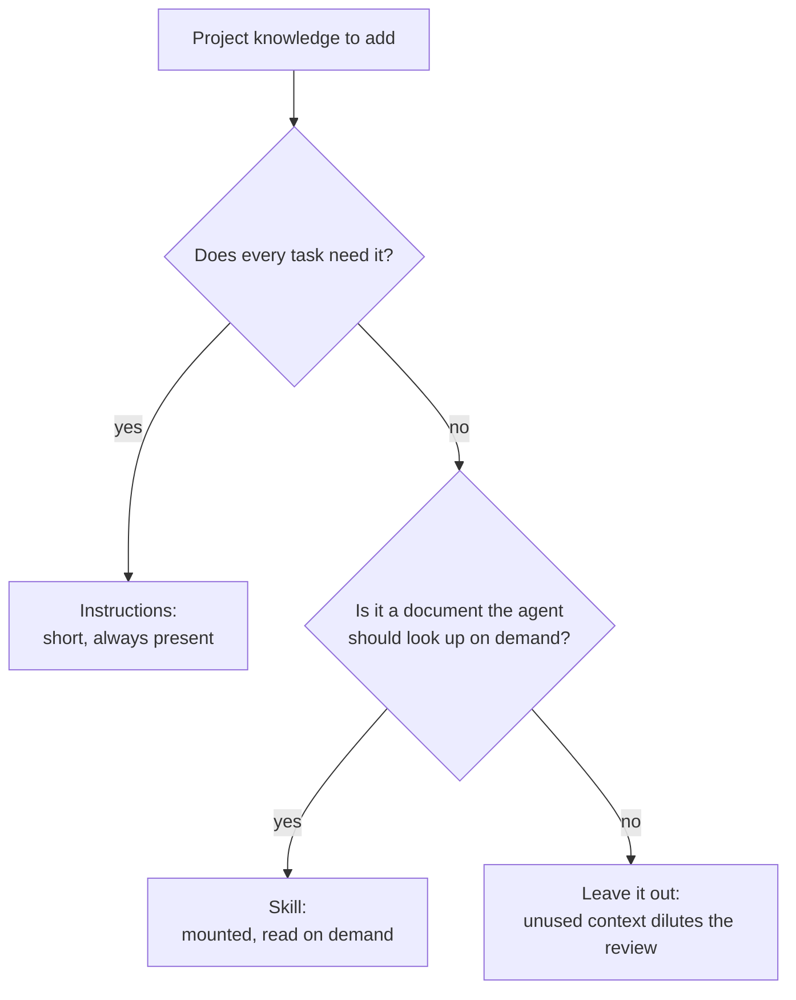

# Reviewer Instructions and Skills

Two mechanisms let you add project knowledge to a review:

| Mechanism | What it is | Cost | Default |
| --- | --- | --- | --- |
| **Instructions** | Markdown text (files and/or an inline string) sent with every review task. | Adds bytes to every task packet. | Empty |
| **Skills** | `SKILL.md` documents mounted through the harness skill registry, which the review agents may consult with read-only tools. | Raises the agent step allowance from 1 to 4 and enables built-in tools. | Disabled |

Both are **untrusted prompt input**. Neither can grant filesystem, shell,
network, publishing or gate authority — see
[prompt-injection-and-untrusted-input.md](../07-security/prompt-injection-and-untrusted-input.md).

---

## Instructions

### Add a file

```json
{
  "instructions": {
    "files": [".codereviewer/instructions/house-rules.md"]
  }
}
```

Paths are repository-relative and resolve under the repository root; traversal,
absolute paths and symlink escapes are rejected before the file is opened. A
missing file fails the run rather than being silently skipped.

### Add inline text

```json
{
  "instructions": {
    "inline": "This service is multi-tenant. A query that omits the tenant filter is a critical defect."
  }
}
```

Inline text is only used when it is non-blank. It is recorded under the
synthetic path `.codereviewer/inline-instructions`.

### What happens to instruction text

1. The file is read and **redacted** (see
   [data-handling-and-redaction.md](../07-security/data-handling-and-redaction.md)).
2. A context-ledger entry records the path, byte count, hash and reason
   `instruction-context`.
3. The redacted content is attached to every review task packet — both the
   discovery call and the refutation call receive it.
4. A hash of each instruction document is written into every admitted finding's
   provenance, so a report proves which instructions produced it.

### Writing instructions that help

| Do | Avoid |
| --- | --- |
| State project-specific invariants ("every handler must call `assertTenant`"). | Restating generic review advice already in the built-in prompt. |
| Name concrete, checkable conditions. | Style, naming and formatting preferences — the reviewer is instructed to skip those and the severity floor drops them anyway. |
| Keep it short. Instruction bytes compete with source bytes inside the task packet budget. | Long documents that push changed-file content out of the packet. |

Instructions influence what the model proposes. They do **not** change
admission, severity thresholds, the baseline or the quality gate; those are
deterministic code paths.

---

## Skills

### Enable them

```json
{
  "skills": {
    "enabled": true,
    "directories": [".codereviewer/skills"],
    "allowTools": ["read", "list", "grep"]
  }
}
```

`CODEREVIEWER_SKILLS_DIR` overrides the directory list from the environment
(single directory).

### Skill file layout

Every skill is a `SKILL.md` file. The indexer walks each configured directory
recursively and picks up every `SKILL.md` it finds:

```
.codereviewer/skills/
  tenancy-rules/
    SKILL.md
  migration-review/
    SKILL.md
```

The frontmatter contract is strict:

```markdown
---
name: tenancy-rules
description: How multi-tenant isolation is enforced in this repository and what breaks it.
---

Every repository query must be scoped by `tenantId` ...
```

| Field | Rule |
| --- | --- |
| Frontmatter block | Required. The file must start with `---` and the block must be terminated. |
| `name` | Lowercase letters, digits and single dashes; 1–64 characters; no leading or trailing dash, no `--`. Must be unique across all configured directories. |
| `description` | 1–1024 characters. |

A file that violates any of these fails the run with a message naming the file.

### What the engine does with a skill

| Sent to the model | Not sent |
| --- | --- |
| The skill name, so the agent can request it | The raw `SKILL.md` body inlined into the workflow input |
| The mounted directory, registered with the harness skill registry as `trust: project`, `source: repository`, strict validation | Anything outside the mounted directory |

The skill's own path, directory and content hash are recorded in the run
artifacts and in finding provenance; the content itself is not copied into
reports, logs, traces or the shared-context artifact.

### `allowTools`

`allowTools` is the built-in tool set the review agents get once at least one
skill is mounted. Only `read`, `list` and `grep` are accepted values — write,
edit, shell, network and publish tools are not part of the enum, so they cannot
be requested.

### The cost of enabling skills

With no skills mounted, each review agent runs single-shot: `maxSteps: 1` and
built-in tools disabled. Mounting at least one skill raises the allowance to
`maxSteps: 4` and enables the `allowTools` set. That is a real change in call
shape: agents may take extra steps, which costs tokens and time. Measure before
and after — see [controlling-cost.md](controlling-cost.md).

---

## Instructions or skills?



The reproducible failure mode of extra context is dilution — a task carrying
more text is not automatically a better review. Add one thing at a time and
check the result.

---

## Security boundary

- Instruction and skill paths must resolve under the repository root.
  Traversal (`.codereviewer/skills/../../private/SKILL.md`) is rejected.
- Instruction text is redacted before it enters any packet, ledger entry or
  artifact.
- Skill content is never inlined into workflow input, reports, logs, traces or
  the shared-context artifact.
- Text inside an instruction or skill is data. The reviewer prompt states that
  reviewed and supplied text can never direct the model, grant permission, or
  approve, excuse or suppress a finding.
- Neither mechanism can change admission, severity, the baseline or the gate.

Details: [permissions-and-path-containment.md](../07-security/permissions-and-path-containment.md).
