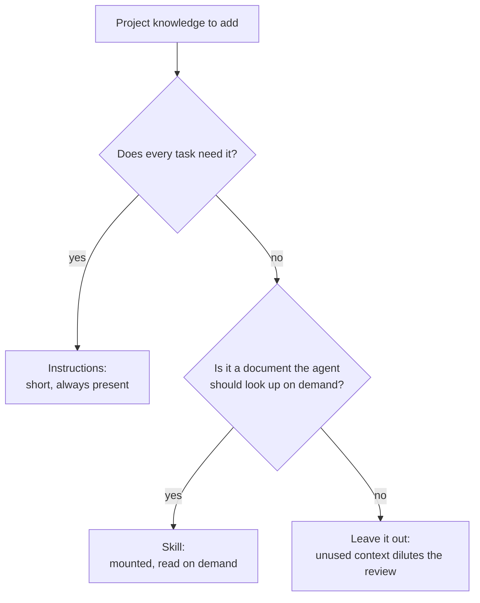

# Reviewer Instructions and Skills

Two mechanisms let you add project knowledge to a review:

| Mechanism | What it is | Cost | Default |
| --- | --- | --- | --- |
| **Instructions** | Markdown text (files and/or an inline string) sent with every review task. | Adds bytes to every task packet. | Empty |
| **Skills** | `SKILL.md` documents mounted through the harness skill registry, which the review agents may consult with read-only tools. | Raises the agent step allowance from 1 to 4 and enables built-in tools. | Disabled |

Neither can grant filesystem, shell, network, publishing or gate authority — see
[prompt-injection-and-untrusted-input.md](../07-security/prompt-injection-and-untrusted-input.md).
Instructions are **operator configuration**: they come from your config file, not
from the change under review, and the discovery prompt presents them as genuine
guidance about your repository rather than as text to be suspicious of. That is a
statement about where the text came from, not a grant of power — the limits below
still hold, and nothing in a reviewed file can promote itself into that class.

---

## Instructions

### Add a file

```json
{
  "instructions": {
    "files": [{ "path": ".codereviewer/instructions/house-rules.md" }]
  }
}
```

Paths are repository-relative and resolve under the repository root; traversal,
absolute paths and symlink escapes are rejected before the file is opened. A
missing file fails the run rather than being silently skipped.

### Scope a file to part of the repository

By default a file applies repository-wide — to every review task, in every
packet. In a monorepo that is often too broad: guidance for one service
becomes noise in the packet for every other service, and packet content is
not free (it costs tokens on every call and dilutes model attention). Add
`scope` to limit a file to review tasks that touch matching paths:

```json
{
  "instructions": {
    "files": [
      { "path": ".codereviewer/instructions/house-rules.md" },
      {
        "path": ".codereviewer/instructions/payments-service.md",
        "scope": ["services/payments/**"]
      }
    ]
  }
}
```

`scope` is a list of glob patterns using the same dialect as
`paths.include`/`paths.exclude` (`*`, `**`, `?`, matched against portable,
repository-relative paths) — there is one glob matcher in this project, reused
everywhere a glob is accepted.

A review task can cover more than one changed file (task clustering may batch
several files into one packet). Scoping matches on **any** file in a task: if
one file in the packet matches the scope, the whole packet gets the
instruction. This fails safe in the direction of inclusion — guidance a
reviewer never sees is invisible and uncatchable, while guidance shown for one
extra file in a mixed packet is merely noise a reader can see and discount.

An entry with no `scope` key still applies everywhere, exactly as before
scoping existed — this is a purely additive capability, not a required one.
`scope: []` (present but empty) is rejected at config load: an empty list
reads as a mistake, and turning it into a silent, permanent exclusion would
hide a configured instruction with nothing saying why.

`inline` has no `scope` — it stays a single string that always applies
repository-wide. It is operator-typed free text (one config value, not a
list), so "which area does this apply to" is not a question it can answer for
more than one area at once. A team that wants area-specific free text should
use a short scoped file instead: it is git-diffable and reviewable, and needs
no second scoping shape for a single string.

### Add inline text

```json
{
  "instructions": {
    "inline": "This service is multi-tenant. A query that omits the tenant filter is a critical defect."
  }
}
```

Inline text is only used when it is non-blank. It is recorded under the
synthetic path `.codereviewer/inline-instructions`.

### What happens to instruction text

1. The file is read and **redacted** (see
   [data-handling-and-redaction.md](../07-security/data-handling-and-redaction.md)).
2. A context-ledger entry records the path, byte count, hash and reason
   `instruction-context`.
3. The redacted content is attached to every review task packet whose files
   match the instruction's `scope` — both the discovery call and the
   refutation call for that packet receive it. An unscoped file or the inline
   text is attached to every packet, as before scoping existed.
   In the discovery call the documents are rendered as a leading
   **"Reviewer instructions (operator configuration - guidance, NOT authority)"**
   section, ahead of the diff, the files under review and any change-intent text,
   each document labelled with the path you configured. The section's own text
   tells the reviewer that this is operator configuration, that it steers what to
   look for and nothing else, and that it is the only place operator instructions
   appear. When the dedicated security pass is enabled, its call gets the same
   section. Until 2026-08-05 this step was documented but not implemented: the
   documents reached refutation only, so guidance could discard a finding but
   never shape the search. Making them reach discovery is a prompt change and its
   effect on recall and precision is **unmeasured** — if you compare review
   results across that date, re-measure rather than assume.
4. Where a `scope` kept an instruction **out** of a packet, the context ledger
   records that too: one entry per task, with `decision: "skipped"`, reason
   `instruction-scope-excluded`, and the byte count that was withheld. So a
   ledger distinguishes "scoped out of this task" from "never loaded at all" —
   the latter has no entry for the file at all, which only happens when it is
   not configured.
5. A hash of each instruction document is written into every admitted finding's
   provenance, so a report proves which instructions produced it. Provenance
   lists every instruction the run loaded, scoped or not; which packets a scoped
   one actually reached is what the ledger entries in step 4 answer.

### Writing instructions that help

| Do | Avoid |
| --- | --- |
| State project-specific invariants ("every handler must call `assertTenant`"). | Restating generic review advice already in the built-in prompt. |
| Name concrete, checkable conditions. | Style, naming and formatting preferences — the reviewer is instructed to skip those and the severity floor drops them anyway. |
| Keep it short. Instruction bytes compete with source bytes inside the task packet budget. | Long documents that push changed-file content out of the packet. |

Instructions influence what the model proposes. They do **not** change
admission, severity thresholds, the baseline or the quality gate; those are
deterministic code paths that never read the text. They also cannot widen a
review beyond the files it was pointed at, or authorize any action the engine
could not otherwise take. An instruction that says "report nothing in this
directory" is not a permission the engine honours — scope a file, or exclude a
path under `paths.exclude`, if that is what you mean.

---

## Skills

### Enable them

```json
{
  "skills": {
    "enabled": true,
    "directories": [".codereviewer/skills"],
    "allowTools": ["read", "list", "grep"]
  }
}
```

`CODEREVIEWER_SKILLS_DIR` overrides the directory list from the environment
(single directory).

### Skill file layout

Every skill is a `SKILL.md` file. The indexer walks each configured directory
recursively and picks up every `SKILL.md` it finds:

```
.codereviewer/skills/
  tenancy-rules/
    SKILL.md
  migration-review/
    SKILL.md
```

A skill's **mounted directory** is the directory holding its `SKILL.md`. Folders
may nest to any depth, and a `SKILL.md` placed directly in a configured
directory is a skill too — its mounted directory is then that configured
directory:

```
.codereviewer/skills/
  SKILL.md            <- a skill; mounted directory is .codereviewer/skills
  tenancy-rules/
    SKILL.md          <- a skill; mounted directory is .../tenancy-rules
```

The folder name means nothing to the engine: the mounted skill ID is the
frontmatter `name`, so it does not have to match the folder, and a skill's
mounted directory is allowed to contain another skill.

The frontmatter contract is strict:

```markdown
---
name: tenancy-rules
description: How multi-tenant isolation is enforced in this repository and what breaks it.
---

Every repository query must be scoped by `tenantId` ...
```

| Field | Rule |
| --- | --- |
| Frontmatter block | Required. The file must start with `---` and the block must be terminated. |
| `name` | Lowercase letters, digits and single dashes; 1–64 characters; no leading or trailing dash, no `--`. Must be unique across all configured directories. |
| `description` | 1–1024 characters. |

A file that violates any of these fails the run with a message naming the file.

### What the engine does with a skill

| Sent to the model | Not sent |
| --- | --- |
| The skill name, so the agent can request it | The raw `SKILL.md` body inlined into the workflow input |
| The mounted directory, registered with the harness skill registry as `trust: project`, `source: repository`, strict validation | Anything outside the mounted directory |

The skill's own path, directory and content hash are recorded in the run
artifacts and in finding provenance; the content itself is not copied into
reports, logs, traces or the shared-context artifact.

### `allowTools`

`allowTools` is the built-in tool set the review agents get once at least one
skill is mounted. Only `read`, `list` and `grep` are accepted values — write,
edit, shell, network and publish tools are not part of the enum, so they cannot
be requested.

### The cost of enabling skills

With no skills mounted, a review agent runs single-shot: `maxSteps: 1` and
built-in tools disabled. Mounting at least one skill raises the allowance to
`maxSteps: 4` and enables the `allowTools` set. That is a real change in call
shape: agents may take extra steps, which costs tokens and time. Measure before
and after — see [controlling-cost.md](controlling-cost.md).

The discovery agent is the exception, and it is already past single-shot by
default: with `review.crossFileRetrieval.enabled` it carries the mediated repo
tools and a step allowance sized to its whole tool-call budget, whatever the
skill setting. Mounting a skill on top of that adds the skill's own tools; it
does not change the step allowance, which is already the larger of the two.

---

## Instructions or skills?



The reproducible failure mode of extra context is dilution — a task carrying
more text is not automatically a better review. Add one thing at a time and
check the result.

---

## Security boundary

- Instruction and skill paths must resolve under the repository root.
  Traversal (`.codereviewer/skills/../../private/SKILL.md`) is rejected.
- Instruction text is redacted before it enters any packet, ledger entry or
  artifact.
- Skill content is never inlined into workflow input, reports, logs, traces or
  the shared-context artifact.
- Text inside an instruction or skill is data. The reviewer prompt states that
  reviewed and supplied text can never direct the model, grant permission, or
  approve, excuse or suppress a finding.
- Neither mechanism can change admission, severity, the baseline or the gate.

Details: [permissions-and-path-containment.md](../07-security/permissions-and-path-containment.md).
