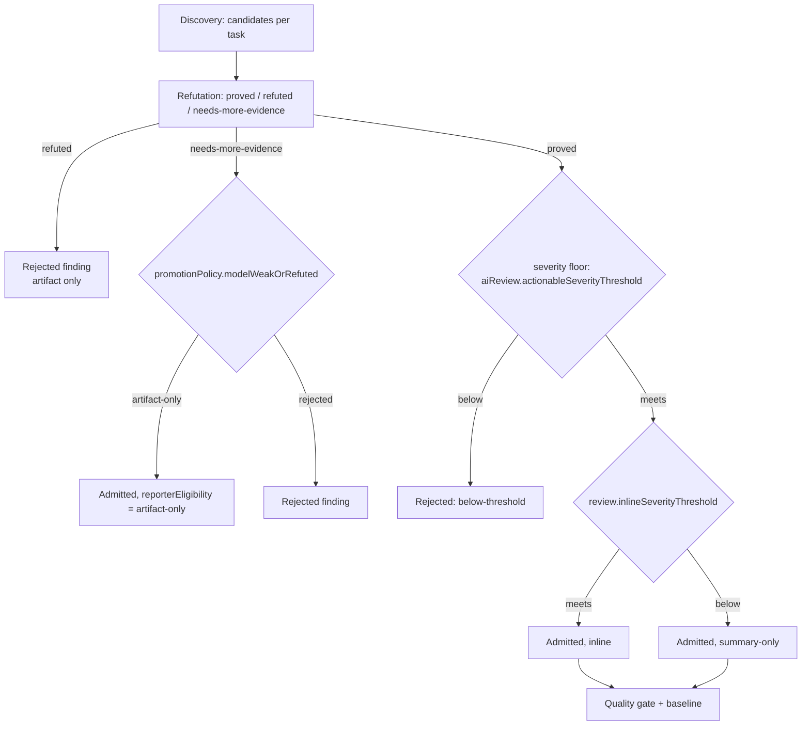

# Tuning Noise and Recall

Every dial in this guide trades one of two things against the other:

- **Recall** — how many real defects the review finds.
- **Noise** — how much of what it reports is not worth a developer's time.

The engine is precision-first by construction: a whole-file discovery pass
proposes candidates, an independent refutation pass adjudicates them, and only
survivors are admitted. The dials below decide how much the discovery side
proposes and how much the admission side lets through.

Change **one dial at a time** and measure. Per-case model variance is real, so
a small difference between two runs is noise, not a result. See the
[quality docs](../05-quality/README.md) for how to measure a change honestly.

---

## The decision path



---

## Dial 1: the severity floor

```json
{ "aiReview": { "actionableSeverityThreshold": "medium" } }
```

Default `medium`. A model-origin candidate whose severity is below the floor is
**rejected** with reason `below-threshold`. It is still written to the run's
rejected findings, so nothing is lost — it just does not reach the actionable
surface.

| Value | Effect |
| --- | --- |
| `critical` / `high` | Only high-impact defects are actionable. Quietest setting. |
| `medium` (default) | Keeps the review on runtime and security impact, out of nit territory. |
| `low` / `info` | Surfaces minor correctness and resource issues. Expect more to read. |

Trusted deterministic-rule candidates are exempt from this floor.

**Raise it** when reviewers complain about volume. **Lower it** when you are
hunting for misses and are willing to triage.

---

## Dial 2: what becomes an inline comment

```json
{ "review": { "inlineSeverityThreshold": "high" } }
```

Default `high`. This does not admit or reject anything — it decides whether an
already-admitted finding is `inline` or `summary-only`. A finding also has to be
anchorable to become a draft: its reported line must fall inside a reviewed diff
range. One that meets the severity but sits outside every changed hunk stays
`summary-only`.

Lower it to `medium` to put more findings directly on the diff; raise it to
`critical` to reserve inline comments for blockers.

---

## Dial 3: what to do with weak candidates

```json
{ "promotionPolicy": { "modelWeakOrRefuted": "artifact-only" } }
```

The refuter returns one of three verdicts. `proved` is admitted; `refuted` is
rejected. This key decides `needs-more-evidence`:

| Value | Behavior |
| --- | --- |
| `artifact-only` (default) | Admitted with `reporterEligibility: artifact-only`. It appears in a dedicated section of the Markdown report and in `report.json`, but is excluded from SARIF, from review comments, and from the quality gate. |
| `rejected` | Dropped entirely and recorded as a rejected finding. |

Use `artifact-only` when someone reads the full report. Use `rejected` when
only the gate and the inline comments are consumed and the extra section is
just noise.

---

## Dial 4: depth

```json
{ "review": { "depth": "balanced" } }
```

Depth sets byte budgets and shapes task planning. It does not change which
files are reviewed.

| Depth | Task planning | Cross-file retrieval caps (reads / searches / matches / traversal depth / bytes per read) |
| --- | --- | --- |
| `fast` | One task per changed file | 200 / 100 / 50 / 4 / 60 000 B |
| `balanced` (default) | Import-connected files clustered into one task, at most 8 paths per task | 1 200 / 600 / 150 / 8 / 120 000 B |
| `thorough` | Same clustering as `balanced` | 4 800 / 2 400 / 320 / 12 / 240 000 B |

Depth no longer bounds the review packet. The change is sent whole, and split only
if the provider refuses it as too large; a single serialized packet is capped at
8 MB as a runaway guard. `review.contextMaxBytes` lowers that ceiling when set —
leave it unset unless you have a specific reason.

`fast` is not simply "cheaper": one task per file means more provider calls for
the same change, each with less context. `balanced` and `thorough` differ only
in how much source each task may carry.

> `review.mode` (`local` / `ci` / `pr` / `full`) is run metadata. It appears in
> the run summary and in logs and changes no behavior.

---

## Dial 5: deterministic support signals

```json
{ "aiReview": { "deterministicSignalMode": "support" } }
```

| Value | Effect |
| --- | --- |
| `support` (default) | Locally computed facts (anchors, symbol spans, import/test/config hints, contradiction signals) are injected as model context. |
| `disabled` | Clustering and planning still use the facts; the injection into the model packet is skipped. Cheaper packets, less grounding. |

---

## The optional discovery passes

All are **off by default**. Each one adds provider calls per task — see
[controlling-cost.md](controlling-cost.md) for the arithmetic before you turn
one on.

> **There is no dial for the second defect in a file.** A discovery response tends
> to answer the diff and stop, so a file holding two defects usually yields one.
> Three passes aimed at exactly this — an enumeration sweep, a diverse-lens pass,
> and an un-anchored pass that withheld the diff — were built, measured, and
> [removed](../03-concepts/optional-capabilities/extra-discovery-passes.md);
> none earned its cost, and the limitation is still open.

### Cross-file retrieval

```json
{ "review": { "crossFileRetrieval": { "enabled": true, "maxToolCallsPerTask": 100, "maxBytesPerRead": 24000 } } }
```

Gives the discovery agent the mediated `repo_read`, `repo_list` and `repo_grep`
tools so it can inspect a callee body, interface or permission definition
outside the changed set. Findings are still restricted to the task's paths and
still pass the same refutation and admission.

The prompt is deliberately restrictive ("resolve a specific suspicion, do not
browse"), and `maxBytesPerRead` exists because a single large retrieved file
measurably dilutes the review. `maxToolCallsPerTask` is a runaway-loop guard,
not a context ration.

This is the pass most likely to *cost* recall through dilution. Measure it.

### Dedicated security pass

```json
{ "security": { "dedicatedPass": { "enabled": true } } }
```

A second, security-only discovery call per task applying a generic OWASP/CWE
checklist (access control, injection, SSRF, insecure deserialization, secrets,
cryptography, path traversal, misconfiguration, security-relevant races) with a
source-to-sink method.

Its candidates are **additive**: they merge with the general pass's candidates
and never displace them, and they flow through the same refutation and
admission. It is a separate call rather than an in-prompt checklist because
folding the checklist into the general prompt trades the dominant authorization
class for the injection classes — finite attention.

`security.signals` is configuration-only in this phase and carries no behavior.

---

## Order to try things

1. **Too much noise?** Raise `aiReview.actionableSeverityThreshold`, then set
   `promotionPolicy.modelWeakOrRefuted` to `rejected`, then raise
   `review.inlineSeverityThreshold`.
2. **Missing security specifically?** `security.dedicatedPass`.
3. **Missing defects that depend on unchanged code?** There is no dial worth
   recommending. `crossFileRetrieval` exists but measured **net negative** — see
   its [page](../03-concepts/optional-capabilities/cross-file-retrieval.md). A
   context scout that pre-selected the missing symbols was
   [removed](../03-concepts/optional-capabilities/context-scout.md) after a
   controlled experiment showed the reviewer largely does not read the context it
   already has.
4. **Still missing?** Raise `review.depth` to `thorough` so more source fits in
   each task.
5. **Missing a second defect in files that already produced one?** No dial
   addresses this today — see the note above.

After each step, re-measure on the same corpus and compare two reports:

```bash
npm run cli -- eval compare --base .codereviewer/eval/before.json --head .codereviewer/eval/eval-report.json
```

---

## What you cannot turn off

Refutation. `aiReview.requireRefutation` accepts the literal `true` only —
setting it to `false` is a validation error. Every model-origin candidate is
adjudicated before it can be admitted.
