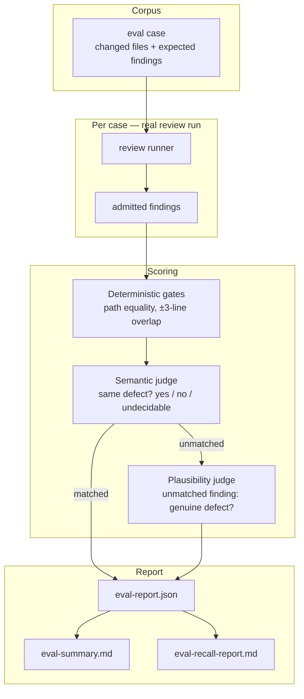

# Quality And Evaluation

This section documents **how review quality is measured** — the metrics, the
judges that produce them, the corpora they are measured on, and the commands
that produce them. It exists so that a number quoted about this engine can be
checked rather than believed.

Everything here is derived from `src/domains/evaluation/` and `eval/`. Where the
code and a spec disagree, this section documents the code and says so.

---

## Why the numbers are worth reading

Six design decisions do the work. Each one exists because the obvious
alternative produces a number that looks fine and means nothing.

1. **Matching is decided by a judge, and the judge is scored.**
   Whether an admitted finding *is* the defect an expected finding describes is
   a semantic judgment, so it is made by a model judge — never by word overlap.
   Two different defects in one function share most of their vocabulary; one
   defect described twice may share almost none. Lexical scoring therefore ranks
   true matches below false ones and is forbidden in the matcher. The judge is
   re-scored every run against a committed, human-labeled calibration set, and a
   run below the configured agreement minimum marks itself untrustworthy
   (`scoring.judgeTrustworthy = false`).
   → [Judges and calibration](judges-and-calibration.md)

2. **An unmatched finding is not assumed to be wrong.**
   A fixture's expected-finding list is a *curated subset* of the defects in a
   change. Counting every unmatched finding as a false positive measures fixture
   incompleteness, not reviewer precision. A second, independent **plausibility
   judge** reads the actual file and decides whether an unmatched finding is a
   genuine defect the fixture simply did not list. `adjustedPrecision` is the
   trustworthy precision figure; raw `precision` is not.
   → [Metrics](metrics.md#precision-and-noise)

3. **Failures fail closed, and undecidable pairs leave the denominator.**
   A plausibility call that cannot be completed leaves its finding counted as a
   genuine false positive — precision is only ever credited by an affirmative
   decision. A match judgment that cannot be completed is recorded as
   *inconclusive* and removed from **both** the recall and precision
   denominators, because recording it as "no match" would fabricate a missed
   finding and a false positive from one provider hiccup.

4. **One run is not a result.**
   Model-backed evaluation is non-deterministic. Four seeds of one identical
   configuration on the real-repository corpus produced recall of 81.3%, 87.5%,
   81.3% and 75.0% — mean 81.3%, standard deviation 4.4 percentage points (on a
   16-expected-finding version of that corpus). A headline figure is the **mean
   across seeds**, never the best observed run. That 4.4pp figure is historical:
   three runs at one pinned engine on the current 37-case corpus first measured
   a tighter **0.96pp** standard deviation (2026-08-02), then a second
   pinned-engine re-baseline on the same corpus and run count measured
   **2.89pp** instead (2026-08-05) — three times wider, cause not yet
   understood. **2.89pp is the current band** — see
   [Current results](current-results.md#current-headline).
   → [Comparing runs](comparing-runs.md#the-variance-band)

   Those figures, and every measured figure published in these quality docs, came
   from `openai/gpt-5.3-codex`. A rate is a property of the model that produced
   it, so the model is named with the number wherever one is quoted.

5. **A number is reported with what invalidates it.**
   Measurement here is expected to survive its own history, so a change that
   makes earlier runs incomparable is stated before the numbers rather than
   after them. The most recent one is harness-wide: no review agent call
   forwards prior conversation any more, and **every figure recorded before
   2026-07-27 was produced under the old behaviour**. A paired re-baseline
   afterwards measured the effect directly: **−0.00pp** recall (p = 0.56, not an
   accuracy change either way) and a **26% cost reduction**. Figures recorded
   since 2026-07-27, including the current headline in
   [Current results](current-results.md#current-headline), are not affected by
   this caveat.
   → [What limits recall](what-limits-recall.md#a-caveat-that-applies-to-every-number-here)

6. **The corpus has to be able to contain the defect.**
   Changed-files-only slices cannot test a cross-file defect at all: the
   evidence is not on disk, so no reviewer could find it and the measured
   "recall" is a property of the dataset. That is why a second corpus of **real
   upstream repositories checked out in full** exists.
   → [Datasets](datasets.md#real-repository-cross-file-corpus)

---

## Read this before running anything

> **`eval run`'s gate is a profile, and the default one does not gate on
> quality.** `stable` — the default — thresholds only `minParseValidity: 1` and
> `failOnProviderError: true`: output either parsed or it did not, a provider
> call either errored or it did not. Neither has run-to-run sampling variance.
> Recall and the raw false-positive count are **not** gated by default, because a
> gate on a mean that moves several points seed-to-seed fires unpredictably, and
> the raw false-positive count charges the reviewer for real defects the answer
> key never listed.
>
> `strict` restores the old all-or-nothing bar (perfect recall, zero false
> positives) as an explicit opt-in, via `--gate-profile strict` or
> `evaluation.regressionGate.profile`. Individual thresholds move through
> `evaluation.regressionGate.overrides`.
>
> **The gate still is not a quality reading.** Read the metrics.
> → [Running an evaluation](running-an-evaluation.md#the-regression-gate)

---

## Pages

| Page | What it answers |
| --- | --- |
| [Metrics](metrics.md) | What each number counts, over what denominator, and how to read it without over-claiming. |
| [Judges and calibration](judges-and-calibration.md) | How a reported finding is matched to an expected one, how unmatched findings are adjudicated, and how both judges are proven reliable. |
| [Datasets](datasets.md) | Every corpus, what it can and cannot measure, and its known limitations. |
| [Running an evaluation](running-an-evaluation.md) | Hydration, the flags `eval run` actually parses, the artifacts it writes, and the gate trap. |
| [Comparing runs](comparing-runs.md) | `eval compare`, `eval recall-report`, `eval slice-manifest`, and the statistics needed for a comparison to mean anything. |
| [Current results](current-results.md) | The measured numbers themselves. |
| [What limits recall](what-limits-recall.md) | Why the engine finds roughly one defect per file, the ceiling that puts on a single pass, every intervention measured against it, and the harness change that re-baselines all of the above. |

---

## The measurement pipeline in one picture

Both judges are calibrated once per run against committed human-labeled sets
before the report is assembled.

---

## Fast orientation

- **Recall denominator** — declared expected findings, *minus* pairs the judge
  could not decide.
- **Trustworthy precision** — `adjustedPrecision`, not `precision`.
- **Headline recall** — `productRecall` (`runtime-critical` + `security` +
  `logic`; `nit` excluded).
- **Empty-denominator convention** — recall/precision-family rates report `1`;
  security and fix-lane rates report `0`. Never read either as an achievement.
- **Judge trust flags** — `scoring.judgeTrustworthy`,
  `scoring.adjustedPrecisionTrustworthy`. If either is `false`, the run's
  numbers are not evidence.

---

## See also

- [Overview: why precision first](../01-overview/why-precision-first.md)
- [Concepts: review lifecycle](../03-concepts/review-lifecycle.md)
- [Reference: CLI](../06-reference/cli.md)
- Specs: `specs/06-evaluation-and-quality-gates.md`,
  `specs/15-security-focused-review.md`,
  `specs/17-real-repository-eval-corpus.md`
