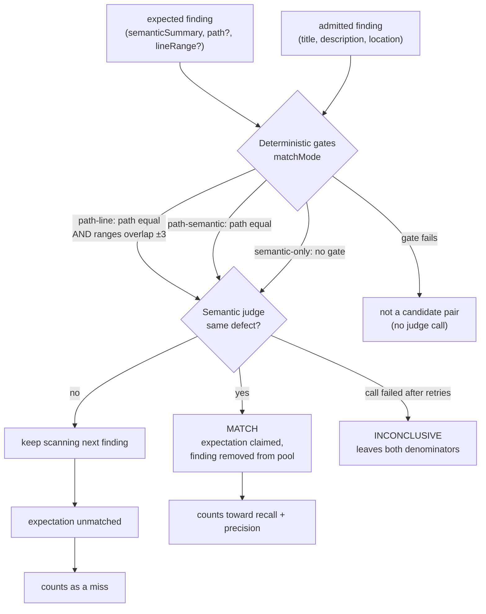
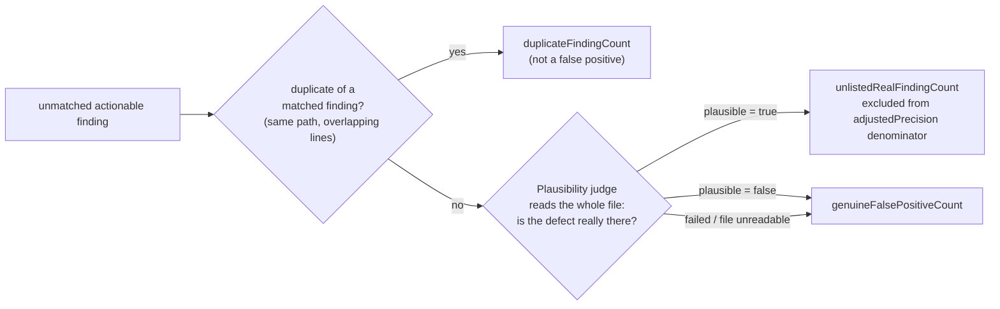

# Judges And Calibration

Two model judges produce the ground truth every quality metric rests on. This
page covers what each one decides, what it is allowed to see, how failures are
handled, and how both are proven reliable on every run.

Sources: `eval-matcher.ts`, `eval-semantic-judge.ts`, `eval-plausibility-judge.ts`,
`eval-judge-calibration.ts`, `eval-plausibility-calibration.ts`, and
`specs/06-evaluation-and-quality-gates.md`.

---

## Why a judge, and not string matching

Matching decides whether an admitted finding **is** the defect an expected
finding describes. It is the ground truth for recall, precision, severity
accuracy, and the fix-lane metrics — so an unreliable matcher does not merely add
noise, it *inverts* scores. A correct finding scored as unmatched costs recall
**and** precision, and marks a correct fix-lane judgment as wrong.

Lexical or token-similarity scoring cannot do this job:

- Vocabulary overlap measures shared **topic**, not identity of defect.
- Two different defects in one function share most of their words.
- One defect described twice may share almost none.

Such a heuristic systematically ranks true matches below false ones. It is
therefore **forbidden in the matcher** — there is no fallback path. A case that
declares expected findings and has no judge available fails the run with a
configuration error (`eval_semantic_judge_missing`) rather than producing
fabricated scores.

A match carries a boolean decision and the judge's report-safe reason. There is
**no numeric similarity score** — an invented number is not evidence.

> **Baseline discontinuity.** Removing lexical scoring changed every quality
> metric. Any eval report or recorded baseline produced by the old lexical
> matcher is void and is not comparable to anything produced since.

---

## The matching flow



Unmatched **findings** then take a second path:



---

## Stage 1 — deterministic gates

Exact, reproducible, and always applied **before** any model call, so the judge
can never move a finding to a different file or line. The gate is selected by the
expectation's effective `matchMode`, which defaults from the fields present:

| `matchMode` | Derived when | Gate applied |
| --- | --- | --- |
| `path-line` | `path` and `lineRange` present | Finding path must equal expected `path`; line ranges must overlap within a **tolerance of 3 lines**. |
| `path-semantic` | `path` present, no `lineRange` | Finding path must equal expected `path`. |
| `semantic-only` | no `path` | No gate. |

`semantic-only` is permitted only for benchmark-compatible datasets whose golden
comments lack reliable file/line metadata. Such expectations participate in
recall, precision, severity, cost and latency — but they cannot prove line
accuracy.

---

## Stage 2 — the semantic judge

**What it decides.** Whether a candidate finding identifies the same underlying
issue as the expected finding.

**What it is allowed to see** — and nothing else:

| Given | Withheld |
| --- | --- |
| `expectedSummary` (the expectation's `semanticSummary`) | Source text |
| Candidate `title` | Diffs |
| Candidate `description` | Prompts, tool output |
| | File paths and line numbers |

Paths and lines are structurally excluded because they are already handled by the
deterministic gates; the judge is asked only about identity of defect. Its
instructions state explicitly that *shared vocabulary is not identity*, and that
it must not infer from missing source code.

**Output contract.** A strict object: `{ match: boolean, reason: string }`,
1–1000 characters of reason. No confidence number.

**Assignment.** The matcher maximises how many expectations get matched, rather
than taking the first acceptable pairing. Taking the first one lets a loose accept
for an earlier expectation swallow the only finding a later expectation could have
matched, scoring that later expectation as a miss the reviewer never made — a bias
pointing the same way as the multi-defect gap this corpus is meant to measure.

**Determinism.** Expectations are served in ascending order and each prefers the
lowest available finding index, including when it is displaced and re-seated, so
one admitted finding matches at most one expected finding and repeated runs over
the same inputs assign the same pairs. Every pair is judged at most once, so
maximising the matching costs no extra judge calls. Cases are scored sequentially so judge calls stay ordered.
Temperature is pinned to `0` **only when the model alias already carries a
temperature**, so reasoning models that reject the parameter keep their defaults.
Transient provider errors are retried under the configured retry policy.

**Failure handling.** A judge call that still fails yields **inconclusive** for
that pair:

- The expectation is excluded from the recall denominator (never recorded as a
  miss).
- The finding is excluded from the precision denominator (never recorded as a
  false positive) and is not classified as a duplicate.
- The failure is recorded as a provider issue and surfaced as the case warning
  `eval-inconclusive-match:<n>`.
- An inconclusive pair only clouds a side that stayed unmatched — once either
  side matched something, its verdict is known.

Recording an undecided pair as "no match" would fabricate both a missed finding
and a false positive from a single provider hiccup. That is why it is excluded.

---

## Stage 3 — the plausibility judge

**The problem it solves.** An admitted finding that matches no expectation is not
necessarily wrong. Expected-finding lists are curated subsets, so a precision-first
reviewer routinely surfaces genuine defects the list omits. Counting all of them
as false positives measures the fixture, not the reviewer.

**What it decides.** For each unmatched actionable finding: does the shown code
actually contain the defect the finding describes?

It runs a **second, separate pass** over the unmatched ARTIFACT-ONLY findings,
seeded with the artifact-only matches rather than the actionable ones. Those
verdicts go to `artifactOnlyUnlistedRealCount` /
`artifactOnlyGenuineFalsePositiveCount` (and the matching per-case ID lists) and
**feed no precision metric**: `precision` and `adjustedPrecision` exclude the
artifact-only population by construction, and promoting it into them is a
precision decision nobody has made. The bucket exists so "is the output we refuse
to post real?" is answerable from a saved report instead of only by re-running the
corpus.

**What it sees.** Unlike the match judge, this one must read code:

- the finding's title, description, severity, category and `path:line`;
- the **new-side content of the whole file** the reviewer saw.

Whole file, not a narrow window — a judge given too little context under-credits
real findings by answering "cannot confirm". The content is **redacted first**
(so a secret cannot survive by straddling a byte boundary) and then truncated to
a 64,000-byte cap.

**Instructions.** Answer `plausible = true` only when the code shown actually
contains the described defect; `false` when the finding misreads the code, is a
style or taste preference, or is unsupported by what the code shows. It is told
explicitly **not** to consult any expected list.

**What it can and cannot change.** It never promotes a finding into recall and
never changes what the reviewer reported. It only reclassifies the reviewer's own
unmatched output for precision accounting:

```
falsePositiveCount = genuineFalsePositiveCount + unlistedRealFindingCount
precision          = matched / (matched + falsePositiveCount)          # lower bound
adjustedPrecision  = matched / (matched + genuineFalsePositiveCount)   # upper bound
```

The two are the bounds of one bracket and are always published together — see
[Metrics, trap 1](metrics.md#read-this-first-three-traps). Without a plausibility
judge the engine sets `adjustedPrecision = precision`, which is the lower bound
printed twice rather than a measured upper bound; `scoring.plausibilityJudged`
records which case a run was in, and every surface renders the upper bound as
*not measured* when it is `false`.

**Fail-closed, everywhere.** Precision is only ever credited by an affirmative
`plausible = true`. Every other outcome leaves the finding a genuine false
positive:

| Situation | Result |
| --- | --- |
| No judge (offline run) or no file reader | No finding credited; **no warning** — nothing was attempted |
| Source file unreadable | Genuine false positive + provider issue `plausibility_source_unavailable` |
| File over the byte cap AND the finding's line outside the window that fit | Genuine false positive + provider issue `plausibility_source_line_omitted`. The judge is not asked at all: scoring a finding against code that was cut away is how a real defect gets recorded as implausible. |
| Judge call failed after retries | Genuine false positive + provider issue with the normalized error code |

Fail-closed findings are surfaced as the case warning
`eval-plausibility-fail-closed:<n>`, and the artifact-only pass under its own
`eval-artifact-only-plausibility-fail-closed:<n>` — one prefix per population, so
the actionable count keeps meaning "findings adjusted precision could not decide".

The new-side content the judge reads always opens with a completeness marker. A
file that fits is passed whole and says so; one that does not is passed as a
window **centred on the finding's line** — never a blind prefix, because the code
supporting a finding is rarely at the top of a file — and says which lines it
covers, and that absence of support outside them is not evidence the finding is
wrong. The marker is stated in both cases for the reason the "None:" line exists
above: the judge must never have to guess whether a short section means a short
file.

---

## Calibration: proving the judges

Both judges are scored **once per run** against a committed, human-labeled
calibration set before the report is assembled. The sets are committed source
(`eval-judge-calibration.ts`, `eval-plausibility-calibration.ts`), so anyone can
read the exact pairs and disagree with a label.

### Semantic-match calibration — 12 pairs

Every entry is a review-summary pair a human can decide **without seeing source
code**, which is exactly what the judge gets.

| Kind | Count | Purpose |
| --- | --- | --- |
| `near-miss` | 6 | The discriminating pairs: high lexical overlap with an opposite label, or low lexical overlap with a matching label. |
| `clear-match` | 3 | Floor check. |
| `clear-non-match` | 3 | Floor check. |

The near-miss design is the point. For example, *"SQL injection in the user query
builder"* against a finding titled *"User query builder missing null check"* —
near-identical vocabulary, labeled **non-match**. A vocabulary matcher fails this
pair; a working judge does not.

### Plausibility calibration — 11 pairs

Each entry is a finding plus the code it claims to describe.

| Kind | Count | Purpose |
| --- | --- | --- |
| `clear-genuine` | 5 | Real defects (missing await, SQL concatenation, off-by-one, leaked handle, missing null guard). |
| `clear-spurious` | 3 | Style preference; a "missing await" claim against code that *does* await; an "injection" claim against a parameterized query. |
| `hard` | 3 | Defects described obliquely, and confident findings that actually misread the code (e.g. a timing-attack claim against code already using `timingSafeEqual`). |

The `hard` pairs discriminate a working judge from one that rubber-stamps every
finding.

### Agreement, and what it gates

```
agreement = pairs decided correctly / pairs actually scored
```

A calibration pair whose judge call **failed** leaves the denominator — a
provider failure must never be reported as judge disagreement. The failure is
logged as a no-content warning (pair id and error code only, never the pair text),
and the reported pair count drops below the committed total. That drop is the
signal that calibration was partial.

| Result | Report field | Meaning |
| --- | --- | --- |
| Agreement ≥ minimum | `scoring.judgeTrustworthy: true` | Quality metrics may be quoted |
| Agreement < minimum | `scoring.judgeTrustworthy: false` | **The run declares its own quality metrics untrustworthy** |
| No pair scored at all | `judgeTrustworthy: false`, agreement omitted | A judge exists but nothing proves it works |
| No judge at all (offline) | `judgeTrustworthy: true` | No semantic authority to distrust — such a run scores only cases with no expected findings, fully deterministically |

The plausibility judge has the parallel field
`scoring.adjustedPrecisionTrustworthy`, gating the precision bracket's UPPER bound
specifically: that bound is only as trustworthy as the judge that produced it. The
lower bound is unaffected — it needs no judge.

**The minimum is 0.9**, from `evaluation.minJudgeAgreement` (default `0.9`). Both
judges share this one config key. The bar is deliberately high: one disagreement
in ten labeled pairs already means roughly one in ten scored findings may be
wrong.

---

## Which model judges

Both judges resolve from the run's provider. Which **model** they run on is
configurable, and that matters exactly once — when the thing being measured is
the model itself.

| `evaluation.judgeModel` | Semantic-match + plausibility judge | Reviewer under test |
| --- | --- | --- |
| unset (default) | `provider.model` | `provider.model` |
| set | `evaluation.judgeModel` | `provider.model` — unchanged |

Set it (config, or `CODEREVIEWER_JUDGE_MODEL`) whenever a measurement varies the
reviewer's model. The judges used to be built from the reviewer's resolved alias
with no way to separate them, so setting `CODEREVIEWER_PROVIDER_MODEL` to compare
two reviewers swapped the scorer too: a recall difference then means either a
weaker reviewer or a weaker judge crediting fewer of its correct findings, and
nothing in the run distinguishes those. Seeds do not help — both arms moved
together by construction.

The override reaches the model and nothing else. Provider id, credentials, base
URL, retry and timeout stay the run's own, and every call in the review workflow
still resolves `provider.model`. Judge spend (`scoringCostUsd`) is priced against
the judge's model, because those are the tokens it spent.

Every report records **both** models in provenance — `modelName` (the reviewer's)
and `judgeModelName` (the judge's, equal to the reviewer's when unpinned) — so an
archived run can name the judge that scored it. A published model comparison must
state the judge model it was scored with, and must hold that judge fixed across
its arms.

---

## Honest limitations

- **By default the judges use the same model as the review under test**, and
  always the same provider — `evaluation.judgeModel` pins the model, not a second
  provider account. A systematic blind spot shared by reviewer and judge would not
  show up in agreement, because the calibration set is fixed and human-labeled
  rather than adversarially generated against the current model.
- **The calibration sets are small** — 12 and 11 pairs. At that size, agreement
  moves in steps of roughly 8–9 percentage points. It proves the judge is not
  broken; it does not resolve fine differences between judges.
- **Calibration is scored once per run**, not per case, and the same run-level
  figure is repeated on every metric group.
- **Every judge call costs money and time**, and calibration adds 23 calls per
  run on top of per-pair matching and per-unmatched-finding plausibility calls.

---

## See also

- [Metrics](metrics.md#precision-and-noise) — how the judges' outputs become numbers.
- [Datasets](datasets.md) — which corpora exercise which match modes.
- [Running an evaluation](running-an-evaluation.md) — a run with no provider scores no expected finding.
- Spec: `specs/06-evaluation-and-quality-gates.md` §Expected-Finding Matching, §Unmatched-Finding Plausibility.
