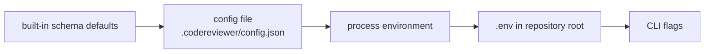

# Configuration Reference

Every key, type, and default on these pages is read from
[`src/shared/contracts/config/config.schema.ts`](../../../src/shared/contracts/config/config.schema.ts),
which is the single source of truth. The generated JSON Schema at
[`schema/codereviewer-config.schema.json`](../../../schema/codereviewer-config.schema.json)
is the committed public contract; regenerate it with `npm run generate:schemas`
(`npm run generate:schemas:check` verifies it in CI).

Default config file: `.codereviewer/config.json`, resolved under the repository
root. A missing file is not an error — the run proceeds on defaults and records
the warning `config-file-missing`.

## Pages

| Page | Top-level keys |
| --- | --- |
| [review.md](./review.md) | `review`, `aiReview`, `promotionPolicy`, `instructions`, `skills`, `paths` |
| [provider.md](./provider.md) | `provider` |
| [quality-gate-and-baseline.md](./quality-gate-and-baseline.md) | `qualityGate`, `baseline`, `drift` |
| [security-and-verification.md](./security-and-verification.md) | `security`, `verification`, `fix` |
| [reporting-and-observability.md](./reporting-and-observability.md) | `reporting`, `observability`, `costs` |
| [context-and-evaluation.md](./context-and-evaluation.md) | `contextSources`, `evaluation` |

All 18 top-level keys are covered. Every one of them is optional; omitting a
key applies its whole default object.

## Strict objects: unknown or misplaced keys are hard failures

The config root — and nearly every nested object in the schema — is a Zod
**`strictObject`**. There is no passthrough and no "unknown keys are ignored"
behavior:

- an unknown key at any level is a validation error;
- a key placed under the wrong parent is *also* an unknown key at that parent,
  and therefore an error — a real, common failure mode is putting
  `crossFileRetrieval` or `contextScout` under `security` instead of `review`;
- a typo (`qualityGate.maxHighs`) fails the run rather than being silently
  ignored.

Validation failures surface as `config_error` with **exit code 2** and a message
listing up to five `path: message` pairs (values are never echoed, so an invalid
config cannot leak a secret). Validate before committing:

```
codereviewer config validate
```

The keys `__proto__`, `constructor`, and `prototype` are rejected by the loader
before schema validation.

## Precedence

Lowest to highest:



| Layer | Notes |
| --- | --- |
| 1. Schema defaults | Applied by Zod after merging. |
| 2. Config file | `--config <path>` > `CODEREVIEWER_CONFIG_PATH` > `.codereviewer/config.json`. |
| 3. Process environment | Only the documented `CODEREVIEWER_*` keys map into config; see [environment.md](../environment.md). |
| 4. `.env` file | Loaded from the repository root, best-effort. **Its values override process environment values.** Invalid `.env` syntax is a config error. `eval run` skips `.env` entirely. |
| 5. CLI flags | `review`/`eval run` `--debug`, `--log-level`; `eval run` `--review-mode`, `--review-depth`, `--max-concurrent-tasks`. |

Merging is a deep merge for plain objects; arrays are **replaced wholesale**, not
concatenated. Setting `paths.exclude` therefore discards the whole default
exclude list — re-list the defaults you still want.

`review --base-ref` / `--head-ref` and `--file` / `--files` are run inputs, not
config-layer overrides: they are passed directly to the pipeline and do not
appear in the normalized config or its hash.

## Value conventions

| Convention | Rule |
| --- | --- |
| Repository-relative path | Non-empty, no NUL bytes, must not start with `/`, must not be a Windows absolute path (`C:`), must not contain a `..` segment. |
| Git ref | Non-empty, must not start with `-`. |
| Severity | `critical` > `high` > `medium` > `low` > `info`. Thresholds are inclusive floors. |
| URL | Parsed as an absolute URL (`z.url()`). |
| Booleans typed `false` | `security.allowShell`, `allowNetwork`, `allowFilesystemWrite`, `captureContentTelemetry` and `aiReview.requireRefutation` are literal types — the only accepted values are `false`, `false`, `false`, `false`, and `true` respectively. |

## Minimal example

```json
{
  "provider": { "id": "openai", "model": "gpt-5-mini" },
  "review": { "depth": "thorough", "baseRef": "origin/main" },
  "qualityGate": { "maxCritical": 0, "maxHigh": 0 }
}
```

## Related

- [CLI reference](../cli.md)
- [Environment variables](../environment.md)
- [Exit codes and error codes](../exit-codes-and-error-codes.md)
- [Artifacts](../artifacts.md)
