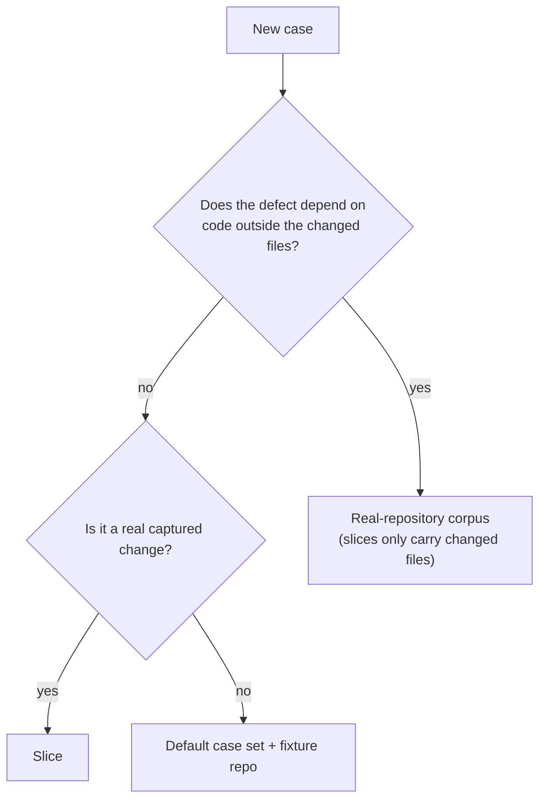

# Adding Evaluation Cases

The evaluation harness is how a change to prompts, thresholds or pipeline
behavior is judged. A case you add becomes part of that judgement, so the bar
for a case is high: it must be real, unambiguous, and free of the answer.

Contracts:
[`src/domains/evaluation/eval-fixture.schema.ts`](../../src/domains/evaluation/eval-fixture.schema.ts)
and
[`src/domains/evaluation/real-repo-corpus.schema.ts`](../../src/domains/evaluation/real-repo-corpus.schema.ts).
Policy: [`specs/06-evaluation-and-quality-gates.md`](../../specs/06-evaluation-and-quality-gates.md)
and [`specs/17-real-repository-eval-corpus.md`](../../specs/17-real-repository-eval-corpus.md).

---

## Three case formats

| Format | Lives in | Reviewer sees | Use it for |
| --- | --- | --- | --- |
| **Default case set** | `eval/fixtures/sample-eval-cases.json` + a repository fixture directory | A small purpose-built repository | Control cases, negative cases, contract tests |
| **Slice** | `<sliceRoot>/<case-id>/slice.json` + `<case-id>/repo/` | Only the changed files, plus a stored diff | Captured pull requests, curated semantic cases |
| **Real-repository corpus** | `eval/corpora/real-repo-cross-file/manifest.json` (checkouts hydrated on demand) | The **full** upstream repository at the pre-fix commit | Anything whose evidence lives in an unchanged file |

Pick the format by what the defect needs to be *findable*:



A slice pack contains only the files a change touched. A defect whose evidence
lives in an unchanged file **cannot be found in a slice by any reviewer** — the
evidence is not on disk. Putting such a case in a slice measures nothing and
depresses recall for a reason unrelated to the engine.

---

## The expected-finding contract

Every format shares `ExpectedFindingSchema`:

| Field | Required | Notes |
| --- | --- | --- |
| `category` | yes | `bug`, `security`, `performance`, `compatibility`, `maintainability`, `test`, `policy` |
| `severity` | yes | `critical` … `info` |
| `semanticSummary` | yes | 1–500 characters. The judge matches on this. Describe the **defect and its consequence**, not the fix |
| `path` | conditional | Required unless the match mode is `semantic-only` |
| `lineRange` | no | `[start, end]`, `end >= start`. Requires `path` |
| `matchMode` | no | `path-line`, `path-semantic`, `semantic-only` |
| `tier` | no | `runtime-critical`, `security`, `logic`, `nit` |
| `securityMechanism` | no | Only valid on `category: "security"` |
| `contextDepth` | no | Only valid on `category: "security"` |

### Match mode is derived when you omit it

| You provide | Effective mode |
| --- | --- |
| `path` + `lineRange` | `path-line` |
| `path` only | `path-semantic` |
| neither | `semantic-only` |

Choose deliberately. `path-line` is the strictest and is right when the defect
has one obvious location. `path-semantic` is right when the defect spans a
function whose exact line the reviewer may reasonably report differently.

### Tier drives the headline metric

Product recall is measured over the `runtime-critical`, `security` and `logic`
tiers. The `nit` tier (documentation, naming, typos, UI, i18n, style,
maintainability, tests, policy) is reported separately and excluded from the
headline.

If you omit `tier` it is derived: `security` → `security`; `bug` at
`critical`/`high` → `runtime-critical`, otherwise `logic`; `performance` and
`compatibility` → `logic`; `maintainability`, `test` and `policy` → `nit`.
Set it explicitly when the derivation would mislabel your case.

### Security labels

On security findings you may add `securityMechanism` (`authorization`,
`injection`, `ssrf`, `xss`, `deserialization`, `secret-flow`, `cryptography`,
`path-traversal`, `unsafe-config`, `concurrency-resource`) and `contextDepth`
(`local`, `cross-function`, `callee`, `caller`, `implementation`, `cross-file`,
`analyzer-path-dependent`).

There is deliberately no `prompt-injection` mechanism. Every value above names a
defect class the reviewer should **report**; the reviewer's own prompt-injection
resistance is whether it **refuses** an instruction planted in reviewed code,
which an expected finding cannot express. It is verified behaviourally in the
test suite instead.

These split obvious from hard security recall — `local` is the obvious class,
everything else is hard — so a case that aces trivial sinks cannot mask the
hard-class gap. Putting either label on a non-security finding is a schema
error, because it would pollute a per-mechanism denominator.

### Negative zones

`expectedNoFindingZones` declares where a finding would be **wrong**:

```json
{
  "path": "src/format.ts",
  "lineRange": [1, 20],
  "reason": "Formatting-only changes must not produce review findings."
}
```

Negative cases are as valuable as positive ones: a reviewer that flags
everything scores perfect recall.

---

## Adding a default-set case

1. Create the fixture repository under `eval/fixtures/<language>/<case-name>/`.
   Keep it minimal — just enough code for the defect to be real.
2. Add an entry to `eval/fixtures/sample-eval-cases.json`:

```json
{
  "id": "typescript-negative",
  "language": "typescript",
  "repositoryFixture": "fixtures/typescript/negative",
  "baseRef": "main",
  "headRef": "HEAD",
  "changedFiles": ["src/format.ts"],
  "expectedFindings": [],
  "expectedNoFindingZones": [
    { "path": "src/format.ts", "lineRange": [1, 20], "reason": "Formatting-only changes must not produce review findings." }
  ],
  "tags": ["negative", "typescript"]
}
```

`repositoryFixture` is relative to `eval/`, and `id` must be unique across the
entire loaded set (duplicates fail loading).

Run just that case:

```bash
npm run cli -- eval run --case typescript-negative
```

---

## Adding a slice case

Layout:

```
<sliceRoot>/<case-id>/
  slice.json
  repo/            the changed files, at their repository-relative paths
```

`slice.json`:

```json
{
  "id": "semantic-authz-cross-file",
  "title": "Cross-file authorization fallback regression",
  "description": "A changed authorization helper grants access when the shared session lookup fails.",
  "source": "project-owned",
  "capturedAt": "2026-06-22",
  "language": "typescript",
  "changedFiles": ["src/authorization.ts"],
  "diff": "diff --git a/src/authorization.ts b/src/authorization.ts\n…",
  "expectedFindings": [
    {
      "category": "security",
      "severity": "high",
      "path": "src/authorization.ts",
      "lineRange": [8, 10],
      "semanticSummary": "Authorization defaults to allow when session is missing",
      "securityMechanism": "authorization",
      "contextDepth": "cross-file"
    }
  ],
  "expectedNoFindingZones": [],
  "tags": ["semantic", "positive"]
}
```

Optional provenance fields the schema accepts: `sourceProfile`
(`project` / `benchmark-semantic` / `captured-pr`), `sourceUrl`, `prUrl`,
`prTitle`, `sourceRepo`, `baseSha`, `headSha`, `upstreamOwner`,
`upstreamRepo`, `hydratedSource`, `hydratedHeadRepository`, `hydratedHeadRef`.

`source` and the resolved `sourceProfile` are merged into `tags`
automatically, and the loader adds a `slice` tag.

Run the pack:

```bash
npm run cli -- eval run --slice-root eval/fixtures/proof-quality-slices
```

A positive slice that is still an un-hydrated placeholder fails the run before
scoring, rather than being silently scored as zero recall.

---

## Adding a real-repository corpus case

This is the format for cross-file defects. The manifest is committed;
**checkouts are not** — hydration materializes the full working tree at the fix
commit's parent into the git-ignored artifact directory.

Add a case to `eval/corpora/real-repo-cross-file/manifest.json`:

```json
{
  "id": "fastify-decorator-shadows-builtin-request-properties",
  "language": "javascript",
  "split": "held-out",
  "repositoryUrl": "https://github.com/fastify/fastify.git",
  "upstreamOwner": "fastify",
  "upstreamRepo": "fastify",
  "license": "MIT",
  "source": "upstream-fix-commit",
  "capturedAt": "2026-07-25",
  "fixCommit": "cc8d9a3c961d65cb1a39c4142ce63285d2de1e3c",
  "fixCommittedAt": "2026-06-28T09:45:40+02:00",
  "parentCommit": "6e6be153127cbe6e025f73efba78d1db7dd5788b",
  "reviewedPaths": ["lib/decorate.js", "lib/reply.js", "lib/request.js"],
  "reviewIntent": "Keep decorator existence checks to static props and prototype lookups",
  "expectedFindings": [ … ],
  "expectedNoFindingZones": [],
  "tags": []
}
```

### Rules the schema enforces for you

| Rule | Why |
| --- | --- |
| `id` is a lowercase slug, unique | Stable case identity |
| `repositoryUrl` must be `https://` and must not embed credentials | An ssh/file remote would pull local credentials into the hydration command |
| `license` must be permissive (`MIT`, `Apache-2.0`, `BSD-2-Clause`, `BSD-3-Clause`, `ISC`, `0BSD`, `Unlicense`) | A case may be republished with its checkout instructions |
| `fixCommit` and `parentCommit` are full 40- or 64-hex object names, and must differ | An ambiguous prefix cannot prove which commit was reviewed |
| The `repositoryUrl@fixCommit` pair is unique | Prevents importing the same fix twice |
| Every path-bearing expected finding must be inside `reviewedPaths` | A reviewer was never asked to look at other files |
| `reviewIntent` (≤300 chars) must not name the defect | See anti-contamination below |
| A `held-out` case's fix must post-date `modelTrainingCutoff` | Temporal contamination control |
| No `held-out` case may predate the newest `dev` case | The split must be chronological |
| `removedCommentDisclosureReview.acknowledgedComments` are trimmed and unique | Hydration matches them exactly against the flagged text; a padded or repeated entry would record a judgement covering nothing |

### Anti-contamination

The reviewed input must never contain the answer key. The schema rejects
advisory identifiers (`CVE-…`, `GHSA-…`, NVD links) and "this fixes a
vulnerability / exploit" phrasing from any field that reaches the reviewed
input.

Hydration goes further: it scans the **generated diff** for the same wording
and fails the case, reporting the leaked text. An upstream fix that also added
an advisory reference puts the answer inside the model's input when read
backwards. If that fires, either drop the case or choose `reviewedPaths` that
exclude the disclosure. The scan also runs on a diff reused from an existing
checkout, so a case hydrated before a rule existed cannot keep scoring from
cache.

#### Removed comments give the defect away too

Advisory vocabulary cannot catch a plain engineering comment, and the reviewed
diff is the fix **read backwards** — so a comment the upstream fix *added* is a
**removed** line the reviewer is shown. Hydration flags removed comment lines
carrying prose (content starting with `//`, `#`, `*`, `/*`, `--` or `<!--` and
holding five or more words) and **fails the case until every flagged comment is
resolved**:

```json
"removedCommentDisclosureReview": {
  "reviewedAt": "2026-07-27",
  "verdict": "non-disclosing",
  "rationale": "A licence header whose copyright year the fix bumped. It names no code and no behaviour, so it cannot give the expectation away.",
  "acknowledgedComments": [
    "* Copyright 2014-2026 Example s.r.o and contributors. Use of this source code is governed by the Apache 2.0 license."
  ]
}
```

Read each flagged comment against the case's own expectations before writing
this. The rule is fuzzy on purpose — it flags licence headers and comments
displaced by re-indentation as readily as a real disclosure — which is why it
warns instead of hard-failing, and why the judgement is recorded rather than
inferred. Rules worth knowing:

- `verdict` has one value. A comment that *does* disclose has no resolution
  other than **dropping the case**.
- Comments are acknowledged **individually and exactly as reported**, so a
  re-capture that changes or adds one fails until it is judged.
- An acknowledgement the diff no longer removes also fails, so a resolution
  cannot outlive its comment and blanket-cover the next one.
- Narrowing `reviewedPaths` is the other way out when the disclosure sits in a
  file the case does not need.

Five cases were dropped this way on 2026-07-27; see
`specs/17-real-repository-eval-corpus.md` §Anti-Contamination.

`reviewedPaths` is also how you keep the fix commit's regression test — whose
name and body are usually the answer — out of the reviewed diff.

`notes` is curator-only: never rendered into slice metadata, never
model-visible.

### Choosing `split`

- `dev` — iterate here.
- `held-out` — decide improvements here. `modelTrainingCutoff` in the manifest
  is an operator setting, re-set each model generation; raising it invalidates
  held-out cases captured before it, which is the intended failure.

### Hydrate

```bash
node --import tsx scripts/hydrate-real-repo-corpus.ts
```

Defaults: manifest `eval/corpora/real-repo-cross-file/manifest.json`, output
`.codereviewer/eval/corpus-slices/real-repo-cross-file`. Flags: `--manifest`,
`--output-slice-root`, `--case <id>` (repeatable), `--force`, `--quiet`.

Hydration performs **git fetches only** — no model call, no provider spend.
Fetches are depth-limited to the pinned commit. It is idempotent and
integrity-checked: a matching checkout is reused, a mismatched one is repaired,
and a checkout whose case the manifest no longer defines is pruned and
reported. Pruning is skipped when `--case` filters are in effect, because the
unselected cases are legitimately absent from that run.

Then run it:

```bash
npm run cli -- eval run --slice-root .codereviewer/eval/corpus-slices/real-repo-cross-file
```

---

## Running the evaluation

> `eval run` performs a **full review per case** plus a semantic-judge call per
> comparison and a plausibility-judge call on unmatched findings. It is the
> most expensive command in the repository. Filter with `--case` while
> iterating.

```bash
npm run cli -- eval run --case my-new-case
```

The bundled benchmark pack, hydrated and run end to end:

```bash
npm run eval:benchmark
```

Facts to know:

- `eval run` deliberately does **not** read `.env`. Provider credentials must
  come from the real process environment; the repo's npm scripts use Node's
  `--env-file-if-exists=.env`.
- Matching is **judge-only**. There is no lexical fallback: a case with
  expected findings and no provider fails with `eval_semantic_judge_missing`
  (exit `2`).
- Read `scoring.judgeTrustworthy` in the report first. A run whose judge falls
  below `evaluation.minJudgeAgreement` (default `0.9`) against the committed
  calibration set reports its own quality metrics as untrustworthy.
- The regression gate is a profile: `stable` by default (parse validity and
  provider errors only), `strict` on request, with per-threshold
  `evaluation.regressionGate.overrides`. Exit `1` means the gate failed, which is
  not the same as "your case is broken" — under `strict` it is the ordinary
  outcome of any corpus with expected findings.
- Model output is non-deterministic. A small difference between two runs is
  noise. Compare reports, and treat a single run as a sample.

Artifacts land in `.codereviewer/eval/` (`eval-report.json`,
`eval-summary.md`, `eval-recall-report.md`) and are also archived per run under
`.codereviewer/eval/runs/<timestamp>-<uuid>/`.

Compare two runs (free, no provider call):

```bash
npm run cli -- eval compare --base .codereviewer/eval/runs/<older>/eval-report.json --head .codereviewer/eval/eval-report.json
```

Emit a manifest with a digest for a slice directory:

```bash
npm run cli -- eval slice-manifest --slice-root eval/fixtures/proof-quality-slices
```

---

## Review checklist for a new case

- [ ] The defect is **real** — you can state the input or path that triggers it
      and the consequence.
- [ ] The `semanticSummary` describes the defect, not the fix, and would let a
      human judge whether a reported finding is the same defect.
- [ ] The format matches the evidence: cross-file evidence means the
      real-repository corpus, not a slice.
- [ ] `tier` is right, or the derivation gives the right answer.
- [ ] Security labels are present on security findings and absent elsewhere.
- [ ] No answer key anywhere in the reviewed input — including the generated
      diff, comments and test names.
- [ ] `expectedNoFindingZones` cover the places a false positive would be
      tempting.
- [ ] The case id is unique across every loaded set.
- [ ] `npm test` passes (the schemas are contract-tested).
- [ ] The case was actually run at least once.
