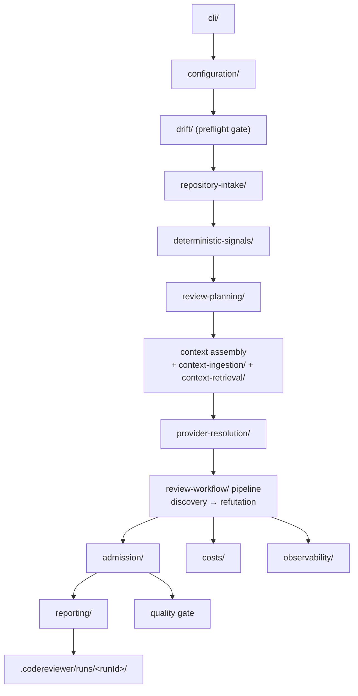

# Repository Map

Where things live and which boundary owns what. Read this before your first
change, then read [`.agent/IMPLEMENTATION.md`](../../.agent/IMPLEMENTATION.md)
for the conventions that govern how code inside these folders is written.

---

## Top level

| Path | Purpose | Tracked |
| --- | --- | --- |
| `src/` | TypeScript source and colocated tests | yes |
| `specs/` | Tracked implementation specs — the source of truth for product behavior | yes |
| `docs/` | User-facing documentation for **implemented** behavior only | yes |
| `eval/` | Evaluation fixtures, benchmark slices, corpus manifests | yes |
| `scripts/` | Operator scripts: schema generation, corpus hydration, pricing refresh | yes |
| `schema/` | Generated JSON Schema for the configuration contract | yes (generated) |
| `.github/workflows/` | Pull-request gate, publish-on-version-bump, Scorecard — see [releasing.md](releasing.md) | yes |
| `plans/` | Implementation plans, tickets and status tracking | yes |
| `.agent/IMPLEMENTATION.md` | Implementation conventions | yes |
| `AGENTS.md` / `CLAUDE.md` | Agent instructions and repository rules | yes |
| `concept/` | Local research notes | **ignored — never commit** |
| `.codereviewer/` | Runtime output: run artifacts, eval reports, hydrated slices | ignored |
| `dist/`, `coverage/` | Build and coverage output | ignored |

---

## `src/` at a glance

```
src/
  index.ts        public library surface (re-exports domain entrypoints)
  cli/            command dispatch, argument parsing, artifact writing
  platform/       filesystem primitives (path service, repository paths)
  shared/         cross-domain primitives (contracts, errors, redaction, …)
  domains/        the product, organized by domain
```

The organizing rule from `AGENTS.md` and `.agent/IMPLEMENTATION.md`: code is
grouped by **domain**, not by technical layer. Each domain exposes a narrow
public entrypoint (`index.ts`); sibling domains import that entrypoint, never
each other's internal files.

---

## `src/cli/`

| File | Owns |
| --- | --- |
| `main.ts` | The executable entry: reads `process.argv`, `process.cwd()` and `process.env`, writes stdout/stderr, sets the exit code |
| `index.ts` | Command dispatch and per-command orchestration |
| `args.ts` | Pure argument parsers — no IO, no runtime state |
| `run-artifacts.ts` | Writing run artifacts and maintaining the run index |
| `baseline-source.ts` | Resolving and validating the report `baseline write` builds from — the source of `baseline_source_unavailable` and `baseline_source_invalid` |
| `review-completion.ts` | The one rule about what a completed run may tell a machine: an absent quality gate is `quality_gate_missing` (exit `5`), never a reported pass |
| `eval-case-runner.ts` | Running one evaluation case through the review pipeline |

`main.ts` is intentionally thin; everything testable lives in `index.ts` and
below, and `runCli` takes its cwd, environment and provider import as injected
options so tests never touch the real process.

---

## `src/platform/`

| File | Owns |
| --- | --- |
| `path-service.ts` | The repository-root containment boundary: resolve-for-read, resolve-for-write, normalization, portable paths, POSIX and Windows flavors |
| `repository-path.ts` | Repository-relative path normalization |

Every filesystem operation in the product goes through here. If you add a new
path input, route it through this module — see
[permissions-and-path-containment.md](../07-security/permissions-and-path-containment.md).

---

## `src/shared/`

| Folder | Owns |
| --- | --- |
| `contracts/` | Zod contracts: `config/`, `findings/`, `report/`, `verification/`. The config schema and the review-report schema are the two generated artifacts. |
| `errors/` | `error-normalizer.ts`: the `StructuredError` shape, category → exit-code mapping, provider error sub-classification, redaction of messages and details |
| `redaction/` | The single redactor used before logs, errors, reports and model-bound context |
| `diff/` | `git-diff-header.ts`: unified-diff header parsing (the `diff --git` path and the `@@` hunk ranges), shared so `repository-intake` and the evaluation corpus hydrator cannot disagree about what a diff changed |
| `glob/`, `hash/`, `json/`, `schema/`, `text/` | Small focused helpers (glob matching, sha256, JSON value types, JSON-Schema conversion, UTF-8 byte slicing and truncation) |

Reuse these helpers rather than re-deriving path handling, redaction, schema
parsing, hashing or error normalization inside a domain.

---

## `src/domains/`

### Intake and planning

| Domain | Owns |
| --- | --- |
| `configuration/` | Config loading, layer merging, `.env` parsing, environment mapping, the redacted config summary |
| `repository-intake/` | The read-only git surface (`merge-base` and two `diff` shapes), changed-path discovery, diff hunk maps, file loading and size caps |
| `deterministic-signals/` | Language-neutral AST-based support signals: one `ast-grep/` parser and one `polyglot/` extractor covering all seven languages |
| `review-planning/` | Task planning and clustering, the task queue, the context ledger, the skill index |
| `context-ingestion/` | Optional external change-intent context: inbox and changed-files providers, frontmatter parsing, deterministic digest and model summarizers |
| `context-retrieval/` | The mediated repository tools (`read`, `list`, `grep`), their eligibility gate and their bounded tool-call wrapper |

### Review execution

| Domain | Owns |
| --- | --- |
| `provider-resolution/` | Mapping `provider.id` to an optional adapter package, credential assertion, lazy import, model-alias construction and the retry policy |
| `review-workflow/` | The pipeline itself. `harness/` wires the agent runtime; `pipeline/` holds discovery, refutation, admission and task queueing; `run/` orchestrates a run end to end (intake → planning → context → provider → completion) |
| `admission/` | The admission gate, fingerprinting, baseline matching and writing, the quality gate |
| `shared-context/` | The run's shared-context snapshot (candidates, verdicts, admission decisions) |
| `verification/` | The optional verification and fix lanes: claim providers, the investigation agent, apply-checks, corroboration |

### Advisory stages, reached only by their own command

| Domain | Owns |
| --- | --- |
| `change-impact/` | `impact check` (spec 22): changed-symbol seeding from the diff, identifier-bounded reference search, contract-change reading, the report and its Markdown render, plus the adjudication layer (deterministic tier, one model seam for the residue, its own admission gate). Makes no provider call unless `changeImpact.adjudication.enabled` is set |
| `intent-fulfilment/` | `intent check` (spec 23): obligation extraction, per-obligation judgement, the separate explanation call, the three refusing input limits in `intent-limits.ts`, and the Markdown render |

### Output and quality

| Domain | Owns |
| --- | --- |
| `reporting/` | JSON, Markdown and SARIF reporters; neutral review-comment drafts and the GitHub/GitLab/Bitbucket/generic renderers; platform detection; run summary and run index |
| `costs/` | Token accounting, price resolution (provider → configured → built-in snapshot), the pricing snapshot |
| `observability/` | The no-content event recorder, the review logger, optional OpenTelemetry setup |
| `drift/` | The deterministic drift checker over `README.md`, `docs/` and `specs/` |
| `evaluation/` | The evaluation harness: fixture and corpus schemas, loaders, the semantic and plausibility judges, the matcher, metrics, report and comparison rendering, hydration |

---

## How a review flows through the domains



Concept-level detail lives in [the concepts section](../03-concepts/review-lifecycle.md).

---

## `specs/`

| Path | Covers |
| --- | --- |
| `00-*.md` | Vision, scope and glossary, conventions, stack, file structure, architecture overview |
| `01-architecture-and-structure.md` | Architecture and module boundaries |
| `02-capabilities/` | Capability inventory |
| `03-contracts/` | Finding/evidence/report contracts plus the two **generated** JSON Schemas |
| `03-flows/` | End-to-end coverage |
| `04-configuration-and-providers.md` | Configuration and provider model |
| `05-review-workflow-and-runtime.md` | The review workflow and runtime |
| `06-evaluation-and-quality-gates.md` | Evaluation, metrics and gates |
| `07-security-privacy-operations.md` | Security, privacy and operations |
| `08-dependencies-and-release.md` | Dependencies and release |
| `09-readiness-self-audit.md` | Readiness self-audit |
| `11-` … `17-` | Feature specs: external context ingestion, verification flow, review comments, security-focused review, cross-file discovery, real-repository eval corpus. `14` and `18` through `21` are retired and never reused |
| `22-` … `28-` | Later feature specs: change-impact review, intent-fulfilment review, invariant-conformance review (`24`, capability removed), guarded-region context (`25`, both arms removed), reactive task splitting, discovery partitioning, targeted reads. A spec for a removed capability is kept, not deleted — the measurement that killed it is the record |
| `_registry.yaml`, `_provenance.yaml` | Spec registry and provenance |

`specs/README.md` and `specs/00-conventions.md` define the source-of-truth
rules. See [spec-driven-workflow.md](spec-driven-workflow.md).

---

## `eval/`

| Path | Contains |
| --- | --- |
| `eval/fixtures/sample-eval-cases.json` | The default case set |
| `eval/fixtures/<language>/` | Small repository fixtures the default cases point at |
| `eval/fixtures/slices/` | Optional directory: when present, slice-format cases here are loaded alongside the default set. A missing directory is not an error. |
| `eval/fixtures/proof-quality-slices/` | A controlled slice pack, selected with `--slice-root` |
| `eval/benchmarks/code-review-bench-style/` | Captured-pull-request slice pack (hydrated on demand) |
| `eval/corpora/real-repo-cross-file/manifest.json` | The real-repository corpus manifest; checkouts are hydrated into `.codereviewer/`, never committed |

See [adding-evaluation-cases.md](adding-evaluation-cases.md).

---

## Conventions that will trip you up first

- **ESM only.** No `require`, no `module.exports`. Import local modules with a
  `.js` extension. No `__dirname` or `__filename` — use `import.meta.url`.
- **Tests are colocated.** `name.test.ts` next to `name.ts`. Live tests are
  `name.live.test.ts` and are excluded from the default suite.
- **Zod at every boundary.** External input, workflow input, agent output and
  tool results all validate through a schema. `any` is forbidden at closed
  contract boundaries; `unknown` is allowed only inside a parser before
  validation.
- **No provider SDK in base dependencies.** Adapter package names stay data
  until provider resolution imports them.
- **Path-portable.** No hard-coded `/` or `\`, no drive letters, no
  case-sensitivity assumptions. Use `node:path`, and `path.posix` only for
  formats that require POSIX separators (git paths, report ids, SARIF URIs).
- **No prompt text or source snippets in logs by default.**
- **Docs describe implemented behavior only.** Speculative behavior belongs in
  `specs/`, not in `docs/`.
