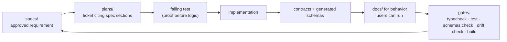

# The Spec-Driven Workflow

This repository does not accept "I thought it should work this way". Product
behavior is defined in `specs/`, reviewed by a human, and only then
implemented.

Read this before you open an editor.

---

## The one rule

> **Product behavior comes from tracked specs only.**

Not from a previous conversation, not from a research note, not from an
untracked file, and not from what the code happens to do today. `specs/README.md`
and `specs/00-conventions.md` state this; `specs/_registry.yaml` lists what
counts as source of truth and explicitly names `concept/`, untracked research
notes and prior conversation context as **forbidden authority**.

Practical consequences:

| Situation | What to do |
| --- | --- |
| A requirement is missing | Update or request a spec **before** writing code |
| A requirement is ambiguous | Same. Do not resolve the ambiguity in code |
| The code and a spec disagree | That is drift. Fix the code, or change the spec deliberately — do not silently document the code's behavior |
| You need a small design decision the spec does not cover | Choose the smallest reversible design that preserves the spec's security, provider-modularity and language-neutral contracts. Record larger product decisions in `specs/` first |

Agents working in this repository are bound by the same rule and may not change
a spec autonomously — specs are human-reviewed.

---

## The loop



### 1. Start from an approved spec

Find the spec that owns the behavior. The set is listed in
[`specs/README.md`](../../specs/README.md); the numbering groups them:

| Range | Topic |
| --- | --- |
| `00-*` | Vision, scope and glossary, conventions, stack, file structure, architecture overview |
| `01`–`03` | Architecture, capability inventory, contracts and flows |
| `04`–`09` | Configuration and providers, review workflow and runtime, evaluation and gates, security/privacy/operations, dependencies and release, readiness audit |
| `11`+ | Feature specs: external context ingestion, verification flow, review comments, security-focused review, cross-file discovery, real-repository eval corpus, independent sampling. Withdrawn numbers (`14`, `18`, `19`, `20`) are retired, not reused |

Every spec carries a `Status` and a `Date` header. Implement against
`Approved` specs.

### 2. Work from a ticket

`plans/` holds implementation plans, tickets and status tracking
(`_registry.yaml`, `_dependencies.yaml`, `_scope.yaml`, `_status.yaml`). A
ticket **cites exact spec sections**. Keep your change scoped to that ticket —
drive-by refactors belong in their own ticket.

### 3. Prove before you implement

From `specs/00-conventions.md`: every implementation ticket includes failing
proof before business logic when practical, then passing proof. Tests are
colocated (`name.test.ts` next to `name.ts`) and hermetic by default.

When you fix a bug, add the closest possible regression test next to the
changed module.

### 4. Contracts and generated artifacts

Boundary values validate through Zod. Two schemas are **generated** from the
Zod contracts and checked in:

- `schema/codereviewer-config.schema.json`
- `specs/03-contracts/config.schema.json`
- `specs/03-contracts/review-report.schema.json`

If you change `src/shared/contracts/config/config.schema.ts` or
`src/shared/contracts/report/review-report.schema.ts`, regenerate:

```bash
npm run generate:schemas
```

Leaving them stale is `generated-artifact-drift`, which is a **hard error** in
the drift gate.

### 5. Documentation

`docs/` describes implemented behavior only, and only behavior a user can
actually run. Update it in the same change as the behavior — a doc that
promises a flag the CLI rejects is `implementation-drift`, and a doc with a
broken local link is `documentation-drift`.

`specs/` defines behavior; `docs/` describes it. Do not turn `docs/` into a
second spec.

---

## The gates

Run these before you claim a change is done:

```bash
npm run typecheck
```

```bash
npm test
```

```bash
npm run generate:schemas:check
```

```bash
npm run cli -- drift check
```

```bash
npm run build
```

`generate:schemas:check` and `drift check` are **both required**. The first
proves the generated schemas match the Zod source; the second proves docs,
specs and the CLI inventory agree. Neither is optional, and neither is covered
by `npm test`.

Remove `dist/` after build verification unless a spec explicitly requires
tracked output.

Full command reference: [running-tests-and-checks.md](running-tests-and-checks.md).

---

## Drift is a first-class product surface

The drift checker is not a lint pass bolted on — it is a deterministic quality
gate that also runs as the **first preflight step of every review**. A blocked
drift gate stops the run before intake with `drift_gate_failed` (exit `1`).

| Category | Meaning | Default gate |
| --- | --- | --- |
| `documentation-drift` | Docs claim behavior the CLI/config/schema does not provide, or a local link is broken | warning |
| `spec-drift` | Specs conflict with generated schemas, package commands, source contracts, plans, or each other | warning |
| `implementation-drift` | Implementation behavior differs from approved specs | warning |
| `generated-artifact-drift` | Generated schemas or snapshots are stale against source | **error** |
| `ambiguity` | A requirement uses unclear, subjective, conflicting or non-testable language | warning |
| `security-drift` | Security-sensitive docs/specs/code disagree on permissions, paths, provider/network behavior, telemetry or secrets | **error** |

Things the checker actually looks for today, so you do not trip them by
accident:

- Local Markdown links in `README.md`, `docs/` and `specs/` must resolve.
- Use `specs/` as the canonical spec root. Referring to a singular `spec`
  directory instead is spec-drift.
- Use `.codereviewer` paths; the obsolete artifact root is security-drift.
- A documented CLI command must be one of `config`, `review`, `baseline`,
  `eval`, `drift`.
- Subjective wording is flagged as ambiguity: unmeasurable superlatives,
  vague quality adjectives, and conditional hedges that leave the requirement
  untestable. Write measurable acceptance criteria instead. (The exact phrase
  list lives in `src/domains/drift/drift-checker.ts`; quoting one of those
  phrases in a doc is itself enough to trigger the finding.)
- Provider-call retries are owned by the Harness model retry policy, not by the
  workflow task queue. Documenting it the old way is implementation-drift.

Drift checking never sends repository content to a provider.

---

## Writing a spec change

If your work needs a spec update:

1. Change the spec first, in its own commit, and keep the `Status`/`Date`
   headers accurate.
2. State testable rules. "Reject absolute paths, `..`, drive letters and NUL
   bytes before IO" is a rule; "handle paths safely" is an ambiguity finding.
3. Keep shared facts in one place and link to them from dependent specs rather
   than restating them.
4. Register anything new in `specs/_registry.yaml` if it belongs to the
   source-of-truth set.
5. Only then implement.

---

## Repository rules worth memorizing

From [`AGENTS.md`](../../AGENTS.md):

- Keep public-facing docs product-neutral. Do not reference internal research
  sources or compare this project to other products.
- Preserve a language-neutral core; language-specific behavior goes behind
  analyzer adapters.
- Keep code domain-oriented and isolated. No catch-all modules, no tangled
  cross-domain imports.
- ESM only.
- Support Linux and Windows filesystems. No hard-coded separators, drive
  letters or case-sensitivity assumptions.
- Keep model providers modular. No provider SDK in base dependencies.
- Treat shell execution, filesystem writes, network access and publishing as
  explicit permissions.
- Do not log prompt text, source snippets, secrets, tokens or raw tool output
  by default.
- `concept/` is ignored and must never be committed.
