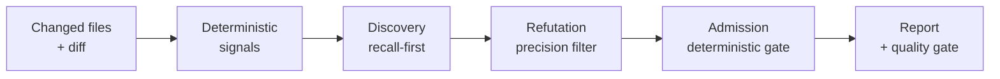

# Documentation

An AI code review engine that looks for **semantic defects** — the wrong-branch,
missing-guard, leaked-handle, broken-contract class of bug that compiles cleanly and
passes lint. It is built precision-first: it would rather report four real defects
than fourteen findings you have to triage.

If you read nothing else, read [What it is](01-overview/what-it-is.md) and
[Current results](05-quality/current-results.md).

## Start here

| You are | Read |
| --- | --- |
| Evaluating whether this is worth your time | [What it is](01-overview/what-it-is.md) → [Status and limitations](01-overview/status-and-limitations.md) → [Current results](05-quality/current-results.md) |
| Trying to run it | [Install and run](02-getting-started/install-and-run.md) → [Your first review](02-getting-started/first-review.md) → [Reading a report](02-getting-started/reading-a-report.md) |
| Deciding whether to trust the numbers | [Why the numbers are believable](05-quality/README.md) → [Metrics](05-quality/metrics.md) → [Judges](05-quality/judges-and-calibration.md) |
| Putting it in CI | [CI/CD](04-guides/ci-cd.md) → [GitHub PRs](04-guides/github-integration.md) → [Exit codes](06-reference/exit-codes-and-error-codes.md) → [Controlling cost](04-guides/controlling-cost.md) |
| Wondering how it actually works | [Review lifecycle](03-concepts/review-lifecycle.md) → the pipeline pages in order |
| Reviewing it for security | [Threat model](07-security/threat-model.md) → [Prompt injection](07-security/prompt-injection-and-untrusted-input.md) |
| Contributing | [Repo map](09-contributing/repo-map.md) → [Spec-driven workflow](09-contributing/spec-driven-workflow.md) → [Releasing](09-contributing/releasing.md) |

The sections are numbered in reading order: each assumes the ones before it.

## How the review works, in one picture

Discovery deliberately over-produces. Refutation then tries to **disprove** each
candidate, and admission applies deterministic rules that no model output can
override. Precision is bought at the last two stages, which is why the engine can
afford a recall-oriented first stage. See
[Why precision-first](01-overview/why-precision-first.md).

## Contents

- **[01 Overview](01-overview/)** — what this is and whether it fits you
  - [What it is](01-overview/what-it-is.md) · [Why precision-first](01-overview/why-precision-first.md) · [How it fits your pipeline](01-overview/how-it-fits-your-pipeline.md) · [Status and limitations](01-overview/status-and-limitations.md) · [Glossary](01-overview/glossary.md)
- **[02 Getting started](02-getting-started/)** — from clone to first report
  - [Install and run](02-getting-started/install-and-run.md) · [Your first review](02-getting-started/first-review.md) · [Reading a report](02-getting-started/reading-a-report.md)
- **[03 Concepts](03-concepts/)** — how the engine works
  - [Review lifecycle](03-concepts/review-lifecycle.md) — the spine; start here
  - Pipeline stages, in order:
    - [1 Configuration and intake](03-concepts/pipeline/01-configuration-and-intake.md)
    - [2 Deterministic support signals](03-concepts/pipeline/02-deterministic-support-signals.md)
    - [3 Task clustering and context assembly](03-concepts/pipeline/03-task-clustering-and-context-assembly.md)
    - [4 Holistic discovery](03-concepts/pipeline/04-holistic-discovery.md)
    - [5 Refutation](03-concepts/pipeline/05-refutation.md)
    - [6 Admission and severity floor](03-concepts/pipeline/06-admission-and-severity-floor.md)
    - [7 Baseline and quality gate](03-concepts/pipeline/07-baseline-and-quality-gate.md)
    - [8 Reporting](03-concepts/pipeline/08-reporting.md)
  - [The two flows](03-concepts/two-flows.md) · [Trust model](03-concepts/trust-model.md)
  - [Optional capabilities](03-concepts/optional-capabilities/README.md) — **read the decision table before turning anything on**
- **[04 Guides](04-guides/)** — task-oriented recipes
  - [Configuration](04-guides/configuration.md) · [Providers](04-guides/providers.md) · [Instructions and skills](04-guides/instructions-and-skills.md) · [Tuning noise and recall](04-guides/tuning-noise-and-recall.md) · [Controlling cost](04-guides/controlling-cost.md) · [CI/CD](04-guides/ci-cd.md) · [GitHub PR integration](04-guides/github-integration.md)
- **[05 Quality](05-quality/)** — how review quality is measured, and what it measures at
  - [Why you should believe the numbers](05-quality/README.md) · [Metrics](05-quality/metrics.md) · [Judges and calibration](05-quality/judges-and-calibration.md) · [Datasets](05-quality/datasets.md) · [**Current results**](05-quality/current-results.md) · [**What limits recall**](05-quality/what-limits-recall.md) · [Running an evaluation](05-quality/running-an-evaluation.md) · [Comparing runs](05-quality/comparing-runs.md)
- **[06 Reference](06-reference/)** — exhaustive lookup
  - [CLI](06-reference/cli.md) · [Configuration](06-reference/configuration/README.md) · [Environment](06-reference/environment.md) · [Exit and error codes](06-reference/exit-codes-and-error-codes.md) · [Artifacts](06-reference/artifacts.md)
- **[07 Security](07-security/)**
  - [Threat model](07-security/threat-model.md) · [Prompt injection and untrusted input](07-security/prompt-injection-and-untrusted-input.md) · [Permissions and path containment](07-security/permissions-and-path-containment.md) · [Data handling and redaction](07-security/data-handling-and-redaction.md) · [Secrets and credentials](07-security/secrets-and-credentials.md)
- **[08 Operations](08-operations/)**
  - [Troubleshooting](08-operations/troubleshooting.md) · [Partial and failed runs](08-operations/partial-and-failed-runs.md)
- **[09 Contributing](09-contributing/)**
  - [Repo map](09-contributing/repo-map.md) · [Spec-driven workflow](09-contributing/spec-driven-workflow.md) · [Running tests and checks](09-contributing/running-tests-and-checks.md) · [Adding evaluation cases](09-contributing/adding-evaluation-cases.md) · [Releasing](09-contributing/releasing.md)

## How quality is measured

A review engine that cannot be measured is a matter of opinion, so measurement is
part of the project rather than a report card bolted on afterwards.

**What is measured.** Every evaluation case is a real code change with a curated list
of the defects it contains. The engine reviews it blind, and its findings are compared
against that list.

- **Recall** — of the defects the case is known to contain, how many were found.
- **Adjusted precision** — of the findings reported, how many are genuine defects.
  Plain precision punishes the engine for finding real bugs the answer key never
  listed, which happens constantly, so a second judge rules on every unmatched
  finding and the ones it confirms are counted as **unlisted-real** rather than as
  mistakes.
- Alongside those: severity accuracy, duplicate findings, provider errors, and cost.

**How it is measured.** Matching a reported finding to an expected one is a judgement
call — the same defect can be described two ways — so a model judge does the matching
and is itself calibrated against human-labelled pairs. Runs report whether the judge
agreed well enough to be trusted. See [Judges](05-quality/judges-and-calibration.md).

**What it is measured on.** Several corpora, each able to answer something the others
cannot — including one built from **real upstream repositories checked out in full**,
because a corpus of changed-files-only slices cannot test a cross-file defect at all:
the evidence is not on disk. See [Datasets](05-quality/datasets.md).

**Two honesty rules** that shape how results are read here:

- Recall against an incomplete answer key **understates** quality. On one benchmark
  the engine reports roughly 2.8× more genuine defects than the key lists.
- Seed-to-seed variance is real and measured. On the real-repository corpus it is
  about 5 percentage points of recall, so a single run that looks better than another
  usually is not. Comparisons need multiple seeds.

The numbers themselves, with their dates, corpora, and caveats, live in
[Current results](05-quality/current-results.md). **Every figure recorded so far
predates a harness change that has not been re-measured**, which that page states
before its first table.

## What the engine is weak at, and what has been tried

The known limitation is enumeration: the engine reliably finds the primary defect in
a changed region and rarely a second one in the same file. The cause is measured —
**attention follows the diff** — and six structural interventions have been built and
measured against it, five of which failed and three of which were deleted. What has
moved the number instead has been prompt-level and scoring-level, at a fraction of
the cost.

That investigation, the ceiling it puts on a single review pass, and the reason it
makes the iterative review-fix-re-review loop the dominant way to use the tool, are
in [What limits recall](05-quality/what-limits-recall.md).
