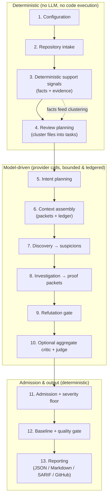

# Architecture

CodeReviewer is a local-first, LLM-centric **semantic** code-review engine. It
reviews a diff (or explicit file set), forms suspicions about real defects,
**proves or refutes** each one with evidence, and emits only admitted findings —
favoring correctness, traceability, and **low noise** over comment volume. It
assumes your pipeline already runs linters, formatters, type checks, tests, and
SAST (CodeQL/Semgrep), so it does not duplicate those; it targets the semantic,
cross-file, runtime/security bugs those tools miss.

This document explains the end-to-end pipeline: **what each step does, why it
exists, how it works, and how the steps interact.** Read it top-to-bottom to
understand a single review run.

---

## The big picture



Two properties hold throughout:

- **Untrusted-by-default.** A model suspicion is a hypothesis, not a finding. It
  only becomes actionable after an independent proof and a refutation gate pass
  (and, optionally, a judge). This is what keeps precision up.
- **Bounded & auditable.** Every piece of source sent to a provider is selected
  under explicit byte budgets and recorded (redacted) in the **context ledger**.
  Nothing executes project code; nothing leaks raw source/secrets to logs.

---

## The pipeline, step by step

### 1. Configuration
**What:** Builds the effective config. **Why:** one validated, typed source of
truth for every later stage. **How:** merges, lowest-to-highest precedence,
built-in defaults → `.codereviewer/config.json` → process env → `.env` → CLI
flags, then validates with Zod and emits a redacted summary + hash. Secrets are
never copied into the normalized config or logs.

### 2. Repository intake
**What:** Turns a base/head diff (or explicit `--files`) into the review's source
set. **Why:** the engine reviews *changes*, so it needs the changed files plus
their diff ranges. **How:** resolves git refs, lists changed paths, applies
`paths.exclude` (incl. generated/data files like lock files, minified bundles,
source maps, snapshots), and skips files that are binary, too large
(`maxFileBytes`), or beyond `maxFiles`. Output: source files + per-file
`reviewedDiffRanges` (which lines are new/modified).

### 3. Deterministic support signals
**What:** Parses each changed file (no execution) into **facts** (imports,
declarations, public symbols, modules) and, for some languages, **evidence**
(rule hits, diagnostics) plus test mappings. **Why:** two jobs — (a) drive file
*clustering* in step 4, and (b) give the model a structural map that measurably
improves discovery (A/B: removing the injected facts dropped recall from 3/3 to
1/3 on one case). **How:** TypeScript/JS use the TS compiler; Python/Go/Rust/
Java/Ruby use `ast-grep`. Signals are *support*, not the main detection surface —
they cannot, by themselves, produce an actionable finding (except a small set of
trusted, allowlisted deterministic rules with their own evidence).

### 4. Review planning
**What:** Groups the changed files into review **tasks**. **Why:** related files
must be reviewed together so cross-file bugs are visible, but a task must stay
within a packet budget. **How:** builds a graph from import-edge facts (relative
imports, plus Python-dotted / Java-package / Ruby-Go-slashed resolution),
connected files form a *dependency cluster*, and clusters are chunked to
`maxPathsPerCluster` (8). This step is **free** (deterministic, pre-LLM).

### 5. Intent planning
**What:** For multi-task non-local runs, a compact model planner groups tasks
into **review intents** (objective, focus areas, risk areas, verification
questions); otherwise one deterministic intent per task. **Why:** gives each
worker a focused checklist instead of "review everything," improving signal.
**How:** controlled by `aiReview.intentPlanning` (`auto`/`deterministic`/
`model`); skipped for single-task runs.

### 6. Context assembly
**What:** Builds the bounded model packet for each task and records every item in
the **context ledger**. **Why:** external processing must be explicit, budgeted,
and auditable — and never silently drop source and still claim success. **How:**
packs source chunks (depth-scaled budget: fast 60 KB / balanced 120 KB /
thorough 240 KB per task; large files split into multiple tasks), plus
support-signal facts (when `deterministicSignalMode = support`), instructions,
skills metadata, and a compact shared digest. Under budget pressure it drops
optional context (digest → support signals → ambient) before source, and records
a recovered provider issue rather than truncating mandatory fields.

### 7. Discovery — suspicions
**What:** The model reviewer reads one task packet and emits **suspicions**
(hypotheses about concrete defects), capped at `maxSuspicionsPerTask`. **Why:**
this is where candidate bugs are found. **How:** the reviewer prompt focuses on
runtime/security/logic defect families (null deref, async/await misuse,
copy-paste/wrong-variable, races/non-atomic read-modify-write, case
normalization, query/condition errors, contract drift) and is told to *suppress
style/doc/naming nits*. Suspicions are not findings yet.

### 8. Investigation — proof packets
**What:** For each suspicion, an investigator tries to **prove** it, producing a
**proof packet** (changed behavior, execution/data path, violated invariant,
impact, introduced-by-change, fix direction) — or returns refuted /
needs-more-evidence. **Why:** turns a guess into evidence. **How:** bounded
*mediated* context retrieval (read/list/grep, capped by
`maxToolReadsPerInvestigation` and rounds) lets it pull just the extra code it
needs. A global `maxInvestigationsPerRun` pool bounds total cost.

### 9. Refutation gate
**What:** An independent critic tries to **disprove** each proof (reachability,
guards, declared contracts, scope, evidence sufficiency, deterministic
contradictions). **Why:** this is the core precision mechanism — only `proved`
survives; `refuted`/`needs-more-evidence` are dropped or kept artifact-only.
**How:** per `aiReview.requireRefutation` (always on); the verdict, not the mere
existence of artifacts, decides admission.

### 10. Optional critics (aggregate + judge) — `aiReview.judgeFindings`
Off by default. When on:
- **Sibling sweep:** looks for the same proved bug pattern in other changed
  ranges (each sibling re-enters the full proof/refutation path).
- **Aggregate critic:** one batch pass over all proofs that **only rejects**
  duplicates/false-positives across the set. A `valid` verdict here does *not*
  substitute for the judge (that previously let weak findings through).
- **Per-candidate judge:** the strictest critic, per surviving proved candidate,
  with explicit challenge questions and verification checks.

> **Is the judge worth it?** It is a *second* strict pass after the refutation
> gate already filtered. In the cases observed after fixing its wiring, it ran
> but rejected nothing (it validated everything that reached it, including the
> false positives), so its marginal precision gain was not demonstrated — while
> it adds a model call per candidate. It is therefore **opt-in** (default off);
> the precision wins came from the refutation gate + the severity floor +
> aggregate de-duplication. Treat the judge as a high-stakes-run option until a
> full judge-on vs judge-off A/B shows a precision lift that justifies the cost.

### 11. Admission + severity floor
**What:** Decides which proved candidates become **actionable** findings. **Why:**
the final, deterministic gate that enforces the product contract. **How:** a
candidate is admitted as actionable only if it has a complete proof packet **and**
a passing refutation (and judge `valid` when judging is on), is in the reviewed
diff scope, is not a duplicate, and — for model-origin findings — meets
`aiReview.actionableSeverityThreshold` (default `medium`; below that it becomes a
recorded `below-threshold` rejection, keeping low-severity nits out of the
actionable surface). Trusted deterministic-rule findings are exempt from the
floor. Reporter eligibility (`inline` / `summary-only` / `artifact-only`) is then
set from severity (`review.inlineSeverityThreshold`, default `high`) and diff
scope. All model-controlled text is redacted before it enters a finding.

### 12. Baseline + quality gate
**What:** Classifies each finding against a saved baseline (new/existing/resolved)
and computes a deterministic pass/fail. **Why:** lets CI fail only on *new*
issues and on configured severity counts. **How:** fingerprint matching +
`qualityGate` thresholds (`maxCritical`/`maxHigh`/`maxMedium`,
`failOnProviderError`, `failOnNewOnly`). Only proved, refutation-passed,
actionable model findings are gate-relevant.

### 13. Reporting
**What:** Writes the run artifacts. **Why:** humans and CI consume the result.
**How:** JSON (machine), Markdown (human, renders the full proof/refutation/judge
evidence chain by reference), SARIF (code-scanning), and **GitHub review
comments** (inline PR comments with validated line numbers + a `Suggested fix`
summary and an applyable ` ```suggestion ` block when a scoped fix edit exists).
The engine *emits* these — it never publishes (no network/write permission); your
CI posts them.

### Cross-cutting: drift & evaluation
- **Drift checks** run alongside review to flag documentation/spec/implementation
  drift (configurable fail/warn categories).
- **Evaluation** is a separate harness (next section) used to measure quality.

---

## Evaluation harness (how quality is measured)

Evaluation runs fixtures/benchmark slices through the same pipeline, then matches
admitted findings to expected findings (deterministic token overlap first, then
an optional semantic judge) and reports metrics. Key design points:

- **Tiered recall.** Expected findings carry a tier (`runtime-critical`,
  `security`, `logic`, `nit`). The headline **`productRecall`** counts only the
  non-nit tiers — matching the product's low-noise scope — while `nitRecall` is
  reported separately. A raw aggregate recall would penalize the engine for
  *correctly* ignoring nits.
- **Coverage metrics.** `suspicionStageCoverage` (did discovery run?) and
  `judgeCoverage` (did the judge actually review what it should?) catch silent
  pipeline gaps.
- **Trustworthy by construction.** Benchmark slices must be *hydrated* with real
  PR code before scoring (the run errors on un-hydrated positive slices instead
  of scoring 0). All rate metrics are clamped so a single out-of-range value
  cannot abort a run.

---

## Domains (ownership map)

| Domain | Responsibility |
| --- | --- |
| Configuration | Defaults, JSON config, env overrides, validation, redacted summaries. |
| Repository intake | Git refs, file selection, exclude globs, diff ranges, path normalization. |
| Deterministic signals | Facts (imports/declarations/symbols), language rules/diagnostics, test mappings — no code execution. |
| Review planning | File clustering into tasks, suspicion/investigation budgets, queue leasing. |
| Shared context + ledger | Append-only admitted context between workers; redacted record of every item considered for provider transfer. |
| Review workflow | Orchestrates intent planning, context assembly, the proof loop (discovery → investigation → refutation), optional critics, and admission. |
| Admission | Proof/refutation/judge checks, severity floor, scope/duplicate checks, baseline matching, quality-gate decisions. |
| Reporting | JSON, Markdown, SARIF, GitHub review comments, run summary. |
| Provider resolution | Optional provider adapters (OpenAI Responses API / Bedrock / Azure), retry policy, parameter shaping. |
| Evaluation | Fixture/benchmark runs, finding↔expected matching, tiered + coverage metrics, regression gates. |

---

## Design principles (the "why" behind the rules)

| Principle | Reason |
| --- | --- |
| Suspicions are untrusted; only proved + refutation-passed becomes actionable. | Precision: stops plausible-but-wrong findings. |
| Deterministic signals are support, not the main detector. | Keeps the core language-neutral and avoids duplicating SAST. |
| Provider context is bounded, ledgered, and coverage-complete. | Makes external processing explicit; never claims success after dropping source. |
| Provider calls are task-scoped and round-gated. | Avoids one oversized call; preserves per-task recovery. |
| Low-severity model findings are not actionable by default. | Low noise over comment volume (matches the product vision). |
| Reports use evidence IDs and redacted summaries; no code execution. | Safety: no raw source/secrets in logs, no running untrusted code. |
| Config, contracts, ids, and rate/text caps come from shared schemas. | Prevents drift between stages (the source of past runtime schema failures). |
