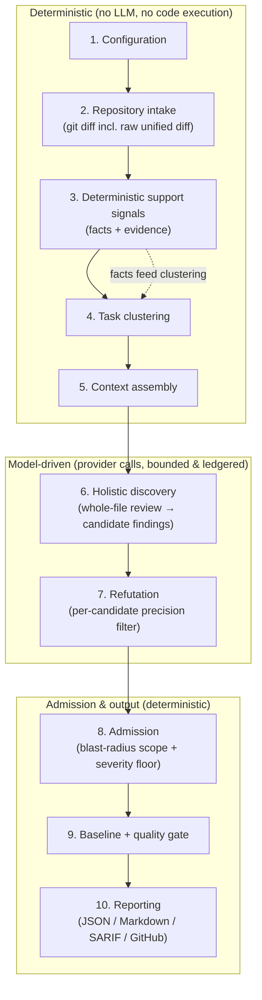

# Architecture

CodeReviewer is a local-first, LLM-centric **semantic** code-review engine. It
reviews a diff (or explicit file set) with a single pipeline: it discovers
candidate defects from a holistic whole-file review, **refutes** each candidate
with an independent precision pass, and admits only the survivors — favoring
correctness, traceability, and **low noise** over comment volume. It assumes your
pipeline already runs linters, formatters, type checks, tests, and SAST
(CodeQL/Semgrep), so it does not duplicate those; it targets the semantic,
cross-file, runtime/security bugs those tools miss.

This document explains the end-to-end pipeline: **what each step does, why it
exists, how it works, and how the steps interact.** Read it top-to-bottom to
understand a single review run.

---

## The big picture



Two properties hold throughout:

- **Untrusted-by-default.** A candidate finding from holistic discovery is not a
  finding yet. It only becomes actionable after an independent refutation pass
  judges it. This is what keeps precision up.
- **Bounded & auditable.** Every piece of source sent to a provider is selected
  under explicit byte budgets and recorded (redacted) in the **context ledger**.
  Nothing executes project code; nothing leaks raw source/secrets to logs.

---

## The pipeline, step by step

### 1. Configuration
**What:** Builds the effective config. **Why:** one validated, typed source of
truth for every later stage. **How:** merges, lowest-to-highest precedence,
built-in defaults → `.codereviewer/config.json` → process env → `.env` → CLI
flags, then validates with Zod and emits a redacted summary + hash. Secrets are
never copied into the normalized config or logs.

### 2. Repository intake
**What:** Turns a base/head diff (or explicit `--files`) into the review's source
set, including the **raw unified diff**. **Why:** the engine reviews *changes*,
so it needs the changed files, their diff ranges, and the actual before/after
diff text. **How:** resolves git refs, lists changed paths, applies
`paths.exclude` (incl. generated/data files like lock files, minified bundles,
source maps, snapshots), and skips files that are binary, too large
(`maxFileBytes`), or beyond `maxFiles`. Output: source files, per-file
`reviewedDiffRanges` (which lines are new/modified), and the raw unified diff.

### 3. Deterministic support signals
**What:** Parses each changed file (no execution) into **facts** (imports,
declarations, public symbols, modules) and, for some languages, **evidence**
(rule hits, diagnostics) plus test mappings. **Why:** two jobs — (a) drive file
*clustering* in step 4, and (b) give the model a structural map and context that
help discovery. **How:** TypeScript/JS use the TS compiler; Python/Go/Rust/Java/
Ruby use `ast-grep`. Signals are *support*, not the main detection surface — they
cannot, by themselves, produce an actionable finding (except a small set of
trusted, allowlisted deterministic rules with their own evidence).

### 4. Task clustering
**What:** Groups the changed files into review **tasks** (change units). **Why:**
related files must be reviewed together so cross-file bugs are visible, but a task
must stay within a packet budget. **How:** builds a graph from import-edge facts
(relative imports, plus Python-dotted / Java-package / Ruby-Go-slashed
resolution), connected files form a *dependency cluster*, and clusters are
chunked to a per-cluster path cap. This step is **free** (deterministic, pre-LLM).

### 5. Context assembly
**What:** Builds the bounded model input for each task and records every item in
the **context ledger**. **Why:** external processing must be explicit, budgeted,
and auditable — and never silently drop source and still claim success. **How:**
packs the changed source as a clean line-numbered document plus the task's
unified-diff segment, support-signal facts (when `deterministicSignalMode =
support`), instructions, skills metadata, and a compact shared digest. Under
budget pressure it drops optional context before source, and records a recovered
provider issue rather than truncating mandatory fields.

### 6. Holistic discovery
**What:** One recall-first whole-change review per task. The reviewer reads the
unified diff plus the full line-numbered content of the changed files and emits
**candidate findings** directly (capped per task). **Why:** this is where
candidate bugs are found, by reasoning over the whole change rather than isolated
hunks. **How:** the reviewer follows a fixed method — understand the intent,
trace control/data flow on every path, verify correctness against the intent,
then systematically sweep defect classes (correctness/logic, side effects &
control, concurrency & state, interface/type alignment, security, memory &
resources, data leaks & privacy). A defect anywhere in a changed file is in scope
whether it sits on the changed lines or elsewhere the change reaches. Style,
naming, formatting, documentation, and cleanup preferences are excluded.
Candidate findings are not findings yet.

### 7. Refutation
**What:** A per-candidate precision filter. An independent refuter tries to prove
or disprove each candidate using only the provided context (candidate, reviewed
diff ranges, evidence, review context, support-signal candidates, instructions,
skills metadata, shared digest, provenance). **Why:** this is the core precision
mechanism. **How:** controlled by `aiReview.requireRefutation` (always on). The
refuter returns `proved`, `refuted`, or `needs-more-evidence`. `proved` candidates
proceed to admission; `refuted` candidates are rejected; `needs-more-evidence`
candidates are handled per `promotionPolicy.modelWeakOrRefuted` (default
`artifact-only`: kept auditable, out of the inline review).

### 8. Admission + severity floor
**What:** Decides which refuted-survivor candidates become **actionable**
findings. **Why:** the final, deterministic gate that enforces the product
contract. **How:** a candidate is admitted as actionable only if it is within the
**blast-radius scope** (a changed file — introduced on the changed lines or
exposed elsewhere in the same changed file), passed refutation, has at least one
redacted evidence record, is not a duplicate, and — for model-origin findings —
meets `aiReview.actionableSeverityThreshold` (default `medium`; below that it
becomes a recorded `below-threshold` rejection, keeping low-severity nits out of
the actionable surface). Trusted deterministic-rule findings are exempt from the
floor. Reporter eligibility (`inline` / `summary-only` / `artifact-only`) is then
set from severity (`review.inlineSeverityThreshold`, default `high`) and literal
hunk overlap. All model-controlled text is redacted before it enters a finding.

### 9. Baseline + quality gate
**What:** Classifies each finding against a saved baseline (new/existing/resolved)
and computes a deterministic pass/fail. **Why:** lets CI fail only on *new*
issues and on configured severity counts. **How:** fingerprint matching +
`qualityGate` thresholds (`maxCritical`/`maxHigh`/`maxMedium`,
`failOnProviderError`, `failOnNewOnly`).

### 10. Reporting
**What:** Writes the run artifacts. **Why:** humans and CI consume the result.
**How:** JSON (machine), Markdown (human, renders the candidate/refutation/evidence
chain by reference), SARIF (code-scanning), and **GitHub review comments** (inline
PR comments with validated line numbers + a `Suggested fix` summary and an
applyable ` ```suggestion ` block when a scoped fix edit exists). Inline comments
are gated by `review.inlineSeverityThreshold`. The engine *emits* these — it never
publishes (no network/write permission); your CI posts them.

### Cross-cutting: drift & evaluation
- **Drift checks** run alongside review to flag documentation/spec/implementation
  drift (configurable fail/warn categories).
- **Evaluation** is a separate harness (next section) used to measure quality.

---

## Evaluation harness (how quality is measured)

Evaluation runs fixtures/benchmark slices through the same pipeline, then matches
admitted findings to expected findings (deterministic token overlap first, then
an optional semantic judge) and reports metrics. Key design points:

- **Tiered recall.** Expected findings carry a tier (`runtime-critical`,
  `security`, `logic`, `nit`). The headline **`productRecall`** counts only the
  non-nit tiers — matching the product's low-noise scope — while `nitRecall` is
  reported separately. A raw aggregate recall would penalize the engine for
  *correctly* ignoring nits.
- **Trustworthy by construction.** Benchmark slices must be *hydrated* with real
  PR code before scoring (the run errors on un-hydrated positive slices instead
  of scoring 0). All rate metrics are clamped so a single out-of-range value
  cannot abort a run.

---

## Domains (ownership map)

| Domain | Responsibility |
| --- | --- |
| Configuration | Defaults, JSON config, env overrides, validation, redacted summaries. |
| Repository intake | Git refs, file selection, exclude globs, diff ranges, raw unified diff, path normalization. |
| Deterministic signals | Facts (imports/declarations/symbols), language rules/diagnostics, test mappings — no code execution. |
| Review planning | File clustering into tasks, queue leasing. |
| Shared context + ledger | Append-only admitted context between workers; redacted record of every item considered for provider transfer. |
| Review workflow | Orchestrates context assembly, holistic discovery, refutation, and admission. |
| Admission | Scope check, severity floor, duplicate checks, baseline matching, quality-gate decisions. |
| Reporting | JSON, Markdown, SARIF, GitHub review comments, run summary. |
| Provider resolution | Optional provider adapters (OpenAI Responses API / Bedrock / Azure), retry policy, parameter shaping. |
| Evaluation | Fixture/benchmark runs, finding↔expected matching, tiered metrics, regression gates. |

---

## Design principles (the "why" behind the rules)

| Principle | Reason |
| --- | --- |
| Candidates are untrusted; only refutation-passed becomes actionable. | Precision: stops plausible-but-wrong findings. |
| Discovery reviews the whole change, not isolated hunks. | Recall: cross-file and exposed-elsewhere defects stay visible. |
| Deterministic signals are support, not the main detector. | Keeps the core language-neutral and avoids duplicating SAST. |
| Provider context is bounded, ledgered, and coverage-complete. | Makes external processing explicit; never claims success after dropping source. |
| Provider calls are task-scoped. | Avoids one oversized call; preserves per-task recovery. |
| Low-severity model findings are not actionable by default. | Low noise over comment volume (matches the product vision). |
| Reports use evidence IDs and redacted summaries; no code execution. | Safety: no raw source/secrets in logs, no running untrusted code. |
| Config, contracts, ids, and rate/text caps come from shared schemas. | Prevents drift between stages (the source of past runtime schema failures). |
