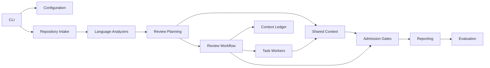

# Architecture

CodeReviewer is organized around isolated domains. Each domain owns one concern
and communicates through typed contracts.

## Domains

| Domain | Responsibility |
| --- | --- |
| Configuration | Defaults, JSON config, env overrides, validation, redacted summaries. |
| Repository Intake | Git refs, file selection, diff-aware inputs, path normalization. |
| Language Analyzers | AST-backed parsing, language-neutral facts, diagnostics, test mapping. |
| Review Planning | Task planning, dependency clustering, and queue leasing. |
| Shared Context | Compact append-only entries, exact task events, evidence references, candidates, and decisions. |
| Context Ledger | Redacted record of every context item considered for provider transfer. |
| Review Workflow | Orchestrated review execution, task context assembly, in-memory provider runtime boundaries. |
| Admission | Evidence checks, baseline matching, quality-gate decisions. |
| Reporting | JSON, Markdown, SARIF, and run summary artifacts. |
| Evaluation | Regression cases and metric gates. |

## Boundary Rules

| Rule | Reason |
| --- | --- |
| Analyzers do not execute project code. | Keeps local and CI review safer. |
| Provider packages are optional. | Minimal deployments can omit optional adapters and install only the selected provider package. |
| Reports use evidence IDs and redacted summaries. | Avoids leaking raw source snippets by default. |
| Config and contracts are typed. | Keeps CLI, workflow, and reports aligned. |
| Provider review gets only bounded, ledgered, coverage-complete context. | Makes external processing explicit and auditable without claiming success after omitted source. |
| Provider calls are task-scoped and round-gated. | Avoids one oversized model call and preserves task-level recovery. |
| Provider workflows keep runtime state in memory. | Avoids source-bearing runtime/session persistence and sandbox workspace trees; JSON artifacts are the run record. |
| Evidence is unfolded by reference. | Keeps shared summaries compact while retaining traceability. |
