# Architecture

CodeReviewer is organized around isolated domains. Each domain owns one concern
and communicates through typed contracts.

```mermaid
flowchart LR
  CLI["CLI"]
  Config["Configuration"]
  Intake["Repository Intake"]
  Signals["Deterministic Support Signals"]
  Structural["Optional Structural Parse"]
  Planner["Review Planning"]
  Context["Shared Context"]
  Ledger["Context Ledger"]
  Workflow["Review Workflow"]
  ProviderWorkflow["Provider Workflow Boundary"]
  ProvidedHarness["Provided Candidate Harness"]
  ModelHarness["Model-Backed Harness"]
  HarnessConfig["Harness Config"]
  Session["Workflow Session"]
  Handler["Workflow Handler"]
  Suspicion["Suspicion Generation"]
  InvestigationPacket["Investigation Packet"]
  Investigation["Investigation"]
  Refutation["Refutation"]
  Admission["Promotion And Admission"]
  Reporting["Reporting"]
  Eval["Evaluation"]
  EvalRender["Eval Report Rendering"]
  AgenticBench["Agentic Benchmark Posture"]
  BaselineBench["Baseline Benchmark Posture"]

  CLI --> Config
  CLI --> Intake
  Intake --> Signals
  Signals --> Structural
  Structural --> Signals
  Signals --> Planner
  Planner --> Context
  Planner --> Workflow
  Workflow --> ProviderWorkflow
  Workflow --> ProvidedHarness
  ProviderWorkflow --> ModelHarness
  Workflow --> HarnessConfig
  Workflow --> Session
  Session --> Handler
  Handler --> Ledger
  Handler --> Suspicion
  Suspicion --> InvestigationPacket
  InvestigationPacket --> Investigation
  Investigation --> Refutation
  Refutation --> Context
  Context --> Admission
  Handler --> Admission
  Admission --> Reporting
  Reporting --> Eval
  Eval --> EvalRender
  Eval --> AgenticBench
  Eval --> BaselineBench
  AgenticBench --> Workflow
  BaselineBench --> Workflow
```

## Domains

| Domain | Responsibility |
| --- | --- |
| Configuration | Defaults, JSON config, env overrides, validation, redacted summaries. |
| Repository Intake | Git refs, file selection, diff-aware inputs, path normalization. |
| Deterministic Support Signals | Local anchors, symbol spans, import/test/config hints, duplicate keys, and contradictions. |
| Review Planning | Task planning, dependency clustering, suspicion budgets, investigation budgets, and queue leasing. |
| Shared Context | Compact append-only entries, exact task events, evidence references, suspicions, proofs, internal candidates, and decisions. |
| Context Ledger | Redacted record of every context item considered for provider transfer or investigation. |
| Review Workflow | Public harness facade, runner start-state creation, runner run observability/start logging, runner preflight for drift and telemetry setup, runner source-state preparation for repository intake and source reads, runner planning-state preparation for deterministic signals and task planning, runner context-assembly step lifecycle, repository input preparation, deterministic signal preparation, runner task planning, runner static-context loading, runner context-state/provenance/metrics preparation, runner completion-state preparation, runner success-result/report-metrics/completion-log assembly, runner quality-gate partial failure assembly, runner provider-state execution/live task-event recovery, runner provider failure classification and partial recovery, runner admission-state preparation with deterministic fallback observability, provider workflow invocation/usage accounting/provider-step observability, deterministic runner admission/task-event conversion, provider workflow output admission mapping, runner error/timeout signal and terminal-error classification, runner partial failure-state assembly, runner finalization for cost/warnings/resolved baseline, runner provenance hash projection, runner baseline loading/configured-state/schema validation/baseline-load observability, runner drift warning and gate-error shaping, runner observability recording, provided-candidate scripted harness construction, model-backed ai-harness construction, ai-harness runtime config/delegation policy, workflow session invocation/error normalization, shared workflow handler orchestration, bounded task queue execution, workflow completion/admission assembly, review-runner context assembly, budget derivation, workflow-input assembly, result assembly, task packet shaping, model task execution/primary proof execution/completion logging, sibling sweep orchestration/provider execution, provider-call logging/normalization adapters, checklist-driven investigation/refutation packet shaping, investigation trace assembly, optional aggregate/judge-packet shaping, aggregate critic orchestration and result normalization, provider issue normalization, packet budget enforcement, compact shared-digest rendering, proof-loop runtime, optional judge review, and in-memory provider boundaries. |
| Promotion And Admission | Proof/refutation checks, evidence checks, baseline matching, quality-gate decisions. |
| Reporting | JSON, Markdown, SARIF, and run summary artifacts. |
| Evaluation | Focused eval report contracts and Markdown rendering, regression cases, metric gates, semantic scoring, default agentic benchmark posture, and baseline benchmark comparison posture. |

## Boundary Rules

| Rule | Reason |
| --- | --- |
| Support signals do not execute project code. | Keeps local and CI review safer. |
| Structural parsing stays inside support-signal extraction. | Structural parsing improves context and contradiction checks without adding parser docs, raw AST dumps, or rule-authoring traces to provider prompts. |
| Provider packages are optional. | Minimal deployments can omit optional adapters and install only the selected provider package. |
| Reports use evidence IDs and redacted summaries. | Avoids leaking raw source snippets by default. |
| Config and contracts are typed. | Keeps CLI, workflow, and reports aligned. |
| Provider review gets only bounded, ledgered, coverage-complete context. | Makes external processing explicit and auditable without claiming success after omitted source. |
| Provider calls are task-scoped and round-gated. | Avoids one oversized model call and preserves task-level recovery. |
| Worker agents cooperate through admitted shared context. | Each worker reviews one bounded task; later workers see compact admitted summaries, not raw suspicions or proof packets from unfinished or rejected work. |
| Provider workflows keep runtime state in memory. | Avoids source-bearing runtime/session persistence and sandbox workspace trees; JSON artifacts are the run record. |
| Evidence is unfolded by reference. | Keeps shared summaries compact while retaining traceability. |
