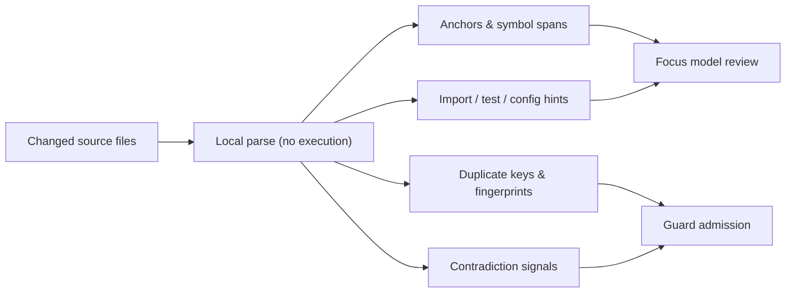

# Deterministic Support Signals

Local, no-execution facts that focus model review and guard promotion decisions.

Deterministic support signals are local facts used to focus model review and
guard promotion decisions. Most signals are context and evidence only, not the
primary issue-discovery surface. This page describes what the signal stage
produces, how signals reach the model, and the rules that keep them in a support
role.

---

## What the signal stage produces

The signal stage may produce:

- changed-line and diff-hunk anchors;
- symbol spans and import/reference hints;
- related test, config, or documentation path hints;
- duplicate keys and baseline fingerprints;
- contradiction signals such as invalid line ranges, out-of-scope paths, or
  unchanged-only evidence.

---

## How signals relate to other checks

> **Note:** Production setups are expected to run CodeQL, linters, formatters,
> unit tests, and build checks in adjacent pipelines. CodeReviewer uses
> deterministic signals to help the LLM review semantic risk and to reject
> weak or contradicted claims.

A small allowlist of trusted rule evidence can also seed actionable
deterministic candidates directly when the rule is local, narrow, and carries
its own evidence and remediation.

---

## Signals do not waive refutation

Generic support signals do not waive refutation. A model-origin candidate that
overlaps support-signal evidence still needs:

- a `proved` refutation result;
- normal admission

before it can become actionable or enter worker shared context. Model
suggestions that cite the same evidence as a trusted deterministic-rule
candidate are treated as duplicates and dropped before refutation.

---

## Redaction

> **Warning:** Provider prompts receive compact, normalized signal summaries
> only. Raw AST dumps, parser traces, rule-authoring notes, command output,
> source snippets, and provider responses are not written to default logs or
> artifacts.

---

## Signal Injection Mode

`aiReview.deterministicSignalMode` controls how signals reach the model:

| Value | Behavior |
| --- | --- |
| `support` (default) | Serialized signal facts are injected into the model packet as context, improving recall. |
| `disabled` | Signals are still used for file clustering and admission (contradiction checks), but serialized facts are not injected into the model packet. Lower token cost. |

Env: `CODEREVIEWER_AI_DETERMINISTIC_SIGNAL_MODE`.

---

## Referenced-definition context

Import facts also drive bounded cross-file context for holistic discovery. For
each task, context assembly resolves the changed files' relative imports
(`./`/`../`) to existing repository files that are NOT part of the change, ranks
them by import frequency, and injects a bounded, line-numbered digest of each
(preferring exported/public declaration lines) as a `referenced-definition`
review-context document. This lets the model reason about a callee's contract
even when that callee lives in an unchanged file.

The injection is token-conscious: at most six dependency files per task, a ~12KB
total section budget, and a per-file digest cap. Package/bare imports and any
path resolving outside the repository root or to a changed file are skipped, and
the whole feature is gated off together with `deterministicSignalMode:
'disabled'`. Referenced definitions are context only — they are never added to a
task's reviewed paths, and findings remain restricted to the changed files (a
finding pointing at a referenced-definition file is dropped during candidate
mapping).

---

## Observability

The no-content observability step is `deterministic_signals`. It records safe
metadata such as signal counts, evidence counts, supported extension counts, and
structural engine version when available.

---

## See also

- [Architecture](./architecture.md)
- [Review modes and flows](./review-modes-and-flows.md)
- [Data handling](../security/data-handling.md)
