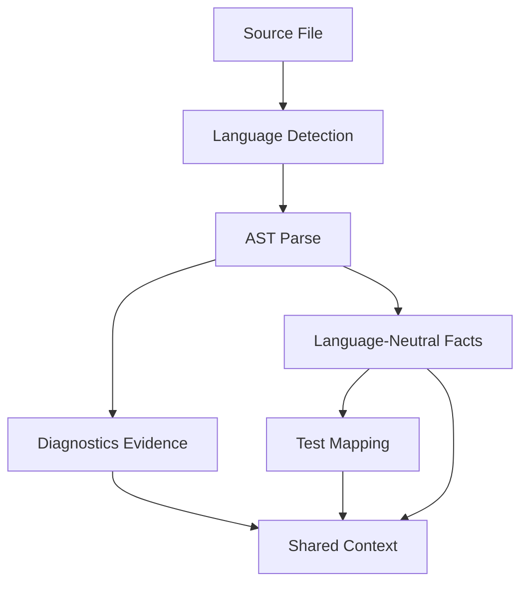
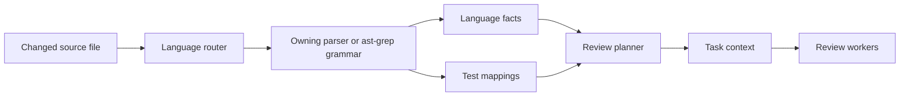

# Language Analyzers

Language analyzers convert source files into language-neutral facts without
executing project code.

## First-Class Languages

| Language | Extensions | Primary Facts |
| --- | --- | --- |
| TypeScript | `.ts`, `.tsx`, `.mts`, `.cts` | imports, exports, diagnostics, tests |
| JavaScript | `.js`, `.jsx`, `.mjs`, `.cjs` | imports, exports, diagnostics, tests |
| Python | `.py` | imports, declarations, public symbols, tests |
| Go | `.go` | packages, imports, declarations, exported symbols, tests |
| Rust | `.rs` | modules, uses, declarations, public symbols, tests |
| Java | `.java` | packages, imports, declarations, public symbols, tests |

## Analyzer Pipeline

The AST layer uses `@ast-grep/napi`. TypeScript, JavaScript, Python, Go, Rust,
and Java are exposed as first-class analyzer adapters. Adapters may share parser
helpers, but registry dispatch routes files first and calls only the owning
adapter.

ast-grep runs as a local deterministic analyzer dependency. It is not a
prompting layer in normal review runs: the system does not send ast-grep
documentation, raw AST dumps, generated rule traces, or MCP transcripts to a
model provider. Developer-time rule authoring can use ast-grep guidance, but
product behavior comes from checked-in analyzer code and fixture tests.

Each file has one analyzer owner based on its normalized repository-relative
path and extension. Unsupported paths are excluded before parser invocation, and
language-specific parsers reject mismatched paths at their public boundary. This
prevents a TypeScript or JavaScript file from being parsed by Python, Go, Rust,
or Java analyzers and prevents analyzer evidence from claiming a path the source
does not own. Facts are checked with the same ownership rule before they can
enter review task context or shared context.

## Fact Shape

Facts are normalized across languages:

| Field | Meaning |
| --- | --- |
| `language` | First-class language ID. |
| `kind` | `import`, `export`, `declaration`, `public-symbol`, or `module`. |
| `path` | Repository-relative file path. |
| `name` | Symbol, module, package, or imported name. |
| `moduleSpecifier` | Optional import/export target. |
| `line` | 1-based source line. |
| `contentHash` | SHA-256 of the analyzed file content. |

## Pipeline Role

The review planner uses import facts to group dependency clusters and uses test
mappings to attach related tests to the same review context. Provider-backed
runs receive compact analyzer-output JSON only when it is relevant to the task.
Analyzer output can reduce model work by focusing the task packet, but it does
not consume model tokens until included in a provider-backed task packet.

The `observability.json` artifact records safe `language_analysis` metadata:
structural engine, ast-grep version, fact count, evidence count, language count,
and test-mapping count. These fields are operational metadata and never contain
source snippets.
