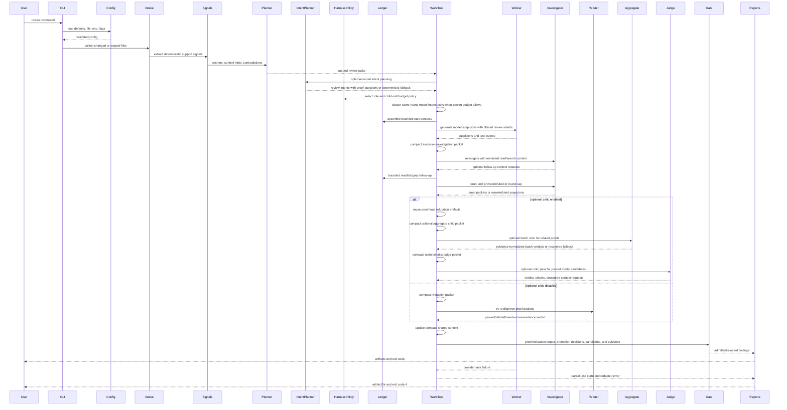
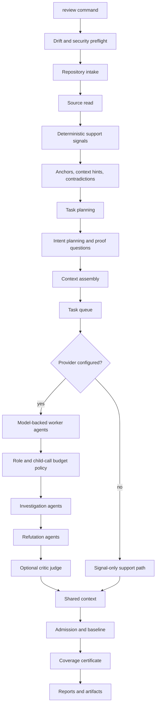
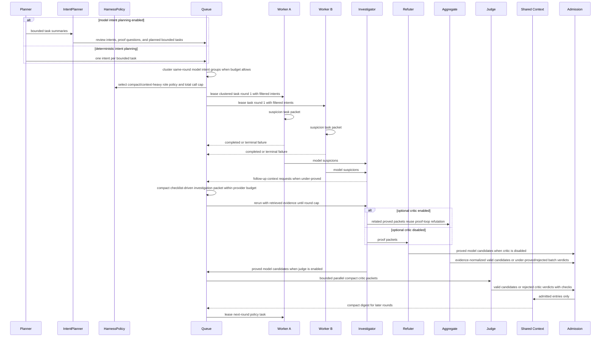

# Review Modes And Flows

The review modes the engine supports and the end-to-end flow each run follows.

This page maps the available modes to their intended use, then traces the run as a sequence and a pipeline, explains how workers coordinate, and lists the gates a finding must pass.

---

## Modes

| Mode | Intended Use | Typical Scope |
| --- | --- | --- |
| `local` | Developer workstation checks. | Changed files or focused paths. |
| `ci` | Pipeline gate. | Merge diff and configured quality thresholds. |
| `pr` | Pull request review. | Diff, inline-eligible findings, baseline filtering. |
| `full` | Repository-wide audit. | Larger context budget and broader file selection. |

---

## Flow

---

## Pipeline Steps

### Deterministic support-signal step

The deterministic support-signal step is local. It emits compact anchors,
symbol spans, import/test/config hints, duplicate keys, and contradiction
signals that help the model investigate and help admission reject weak claims.

> **Note:** It is not a replacement for CodeQL, linters, formatters, unit tests,
> or build checks that production pipelines already run.

### Review intents

Provider-backed review always records review intents. The default deterministic
path records one intent per task without an extra model call. In `auto` mode,
multi-task non-local reviews use a compact model planner to group bounded tasks
by implementation intent before worker review. Each intent carries compact
verification questions. The workflow passes only the intents relevant to the
leased task into the worker packet when they fit the task budget, so the worker,
investigator, aggregate critic, and optional judge can prove or falsify concrete
assumptions instead of treating the intent as broad prose.

Under tight packet budgets, the workflow drops grouped `reviewIntents` first and
keeps the flattened task objective and proof questions; if prior admitted context
alone keeps the packet oversized, it then omits the shared digest before failing
the provider task budget. The shared digest sent between workers is compacted with
relevant-entry filtering, per-summary truncation, and a recency-preserving byte
cap.

### Task clustering

When a model intent spans multiple same-round tasks, the workflow executes those
paths as one bounded `dependency-cluster` task when the clustered packet fits the
configured budget. If the cluster would exceed the provider task-packet budget,
the workflow keeps the original individual tasks.

When optional judging is enabled and multiple proofs exist, model task execution
applies suspicion caps, reserves investigation slots, runs the proof loop, and
invokes the optional sibling sweep before aggregate review.

### Aggregate critic packet

The aggregate critic packet uses the same provider task-input budget: review
intents, investigation traces, and shared digest text are removed before
proof/refutation artifacts and cited evidence. If that packet is irreducibly too
large, the run records a recovered provider issue and falls back to per-candidate
review. Aggregate packet construction, provider execution, and output
normalization are isolated behind a focused provider-runner helper.

The aggregate packet is scoped to the proof packet IDs being reviewed: unrelated
review intents, stale refutations, unrelated investigation traces, and their
evidence do not enter the critic prompt. Aggregate critic output is normalized
against that packet before persistence, so out-of-scope candidate and evidence
references do not enter the report. Evidence-less aggregate result approvals and
per-candidate approvals or rejections become `needs-more-evidence`, and Markdown
reports render aggregate result, decision, and similar-issue check evidence as
cited IDs or `none cited`; non-valid aggregate decisions are mapped before
per-candidate admission. Aggregate decisions suppress per-candidate judge only
for the candidate IDs they explicitly cover; uncovered proved candidates still go
through the normal optional judge.

### Optional critic judge

A separate optional critic judge can re-check proved model-origin candidates
before admission. Its packet also uses the provider task-input budget: filtered
review intents are removed before ambient review context, shared digest text is
omitted before dropping review context, and proof/refutation artifacts plus
explicit follow-up evidence remain. The critic records compact challenge
questions and structured verification checks. Markdown reports render judge result
and verification-check evidence as cited IDs or `none cited`.

When under-proved, it may request bounded mediated read/list/grep follow-up using
structured context requests and rerun until it reaches a verdict, cannot obtain
more safe context, or reaches the configured investigation-round cap. If the judge
packet is irreducibly too large, the run records a recovered provider issue
instead of producing an actionable finding. When optional judging is enabled,
per-candidate judge follow-up reuses identical mediated context artifacts across
the admission-preparation pass instead of spending repeated read/search budget for
the same decisive reference.

> **Note:** Provider issues from these stages are normalized through the same
> report-safe boundary before JSON, Markdown, or eval artifacts see them.

### Harness role and budget policy

The model-backed harness applies role-specific step/tool policy and a
scale-derived child-agent call budget. Planning, aggregate comparison, and
sibling-sweep agents stay single-step and tool-free to preserve speed and cost.
Task review, suspicion investigation, refutation, and optional judging can use
mounted read/list/grep skill tools for up to four harness steps when skills are
enabled, and remain single-step when no skills are mounted. The total
child-agent call cap is derived from planned task count, investigation slots,
investigation rounds, proof-loop refutation, optional critic work, sibling
sweeps, and a concurrency buffer, with a hard upper bound. Repository context
still flows through runtime-mediated context retrieval, not through unrestricted
model tools.

### Observability

`observability.json` records this as `deterministic_signals` with safe counts
and structural engine provenance when a parser is used. Those attributes are
metadata only; source snippets, prompt text, raw AST text, and provider
responses are filtered out.

---

## Worker Coordination

### How workers split the work

Workers cooperate by reviewing separate bounded task packets toward the same
run goal. A worker receives only its task-scoped source chunks, support signals,
instructions, selected skill references, and a compact digest of already
admitted shared entries.

The task reviewer is instructed to:

- emit only concrete packet-backed semantic suspicions;
- return nothing for cleanup-only, formatting, naming, preference, or
  helper-refactor concerns unless the packet proves concrete impact;
- never guess about omitted callers, tests, configuration, dependencies, file
  content, or runtime behavior.

Raw model suspicions do not influence later workers. Model suspicions carry
structured bounded follow-up context requests. The conversion boundary
deduplicates repeated model suspicions by generated candidate identity before
investigation slots are spent.

### Context retrieval and de-duplication

Runtime-owned read/list/grep retrieval de-duplicates identical structured
requests, mediates safe requests into evidence before a suspicion can become a
proof packet, and avoids spending retrieval budget on repeated requests.
Markdown reports render investigation trace budgets and redacted tool-call
summaries so humans can inspect context retrieval without reading JSON.
Investigation trace assembly is isolated behind a focused helper so retrieved
context tool calls, context ledger IDs, retrieval budget usage, and round counts
stay consistent across proof-loop paths.

Retrieval-level de-duplication and artifact-cache de-duplication both normalize
equivalent safe path spellings. Related suspicions in the same proof-loop batch
also reuse identical retrieved context artifacts so each investigator sees the
decisive context without another repository read/search; reordered equivalent
structured request sets share the same cache entry, and different prose audit
notes do not split structured request cache reuse. Optional sibling-sweep
suspicions share that task-review cache with the primary proof loop, so repeated
same-pattern investigation can reuse already retrieved context.

### Primary proof loop

A focused primary proof runner owns selected primary candidates, task-level
investigation-call instrumentation, and shared retrieval cache handoff before a
bounded investigator model call proves, refutes, or marks the suspicion as
needing more evidence. Its packet uses the provider task-input budget and
keeps review context only at the packet top level, avoiding duplicate nested
task context. It also carries a capped `proofQuestions` checklist assembled from
task or intent verification questions plus the required proof obligations, so
the existing investigator agent can focus on decisive evidence without another
provider call.

If an investigation packet is too large, optional shared digest text is omitted
before retrieved or ambient review context is dropped. When the investigator
itself needs a decisive reference, it can return structured follow-up context
requests; the workflow retrieves that context and reruns the investigator until
proof/refutation, no safe follow-up remains, or the configured
investigation-round cap is reached.

### Refutation and critic paths

When optional judging is disabled, complete proof packets pass through a bounded
refutation agent before admission. Markdown reports render proof packet fields,
proof evidence, refutation summaries, refutation evidence, and check evidence as
cited IDs or `none cited`. When optional judging is enabled, the workflow reuses
the proof-loop refutation artifacts and spends the saved provider call on the
aggregate critic or per-candidate judge instead.

When multiple proofs exist, one aggregate critic can compare related proofs
before per-candidate admission, and only aggregate-covered candidates skip the
per-candidate judge. Remaining per-candidate judge checks run with bounded
concurrency up to the review task concurrency cap, then merge their results back
in candidate order. Each judge packet starts from workflow evidence plus
task-produced proof evidence, then keeps only that candidate's cited proof,
refutation, and follow-up evidence, so unrelated candidate proof/refutation
rationale does not inflate later critic prompts.

Refutation packets start from workflow evidence plus task-produced proof
evidence, then keep only candidate-scoped proof evidence and changed-range
metadata first; if the packet is too large, the workflow omits shared digest
text, support-signal corroboration candidates, and finally ambient review
context before failing the provider budget. Support-signal corroboration is
limited to candidates that overlap the finding location or share evidence IDs,
so unrelated same-file signals do not inflate the refutation prompt.

### Sibling sweep

When a proved pattern spans multiple changed ranges or task paths, an optional
sibling sweep can add same-pattern suspicions that must pass the same proof
gates. The sweep prompt receives only proof-covered suspicions and matching
investigation traces, not weak or refuted suspicions from the same task.
Duplicate sibling suggestions at the same category/path/start line are pruned
before investigation budget is spent.

Sibling-sweep provider input shaping and recovered provider issue handling live
behind a focused runner helper, so the sweep orchestration only decides whether
to run and selects sibling candidates. A separate focused proof runner sends
selected siblings through the normal proof loop and assembles the
schema-validated sibling result.

### Promotion and de-duplication

Only proved packets can be promoted to actionable findings. Weak, refuted, or
provider-error model output remains rejected or artifact-only diagnostic output
without becoming review comments or quality-gate failures. Task evidence is not
inferred from same-path context; the model must cite exact evidence IDs for task
evidence to attach. Under-evidenced suspicions can still become provable when
mediated context retrieval produces new evidence.

Shared context and workflow completion deduplicate evidence records and candidate
findings by ID, so reused context artifacts and overlapping runtime paths do not
inflate live snapshots, later gates, or report artifacts. Admission candidates
are also deduplicated by ID before admission so the same candidate cannot be
admitted and then rejected as its own duplicate. If aggregate, judge/refutation,
or promotion handling has already produced a rejected or needs-more-evidence
pre-admission decision, workflow completion keeps that first terminal result and
does not admit the same candidate later in the pass. Workflow completion also
deduplicates stable-ID model artifacts before report output, so overlapping
runtime paths do not duplicate the same suspicion, proof, refutation, aggregate,
or judge artifact. Identical provider issue records are collapsed before report
output, while distinct provider stages or messages remain visible. Context ledger
entries are also deduplicated by stable ledger ID so reused retrieval artifacts
remain referenced without repeating the same ledger record.

### Retries and queue ownership

Provider-call retries are owned by the Harness model retry policy on the model
alias; the workflow task queue records lifecycle events and terminal failures
after provider retry classification is exhausted.

The bounded workflow task queue is a focused runtime helper: the ai-harness
workflow delegates task leasing and task-event assembly to it while keeping
agent definitions, provider calls, and workflow delegation in the harness
assembly module.

### Workflow completion helpers

Workflow completion is isolated behind a focused helper that owns admission,
artifact-only eligibility, baseline matching, quality gates, and final output
assembly after model/proof work is finished. Supporting helpers each own a
narrow concern:

- **Deterministic admission and event conversion** — runner-local task/admission
  event conversion is isolated so the main runner stays responsible for
  orchestration instead of owning admission mechanics. The same helper owns
  deterministic fallback queue observability and debug logging.
- **Timeout and partial-run errors** — runner timeout signals and structured
  partial-run errors are isolated, keeping timeout/cost/coverage failure shape
  separate from repository and provider orchestration.
- **Baseline loading** — runner baseline loading and schema validation are
  isolated, keeping baseline file IO, parse rules, explicit-configured policy,
  and safe baseline counts outside the main orchestration path. The same helper
  owns baseline-load observability and debug logs when the runner provides
  collaborators.
- **Drift warnings and hard gate errors** — runner drift warning strings and hard
  gate errors are isolated, so failure/report shaping is shared across normal and
  partial-run paths.
- **Observability recording** — runner task-event and structured-error
  observability recording is isolated behind a focused helper that records only
  bounded metadata fields.

Provider workflow output is converted into runner admission state behind the
focused admission helper, including shared-context task and decision records.
Partial-run failure state is assembled behind a focused helper so timeout,
coverage, provider, and cost failures share the same run-summary shape. Run
finalization for cost summaries, run warnings, and resolved baseline entries is
isolated behind a focused helper before final report assembly.

Successful result assembly is isolated behind the runner results helper so final
report construction, shared-context snapshot reconstruction, and report-step
metrics stay outside the main runner. The same helper owns the successful
run-completed log when the runner provides a logger. Post-provider completion is
isolated behind a focused runner helper so admission, deterministic fallback
task-event recording, coverage checks, run finalization, quality failures, and
success assembly stay in one tested stage.

Coverage-incomplete and cost-budget quality failures are isolated behind a
focused runner helper so partial-run error shaping, admission shared-context
reconstruction, run-cost metadata, and observability snapshots remain
consistent. Provider timeout and task-execution partial failures are classified
and shaped behind a focused runner helper so timeout normalization, recovered
provider candidates, task-event conversion, partial-run warnings, and
shared-context reconstruction stay consistent. Provider workflow execution is
wrapped by a focused runner helper so live provider task events are recorded
once, provider failures use the same partial run recovery path, and deterministic
fallback task events remain separate after admission. Provider-output versus
deterministic admission selection is isolated behind the runner admission helper
so fallback task-queue execution, deterministic admission, and provider workflow
output mapping share one boundary.

### Runner preparation helpers

Each preparation stage is isolated behind a focused helper, keeping its IO,
metrics, and debug logs outside the main orchestration path:

- **Preflight** — drift-gate execution, safe preflight observability metrics, and
  optional OpenTelemetry setup.
- **Run observability** — no-content run-start events, scoped run log bindings,
  and start-log metadata stay consistent before preflight begins.
- **Terminal run-error classification** — partial failures, configured timeouts,
  unexpected crashes, and their log metadata keep one policy boundary while the
  runner performs the actual observability recording.
- **Source-state preparation** — repository-intake and source-read step
  lifecycles, safe metrics, and debug logs.
- **Planning-state preparation** — deterministic-signal and task-planning step
  lifecycles, safe metrics, and debug logs.
- **Context-assembly step lifecycle** — context assembly observability and debug
  logs.
- **Instruction and skill static-context loading** — file IO, redaction, context
  ledger entries, and harness skill definitions stay separate from task source
  packing.
- **Provenance hash projection** — instruction and skill source hashes are
  derived from the context ledger in one place before deterministic admission.
- **Context-state preparation** — wraps context assembly, provenance projection,
  and safe context metrics behind one helper before the main runner builds
  workflow input.
- **Start-state creation** — run ids, start timestamps, and config hashes are
  created consistently before runtime steps begin.
- **Repository input preparation** — repository intake, review diff-map
  overrides, source reading, and safe step counts.
- **Deterministic signal preparation** — parser output, evidence schema
  validation, ownership assertions, and safe observability counts.
- **Task planning** — support-signal candidate policy, planner input shaping, and
  safe planning counts.

Mediated read/list/grep context retrieval records `tool-result` ledger entries so
investigation follow-up context stays distinguishable from initial source,
symbol, instruction, skill, and support-signal context.

### Workflow and harness boundaries

The shared workflow handler is the execution boundary between ai-harness
construction and review runtime behavior. It owns task planning fallback, queue
execution, context retrieval setup, aggregate review handoff, admission
preparation, and completion delegation. Workflow session invocation is a smaller
boundary above the handler. It parses the workflow input, forwards abort signals,
closes the ai-harness session, and normalizes provider errors while preserving
task execution errors.

Harness runtime configuration is isolated from builder composition: concurrency
defaults, delegation allowlists, run timeouts, and role-specific skill-agent
builtin tools/step budgets plus total child-agent call caps are owned by a
focused config helper and covered directly.

Provider workflow invocation is also isolated from the review runner. It resolves
the configured provider, wraps usage accounting, creates the model-backed
harness, forwards task events and abort signals, and shuts the harness down after
workflow completion or failure. The provided-candidate harness is also isolated
from the model-backed harness. It is the scripted pass-through mode used for
supplied candidates and failure simulation tests, while model-backed review keeps
separate agent wiring.

The model-backed harness owns provider-backed ai-harness agent definitions and
adapter callbacks for intent planning, task review, investigation, sibling
sweeps, refutation, aggregate review, and optional judging. It consumes the
shared role policy so context-heavy proof/critic roles can use bounded mounted
skill tools while compact orchestration roles remain cheap, and it receives a
scale-derived total child-agent call budget from the provider workflow boundary.
The provider workflow boundary owns successful provider-step observability, usage
accounting, task-event forwarding, and harness shutdown. The public
`harness-workflow` module is only a stable facade over those focused modules.

---

## Gates

| Gate | Checks |
| --- | --- |
| Config gate | Schema-valid config, safe refs, provider requirements. |
| Intake gate | Repository-relative paths, file limits, byte limits. |
| Evidence gate | Findings need locations and admitted evidence IDs; model-generated confidence scores are not review evidence. |
| Context gate | Provider-bound context must be bounded, redacted, ledgered, and coverage-complete. |
| Refutation gate | Model proof packets must survive bounded refutation before promotion. |
| Judge gate | Optional critic pass records challenge questions/checks and rejects proved model candidates that are false-positive or under-proved. |
| Admission gate | Deduplication, baseline handling, severity thresholds. |
| Quality gate | Fails when configured finding thresholds are exceeded. |
| Evaluation gate | Detects regressions in expected findings and false positives. |

### Provider-backed vs signal-only

The public CLI runs the same review runner for local review and evaluation.
When no provider is configured, review can still emit deterministic support
metadata and reports, but semantic issue discovery is provider-backed.

When a provider is configured, provider setup and calls are opt-in and pass
through the selected adapter boundary per bounded review task. Provider-call
wrappers keep logging and normalization consistent while the harness keeps typed
agent invocation and delegation. Later rounds do not start while an earlier round
still has planned or running tasks.

A review is not a single model call. Each worker receives only task-scoped
evidence, instructions, mounted skill references, bounded task context, support
signals, and a compact digest of earlier accepted task output. Dependency
clusters are split into bounded worker packets, and large source files are split
into exact source chunks assigned to additional tasks. Budget pressure creates
more tasks; it does not skip or truncate required source. A final task packet
guard fails before the provider call if the serialized task input still exceeds
the configured safety budget.

The provider workflow input does not duplicate run-wide source context once tasks
have been assembled; task packets are the model boundary.

> **Note:** Raw model suspicions are not rendered into live shared digests for
> later workers. A model-origin suspicion can influence actionable output only
> after mediated investigation produces a complete proof packet and refutation
> returns `proved`.

Weak, refuted, provider-error, or static-analysis-duplicate output remains
artifact-only or rejected according to `promotionPolicy` and does not affect the
quality gate.

The shared-context artifact stores compact summaries and references first.
Detailed evidence remains behind evidence IDs and can be unfolded by tooling
that needs the backing records.

### Statelessness and partial failures

Review runs are stateless and one-shot. Provider-backed runs keep all Harness
session and task state in memory; R1 review workers do not require a persistent
sandbox workspace, so runs never create durable databases, session directories,
or workspace directories. Per-task provider packets and provider responses are
source-bearing and are never persisted.

> **Warning:** A failed run is not resumable; rerun the command to review again
> from scratch.

If a provider-backed task fails after work has started, the run does not publish
admitted findings. It writes partial artifacts with the context ledger, shared
task history, and redacted error metadata so the failed worker state can be
understood without re-running the whole repository blindly.

---

## See also

- [Architecture](./architecture.md)
- [Deterministic support signals](./deterministic-support-signals.md)
- [CI/CD](../operations/ci-cd.md)
- [Reports and artifacts](../guides/reports-and-artifacts.md)
