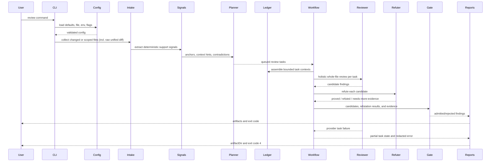
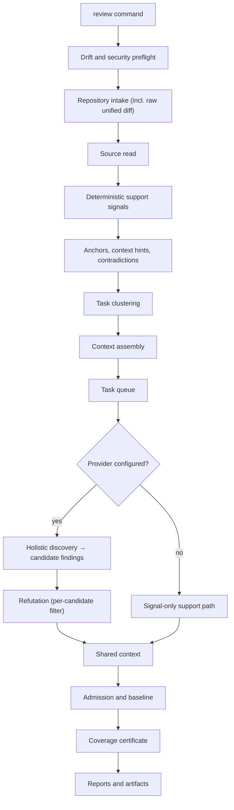
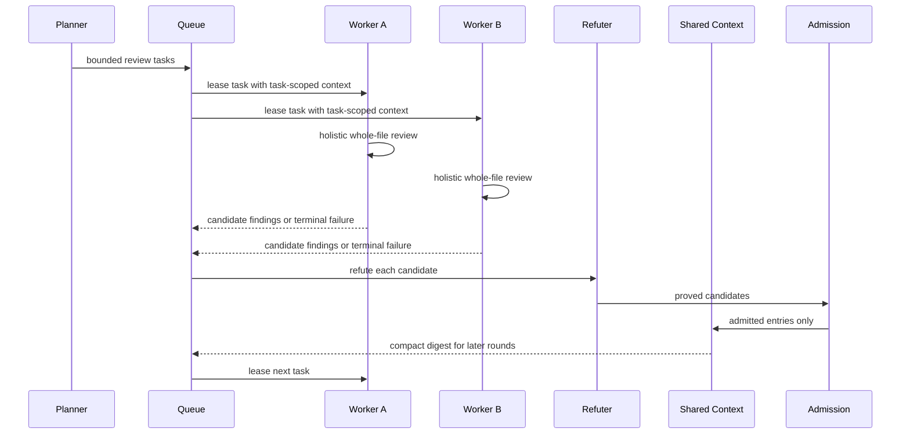

# Review Modes And Flows

The review modes the engine supports and the end-to-end flow each run follows.

This page maps the available modes to their intended use, then traces the run as a sequence and a pipeline, explains how workers coordinate, and lists the gates a finding must pass.

---

## Modes

| Mode | Intended Use | Typical Scope |
| --- | --- | --- |
| `local` | Developer workstation checks. | Changed files or focused paths. |
| `ci` | Pipeline gate. | Merge diff and configured quality thresholds. |
| `pr` | Pull request review. | Diff, inline-eligible findings, baseline filtering. |
| `full` | Repository-wide audit. | Larger context budget and broader file selection. |

---

## Flow

---

## Pipeline Steps

### Deterministic support-signal step

The deterministic support-signal step is local. It emits compact anchors,
symbol spans, import/test/config hints, duplicate keys, and contradiction
signals that feed clustering, give the holistic reviewer structural context, and
help admission reject weak claims.

> **Note:** It is not a replacement for CodeQL, linters, formatters, unit tests,
> or build checks that production pipelines already run.

### Task clustering

The workflow groups changed files into bounded review tasks (change units) using
import-edge facts. Connected files form a dependency cluster, and clusters are
chunked so each task packet fits the configured budget. Large source files are
split into exact source chunks assigned to additional tasks. Budget pressure
creates more tasks; it does not skip or truncate required source.

### Holistic discovery

Each task gets one recall-first whole-change review. The reviewer receives the
task's unified-diff segment (the exact before/after change) followed by the full
line-numbered content of the changed files for context, and emits candidate
findings directly. The reviewer is instructed to:

- understand the change intent, then trace control and data flow on every path
  (success, error, and edge cases);
- verify the implementation against the intent and systematically sweep defect
  classes (correctness/logic, side effects & control, concurrency & state,
  interface/type alignment, security, memory & resources, data leaks & privacy);
- treat a defect anywhere in a changed file as in scope whether it is introduced
  on the changed lines or exposed elsewhere in a changed file the change reaches;
- report only concrete defects with a precise triggering path, and never report
  style, naming, formatting, documentation, or cleanup preferences;
- never guess about omitted callers, tests, configuration, dependencies, or
  behavior not present in the review text.

Candidate findings are capped per task; the refutation filter, not this cap,
controls precision. Raw candidates do not influence later workers.

### Refutation

Every model-origin candidate within the reviewed scope passes through a bounded
refutation agent before admission. The refuter uses only the provided candidate,
reviewed diff ranges, evidence, review context, support-signal candidates,
instructions, skills metadata, shared digest, and provenance. It returns:

- `proved` — the provided context proves the finding and its impact; the
  candidate proceeds to admission.
- `refuted` — the candidate is contradicted by the provided context, or is a
  vague clarity/strictness/cleanup suggestion, or only occurs by violating
  declared static types/signatures/schemas with no shown caller or input; the
  candidate is rejected.
- `needs-more-evidence` — the issue might exist but the provided context is not
  enough to prove it; handled per `promotionPolicy.modelWeakOrRefuted` (default
  `artifact-only`, kept auditable but out of the inline review; `rejected` drops
  it entirely).

A real defect anywhere in a changed file is in scope: the verdict is decided on
correctness and reachability whether the defect lives on the changed lines or
elsewhere in a changed file the change reaches. Refutation summaries and check
evidence are rendered in Markdown reports as cited IDs or `none cited`.

> **Note:** Provider issues from these stages are normalized through the same
> report-safe boundary before JSON, Markdown, or eval artifacts see them.

### Observability

`observability.json` records the signal stage as `deterministic_signals` with
safe counts and structural engine provenance when a parser is used. Those
attributes are metadata only; source snippets, prompt text, raw AST text, and
provider responses are filtered out.

---

## Worker Coordination

### How workers split the work

Workers cooperate by reviewing separate bounded task packets toward the same
run goal. A worker receives only its task-scoped source (the unified-diff segment
plus the full line-numbered changed files), support signals, instructions,
selected skill references, and a compact digest of already admitted shared
entries.

Raw candidate findings do not influence later workers. A candidate can become
actionable only after refutation returns `proved` (or `needs-more-evidence` kept
artifact-only). Candidates are deduplicated by generated candidate identity before
refutation budget is spent.

### Refutation path

Refutation packets start from workflow evidence plus task-produced evidence, then
keep only candidate-scoped evidence and changed-range metadata first; if the
packet is too large, the workflow omits shared digest text, support-signal
corroboration candidates, and finally ambient review context before failing the
provider budget. Support-signal corroboration is limited to candidates that
overlap the finding location or share evidence IDs, so unrelated same-file signals
do not inflate the refutation prompt. Markdown reports render candidate fields,
refutation summaries, refutation evidence, and check evidence as cited IDs or
`none cited`.

### Admission and de-duplication

Only refutation-passed candidates can become actionable findings. Refuted,
needs-more-evidence, or provider-error model output remains rejected or
artifact-only diagnostic output without becoming review comments or quality-gate
failures, according to `promotionPolicy.modelWeakOrRefuted`.

Shared context and workflow completion deduplicate evidence records and candidate
findings by ID, so reused context artifacts and overlapping runtime paths do not
inflate live snapshots, later gates, or report artifacts. Admission candidates are
also deduplicated by ID before admission so the same candidate cannot be admitted
and then rejected as its own duplicate. If refutation or admission has already
produced a rejected or needs-more-evidence pre-admission decision, workflow
completion keeps that first terminal result. Identical provider issue records are
collapsed before report output, while distinct provider stages or messages remain
visible. Context ledger entries are also deduplicated by stable ledger ID so
reused retrieval artifacts remain referenced without repeating the same record.

### Retries and queue ownership

Provider-call retries are owned by the Harness model retry policy on the model
alias; the workflow task queue records lifecycle events and terminal failures
after provider retry classification is exhausted.

The bounded workflow task queue is a focused runtime helper: the ai-harness
workflow delegates task leasing and task-event assembly to it while keeping
agent definitions, provider calls, and workflow delegation in the harness
assembly module.

### Workflow completion helpers

Workflow completion is isolated behind a focused helper that owns admission,
artifact-only eligibility, baseline matching, quality gates, and final output
assembly after model work is finished. Supporting helpers each own a narrow
concern: deterministic admission and event conversion; timeout and partial-run
errors; baseline loading; drift warnings and hard gate errors; and observability
recording (bounded metadata fields only).

### Workflow and harness boundaries

The shared workflow handler is the execution boundary between ai-harness
construction and review runtime behavior. It owns task planning fallback, queue
execution, admission preparation, and completion delegation. Workflow session
invocation is a smaller boundary above the handler. It parses the workflow input,
forwards abort signals, closes the ai-harness session, and normalizes provider
errors while preserving task execution errors.

Provider workflow invocation is isolated from the review runner. It resolves the
configured provider, wraps usage accounting, creates the model-backed harness,
forwards task events and abort signals, and shuts the harness down after workflow
completion or failure. The model-backed harness owns provider-backed ai-harness
agent definitions and adapter callbacks for holistic task review and refutation.
The public `harness-workflow` module is only a stable facade over those focused
modules.

---

## Gates

| Gate | Checks |
| --- | --- |
| Config gate | Schema-valid config, safe refs, provider requirements. |
| Intake gate | Repository-relative paths, file limits, byte limits. |
| Evidence gate | Findings need locations and admitted evidence IDs; model-generated confidence scores are not review evidence. |
| Context gate | Provider-bound context must be bounded, redacted, ledgered, and coverage-complete. |
| Refutation gate | Model candidates must survive bounded refutation before admission. |
| Admission gate | Scope, deduplication, baseline handling, severity thresholds. |
| Quality gate | Fails when configured finding thresholds are exceeded. |
| Evaluation gate | Detects regressions in expected findings and false positives. |

### Provider-backed vs signal-only

The public CLI runs the same review runner for local review and evaluation.
When no provider is configured, review can still emit deterministic support
metadata and reports, but semantic issue discovery is provider-backed.

When a provider is configured, provider setup and calls are opt-in and pass
through the selected adapter boundary per bounded review task. Provider-call
wrappers keep logging and normalization consistent while the harness keeps typed
agent invocation and delegation. Later rounds do not start while an earlier round
still has planned or running tasks.

A review is not a single model call. Each worker receives only task-scoped source,
instructions, mounted skill references, bounded task context, support signals, and
a compact digest of earlier accepted task output. Dependency clusters are split
into bounded worker packets, and large source files are split into exact source
chunks assigned to additional tasks. A final task packet guard fails before the
provider call if the serialized task input still exceeds the configured safety
budget.

> **Note:** Raw candidate findings are not rendered into live shared digests for
> later workers. A model-origin candidate can influence actionable output only
> after refutation returns `proved` (or `needs-more-evidence` kept artifact-only).

Refuted, needs-more-evidence, or provider-error output remains artifact-only or
rejected according to `promotionPolicy` and does not affect the quality gate.

The shared-context artifact stores compact summaries and references first.
Detailed evidence remains behind evidence IDs and can be unfolded by tooling
that needs the backing records.

### Statelessness and partial failures

Review runs are stateless and one-shot. Provider-backed runs keep all Harness
session and task state in memory; review workers do not require a persistent
sandbox workspace, so runs never create durable databases, session directories,
or workspace directories. Per-task provider packets and provider responses are
source-bearing and are never persisted.

> **Warning:** A failed run is not resumable; rerun the command to review again
> from scratch.

If a provider-backed task fails after work has started, the run does not publish
admitted findings. It writes partial artifacts with the context ledger, shared
task history, and redacted error metadata so the failed worker state can be
understood without re-running the whole repository blindly.

---

## See also

- [Architecture](./architecture.md)
- [Deterministic support signals](./deterministic-support-signals.md)
- [CI/CD](../operations/ci-cd.md)
- [Reports and artifacts](../guides/reports-and-artifacts.md)
