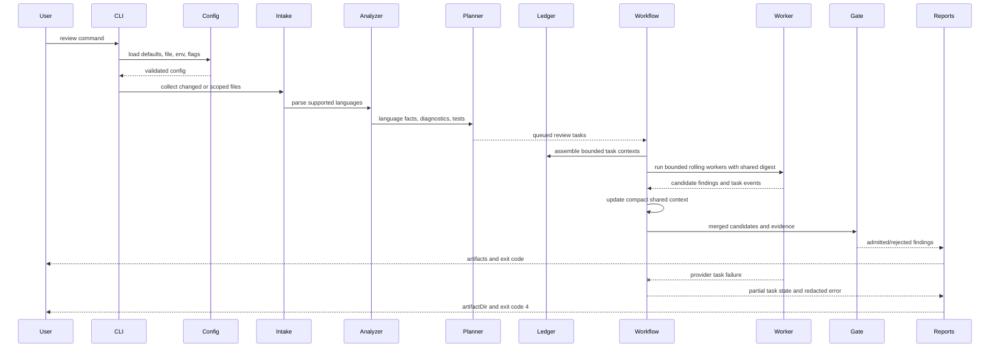
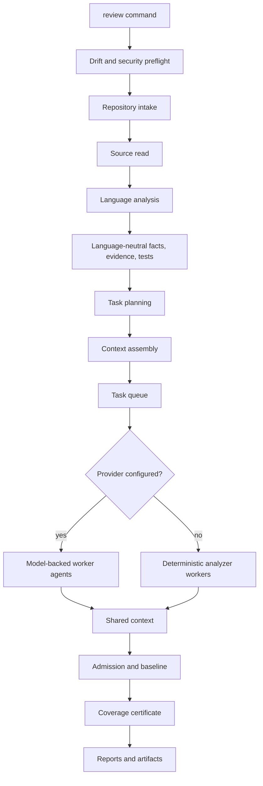
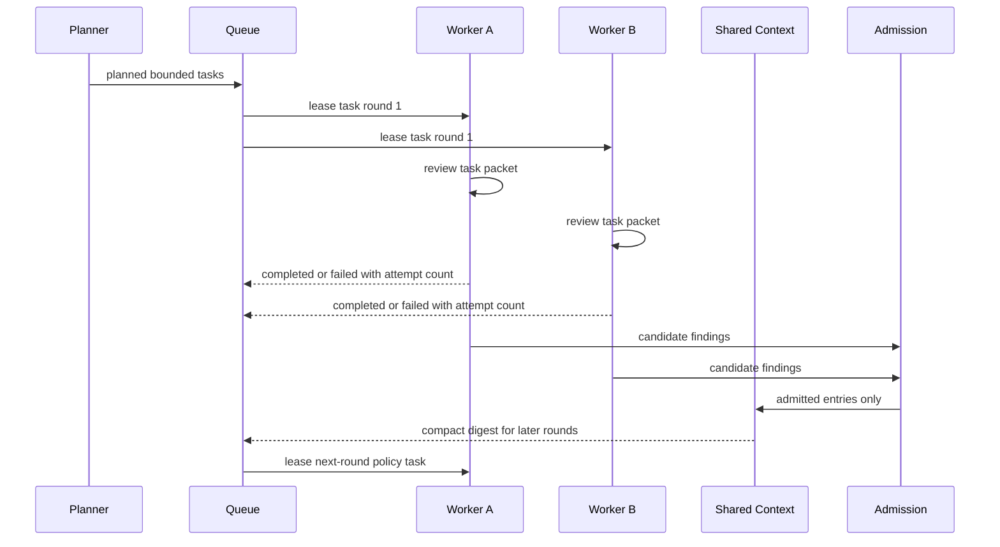

# Review Modes And Flows

## Modes

| Mode | Intended Use | Typical Scope |
| --- | --- | --- |
| `local` | Developer workstation checks. | Changed files or focused paths. |
| `ci` | Pipeline gate. | Merge diff and configured quality thresholds. |
| `pr` | Pull request review. | Diff, inline-eligible findings, baseline filtering. |
| `full` | Repository-wide audit. | Larger context budget and broader file selection. |

## Flow

## Pipeline Steps

The language-analysis step is local and deterministic. TypeScript and
JavaScript use language-native parsing where it gives better diagnostics;
Python, Go, Rust, and Java use ast-grep structural parsing through
`@ast-grep/napi`. The step emits compact facts, diagnostics, and test mappings.
It does not call a model provider and does not add ast-grep manuals, raw AST
dumps, or rule-authoring traces to prompts.

`observability.json` records this as `language_analysis` with safe counts and
structural engine provenance, including the ast-grep version. Those attributes
are metadata only; source snippets, prompt text, raw AST text, and provider
responses are filtered out.

## Worker Coordination

Workers cooperate by reviewing separate bounded task packets toward the same
run goal. A worker receives only its task-scoped source chunks, analyzer output,
instructions, selected skill references, and a compact digest of already
admitted shared entries. Raw model candidates do not influence later workers
until deterministic admission accepts them. If a provider task fails
transiently, the queue owns bounded retries and records the terminal attempt
count in task events.

## Gates

| Gate | Checks |
| --- | --- |
| Config gate | Schema-valid config, safe refs, provider requirements. |
| Intake gate | Repository-relative paths, file limits, byte limits. |
| Evidence gate | Findings need evidence IDs and locations. |
| Context gate | Provider-bound context must be bounded, redacted, ledgered, and coverage-complete. |
| Admission gate | Deduplication, baseline handling, severity thresholds. |
| Quality gate | Fails when configured finding thresholds are exceeded. |
| Evaluation gate | Detects regressions in expected findings and false positives. |

The public CLI runs the same review runner for local review and evaluation.
When no provider is configured, review uses deterministic analyzer evidence.
When a provider is configured, provider setup and calls are opt-in and pass
through the selected adapter boundary per bounded review task. Later rounds do
not start while an earlier round still has planned or running tasks. A review is not a
single model call. Each worker receives only task-scoped evidence, candidates,
instructions, mounted skill references, bounded task context, and a compact
digest of earlier accepted task output. Dependency clusters are split into
bounded worker packets, and large source files are split into exact source
chunks assigned to additional tasks. Budget pressure creates more tasks; it does
not skip or truncate required source. A final task packet guard fails before the
provider call if the serialized task input still exceeds the configured safety
budget.
The provider workflow input does not duplicate run-wide source context once
tasks have been assembled; task packets are the model boundary.
Raw model candidates are not rendered into live shared digests for later
workers. A candidate can influence later workers only after passing the
deterministic admission boundary as an admitted shared entry.
Deterministic analyzer findings remain eligible even when the provider returns
no additional candidates.

The shared-context artifact stores compact summaries and references first.
Detailed evidence remains behind evidence IDs and can be unfolded by tooling
that needs the backing records.

Review runs are stateless and one-shot. Provider-backed runs keep all Harness
session and task state in memory; R1 review workers do not require a persistent
sandbox workspace, so runs never create durable databases, session directories,
or workspace directories. Per-task provider packets and provider responses are
source-bearing and are never persisted. A failed run is not resumable; rerun the
command to review again from scratch.

If a provider-backed task fails after work has started, the run does not publish
admitted findings. It writes partial artifacts with the context ledger, shared
task history, and redacted error metadata so the failed worker state can be
understood without re-running the whole repository blindly.
