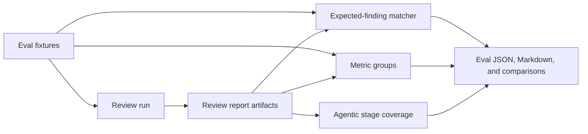

# Evaluation

The evaluation runner measures review quality by running fixtures through the
same pipeline as a normal review, then matching admitted findings against
expected findings and reporting recall, precision, and pipeline coverage metrics.

Fixtures live under `eval/fixtures/`. Artifacts are written under
`.codereviewer/eval/`.

> **Note:** Evaluation is a from-source dev and benchmarking workflow. It runs
> from a cloned repository using `npm run …` (and `npm run cli -- eval …`), not
> the published `@sebastianwessel/codereviewer` package or the `codereviewer`
> binary.

---

## Quick start

```bash
# Hydrate benchmark slices (required before the first benchmark run):
npm run eval:hydrate

# Run the full benchmark:
npm run eval:benchmark
```

---

## Evaluation pipeline



The runner computes case results and gates; a focused rendering module turns the
saved report contract into human-readable artifacts. Runner execution and
Markdown rendering share the same provider-issue, scoring, selection,
metric-group, and threshold schema.

---

## Output artifacts

Each run writes three files to `.codereviewer/eval/` (top-level = latest-run
convenience copies):

| File | Purpose |
| --- | --- |
| `eval-report.json` | Evaluation selection metadata, aggregate metrics, grouped metrics, case results, context ledger kind summaries, provider issues, and artifact-derived agentic stage coverage. |
| `eval-summary.md` | Human-readable selection, grouped metrics, gate result, metric tables, case table, context ledger kind coverage, agentic stage coverage, and failure details. |
| `eval-recall-report.md` | Per-expected-finding recall report for the current run. |

Each run is also archived under `.codereviewer/eval/runs/<run-id>/` with the
same three artifacts, so a smoke run does not overwrite the report from an
earlier benchmark run.

### `eval-report.json`

Records:

- `selection.fixtureSource`
- `selection.sliceRoot` (when `--slice-root` was used)
- `selection.caseFilters`
- `selection.selectedCaseIds`
- `metricGroups` for source profile, language, and tag — grouped metrics use
  the same deterministic metric contract as top-level report metrics

Each case result contains sanitized `expectedFindings` metadata (expected
index, category, severity, optional path/line range, match mode, and semantic
summary — no source snippets) so saved reports can be analyzed later without
the original fixture files.

Case results also record `duplicateFindingIds`, sanitized duplicate summaries,
token totals, `costUsd`, and `costUnavailable`. Duplicate findings are
same-location repeats of matched expected findings; they are visible as review
noise but are not counted as false positives.

### Aggregate metrics

| Metric | Description |
| --- | --- |
| `recallByTier` | Recall per intent tier: `runtime-critical`, `security`, `logic`, `nit`. |
| `precisionByTier` | Precision mirrored per tier (same computation as `recallByTier`; admitted findings carry no expected-tier label so precise per-tier precision is not derivable). |
| `productRecall` | Headline recall over `runtime-critical`, `security`, and `logic` tiers, excluding `nit`. This is the primary accuracy target. |
| `nitRecall` | Recall over `nit`-tier findings. Reported for visibility but not gated. |
| `suspicionStageCoverage` | Fraction of non-provider-error cases that produced at least one model suspicion. |
| `judgeCoverage` | When `judgeFindings` is enabled, judged candidates divided by actionable-promoted proofs. |
| `duplicateFindingCount` | Total duplicate findings across all cases. |
| `inputTokens` | Aggregate input token total. |
| `outputTokens` | Aggregate output token total. |
| `costUnavailableCount` | Cases where cost could not be computed. |

### Regression gate thresholds

The saved `eval-report.json` records the thresholds used when the regression
gate was evaluated. Each threshold is set via an `eval run` CLI flag (not the
`.codereviewer/config.json` schema) and is optional; when unset the
corresponding gate check is skipped.

| Threshold | Description |
| --- | --- |
| `minParseValidity` | Minimum fraction of cases with a valid parse. |
| `minRecall` | Minimum overall recall. |
| `minPrecision` | Minimum overall precision. |
| `minSeverityWeightedF1` | Minimum severity-weighted F1. |
| `maxFalsePositiveCount` | Maximum total false positives. |
| `maxCommentsPerKloc` | Maximum comments per thousand changed lines. |
| `maxCommentsPerDiffHunk` | Maximum comments per diff hunk. |
| `maxIncompleteCoverageRate` | Maximum fraction of cases with incomplete coverage. |
| `maxContextMutationRate` | Maximum fraction of context entries that were mutated. |
| `maxCostUsd` | Maximum total cost in USD. |
| `maxDurationMs` | Maximum total duration in milliseconds. |
| `minProductRecall` | Minimum recall over `runtime-critical`, `security`, and `logic` tiers (excluding `nit`). This is the primary accuracy target gate. Fails if `productRecall` is below the configured value. |
| `minSuspicionStageCoverage` | Minimum fraction of non-provider-error cases that produced at least one model suspicion. Fails if `suspicionStageCoverage` is below the configured value. |
| `minJudgeCoverage` | Minimum judged candidates divided by actionable-promoted proofs. Only enforced when `judgeFindings` is enabled. |
| `failOnProviderError` | Whether any provider-errored case fails the gate. Default `true`. |

---

## When to run evaluation

Run evaluation before changing any of the following, to catch regressions before
they reach CI:

- Support-signal behavior
- Admission rules
- Reporting
- Provider prompts

---

## Metrics reference

### Tier-based metrics

Each expected finding has a tier. The tier is either declared in `slice.json` or
derived deterministically from `category` and `severity`:

| Category / Severity | Derived tier |
| --- | --- |
| `security` category | `security` |
| `bug` + severity `critical` or `high` | `runtime-critical` |
| `bug` + severity `medium` or lower | `logic` |
| `performance` or `compatibility` category | `logic` |
| `maintainability`, `test`, or `policy` category | `nit` |

| Metric | Description |
| --- | --- |
| `productRecall` | Headline recall over `runtime-critical`, `security`, and `logic` tiers. **Primary accuracy target.** |
| `nitRecall` | Recall over `nit`-tier findings. Reported for visibility; not gated by default. |
| `recallByTier` | Recall per tier: `runtime-critical`, `security`, `logic`, `nit`. |
| `precisionByTier` | Precision mirrored per tier (admitted findings carry no expected-tier label). |
| `suspicionStageCoverage` | Fraction of non-provider-error cases that produced at least one model suspicion. |
| `judgeCoverage` | When `judgeFindings` is enabled: judged candidates divided by actionable-promoted proofs. |

> **Note:** `productRecall` excludes nits because the product's low-noise scope
> deliberately suppresses comments that belong in a linter or style guide.
> Penalizing the engine for correctly ignoring them would misrepresent accuracy.

The `eval-summary.md` renders a `Recall by Tier` section showing per-tier
recall alongside the overall product recall headline.

### Case result diagnostics

Each case result in `eval-report.json` includes sanitized expected-finding
metadata (index, category, severity, optional path/line range, match mode, and
summary) plus:

| Field | Meaning |
| --- | --- |
| `inlineFindingCount` | Inline-eligible findings; rendered as the `Inline` column in the Markdown summary. |
| `duplicateFindingIds` | Extra findings on the same path and line as an already-matched expected finding (counted as noise, not false positives). |
| `contextLedger` | Case-level context ledger summaries, including context kind such as `file`, `support-signal-output`, or `tool-result`. |
| `providerIssues` | Provider failures or recovered provider retries observed while scoring the case. |
| `agenticStages` | Artifact-derived stage coverage for intent planning, suspicion generation, investigation, proof, refutation, aggregate critic, optional judge, and provider recovery. |
| `inputTokens` / `outputTokens` | Token totals surfaced by the review run for that case. |
| `costUnavailable` | Whether cost metadata was incomplete for that case. |

Additional rendering behaviors:

- If any case has unavailable cost data, the Cost row shows the known cost plus
  the number of cases where cost was unavailable, rather than presenting the run
  as free.
- Provider issues are shown separately from hard provider errors, so a recovered
  retry remains visible without failing the provider-error gate.
- Agentic stage coverage is rendered as a compact summary table.
- When cases include context ledger entries, the summary renders a `Context
  Ledger Kinds` table with per-case kind counts plus considered and truncated
  counts.
- The metric row `Trusted deterministic findings` counts actionable findings
  seeded from the trusted deterministic-rule allowlist. These findings are
  proof-exempt; model-origin findings still require proof/refutation before they
  can be actionable.

### Artifact-only findings

Findings marked `reporterEligibility = "artifact-only"` are scored separately
from actionable findings. They can show that the model noticed a possible
expected issue, but they do not satisfy the main recall/precision gate and do
not count as normal false positives. The summary renders artifact-only recall,
precision, finding count, matched count, and false-positive count so uncertain
AI findings remain visible without being treated as publishable review comments.

Trusted deterministic-rule findings are scored as actionable findings, but
reported separately from proof-based model findings so proof recall remains
interpretable.

---

## Commands

### Run the benchmark

```bash
npm run eval:benchmark
```

`eval:benchmark` forces: PR mode, thorough review depth, model intent planning,
optional finding judging, semantic eval judging, and serial provider calls
(`--max-concurrent-tasks 1`) so large captured slices do not fail under parallel
provider-call timeout pressure.

For ad hoc eval runs, pass the same flags explicitly when you want this posture
without changing `.codereviewer/config.json`.

### Run with debug logging

```bash
npm run eval:benchmark:debug
```

Runs the same agentic benchmark with sanitized live debug logs written as
newline-delimited JSON to `.codereviewer/eval/log.log`. The Markdown summary
remains in `eval-summary.md` and stdout instead of being mixed into the log
file.

You can also pass `--debug` or `--log-level debug` directly to `eval run`. Add
`--log-file <path>` to write structured logs to a repository-relative file.

### Run a local slice pack

```bash
npm run cli -- eval run --slice-root eval/benchmarks/crb --case crb-sentry-1
```

`--slice-root` expects a repository-relative directory containing
`<case-id>/slice.json` and `<case-id>/repo/`. `--case` may be repeated to run a
subset while tuning prompts or provider settings. These values are persisted in
`eval-report.json` for reproducible same-dataset comparison.

### Flags — `eval run`

| Flag | Description |
| --- | --- |
| `--slice-root <path>` | Run only self-contained slice cases from a repository-relative local benchmark directory. |
| `--case <id>` | Filter loaded cases by exact case ID. Repeat for multiple IDs. |
| `--max-concurrent-tasks <1-32>` | Override review task/provider-call concurrency for this eval run without changing repository config. |
| `--review-mode <local\|ci\|pr\|full>` | Force the review mode for this run without editing config. |
| `--review-depth <fast\|balanced\|thorough>` | Force the review depth for this run without editing config. |
| `--intent-planning <auto\|deterministic\|model>` | Force intent-planning mode for this run. |
| `--judge-findings` | Enable the optional judge critic for this run. |
| `--semantic-judge` | Use provider-backed semantic matching (for explicit benchmark scoring only; the default matcher is deterministic and offline). |
| `--debug` | Emit no-content stage logs. |
| `--log-file <path>` | Write newline-delimited JSON logs to a repository-relative file. |

The generated report records the fixture source, slice root, filters, selected
case IDs, scoring mode, and grouped metrics so reports can be compared only
after confirming they used the same case set and semantic matcher.

`--max-concurrent-tasks` is useful for focused provider-backed benchmark runs
where serial execution avoids transient provider timeout noise. The
`--review-mode`, `--review-depth`, `--intent-planning`, and `--judge-findings`
flags are intended for apples-to-apples benchmark experiments, especially when
comparing the agentic PR-review path against the default local/balanced path.

### Compare two saved reports

```bash
npm run cli -- eval compare \
  --base .codereviewer/eval/base-report.json \
  --head .codereviewer/eval/head-report.json
```

Comparison output includes:

- A selection section before metric deltas. If selected case IDs differ, a
  warning lists base-only and head-only cases.
- A warning when semantic matcher modes differ (runs used different scoring
  modes).
- `Context Ledger Kind Deltas` when either report includes ledger entries.
- `Agentic Stage Deltas` when either report includes stage coverage; zero/zero
  skipped stages are omitted.
- Metric deltas for input/output token totals, provider errors, provider issues,
  and proof-loop quality (suspicion recall, proof recall, proof promotion
  precision, refutation false-positive/false-negative counts).
- `Metric Group Deltas` (fixture counts, recall, precision, F1, false-positive
  deltas) when both reports contain matching `sourceProfile` or `language`
  metric groups.
- `Metric Group Proof-Loop Deltas` for the same groups.
- `Metric Group Resource Deltas` (input tokens, output tokens, known cost,
  unavailable-cost cases).
- `Metric Group Coverage Deltas` for groups that are new, removed, or changed
  in fixture count even when the group exists in only one saved report.
- Cost comparison uses the same known/unavailable wording as eval summaries and
  includes a `Cost unavailable cases` delta row.

### Per-expected recall report

```bash
npm run cli -- eval recall-report \
  --report .codereviewer/eval/base-report.json \
  --report .codereviewer/eval/head-report.json
```

Without `--report`, reads `.codereviewer/eval/eval-report.json`. Output shows
whether selected case sets are identical, then lists expected findings with
detection rates and run marks.

### Flags — `eval compare` / `eval recall-report`

| Flag | Description |
| --- | --- |
| `--base <path>` | Base evaluation report JSON for comparison. |
| `--head <path>` | Head evaluation report JSON for comparison. |
| `--report <path>` | Report file(s) for `recall-report`. Without `--report`, reads `.codereviewer/eval/eval-report.json`. Repeat for multiple reports. |

### Fingerprint a local slice pack

```bash
npm run cli -- eval slice-manifest --slice-root eval/benchmarks/crb
```

Prints JSON with case IDs, normalized counts, and sha256 hashes for each
`slice.json` and repository tree. Store this output in CI logs or beside saved
reports when comparing local packs across machines. The digest excludes the
generation timestamp so the same unchanged pack produces the same digest on
repeated runs. Manifest output does not include source text, prompts, provider
payloads, secrets, or environment values.

---

## Fixture format

### Slice layout

```text
eval/fixtures/slices/<case-id>/
  slice.json
  repo/
    <repository files>
```

`slice.json` declares the case metadata, changed files, expected findings, and
no-finding zones. Paths in `changedFiles`, `expectedFindings`, and
`expectedNoFindingZones` are relative to the `repo/` directory.

Benchmark-style slices use canonical `expectedFindings[]` entries. Entries
without path and line data are treated as semantic-only expectations: they
contribute to actionable recall and precision, but not to line-accuracy or
PR-comment placement gates.

When `slice.json` includes a unified `diff`, evaluation derives changed-line
and diff-hunk counts from that diff for noise metrics and passes the parsed diff
map into review execution for inline PR-comment eligibility. Without `diff`, it
falls back to reviewed fixture file lines, changed-file count, and normal
repository-intake diff behavior.

### Committed fixture packs

The base fixture pack covers TypeScript, JavaScript, Python, Go, Rust, Java, and
Ruby with positive diagnostic cases and negative no-finding zones.

The committed Code Review Bench-style pack under
`eval/benchmarks/code-review-bench-style/` contains 59 captured-PR-style slices:
49 severity-labeled golden-comment cases plus 10 negative/no-finding-zone cases
for precision pressure. It is kept out of the default deterministic smoke run
because those golden comments are semantic review expectations and should be
evaluated with provider-backed review plus semantic judging.

### Hydrating benchmark slices

Positive slices (those with expected findings) must be hydrated before scoring.
If a positive slice still contains the placeholder diff marker from the committed
metadata, the eval command aborts with a clear error rather than silently
recording a false 0 recall.

```bash
npm run eval:hydrate
```

`npm run eval:benchmark` runs hydration automatically before the review pass.

> **Note:** Negative slices (no expected findings) are allowed to remain
> unhydrated and are never flagged.

---

## Semantic judge (`--semantic-judge`)

The default matching mode is `deterministic` (offline token matching). Pass
`--semantic-judge` for provider-backed semantic matching:

- The judge receives only the expected semantic summary and admitted finding
  title/description. Source snippets, unified diffs, prompts, secrets, tool
  output, and repository files are not sent.
- Judge output is a boolean match decision plus a short rationale.
- Accepted judge-backed matches receive a deterministic full semantic score
  instead of a provider-generated confidence.
- The saved JSON report stores the rationale as `semanticReason` on the matched
  finding; the Markdown summary renders a compact `Semantic Judge Matches` table
  for audit.
- Runs started with `--semantic-judge` are marked `semantic-judge` in
  `scoring.semanticMatcher` so benchmark metrics are not silently compared with
  deterministic runs.

`--semantic-judge` requires provider configuration and credentials from the
process environment, `.env`, or config file.

---

## Adding benchmark slices

For deeper quality comparison, add self-contained benchmark-style fixture slices:
a `slice.json` metadata file with expected findings plus a minimal `repo/`
directory containing only the files needed to reproduce the review decision. This
keeps cases reviewable by humans while still exercising the normal review runner.

---

## Related docs

- [Reports and artifacts](../guides/reports-and-artifacts.md) — full artifact
  schema for review run outputs.
- [Architecture](../concepts/architecture.md) — the evaluation harness section
  at the end of the architecture doc.
- [Configuration guide](../guides/configuration.md) — `aiReview.judgeFindings`
  and depth settings used by the benchmark posture.
