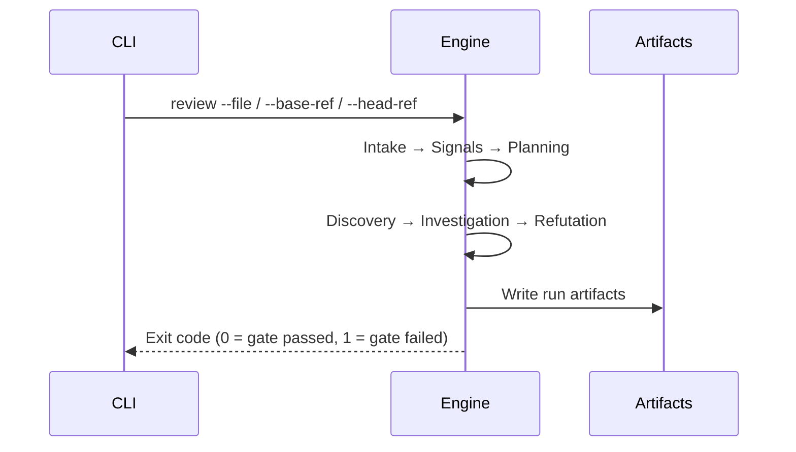

# First Review

Run the local review path and learn what each artifact in the output directory
contains.

---

## Run a review

### Review a specific file

```bash
npx tsx src/cli/main.ts review --file src/app.ts
```

### Review changes relative to a base branch

```bash
npx tsx src/cli/main.ts review --base-ref origin/main --head-ref HEAD
```

---

## Review lifecycle



---

## Output artifacts

Artifacts are written under:

```text
.codereviewer/runs/<run-id>/
```

| File | Purpose |
| --- | --- |
| `report.json` | Machine-readable review report. |
| `report.md` | Human-readable summary with the full proof/refutation evidence chain. |
| `report.sarif` | SARIF output for security and code-scanning tools. |
| `github-review-comments.json` | Inline PR comment drafts (written when `github-review-comments` is in `reporting.formats`). |
| `run-summary.json` | Run metadata used by automation and status checks. |
| `context-ledger.json` | Redacted context budget and inclusion audit. |
| `shared-context.json` | Compact shared entries, task events, current task state, and admission trace. |
| `observability.json` | No-content pipeline step and task event trace. |

See [Reports and Artifacts](../guides/reports-and-artifacts.md) for a detailed
description of each format.

---

## Exit codes

| Code | Meaning |
| --- | --- |
| `0` | Quality gate passed — no configured thresholds exceeded. |
| `1` | Review ran successfully; quality gate failed because at least one configured threshold was exceeded. |

See [Exit Codes](../reference/exit-codes.md) for the full exit-code contract.

---

## Next steps

- [Configuration Guide](../guides/configuration.md) — adjust mode, depth, and severity thresholds.
- [Reports and Artifacts](../guides/reports-and-artifacts.md) — understand the full artifact schema.
- [CI/CD](../operations/ci-cd.md) — integrate the review into a pipeline.
