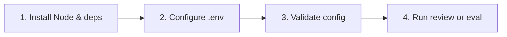

# Quick Setup

Get CodeReviewer installed, configured, and verified in a single session.

---

## Prerequisites

| Requirement | Version / Notes |
| --- | --- |
| Node.js | `>=24.15.0` |
| npm | Bundled with Node |
| Git | Required for repository review flows |

---

## Setup flow



---

## Step 1 — Install

Use the repository's pinned Node version, then install dependencies:

```bash
nvm install
nvm use
npm install
```

---

## Step 2 — Configure environment

Create a local `.env` from the template:

```bash
cp .env.example .env
```

> **Note:** `.env` is gitignored. Keep provider credentials there or in your
> CI secret store — never commit them.

Edit `.env` and fill in at minimum your provider ID, model, and API key.
Example for OpenAI:

```text
CODEREVIEWER_PROVIDER_ID=openai
CODEREVIEWER_PROVIDER_MODEL=gpt-4o
OPENAI_API_KEY=sk-...
```

See [Secrets and Env](../security/secrets-and-env.md) for all credential
options and [Providers](../guides/providers.md) for provider-specific setup.

---

## Step 3 — Validate configuration

```bash
npx tsx src/cli/main.ts config validate
```

A missing `.codereviewer/config.json` is valid — built-in defaults are applied
and environment overrides are merged on top. The command reports the effective
config (with secrets redacted).

---

## Step 4 — Run baseline checks

```bash
npm run typecheck
npm test
npm run build
```

All three must pass before running a review.

---

## Step 5 — Run a review or evaluation

### Review a specific file

```bash
npx tsx src/cli/main.ts review --file src/app.ts
```

Artifacts are written under `.codereviewer/runs/`. See
[First Review](first-review.md) for what each artifact contains.

### Run the evaluation suite

```bash
npm run eval
```

Evaluation uses development fixtures under `eval/fixtures/`, writes results to
`.codereviewer/eval/`, prints a human-readable summary, and does not load `.env`
for the deterministic default.

Use `npm run eval:with-env` or `npm run eval:semantic` when a provider-backed
evaluation should use `.env`.

### Run benchmark slices

Benchmark slices must be hydrated before running:

```bash
npm run eval:hydrate
npm run eval:benchmark
```

> **Warning:** Running `eval:benchmark` against un-hydrated positive slices
> causes the evaluation to abort with an error rather than silently recording
> zero recall.

---

## Next steps

- [First Review](first-review.md) — understand the artifacts produced by a review run.
- [Configuration Guide](../guides/configuration.md) — tune mode, depth, and quality gates.
- [Providers](../guides/providers.md) — install and configure provider adapters.
