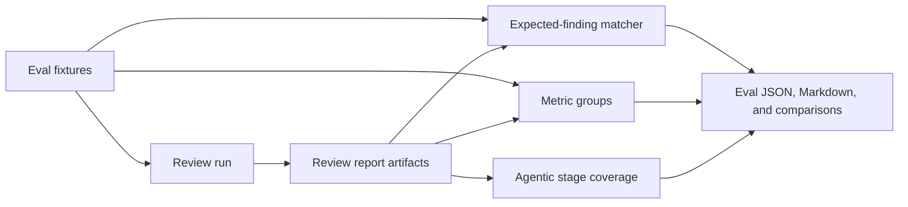

# Evaluation

The evaluation runner checks review behavior against deterministic development
fixtures stored under root `eval/fixtures/`.

Run evaluation:

```bash
npm run eval:benchmark
```

Artifacts are written under:

```text
.codereviewer/eval/
```

| File | Purpose |
| --- | --- |
| `eval-report.json` | Regression metrics, selected fixture metadata, grouped metrics, and fixture results. |
| `eval-summary.md` | Human-readable selection, gate result, metric tables, case table, and failure details. |
| `eval-recall-report.md` | Human-readable per-expected-finding recall report for the current run. |

Each run is also archived under `.codereviewer/eval/runs/<run-id>/` with the
same three artifacts. The top-level files remain latest-run convenience copies,
so a cheap smoke run does not destroy the report from an earlier benchmark run.

Use evaluation before changing support-signal behavior, admission rules, reporting, or
provider prompts. Evaluation executes the product review runner for each case,
then checks missed expected findings and excessive false positives before a
change reaches CI.

The command prints the same summary to stdout. Use the Markdown summary for
human comparison between runs, and use `eval-report.json` for automation.
The JSON report includes `selection.fixtureSource`, optional
`selection.sliceRoot`, `selection.caseFilters`, and
`selection.selectedCaseIds` so two reports can prove they used the same fixture
set before their numbers are compared.

The JSON report contract is owned by a focused evaluation contract module so
runner execution and Markdown rendering share the same provider-issue, scoring,
selection, metric-group, and threshold schema.

The Markdown summary, recall report, and comparison output are owned by a
focused evaluation rendering module. The runner computes case results and gates;
the renderer turns the saved report contract into human-readable artifacts.

The JSON report also includes `scoring.semanticMatcher`. The default is
`deterministic`, which uses offline token matching. Runs started with
`--semantic-judge` are marked as `semantic-judge` so benchmark metrics are not
silently compared with deterministic runs.

The JSON report also includes `metricGroups` for `sourceProfile`, `language`,
and `tag`. The Markdown summary renders source-profile and language groups so
recall and noise changes are visible without opening raw JSON.



Each case result in `eval-report.json` includes sanitized expected-finding
metadata: expected index, category, severity, optional path/line range, match
mode, and summary. This keeps saved reports useful for later recall analysis
without reloading fixture files.

Case results also include `inlineFindingCount`. The Markdown summary renders
this as the `Inline` column so PR-comment anchoring changes are visible without
opening raw JSON.

Case results include duplicate-finding and usage diagnostics:

| Field | Meaning |
| --- | --- |
| `duplicateFindingIds` | Extra findings on the same path and line as an already matched expected finding. |
| `contextLedger` | Case-level context ledger summaries, including the context kind such as `file`, `support-signal-output`, or `tool-result`. |
| `providerIssues` | Provider failures or recovered provider retries observed while scoring the case. |
| `agenticStages` | Artifact-derived stage coverage for intent planning, suspicion generation, investigation, proof, refutation, aggregate critic, optional judge, and provider recovery. |
| `inputTokens` / `outputTokens` | Token totals surfaced by the review run for that case. |
| `costUnavailable` | Whether cost metadata was incomplete for that case. |

Duplicates are shown in the summary as review noise, but they are not counted as
false positives. If any case has unavailable cost data, the Cost row shows the
known cost plus the number of cases where cost was unavailable instead of
presenting the run as simply free. Provider issues are shown separately from
hard provider errors, so a recovered retry remains visible in the human summary
without failing the provider-error gate. Agentic stage coverage is rendered as a
compact summary table so benchmark reports show whether a run actually produced
planning, suspicion, proof/refutation, aggregate, judge, or provider-recovery
artifacts without requiring debug logs. When cases include context ledger
entries, the summary also renders a `Context Ledger Kinds` table with per-case
kind counts plus considered and truncated counts.
The metric row `Trusted deterministic findings` counts actionable findings
seeded from the trusted deterministic-rule allowlist. These findings are
proof-exempt; model-origin findings still require proof/refutation before they
can be actionable.

The eval report includes tier-based and pipeline coverage metrics:

| Metric | Description |
| --- | --- |
| `recallByTier` | Recall per intent tier: `runtime-critical`, `security`, `logic`, `nit`. |
| `precisionByTier` | Precision mirrored per tier (see `recallByTier`; admitted findings carry no expected-tier label). |
| `productRecall` | Headline recall over `runtime-critical`, `security`, and `logic` tiers. This is the primary accuracy target. |
| `nitRecall` | Recall over `nit`-tier findings. Reported for visibility but not gated by default. |
| `suspicionStageCoverage` | Fraction of non-provider-error cases that produced at least one model suspicion. |
| `judgeCoverage` | When `judgeFindings` is enabled, judged candidates divided by actionable-promoted proofs. |

The `eval-summary.md` renders a `Recall by Tier` section showing per-tier recall
alongside the overall product recall headline.

Compare two saved reports:

```bash
npm run cli -- eval compare --base .codereviewer/eval/base-report.json --head .codereviewer/eval/head-report.json
```

The comparison output includes a selection section before metric deltas. If the
selected case IDs differ, it prints a warning and lists base-only and head-only
cases so aggregate deltas are not mistaken for same-dataset results.
If semantic matcher modes differ, it prints a separate warning because the runs
used different scoring modes. If either report includes context ledger entries,
the comparison also includes `Context Ledger Kind Deltas` so context expansion,
retrieval, or support-signal usage changes are visible next to quality metrics.
If either report includes agentic stage coverage, the comparison includes
`Agentic Stage Deltas` so planning, proof/refutation, aggregate, and optional
judge changes are visible without opening raw JSON. Metric deltas include input
and output token totals so token-use changes are visible beside quality, cost,
and duration. Cost comparison uses the same known/unavailable wording as eval
summaries and includes a `Cost unavailable cases` delta row.
Agentic stage delta rows omit zero/zero skipped stages so the comparison remains
focused on actual workflow activity.
Metric deltas include provider error and provider issue rows so provider
instability is visible beside model-quality, token, cost, and duration changes.
They also include proof-loop quality rows for suspicion recall, proof recall,
proof promotion precision, and refutation false-positive/false-negative counts.
When both saved reports contain matching `sourceProfile` or `language` metric
groups, comparison output also includes `Metric Group Deltas` with fixture
counts, recall, precision, F1, and false-positive deltas so a mixed benchmark
cannot hide a segment-specific regression. It also includes `Metric Group
Proof-Loop Deltas` for the same groups so suspicion, proof, promotion, and
refutation regressions are visible by segment. `Metric Group Resource Deltas`
shows input-token, output-token, known-cost, and unavailable-cost case changes
for the same groups. `Metric Group Coverage Deltas` shows source-profile and
language groups that are new, removed, or changed in fixture count even when the
group exists in only one saved report.

Create a per-expected recall report from saved reports:

```bash
npm run cli -- eval recall-report --report .codereviewer/eval/base-report.json --report .codereviewer/eval/head-report.json
```

Without `--report`, the command reads `.codereviewer/eval/eval-report.json`. The
output shows whether selected case sets are identical, then lists expected
findings with detection rates and run marks.

The committed fixture pack covers TypeScript, JavaScript, Python, Go, Rust, Java,
and Ruby with positive diagnostic cases and negative no-finding zones.

`npm run eval:benchmark` hydrates the slice pack and then runs the intended
agentic PR-review posture: PR mode, thorough depth, model intent planning,
optional finding judging, provider-backed semantic scoring, and
`--max-concurrent-tasks 1` so large captured slices do not first fail under
parallel provider-call timeout pressure.
For ad hoc eval runs, pass the same flags explicitly when you want this posture
without changing `.codereviewer/config.json`.

`--semantic-judge` requires provider configuration and credentials from the
process environment, `.env`, or config file. The judge receives only the
expected semantic summary and admitted finding title/description. Source
snippets, unified diffs, prompts, secrets, tool output, and repository files are
not sent as judge input by this scoring step. Judge output is a boolean match
decision plus a short rationale; accepted judge-backed matches receive a
deterministic full semantic score instead of a provider-generated confidence.
The saved JSON report stores that rationale as `semanticReason` on the matched
finding, and the Markdown summary renders a compact `Semantic Judge Matches`
table for audit.

For deeper quality comparison, add self-contained benchmark-style fixture
slices: a metadata file with expected findings plus a minimal repository tree
that contains only the files needed to reproduce the review decision. This keeps
cases reviewable by humans while still exercising the normal review runner.

The committed Code Review Bench-style pack under
`eval/benchmarks/code-review-bench-style/` contains 59 captured-PR-style slices:
49 severity-labeled golden-comment cases adapted from the open benchmark shape
plus 10 negative/no-finding-zone cases for precision pressure. It is kept out of
the default deterministic smoke run because those golden comments are semantic
review expectations and should be evaluated with provider-backed review plus
semantic judging. The committed positive cases are metadata. `npm run
eval:benchmark` first hydrates them from their public PR or commit unified
diffs into `.codereviewer/eval/benchmark-slices/code-review-bench-style/`, with
full head-side files for changed paths, then runs the normal eval command
against that hydrated local slice root.

Before running any eval that includes benchmark slices, positive slices must be
hydrated. If a positive slice (one with expected findings) still contains the
placeholder diff marker from the committed metadata, the eval command aborts with
a clear error before scoring begins, rather than silently recording a false 0
recall. Run hydration first:

```bash
npm run eval:hydrate
```

Negative slices (no expected findings) are allowed to remain unhydrated and are never flagged.

Slice layout:

```text
eval/fixtures/slices/<case-id>/
  slice.json
  repo/
    <repository files>
```

Run an untracked local benchmark slice pack by pointing the CLI at the slice
root:

```bash
npm run cli -- eval run --slice-root eval/benchmarks/crb --case crb-sentry-1
```

Run the committed benchmark-style pack (hydrates then reviews):

```bash
npm run eval:benchmark
```

`eval:benchmark` forces PR mode, thorough review depth, model intent planning,
optional finding judging, semantic eval judging, and serial provider calls.
`eval:benchmark:debug` runs the same agentic benchmark with sanitized
live debug logs written as newline-delimited JSON to
`.codereviewer/eval/log.log`; the Markdown summary remains in
`eval-summary.md` and stdout instead of being mixed into the log file.
You can also pass `--debug` or `--log-level debug` to `eval run` directly.
Add `--log-file <path>` to write the structured logs to a repository-relative file.

`--slice-root` expects a repository-relative directory containing
`<case-id>/slice.json` and `<case-id>/repo/`. `--case` may be repeated to run a
small subset while tuning prompts or provider settings. These values are
persisted in `eval-report.json` for reproducible same-dataset comparison.

Fingerprint a local slice pack:

```bash
npm run cli -- eval slice-manifest --slice-root eval/benchmarks/crb
```

The command prints JSON with case IDs, normalized counts, and sha256 hashes for
each `slice.json` and repository tree. Store this output in CI logs or beside
saved reports when comparing local packs across machines. The digest excludes
the generation timestamp, so the same unchanged pack produces the same digest
on repeated runs. Manifest output does not include source text, prompts,
provider payloads, secrets, or environment values.

`slice.json` declares the case metadata, changed files, expected findings, and
no-finding zones. Paths in `changedFiles`, `expectedFindings`, and
`expectedNoFindingZones` are relative to the `repo/` directory.

Benchmark-style slices use canonical `expectedFindings[]` entries. Entries
without path and line data are treated as semantic-only expectations: they
contribute to actionable recall and precision, but not to line-accuracy or
PR-comment placement gates.

Each expected finding carries an optional `tier` field
(`runtime-critical`, `security`, `logic`, or `nit`). When `tier` is absent it
is derived deterministically from `category` and `severity` via
`resolveExpectedFindingTier`:

- `security` category → `security`
- `bug` category, severity `critical` or `high` → `runtime-critical`
- `bug` category, severity `medium` or lower → `logic`
- `performance` or `compatibility` category → `logic`
- `maintainability`, `test`, or `policy` category → `nit`

The product accuracy target is measured on `productRecall`, which covers the
`runtime-critical`, `security`, and `logic` tiers only. The `nit` tier
(docs, naming, typos, style, maintainability, tests, policy) is reported as
`nitRecall` but excluded from the product gate. This separation reflects the
low-noise product scope: comments that belong in a pre-commit linter or style
guide are measured but not penalized as recall misses on the main target.

Findings marked `reporterEligibility = "artifact-only"` are scored separately
from actionable findings. They can show that the model noticed a possible
expected issue, but they do not satisfy the main recall/precision gate and do
not count as normal false positives. The summary renders artifact-only recall,
precision, finding count, matched count, and false-positive count so uncertain
AI findings remain visible without being treated as publishable review comments.
Trusted deterministic-rule findings are scored as actionable findings, but are
reported separately from proof-based model findings so proof recall remains
interpretable.

When `slice.json` includes a unified `diff`, evaluation derives changed-line
and diff-hunk counts from that diff for noise metrics and passes the parsed diff
map into review execution for inline PR-comment eligibility. Without `diff`, it
falls back to reviewed fixture file lines, changed-file count, and normal
repository-intake diff behavior.
