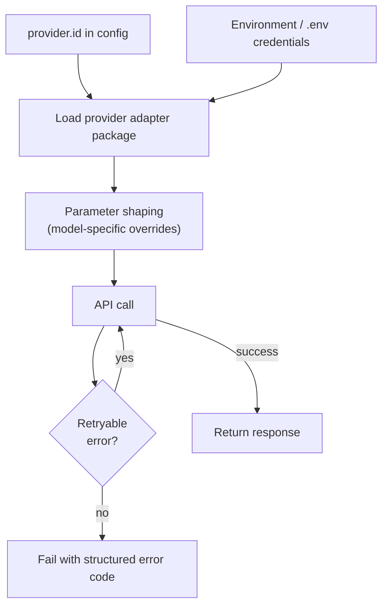

# Providers

Provider adapters are optional peer packages — the base install does not include
any provider SDK. Install only the adapter needed for your deployment, then
point `provider.id` in `.codereviewer/config.json` at it.

---

## Supported provider families

| Provider ID | Use for | Notes |
| --- | --- | --- |
| `openai` | OpenAI API | Uses standard OpenAI credentials. |
| `openai-compatible` | Compatible HTTP APIs | Requires `baseUrl`. |
| `bedrock` | AWS Bedrock | Uses AWS credential chain and region. |
| `azure` | Azure AI / OpenAI deployments | Uses Azure endpoint and key/identity. |

---

## Installing provider packages

```bash
npm run provider:install:openai
npm run provider:install:bedrock
npm run provider:install:azure
```

> **Note:** Provider secrets belong in `.env` or your CI secret store, not in
> config files. See the [environment reference](../reference/environment.md)
> for all recognized secret variable names.

---

## Config examples

### OpenAI

```json
{
  "provider": {
    "id": "openai",
    "model": "gpt-5-mini",
    "temperature": 0,
    "timeoutMs": 120000,
    "maxRetries": 2
  }
}
```

### OpenAI-compatible (custom base URL)

```json
{
  "provider": {
    "id": "openai-compatible",
    "model": "provider-model-name",
    "baseUrl": "https://example.internal/v1"
  }
}
```

---

## Provider resolution flow



---

## Reasoning effort

For OpenAI reasoning models, add `reasoningEffort` under `provider`:

```json
{
  "provider": {
    "id": "openai",
    "model": "gpt-5-mini",
    "reasoningEffort": "medium"
  }
}
```

| Value | Notes |
| --- | --- |
| `minimal` | Lowest cost and latency. |
| `low` | |
| `medium` | Recommended starting point. |
| `high` | Not recommended — higher cost and latency without improving product recall. |

Environment variable: `CODEREVIEWER_PROVIDER_REASONING_EFFORT`.

The OpenAI adapter maps this to the Responses API `reasoning: { effort }` field.
Leaving it unset uses the provider default.

> **Note:** `temperature` is automatically omitted for all `gpt-5.x` models
> (including dotted versions such as `gpt-5.4-mini`) because those models
> reject the parameter. Compatible providers keep the configured value because
> their model behavior is provider-specific.

---

## Retry behavior

Provider task calls are retried under a single classified policy:

| Failure type | Retried? | Notes |
| --- | --- | --- |
| Network errors | Yes | Transient connectivity failures. |
| HTTP 408 / 425 / 5xx | Yes | Bounded exponential backoff. |
| HTTP 429 (rate limit) | Yes | Honors `Retry-After`; fails if window exceeds `retryMaxDelayMs`. |
| Oversized context | No | Context-length errors are not retried. |
| Authentication / payment / quota | No | |
| Cancellation | No | |

Total attempts = `maxRetries + 1`. Each backoff interval is capped by
`retryMaxDelayMs`.

---

## Provider error codes

When a provider call fails, the structured error carries one of these codes in
`stderr` and in partial run artifacts:

| Code | Meaning |
| --- | --- |
| `provider_rate_limited` | HTTP 429 or overloaded / rate-limit / too-many-requests message. |
| `provider_auth` | HTTP 401 / 403 or API-key / unauthorized / forbidden message. |
| `provider_context_length` | Context-length / context-window / too-many-tokens message. |
| `provider_server_error` | HTTP 5xx response. |
| `provider_error` | Any other provider-side failure not matched above. |
| `provider_timeout` | Request timed out. |
| `provider_cancelled` | Request was aborted or cancelled. |

See the [Retry behavior](#retry-behavior) section above for which codes trigger
a retry.

---

## Related docs

- [Configuration guide](configuration.md) — full config file reference.
- [Environment reference](../reference/environment.md) — all recognized
  environment variables including provider secrets.
- [Architecture](../concepts/architecture.md) — how provider calls fit into
  the review pipeline.
