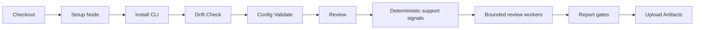

# CI/CD

How to run CodeReviewer as a pipeline gate, harden the install, and surface its reports in CI.

This page covers the recommended pipeline shape, the commands and exit codes, a hardened install policy, report formats, and a security hardening checklist.

---

## Recommended Pipeline Shape



---

## Commands

Install the published CLI, then run these steps in order in your pipeline:

```bash
npm install -g @sebastianwessel/codereviewer
codereviewer drift check
codereviewer config validate
codereviewer review --base-ref origin/main --head-ref HEAD
```

### Exit codes

- Treat exit code `1` as a merge-blocking quality gate failure.
- Treat exit code `2` or higher as setup, repository, provider, or internal
  failure that should be investigated before retrying.

---

## Example Workflow

A minimal GitHub Actions job that runs the pipeline and uploads artifacts:

```yaml
# Supersede an in-flight review when a new commit lands on the same PR, so
# rapid pushes do not stack full reviews.
concurrency:
  group: codereviewer-${{ github.ref }}
  cancel-in-progress: true

jobs:
  review:
    runs-on: ubuntu-latest
    permissions:
      contents: read
    steps:
      - uses: actions/checkout@v4
        with:
          # Required: the review resolves the merge base of the base and head
          # refs. A shallow checkout that excludes the divergence point fails
          # with `merge_base_unavailable`.
          fetch-depth: 0
      - uses: actions/setup-node@v4
        with:
          node-version: 24.15.0
      - run: npm install -g @sebastianwessel/codereviewer
      - run: codereviewer drift check
      - run: codereviewer config validate
      - run: codereviewer review --base-ref origin/main --head-ref HEAD
        env:
          OPENAI_API_KEY: ${{ secrets.OPENAI_API_KEY }}
      - uses: actions/upload-artifact@v4
        if: always()
        with:
          name: codereviewer-runs
          path: .codereviewer/runs/**
```

---

## Controlling Cost On Repeated Pushes

A review costs roughly one provider call per review task plus one per candidate,
so re-reviewing an unchanged file on every push is the main source of avoidable
spend. In order of effort:

| Lever | Effect | Cost |
| --- | --- | --- |
| `concurrency.cancel-in-progress` | Supersedes superseded runs instead of stacking them. | None. |
| `paths-ignore` for docs/lockfile-only pushes | Skips the run entirely. | None. |
| `review.depth: fast` on intermediate pushes, `thorough` on the merge gate | One task per file instead of dependency clusters. | Lower recall on intermediate runs — keep those non-blocking. |
| Baseline suppression with `failOnNewOnly` | Gate reacts only to findings introduced since the baseline. | Requires generating and committing the baseline. |

> **Note:** Narrowing `--base-ref` to the previously reviewed commit is **not**
> recommended. A defect anywhere in a changed file is in scope, so a file
> touched by an earlier push would drop out of review entirely, and the report
> would describe one push rather than the change under review.

### Baseline suppression in CI

Generate the baseline once from a review of the base branch, commit it, and let
the gate fail only on findings that are new relative to it:

```bash
codereviewer review --base-ref origin/main~1 --head-ref origin/main
codereviewer baseline write
```

With `baseline.enabled` and `qualityGate.failOnNewOnly` set, pre-existing
findings stay in the report but stop blocking merges. Fingerprints are anchored
on source text rather than line numbers, so a finding keeps its baseline
identity when unrelated edits shift it within a file.

---

## Hardened Install Policy

Installing the package can execute dependency lifecycle scripts. In highly
controlled CI, prefer the hardened path below and allow scripts only for
reviewed packages that need native post-install setup:

```bash
npm install -g @sebastianwessel/codereviewer --ignore-scripts
npm rebuild @ast-grep/napi esbuild
```

The review command can use ast-grep-backed structural parsing locally through
`@ast-grep/napi` as part of deterministic support-signal extraction. It does
not require a separate ast-grep CLI step.

> **Warning:** If the CI runner installs with `--ignore-scripts`, rebuild
> `@ast-grep/napi` before running a review so the support-signal stage can load
> its native binding.

| Mode | Use When | Tradeoff |
| --- | --- | --- |
| `npm install -g … --ignore-scripts` | Untrusted pull requests and locked-down runners. | Some native packages may need an explicit reviewed rebuild. |
| Reviewed `npm rebuild <package>` | A dependency requires a native install step. | Keep the allowlist short and review lockfile changes. |
| Plain `npm install -g …` | Trusted release branches with protected dependency updates. | Faster setup, larger supply-chain execution surface. |

---

## Supplying Change-Intent Context

When [`contextSources`](../reference/configuration.md#contextsources) is enabled,
CodeReviewer reads a short intent brief before the review. The tool integrates no
issue trackers or platform APIs; instead, a pipeline step writes context into the
inbox directory (`.codereviewer/context/`) before the review runs. Anything a
pipeline step can reach becomes available, and no external credential reaches
CodeReviewer.

**Pull-request description** — already available in a `pull_request` workflow as
`github.event.pull_request.*`, so no token or API call is needed. Pass it through
environment variables (never interpolate the untrusted body directly into the
shell):

```yaml
      - name: Add PR description to review context
        env:
          PR_TITLE: ${{ github.event.pull_request.title }}
          PR_BODY: ${{ github.event.pull_request.body }}
        run: |
          mkdir -p .codereviewer/context
          { echo "---"; echo "source: github-pr"; echo "title: ${PR_TITLE}";
            echo "---"; echo "${PR_BODY}"; } > .codereviewer/context/pull-request.md
```

**Issue-tracker ticket** — fetched by your pipeline, so the tracker credential
stays in the pipeline and never reaches CodeReviewer:

```yaml
      - name: Fetch ticket context
        env:
          JIRA_TOKEN: ${{ secrets.JIRA_TOKEN }}
        run: |
          mkdir -p .codereviewer/context
          ./scripts/fetch-jira.sh "$TICKET_ID" > .codereviewer/context/ticket.md
      - run: codereviewer review --base-ref origin/main --head-ref HEAD
```

The gathered context is redacted and cannot change findings, severity, or gates.

> **Note:** A dedicated `platform` provider that reads PR metadata directly
> (event payload or API) is a later phase. Until then the inbox covers the same
> need with no additional configuration.

---

## Report Formats In CI

Add `"github-review-comments"` to `reporting.formats` to generate inline PR comment
drafts (`github-review-comments.json`) alongside JSON, Markdown, and SARIF. The file
contains path, line, body, severity, category, and an optional `suggestion` block for
findings whose line range was validated during admission and overlaps a changed new-side
diff hunk.

> **Note:** The CLI does not publish comments; upload the artifact for
> downstream tooling.

---

## CI Guidance

| Area | Recommendation |
| --- | --- |
| Secrets | Use CI secret storage; do not print provider keys. |
| Dependencies | Pin the CLI version for reproducible installs. |
| Artifacts | Upload `.codereviewer/runs/**`. |
| Caches | Cache npm packages, not `.env` or generated reports. |
| Permissions | Start with read-only repository permissions. |

---

## Hardening Checklist

| Risk | Recommendation |
| --- | --- |
| Fork pull requests | Do not expose provider secrets to untrusted fork contexts. |
| Privileged workflows | Avoid privileged target-style workflows for untrusted code review. |
| Provider network | Enable provider-backed review only in trusted branches or protected CI contexts. |
| Git safety | Do not add custom git commands around the tool; use the documented CLI only. |
| Drift | Run `drift check` before review so generated schema or security drift fails early. |
| Artifacts | Treat SARIF and Markdown as generated artifacts; upload them only to intended CI artifact stores. |
| Runners | Prefer ephemeral or cleaned runners for sensitive repositories. |

---

## See also

- [Exit codes](../reference/exit-codes.md)
- [Reports and artifacts](../guides/reports-and-artifacts.md)
- [Secrets and env](../security/secrets-and-env.md)
- [Troubleshooting](./troubleshooting.md)
