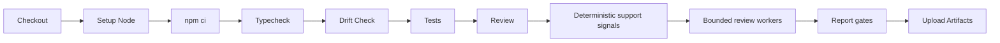

# CI/CD

## Recommended Pipeline Shape



## Commands

```bash
npm ci
npm run typecheck
npx tsx src/cli/main.ts drift check
npm test
npx tsx src/cli/main.ts config validate
npx tsx src/cli/main.ts review --base-ref origin/main --head-ref HEAD
```

Treat exit code `1` as a merge-blocking quality gate failure. Treat exit code
`2` or higher as setup, repository, provider, or internal failure that should be
investigated before retrying.

## Hardened Install Policy

`npm ci` can execute dependency lifecycle scripts. In highly controlled CI,
prefer the hardened path below and allow scripts only for reviewed packages that
need native post-install setup:

```bash
npm ci --ignore-scripts
npm rebuild @ast-grep/napi esbuild
```

The review command can use ast-grep-backed structural parsing locally through
`@ast-grep/napi` as part of deterministic support-signal extraction. It does
not require a separate ast-grep CLI step. If the CI runner installs with
`--ignore-scripts`, rebuild `@ast-grep/napi` before typecheck, tests, or review
so the support-signal stage can load its native binding.

| Mode | Use When | Tradeoff |
| --- | --- | --- |
| `npm ci --ignore-scripts` | Untrusted pull requests and locked-down runners. | Some native packages may need an explicit reviewed rebuild. |
| Reviewed `npm rebuild <package>` | A dependency requires a native install step. | Keep the allowlist short and review lockfile changes. |
| Plain `npm ci` | Trusted release branches with protected dependency updates. | Faster setup, larger supply-chain execution surface. |

## Report Formats In CI

Add `"github-review-comments"` to `reporting.formats` to generate inline PR comment
drafts (`github-review-comments.json`) alongside JSON, Markdown, and SARIF. The file
contains path, line, body, severity, category, and an optional `suggestion` block for
findings whose line range was validated during admission and overlaps a changed new-side
diff hunk. The CLI does not publish comments; upload the artifact for downstream tooling.

## CI Guidance

| Area | Recommendation |
| --- | --- |
| Secrets | Use CI secret storage; do not print provider keys. |
| Dependencies | Use `npm ci` for reproducible installs. |
| Artifacts | Upload `.codereviewer/runs/**` and `.codereviewer/eval/**`. |
| Caches | Cache npm packages, not `.env` or generated reports. |
| Permissions | Start with read-only repository permissions. |

## Hardening Checklist

| Risk | Recommendation |
| --- | --- |
| Fork pull requests | Do not expose provider secrets to untrusted fork contexts. |
| Privileged workflows | Avoid privileged target-style workflows for untrusted code review. |
| Provider network | Enable provider-backed review only in trusted branches or protected CI contexts. |
| Git safety | Do not add custom git commands around the tool; use the documented CLI only. |
| Drift | Run `drift check` before review so generated schema or security drift fails early. |
| Artifacts | Treat SARIF and Markdown as generated artifacts; upload them only to intended CI artifact stores. |
| Runners | Prefer ephemeral or cleaned runners for sensitive repositories. |
