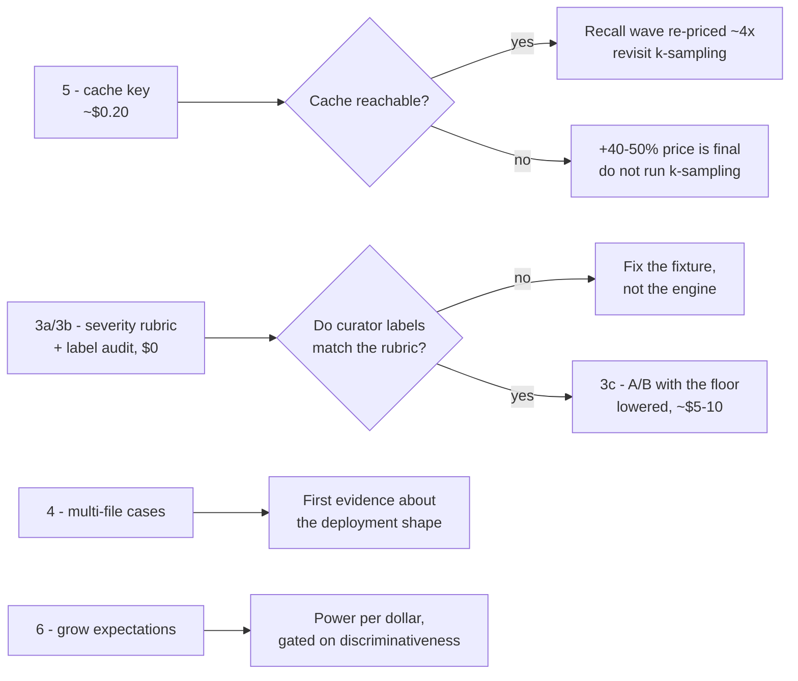
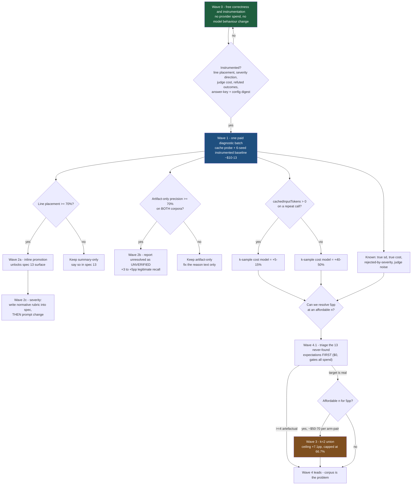

# Accuracy, recall and measurement — improvement plan

**2026-07-26 · planning only, no code changed · companion to
[`2026-07-26-full-codebase-review.md`](2026-07-26-full-codebase-review.md)**

Produced by six parallel investigations (multi-defect discovery, external research,
refutation/precision, severity and finding quality, measurement power, cost) each
adversarially critiqued, then synthesised and audited for completeness. Claims were
checked against the repository and the archived evaluation artifacts, not reasoned from
comments. Where a claim survived first-hand verification it is marked; where it did not,
the corrected value is normative for the rest of this document.

---

## Executive summary

1. **A load-bearing number published in two approved specs, the docs and the project
   memory is wrong — it was mine.** The corpus is **19 single-expectation cases, 10
   double, 1 triple = 30 cases / 42 expectations**. The previously published split
   ("one expected defect 16 of 24; two 7 of 18") used denominators that cannot exist:
   they came from a stale nine-case list left over from the hydration bug, not from the
   manifest. Verified first-hand. The qualitative conclusion survives; the arithmetic
   does not. Correcting `specs/05`, `specs/17`, `docs/05-quality/current-results.md`,
   `docs/03-concepts/optional-capabilities/extra-discovery-passes.md` and the memory
   notes is item 0.1 and should happen before anything else.

2. **The corrected shape is sharper and more useful.** Recall decomposes cleanly by
   expectation rank, and the decomposition cross-checks exactly to the headline:

   | Class | Per-run recall | Union over 13 archived runs |
   | --- | ---: | ---: |
   | Primary expectation (first listed, 30 of 42) | **71.1%** (64/90 instances) | 86.7% (26/30) |
   | Non-primary (12 of 42) | **13.9%** (5/36) | 25.0% (3/12) |
   | Combined | **54.8%** (69/126) ✓ matches headline | 69.0% (29/42) |

   **No non-primary expectation is high-severity** — all 14 highs in the corpus are
   primary. Every one of the 7 non-primary `medium` expectations was missed in all three
   baseline seeds.

3. **The union ceiling is 66.7%** across three baseline seeds (69.0% over all 13 archived
   runs, saturating). Every sampling-based lever — k-sampling, self-consistency, more
   seeds — is bounded by it. The honest headroom sampling can recover is **+5 to +10pp**,
   and **26 of the 28 findings in that union are primary**, so it is not a fix for the
   multi-defect gap.

4. **Measurement power is worse than published and the fix is free.** The ±5.5pp figure
   used until now is an eyeball band at roughly 50% power; the true 80%-power minimum
   detectable effect at n=3 is **10–16pp**. A finding-level paired test, computable from
   data already in every report, roughly doubles power at zero provider cost. Adding
   *cases* to the corpus buys nothing per dollar; adding *expectations to existing cases*
   does.

5. **An entire product surface has never fired.** `inlineFindingCount` is 0 across ~168
   admitted findings, because discovery stamps `side: 'file'` while inline eligibility
   requires `'new'`. Independently found by two investigators and consistent with P0-2 of
   the codebase review.

6. **Three metrics are actively misleading.** `lineAccuracy` returns **1.0** on an empty
   denominator in `report.json` (verified at `metrics.ts:573-577`) even though the
   markdown now renders `n/a`; `refutationFalsePositiveCount` is numerically identical to
   `unlistedRealFindingCount` (verified 7 = 7 in `base-3`) — it counts the genuine defects
   that `adjustedPrecision` exists to exonerate; and an archived run still displaying
   **78.8% recall** was scored against the stale 33-expectation key.

7. **Do the free work first.** Nothing about recall should be attempted before the
   instrumentation lands. Two of the recall experiments already run were graded against
   numbers that turned out to be wrong.

### Immediate action item outside the plan

`.codereviewer/eval/.env.codex` contains `OPENAI_API_KEY`, `AWS_ACCESS_KEY_ID`,
`AWS_SECRET_ACCESS_KEY` and `AZURE_AI_API_KEY` in plaintext. Verified: the file is
gitignored and has **never been committed**, so it has not leaked through git. I did not
read the values. If those credentials are live, **rotate them** — a plaintext key file is
printed by any command that dumps configuration. This is an owned decision for you, not
something to leave as an observation.

---

## Next wave (items 3-6) — plan

Written after the post-fix baseline. Recall is capped near the verified 66.7% union
ceiling and the cheap routes there are closed, so this wave deliberately spends on
things that are not recall.

### 5 first — `prompt_cache_key` (~$0.20, S)

Cheapest and highest-leverage, so it goes first even though it is numbered last.
The probe proved caching is unreachable; the adapter sends neither
`prompt_cache_key` nor `store`, and that key is how a request reaches a machine
holding the cache.

**Blocker found while planning:** `@purista/harness-openai` exposes no passthrough
for extra request parameters, so this is not a config change. Either the harness
gains a passthrough (upstream change, or a local adapter wrapper) or this stays
closed.

- **Do:** confirm the passthrough gap, then either add one or wrap the adapter.
  Re-run the two-identical-runs probe.
- **Falsified if:** `cachedInputTokens` is still 0 with a stable key set. Then
  caching is genuinely unavailable and the +40-50% k-sampling price is final.
- **Worth it because:** a hit re-prices every future recall experiment by ~4x and
  cuts steady-state cost on an input-dominated workload.

### 3 — severity, in the only defensible order (~$5-10, S then M)

Severity accuracy is 39-46% and is the weakest metric. It is also the one most
likely to be measuring the wrong thing.

**No spec defines severity.** The rubric exists only in the discovery prompt, so
`severityAccuracy` currently scores agreement with an undocumented curator label.
Changing the prompt before defining the target would be tuning toward a label
nobody has justified.

- **3a. Write a normative rubric into a spec** (impact x reachability), human
  approved. $0.
- **3b. Audit the corpus labels against it** before touching the engine. If curator
  labels disagree with the rubric, the metric was measuring label noise and the fix
  is the fixture. $0.
- **3c. Only then A/B a prompt change.**

**The trap, now quantified.** Six of the 42 expectations are `low`, and the
actionable floor is `medium`. The admission gate reads the MODEL's severity, so a
`low` expectation only matches today when the model over-rates it — which is
exactly what happens (one such expectation matched 12/12 runs). **Correctly
calibrating severity downward would therefore lose up to 6/42 = 14.3pp of recall**,
and a naive reading would call that a regression. Any severity A/B must either
lower the floor to `low` for the measurement or tally below-threshold rejections
separately.

- **Expected:** inconclusive is the single most likely outcome at this resolution.
  Say so in advance rather than after.

### 4 — multi-file cases (curation, $0 provider, M-L)

**29 of 30 cases change exactly one file.** Task clustering, context packing,
budget behaviour on wide diffs, and cross-file dilution are all structurally
invisible to every number this project has published. Real pull requests are not
single-file.

- **Do:** curate cases whose upstream fix touches several files, under the same
  spec 17 anti-contamination rules. Do not require the defect to be cross-file —
  a realistic multi-file PR containing one defect already exercises packing and
  budget.
- **Value:** this is the only item that can reveal a problem nobody suspects. It is
  also the most likely to make the engine look worse, which is the point.
- **Falsified if:** multi-file cases score within noise of single-file ones, in
  which case the single-file corpus was representative after all and that is worth
  knowing.

### 6 — grow expectations per existing case (curation, $0 provider, L)

The only corpus lever that improves statistical power per dollar: minimum
detectable effect scales as 1/sqrt(cases x findings) while cost scales with cases,
so adding findings to the 30 checkouts already hydrated is strictly better than
adding cases.

- **Do:** target ~3 expectations per case, drawn from upstream history and human
  review. **Never from engine output** — that converges "recall" toward "similarity
  to the 2026-07 engine".
- **Gate on discriminative power, not on variance:** the fraction of added findings
  with 0 < p < 1 across three runs should be >= 0.3. Adding near-dead findings
  lowers the observed deviation while buying nothing, so deviation is not a valid
  success proxy.
- **Pilot 5 cases first** and abandon if the added findings cluster at p ~ 0 the way
  the existing non-primary ones do.

### Sequencing

3a, 4 and 6 are all zero-provider-cost and can proceed in parallel with 5. Nothing
here depends on k-sampling, which remains declined on the evidence.

---

## Wave 1.1 cache probe — RUN, and it re-prices the recall wave

Executed 2026-07-26 for about $0.36. Two identical single-case runs, back to back,
`gpt-5.3-codex` on the Responses API: **0 cached input tokens on both**, against
67,632 and 67,493 input tokens.

The telemetry was checked before concluding, because "the metric is broken" and
"caching is off" look identical from the outside. The harness does read
`usage.input_tokens_details.cached_tokens`, and the usage recorder does sum it.
The provider reported zero.

**Caching is not reachable from this stack as configured.** The diagnosis is not
finished — the adapter sends neither `prompt_cache_key` nor `store`, and OpenAI
uses that key to route a request to a machine holding the cache, so that is the
first thing to try if this is ever revisited. Organisation-level disablement and
`json_schema` participating in prefix identity are not ruled out.

**What this settles.** Wave 3.1 was priced at +5-15% if caching worked and
+40-50% if not. It is **+40-50%, permanently, per review**. Set against the
verified union ceiling of 66.7% — of which almost nothing is the multi-defect
class — the honest question is no longer "does k-sampling work" but "is up to
+5-10pp recall worth a permanent ~45% cost increase". That question can be
answered before spending the $50-70 the experiment itself costs, and the answer
may be no.

**An unplanned second result.** Judge spend is much larger than the 10-30% this
plan assumed, at least on small runs: scoring cost $0.0785 against a review cost
of $0.1291 on the first run (61%) and $0.0523 against $0.1283 on the second
(41%). Judge cost scales with findings rather than file size, so the share falls
on larger corpora — but every per-case cost figure published before today
understated the true total by more than anyone thought.

---

## Status against HEAD — updated after execution

Audited against the code rather than from memory. **Wave 0 is substantially done and
the gating Wave 4.1 triage is complete.**

| Item | State |
| --- | --- |
| 0.1 correct the multi-defect statistics | done — and the error was in two approved specs, the docs and the memory notes |
| 0.2 answer-key + config digest | partial — `metricsVersion` ships and comparison refuses to diff across it; the corpus/config digest is in flight |
| 0.3 line placement + severity/locality cross-tab | in flight |
| 0.4 rejections by reason and severity | partial — by reason ships; by severity in flight |
| 0.5 redefine the refutation metrics | done |
| 0.6 finding-level significance test | done, and validated on the 12 archived runs: an A/A control is correctly non-significant, and the paired statistic resolves at ±5.6pp where the run-mean test needs 10–16pp |
| 0.7 refutation output-validation retry | done — retries only harness-level output-validation failures, never the hard provider errors that already have their own backoff |
| 0.8 populate `refutationId` | done |
| 0.9 judge cost accounting | done — true run cost is review plus scoring, roughly 10–30% above the old review-only figure |
| 0.10 wire the gate to config, unfreeze timestamps | done — the default profile gates only on mechanical signals, because a recall threshold against a 4.8pp deviation would flake rather than inform |
| 0.11 resolve the eval-script drift | done — `eval:corpus` and `eval:corpus:hydrate` are committed, and spec 06 no longer mandates scripts a test simultaneously forbids |
| 0.12 delete the discarded discovery `fixSummary` | done |
| 0.13 delete the fixture-derived refuter clauses | done — plus one the audit missed, copied verbatim from a fixture answer key |
| 4.1 triage the 13 never-found expectations | done — all 13 genuine, zero artefacts, and the admission-floor hypothesis disproven |

**What that changes about the plan.** The severity-floor sweep (audit item A-21) is
cancelled: the triage disproved its premise directly. Wave 2.1 (inline comments)
remains gated on 0.3, which is the last free item before it. Waves 1–3 are unchanged
and still need provider spend, and the discipline that gates them still holds — the
instrument had to become trustworthy first, and most of that work is now done.

One thing the execution surfaced that the plan did not anticipate: the primary
baseline was not reproducible from the repository at all. There was no committed
script for the real-repository corpus, so the headline 54.8% existed only because
someone typed the flags by hand.

---

## Triage of the 13 never-found expectations — COMPLETE, and it changes the plan

Executed 2026-07-26, zero provider spend. This was the gating item.

**All 13 are GENUINE, reachable defects. Zero artefacts, zero corpus bugs, zero
floor-suppressed.** The recall target exists in full; no planned experiment is
chasing phantoms.

**The admission-floor hypothesis (audit item A-11) is DISPROVEN, with direct
evidence.** The gate reads the *model-assigned* severity, not the expectation's, and
the matcher never gates on severity agreement. Decisive counter-example in the same
corpus: `rack-static-header-rules-match-encoded-path#2` is `severity: low` and was
matched in **12 of 12 runs**. Across all 12 runs the 152 non-matched admitted
findings are 118 high / 34 medium / **0 low** — the engine does not emit
low-severity findings on this corpus at all. **Lowering `actionableSeverityThreshold`
is not warranted and would only add noise.** The severity-floor sweep proposed as a
cheap win (A-21) is cancelled.

**The cause is finding count per case, now measured precisely: 0.97 findings per
case across 360 case-runs, with only 13.1% of case-runs producing two or more.** For
nine of the 13, expectation `#0` was matched in ~10.4 of 12 runs and consumed the
single finding. Where a second finding did appear it was usually a restatement of
the first. Any experiment aimed at these nine must raise findings-per-file; nothing
aimed at discovery depth or the severity gate will move them.

Three findings that are actionable and were not in any proposal:

- **A reverse-diff decoy costs both precision and recall, systematically.** The
  upstream fix for `aspnetcore-url-normalizer` added the backslash handling *and* a
  null guard. Read backwards, the generated diff presents the pre-fix code as
  *someone deleting a null guard*, and in **12 of 12 runs** the engine spent its
  single finding there. Any upstream fix that hardens something incidental produces
  the same decoy. Two provider-free remedies: add the null-deref as a second
  expectation, or restrict the generated diff to the hunk carrying the labelled
  defect. This is a corpus-generation defect, not a reviewer defect.
- **One of the 13 is a depth miss, not a discovery miss.** For
  `ws-close-frame-leaks-uninitialised-buffer-bytes`, in 10 of 12 runs the engine
  landed on the exact lines but stopped at the shallow consequence (wrong error
  type) instead of following the byteLength-versus-set mismatch to uninitialised
  memory. This is the only one of the 13 that prompt work could plausibly move.
- **Persist rejected findings in the eval report.** The archives do not serialise
  them, so "was a low-severity candidate dropped at the gate?" cannot be answered
  from any archived run. Free to fix, and it closes the question permanently.

Deterministic-signal coverage is a red herring here: C#, Kotlin and PHP are unparsed,
but the signal layer emits structural facts that would not have surfaced any of these
defects, and Ruby — which *does* have signals — missed its case anyway.

---

## Evidence gathered outside the investigations

Three findings computed directly from the archived runs and the manifest, which the
investigators did not have:

- **Findings-per-case is a point mass at 1.** Across 30 real-world cases: 24 produce
  exactly one finding, 3–4 produce two, **none produce three or more**. A human reviewer
  across 30 real pull requests would not produce that distribution.
- **The diverse-lens pass did move that distribution — it simply missed the key.** Cases
  producing two findings went 4 → 8; unlisted-real findings went 5–7 → 9; adjusted
  precision stayed at 100%. Reading its result as "the lens did nothing" is wrong: it
  produced *more genuine defects*, just not the curated ones. That materially changes what
  its failure implies about the ceiling.
- **The semantic matcher is greedy and can strand the second expectation.**
  `eval-matcher.ts` `runJudgePass` walks expectations in order and the first
  judge-accepted finding claims one permanently. With two expectations and two findings, a
  loose accept for `expected[0]` can strand `expected[1]`. Impact on today's numbers is
  probably small — most cases emit only one finding, so there is nothing to mis-assign —
  but it **confounds precisely the multi-defect measurement the whole thesis rests on**.
  Matches P1-6 of the codebase review; optimal bipartite matching removes the confound.

---

## Binding corrections to the plan below

The plan that follows was produced by synthesis and then audited. Where the audit
(Appendix A) conflicts with the plan body, **the audit wins**. The load-bearing ones:

- **Wave 0 is not entirely free** (A-8). Items 0.12 and 0.13 change model-visible
  behaviour and their falsifiers are stated in recall, so they need paid seeded runs.
  Split Wave 0 into truly-free instrumentation and behaviour-changing items.
- **The Wave 1 baseline is confounded before it runs** (A-9). Items 0.7, 0.12 and 0.13
  all land before it. Run the baseline on the unchanged configuration, or declare a new
  baseline epoch via the config digest.
- **The never-found triage omits the most likely artefact class** (A-11). Three of the
  nine never-found non-primary expectations are `low` severity, and the admission gate
  rejects model-origin candidates below the `medium` floor — so they are unreachable by
  construction, not undiscovered. Part of the "ceiling" may be a config artefact. A
  severity-floor sweep (A-21) is higher information per dollar than the prompt probe.
- **Nothing measures false alarms on clean code** (A-1, A-2). All 30 cases carry a known
  defect and `expectedNoFindingZones: []`, so the loudest real-user complaint — crying
  wolf on a refactor-only PR — is structurally unmeasured while the metric sits wired and
  pinned at zero.
- **Set a willingness-to-pay rule before spending** (A-17). Decide what recall gain
  justifies what permanent per-PR cost *first*; +45% cost for +3pp is probably a reject
  even if real, which would save the experiment entirely.
- **Run arms on the labile slice** (A-19). By the plan's own partition, 25 of 42
  expectations carry zero discriminative signal; screening on the ~17 labile findings
  roughly halves per-arm cost at near-unchanged power.

---

## Synthesis: the plan

1. **The headline number describing the central open problem is wrong in two normative specs and in the task brief.** `specs/05:321` and `specs/17:117` state "cases holding one expected defect score 16 of 24 … two score 7 of 18". The committed corpus is **19 single-expectation + 10 double + 1 triple = 30 cases / 42 expectations**; those denominators cannot exist. Verified first-hand.
2. **The real shape is sharper and worse.** Across all 13 archived 30-case runs (3+ prompt configurations), the engine has found **26 of 30 primary expectations (86.7%) but only 3 of 12 non-primary expectations (25%)**. Nine non-primary expectations have never been produced by any run, ever.
3. **The union ceiling is 66.7%** (3 baseline seeds; 69.0% over all 13 runs, saturating). Any sampling-based lever — self-consistency, extra seeds, k-sampling — is bounded by that. Per-run recall is 54.8%; the honest gap sampling can close is **+5 to +10pp, and no more**.
4. **Measurement power is worse than assumed and the fix is free.** ±5.5pp is an eyeball band at ~50% power; true MDE80 at n=3 is 10–16pp. A finding-level test on data already in every report roughly doubles power at n=3–6 at zero provider cost. Growing the corpus by adding *cases* buys nothing per dollar.
5. **An entire product surface has never fired.** `inlineFindingCount` is 0 across ~168 admitted findings in two corpora, because discovery hard-codes `side: 'file'` and inline eligibility requires `'new'`. Two investigators found this independently. Spec 06 already mandates a diff-anchor eval that is unsatisfiable today.
6. **Three metrics are actively lying**: `lineAccuracy` renders 1.0 on an empty denominator; `refutationFalsePositiveCount` (8) is numerically identical to `unlistedRealFindingCount` (8) — it counts the genuine defects `adjustedPrecision` exists to exonerate; and an archived run reporting **78.8% recall was scored against a stale 33-expectation key** (26/42 = 61.9% against the committed key) and is still sitting in the archive looking like the best result ever.
7. **Do the free work first.** Wave 0 is ~11 deterministic changes with zero provider spend. Wave 1 is one instrumented 6-seed baseline (~$10). Nothing about recall should be attempted before those land — most of the recall proposals cannot be adjudicated by the current instrument, and two of them were graded on numbers that turned out to be wrong.

---

## 1. Verified corrections to the shared premises

Everything in this table I checked against the repository and the archived artifacts myself. Where a claim survived, I say so; where it did not, the corrected value is normative for the rest of this plan.

| Premise as stated in the brief / specs | Verified status | Correct value |
|---|---|---|
| "one expected defect: 16/24 (66.7%); two: 7/18 (38.9%)" | **False** — impossible denominators | Corpus is 19 single / 10 double / 1 triple. Baseline seeds score **13/19, 11/19, 15/19** on single-expectation cases and **9/20** on double-expectation cases in all three seeds |
| "in 7 of 9 the engine found exactly one, never both" | **Directionally right, numerically wrong** | Over 3 baseline seeds × 10 double cases = 30 case-runs: **exactly one in 23, both in 2, neither in 5** |
| Baseline recall 54.8% mean (50.0 / 54.8 / 59.5) | **Confirmed** | 23 / 21 / 25 of 42 |
| Resolution ≈ ±5.5pp | **Misleading** | ±5.5pp ≈ 2× one run's sd — an eyeball threshold at ~50% power. **MDE80 at n=3 is 9.6–11.2pp** (finding-level) or 14–16pp (the run-mean t-test actually in use) |
| Prompt cache 0% is a big untouched cost lever | **Partly false** | The shared system message (~1.2–1.35k tokens) already clears OpenAI's 1024-token floor and precedes every call, yet `cachedInputTokens` is 0 in **every** archived report. The cause is *not* prefix length. Within-run caching caps at ~13% of input; the diagnosis is unknown and worth $0.10 to settle |
| Input dominates output 23:1 | **Understated for this corpus** | 36:1 on the 30-case corpus (853,445 / 23,649), 80:1 on the 59-case corpus |
| Cost ~$1.22 per 30-case run | **Floor, not total** | Judge spend is billed to an unwrapped model alias and counted nowhere. True cost is unknown; est. +10–20% on this corpus, +20–30% on the 59-case one |
| "Discovery reports roughly one defect per file" | **Confirmed, and it is a property of the call** | 1.59–2.17 candidates per discovery call regardless of files carried; 0.31 per changed file |

**Two hypotheses that the corpus cannot separate.** The multi-defect investigator's "out-of-hunk expectations are 0/91", the external-research investigator's "9 of 10 missed secondaries sit in a different top-level declaration a median of 11 lines away", and the plain "second defect" framing are three descriptions of largely **the same ≤12 expectations**. All 7 out-of-hunk expectations are non-primary. No experiment on this corpus can credit a gain to one mechanism rather than another. Any plan that claims otherwise is over-reading.

---

## 2. The ceiling, stated honestly

This is the part a maintainer should read twice.

**Per-expectation detection over 13 archived 30-case runs (all configurations):**

| Class | Count | Found by ≥1 run | Never found |
|---|---|---|---|
| Primary expectation (`expectedIndex 0`) | 30 | 26 (86.7%) | 4 |
| Non-primary (`expectedIndex ≥ 1`) | 12 | 3 (25.0%) | 9 |
| **Total** | **42** | **29 (69.0%)** | **13** |

**Stability partition (13 runs):** 12 always found · 17 labile · 13 never found. **Only 17 of 42 findings carry any discriminative signal at all.**

**Union ceiling (3 baseline seeds):** singles 23/21/25 → pairwise unions 24/27/27 → **union(3) = 28 = 66.7%**, intersection 19. Adding the other ten archived runs moves it to 29 (69.0%). It saturates.

The 13 never-found expectations, verbatim from the archive:

- **Non-primary (9):** `authlib-oidc-scope#1`, `authlib-oidc-token-hash#1`, `axum-multipart#1`, `casbin-conditional-role#1`, `fastify-decorator#1`, `gin-context-copy#1`, `golang-jwt-zero-exp#1`, `slim-html-error#1`, `werkzeug-if-range#1`
- **Primary (4), all security-tier:** `aspnetcore-url-normalizer#0` (C#), `ktor-rate-limit-phase#0` (Kotlin), `rack-static-header-rules#0` (Ruby), `ws-close-frame-leaks#0` (JavaScript)

**What this means.**

- Sampling-based levers (k-sample union, more seeds, self-consistency) can close the gap between per-run recall (54.8%) and the union (66.7%). That is **+5 to +10pp and it is capped**. It is a real win and it is not a solution to the multi-defect problem: of the 28 findings in the baseline union, **26 are primary**.
- Getting above ~67% requires generating findings that 13 runs across at least three prompt configurations have never produced once. Prompt reframing has been tried twice (sweep, lens) and failed; retrieval has been tried twice (agentic cross-file, context scout) and failed.
- **Recall on primary defects may genuinely be near the ceiling for this architecture** — 86.7% union, ~73% per run, with the residual 4 concentrated in security-tier defects in two languages the deterministic layer does not parse. The remaining headroom is almost entirely the non-primary class, and that class has resisted every intervention so far.
- Before spending on any of it: **triage the 13.** If four or more are artefactual, the target partly does not exist and every recall figure on this corpus needs an asterisk. I have handed you the exact list; the triage is free and it gates everything downstream.

---

## 3. Sequencing

**The one hard sequencing rule:** no recall experiment starts until Wave 0 and Wave 1 are done. Two of the six investigations produced proposals graded against numbers that turned out to be wrong, and the archive currently contains a run advertising 78.8% recall that was scored against a stale key. The instrument is not trustworthy enough to adjudicate a 5pp claim today.

---

## Wave 0 — Correctness and instrumentation

> **Corrected per audit A-8:** this wave is *not* entirely free. Items 0.12 and 0.13
> change model-visible behaviour and their falsifiers are stated in recall, so they
> require paid seeded runs (~$4–8). Split it: 0.1–0.11 are genuinely $0; 0.12–0.13 are
> behaviour changes that belong with Wave 1's measurement, not before it.

**Entry:** now. **Exit:** the next paid run emits line placement, produced severity and location per match, rejection reasons by severity, judge spend, refuted/needs-more-evidence outcomes, an answer-key digest and a config digest — and the eval exit code means something.
**Provider cost: $0 for items 0.1–0.11.** Items 0.12–0.13 are behaviour changes and are
not free — see the correction above.

| # | Change | Expected effect (uncertainty) | Cost | Effort | Falsified if | Spec |
|---|---|---|---|---|---|---|
| 0.1 | **Correct the multi-defect statistics** in `specs/05:321` and `specs/17:117`; replace with the verified 19/10/1 partition and per-seed splits (13/19, 9/20) | None on behaviour; removes a wrong load-bearing number from two normative specs | $0 | S | n/a — verified | 05, 17 |
| 0.2 | **Answer-key digest + config digest** in every report; `compare`/`recall-report`/significance refuse to diff across differing digests | Eliminates a *proven* class of void measurement (an archived run still reports 78.8% against a 33-key) | $0 | M | Mutated-key fixture fails to produce a differing digest | 06 |
| 0.3 | **Record produced severity, path, startLine on every match**; add `linePlacementRate` as a diagnostic over every expectation carrying a `lineRange`, gating nothing; add a locality × ordinal cross-tab | First line-placement number ever; gates 2.1. Currently `lineOverlaps:false` is printed on 100% of matches, which is worse than absent | $0 | S | Reproduction disagrees with the archived 298/455 in-hunk figure | 06 |
| 0.4 | **Tally rejected findings by reason *and* severity** | Without it, "severity is over-called" is confounded by the `medium` admission floor deleting every model-origin `low` before anyone sees it | $0 | S | Histogram is all-zero outside `refuted` *and* line placement >90% → both quality concerns are non-problems | 06 |
| 0.5 | **Redefine the two refutation metrics.** `refutationFalsePositiveCount` = 8 is numerically identical to `unlistedRealFindingCount` = 8; `refutationFalseNegativeCount` counts unrelated rejections | Removes two metrics that measure the opposite of their names | $0 | S | n/a — verified numerically | 06 |
| 0.6 | **Finding-level significance test** (`eval significance`, repeatable `--base`/`--head`), reporting δ, 95% CI, z-test and a per-finding transition table; loud MDE warning when handed one report per side | ~1.6–2× power at n=3–6 (independently reproduced by the critic); converges to 1.0 by n≈16 | $0 | M | Paid A/A at n=6 rejects the null materially above 5% | 06 |
| 0.7 | **Refutation retry on output-validation failure** — today one `catch` maps every candidate in a batch to `provider-error` → `needs-more-evidence` → excluded from recall, with no retry. 16 events / 9 cases across 12 runs; `starlette` fails in 6 of 11 | +0.9 to +1.5pp recall (critic's revision) **and** a predicted sd reduction — this is ~2.4pp of binary per-run swing firing in more than half of runs | +1–2% run cost | S | Retries fail at the same rate (failure is deterministic per packet) | 05 |
| 0.8 | **Populate `refutationId`** — it has exactly one reader (`markdown-reporter.ts:129`) and **no writer**, so every "Unresolved — Needs Human Decision" entry renders "no refutation verdict was recorded". Spec 05:668 requires the verdict and rationale | Zero metric movement; the section becomes usable for the first time. Existing test asserts only the `- Why unresolved:` label, which is why this shipped | $0 | S | n/a — verified spec violation | 05 |
| 0.9 | **Judge cost accounting** — wrap the CLI's judge `modelAlias` in the usage recorder and report `scoringCostUsd` separately | Every cost figure in this repo is currently a floor. Est. +10–20% on the 30-case corpus, +20–30% on the 59-case one | $0 | S | Reported judge tokens come back zero → recorder is not on the path | 06 |
| 0.10 | **Wire the regression gate to config; unfreeze `generatedAt`.** Thresholds are hard-coded `minRecall: 1, maxFalsePositiveCount: 0`; `generatedAt` is the literal `'2026-06-20T00:00:02.000Z'` in all 13 archived reports | `eval run` gains a meaningful exit code; run ordering stops depending on directory names | $0 | S | n/a — verified at `src/cli/index.ts:746-752` | 06, 04 |
| 0.11 | **Resolve the eval-script drift.** Spec 06:475-484 mandates `eval:cheap*` and `eval:benchmark:baseline`; a committed test asserts all four must *not* exist; and there is **no committed script for the real-repository corpus at all** — the headline 54.8% baseline is not reproducible from the repo | Reproducibility of the primary baseline | $0 | S | n/a — verified | 06 |
| 0.12 | **Delete the discarded discovery `fixSummary`.** The prompt asks for it, the parser accepts it, the candidate mapping drops it. The write-back path it would feed is unreachable (`FixProposalSchema` requires ≥1 evidenceId; discovery candidates have none) | ~20–40 output tokens per finding saved *(estimate)*; removes dead contract | $0 | S | 3-seed recall moves >1 sd → the clause was doing hidden reasoning work; keep it with a comment saying so | 05 |
| 0.13 | **Delete the two `Prove <class>` refuter clauses** (case/Unicode normalization, operation-specific error-message), traced to commit `f2439e1` — the dev-corpus session whose measurement is recorded as VOID. Restate the schema-syntax clause generically as an anti-hallucination guard; keep every principle clause | Compliance with the no-fixture-tuning constraint. Recall inside noise with a downward skew — **watch `needs-more-evidence` and artifact-only counts, not recall** | $0 | S | Adjusted precision <95.8% or genuine FPs >1/run | 05 |

**Explicitly narrowed from the original proposals:**
- The per-stage token attribution in PR-P2(3) is **deferred** — one wrapped `ModelAlias` is shared by all agents, so it needs per-stage recorders or an AsyncLocalStorage context. Not small, not needed yet.
- MP-5's offline re-score is **deferred**: archives persist no finding descriptions, so **no archived run can be re-scored at any price**. Persistence must land first and only helps runs recorded after it. This also blocks MP-3's "free" re-score plan.
- MP-2's run bank is **dropped**; only its config digest survives (folded into 0.2). A 2-run drift check against a 48-run bank resolves ~8pp — coarser than the 3pp it is sold to enable, with a silent directional-bias failure mode.

---

## Wave 1 — One instrumented diagnostic batch

**Entry:** Wave 0 landed. **Exit:** the six unknowns below have numbers. **Total: ~$10–13 provider spend.**

| # | Run | Answers | Cost | Falsified if |
|---|---|---|---|---|
| 1.1 | **Cache probe**: issue one discovery agent twice with byte-identical input; log raw usage | Whether prompt caching is reachable **at all** from this stack. The ~1.2–1.35k-token system message already clears the 1024 floor and precedes every call, yet cached tokens are 0 — so the cause is not prefix length. This is the single cheapest open question in the project | ~$0.10 | `cachedInputTokens` still 0 on the identical repeat → caching is unreachable; **CE-2 dies and k-sampling costs +40–50%, not +5–15%** |
| 1.2 | **6-seed instrumented baseline** on the 30-case corpus, with 0.7 (retry) landed | True sd; line placement; severity confusion matrix **including rejected-by-severity**; refuted and needs-more-evidence candidate outcomes judged; `scoringCostUsd`; per-finding matrix | ~$8–11 + judge | Line placement <70% → **2.1 does not ship**. Artifact-only adjusted precision <70% → **2.2 does not ship** |
| 1.3 | **Judge-stability probe** on 3 of those runs (re-judge each run's pairs 3×) | How much of the observed sd is the *matcher* rather than the reviewer. The semantic judge is **not** temperature-pinned on gpt-5.x (`provider-resolution.ts:178` excludes gpt-5.x from temperature defaults), so this is a live hypothesis | ~$0.05–0.10/run | Pairwise disagreement <1% → judge noise negligible, all variance belongs to the reviewer |

> If 1.3 comes back above ~20%, **majority-vote judging is a bigger power win than any corpus change, for cents** — and no number of extra review seeds would ever have found that.

---

## Wave 2 — Actionability (deterministic; does not need statistical power)

**Entry:** Wave 1 gates passed. These are the highest-value changes per dollar in the whole plan because they are deterministic, cost no tokens, and unlock a product surface rather than chasing a 3pp recall delta the corpus cannot see.

| # | Change | Expected effect (uncertainty) | Cost | Effort | Falsified if | Spec |
|---|---|---|---|---|---|---|
| 2.1 | **Make inline comments possible.** `holistic-task-review.ts:394` hard-codes `side: 'file'`; `admission-gate.ts:295` requires `'new'`; `review-comments.ts:105` drops the rest. `inlineFindingCount` = 0 across both corpora. Implement as **one admission-side predicate** (does a whole-file location whose startLine falls in a reviewed hunk become inline-eligible?), not a discovery-side reclassification — admission already computes that hunk test | inlineFindingCount 0 → est. **60–85%** of admitted findings (14/16 of locatable admitted findings sit inside a hunk; ~62–78% clear the `high` inline threshold). Recall / precision / cost unchanged by construction | $0 tokens | M | Line placement <70% (Wave 1) → keep summary-only and say so in spec 13 | 05, 13 |
| 2.2 | **Report the unresolved bucket as UNVERIFIED** rather than demoting it. `needs-more-evidence` → artifact-only findings are excluded from recall and pushed below the actionable list | ~**2 uniquely recovered expectations per run (+4.8pp)** on the 30-case corpus — but **not** the claimed "80% real": the favourable corpus family gives 85%, the 59-case corpus gives 17–25%. Gate on measurement, both corpora | ~$0.01/run (judge) | M | Artifact-only adjusted precision <70%, or promoting them pushes overall adjusted precision below 95.8% | 05, 06 |
| 2.3 | **Severity, in the only defensible order.** (a) There is **no severity rubric in any spec** — it exists solely at `agent-instructions.ts:23`, so `severityAccuracy` scores agreement with an undocumented curator label. Write a normative rubric into spec first. (b) Only then change the prompt. (c) The A/B **must** lower the actionable floor to `low` or tally below-threshold rejections separately — 6 of 42 expectations are `low` and the floor is `medium`, so successful calibration could cost up to 14pp of recall and be misread as a regression | Severity bias 0 → 0.3 levels at ~1 SE resolution (n≈22 checks). **Inconclusive is the single most likely outcome** | ~+0.7% input | S+ | Bias moves <0.25 levels, or recall drops >1 sd with the floor correctly handled | 05, 06 |
| 2.4 | **Decide the context scout.** It is sent the *entire* discovery packet (full line-numbered file bodies) while its own prompt says "You have no file bodies", and the symbol inventory spec 18 requires **is not built anywhere in the codebase**. Its NEUTRAL verdict was measured on a non-conforming implementation and should be treated as void | Two branches: conform (scout input −70–90%, re-measure once) or **delete the scout, its config, and spec 18**. Given flat measured recall, 3-of-18 task engagement, and the complexity rule, **deletion is the stronger default** | $0 today (off by default) | M | If conformed and recall still inside the noise band → delete | 18 |

---

## Wave 3 — Recall and cost levers (gated on Waves 0–1)

**Entry:** the significance test exists, sd is known post-retry, and the cache question is answered. **This wave is where money gets spent, and it should not start earlier.**

| # | Change | Expected effect (uncertainty) | Cost | Effort | Falsified if | Spec |
|---|---|---|---|---|---|---|
| 3.1 | **k-sample independent discovery with candidate union** (k=2 first), unioned before the single batched refutation call. Merge key must use line **proximity** and category, not exact `startLine` — the admission fingerprint hashes category + path + normalized title + anchor text, so two samples describing one defect at adjacent lines collapse in neither | **+2 to +7pp**, hard-capped by the verified union ceiling of 66.7%. Upper bound from the archived baseline union is **+7.1pp mean** and that unions whole runs (discovery + refutation + admission), so k=2-discovery-only is strictly below it. **Effect on the multi-defect class: approximately zero** — 26 of the 28 union findings are primary | +40–50%/run if 1.1 fails; +5–15% if it passes **and** samples are issued sequentially (parallel identical calls cannot cache each other) | M | Candidates/task does not rise in the pre-test → samples are not diverse, dead before any recall claim. Or: gain <3pp, or genuine FPs >1/run, or findings-per-PR volume unacceptable | 05, 04 |
| 3.2 | **Cheap refuter, strong reviewer** (second model alias). Refutation is ~52% of run input; the archived model comparison found the *more* expensive model found *fewer* real defects | **−20 to −25% run cost** — the largest verified saving not contingent on caching. Quality effect unknown and asymmetrically risky | Measurement ~$10–13 | M | **Deterministic kill switches, not a recall band**: any increase in candidates returning no verdict, or in unmatched `candidateId`s. A missing verdict silently becomes `needs-more-evidence` → artifact-only → excluded from recall, with no provider issue raised | 04 |
| 3.3 | **Declaration-enumeration prompt probe** (ER-P1, reduced). Ask discovery to enumerate top-level declarations and state defect-or-clean per declaration, *before* the findings array | **+0 to +5pp, modal +1–2pp, ~55% chance of exactly zero.** Judge it on the **tripwire only** — did any of the 9 never-found non-primary expectations get matched at all — never on mean recall, which cannot resolve the modal effect | ~+5% (output only) | S | No never-found secondary matched in 3 seeds; or recovered-provider-issue count rises (a long preamble raises truncation risk, which now costs the task *all* its findings) | 05 |

**Sequencing note on cost.** Detecting a real 5pp effect at 80% power needs n≈16–20 per arm even with the finding-level statistic. At measured prices (baseline $1.20–1.25/run, two-discovery-call arms $1.70–1.87/run) that is **≈$50–70 per experiment**, plus judge spend that Wave 0 will finally make visible. That is the honest price of a decisive answer on 3.1. It is affordable; it is not free; and running it at n=3 — as every prior experiment did — would buy nothing.

---

## Wave 4 — Corpus (long-running, parallel, human-gated)

| # | Change | Expected effect (uncertainty) | Cost | Effort | Falsified if | Spec |
|---|---|---|---|---|---|---|
| 4.1 | **Triage the 13 never-found expectations** against upstream fix commits. The exact list is in §2. Classify each as genuine / under-specified / not-a-defect-at-this-parent, **and** test for the two corpus-bug classes already hit here: an expectation whose generated diff leaks the answer key, and stale hydration | No recall change. **Asymmetric decision value: if ≥4 are artefactual, Waves 3.1/3.3 are chasing a target that partly does not exist and every historical recall figure needs an asterisk.** Cheapest item in the plan; run it first, before any Wave 3 spend | $0 | S | ≥12 of 13 confirmed genuine → the blind spot is real and the question closes | 17 |
| 4.2 | **Grow expectations per case from upstream history** — never from engine output. Target ~3/case on the same 30 hydrated checkouts | **1.0–1.3× resolution per dollar, not 1.4–1.5×.** `sigma_run` is *not* a valid success proxy (adding near-dead findings makes it fall while buying nothing). The only sound gate is: fraction of added findings with 0 < p < 1 across 3 runs, target ≥0.3 | $0 provider; **10–20 h human curation is the real cost** | L | Pilot 5 cases first; abandon if the added findings cluster at p≈0 like the existing non-primary ones | 17, 06 |
| 4.3 | **Add out-of-hunk-only, single-expectation cases** | Breaks the confound that makes "exposed", "second defect" and "different declaration" the same column of data wearing three names. Without this, no Wave 3 result can be attributed to a mechanism | $0 provider | M | n/a — this is a corpus-design requirement, not an experiment | 17 |
| 4.4 | **Record `introduced` vs `exposed` per expectation** in the manifest | Makes locality a curated property rather than an accident | $0 | S | n/a | 17 |

**Do not add cases.** MDE scales as 1/√(n·N) while cost scales with n·cases: doubling cases doubles both. Adding *expectations to already-hydrated cases* is the only corpus lever that improves power per dollar.

---

## 4. Full proposal inventory (39 proposals)

| ID | Title | Critic verdict | Disposition |
|---|---|---|---|
| MD-P1 | Refutation retry on validation failure | strong | **Wave 0.7** |
| MD-P2 | Hunk-locality metric (in/out of hunk) | promising | **Wave 0.3** as a locality × ordinal cross-tab; corpus half → 4.3/4.4 |
| MD-P3 | De-anchor the review surface | weak | **Reduced to two header relabels**; ride 3.3 only. Edits 3 and 4 already shipped (`agent-instructions.ts:20`, refuter `:64`, `candidate-scope.ts:14-31`) |
| MD-P4 | k-sample self-consistency union | promising | **Wave 3.1** (merged with ER-P4, CE-3) |
| MD-P5 | Stop packing 8 files per discovery call | **drop** | **Dropped.** All 59 crb cases and 29/30 real-repo cases have exactly one changed file; `maxPathsPerCluster` is never exercised. Unmeasurable on both corpora |
| MD-P6 | Forced per-unit verdicts | weak | **Stage 1 only** (free extractor-coverage test over 30 cases; ≥85% gate). Rest deferred behind 3.3's tripwire |
| ER-P1 | Declaration-scoped enumeration skeleton | promising | **Wave 3.3**, judged on the tripwire only |
| ER-P2 | Declaration-sharded discovery fan-out | weak | **Dropped.** Grouping is hunk-derived but the evidence is about declarations; ≥5 of 11 multi-defect pairs collapse to one hunk and fall back to a single call |
| ER-P3 | Reorder packet prefix + `prompt_cache_key` | **drop** | **Dropped.** Targets `TaskReviewInputSchema`, which no provider ever sees; proposed direction inverts an already-correct, already-commented ordering; `cachedInputTokens` already exists |
| ER-P4 | k-sample union (Atomic Self-Consistency) | promising | **Merged into Wave 3.1** |
| ER-P5 | Paired per-finding statistics + screening slice | weak (dup) | **Only McNemar survives → folded into 0.6.** Per-finding hit table, stability partition and case filters already exist; the `lineAccuracy` "bug" it names is not a bug |
| ER-P6 | Triage the never-found; promote unlisted-real | promising | **Triage → Wave 4.1.** Metric-promotion half **dropped** (already implemented; the optimisation hazard is real) |
| PR-P1 | Inline promotion + chunk line-offset fix | strong | **Wave 2.1** (merged with SQ-5). Chunk-offset fix **split out** — real latent bug, but unmeasurable here (largest corpus file 47,326 B vs 54,000 B budget) |
| PR-P2 | Close admission measurement blind spots | strong | **Wave 0.3 / 0.4 / 0.5.** Per-stage token attribution deferred |
| PR-P3 | Refuter fact-enums → derived severity | promising | **Deferred into 2.3**, after the normative rubric exists |
| PR-P4 | Unresolved bucket: explain, judge, report | strong | **(a) → Wave 0.8; (b)+(c) → Wave 2.2** |
| PR-P5 | Judge the candidates the refuter killed | promising | **Merged into 2.2's instrumentation.** Denominator is 0–1 refuted/run on this corpus — report with its denominator or it will be misread |
| PR-P6 | Static-type trust-boundary carve-out | weak (dup) | **Dropped.** Spec 05 records the same exemption measured and reverted (precision 100% → 86.7%, 2 genuine FPs, no recall gain) |
| PR-P7 | Delete case-derived refuter clauses | promising | **Wave 0.13, narrowed to 2 clauses** |
| SQ-1 | Severity confusion matrix + line diagnostics | strong | **Wave 0.3 / 0.4** |
| SQ-2 | Rewrite the severity rubric | promising | **Wave 2.3**, reordered: spec first, prompt second, floor handled |
| SQ-3 | Refuter sets final severity | weak | **Dropped.** Refutation precedes admission, so a downgrade below `medium` silently costs recall; endpoint list omits recall entirely |
| SQ-4 | Independent judge severity + anchor removal | weak | **Anchor removal only** (folded into Wave 0). `independentSeverity` dropped — the judge only ever sees *unmatched* findings, so it can never be checked against ground truth |
| SQ-5 | Derive `location.side` from diff ranges | promising | **Merged into 2.1**, as an admission-side predicate. `endLine` half split out (needs prompt + schema + mapping) |
| SQ-6 | Refuter marks restatement duplicates | weak | **Dropped.** Requires ≥2 candidates per batch; measured `candidate_count` is 1. Also cannot raise `adjustedPrecision`, which excludes unlisted-real from its denominator |
| SQ-7 | Resolve the discarded `fixSummary` | promising | **Wave 0.12 (option a, delete).** Option (b) is impossible as written |
| MP-1 | Finding-level significance test | strong | **Wave 0.6** |
| MP-2 | Control-run bank + pre-registration | weak | **Config digest only** (→ 0.2). Bank dropped: drift check resolves ~8pp, worse than the 3pp it enables |
| MP-3 | Grow expectations from upstream history | promising | **Wave 4.2**, with the success criterion corrected |
| MP-4 | Answer-key digest + promotion policy | strong | **Digest → Wave 0.2.** Promotion policy **dropped outright** — unenforceable by its own admission, buys no power, closest thing here to fixture tuning |
| MP-5 | Persist judge decisions; offline re-score | promising | **Persistence → Wave 0** (enables 4.2). Bipartite audit expected 0 to +1pp, free rider only. **Archives cannot be re-scored** |
| MP-6 | Cross-run prompt caching + `--repeat` | weak | **Diagnostic only → 1.1.** Edits the refutation schema, which it concedes cannot cache; the discovery packet is the one with `runId` first |
| MP-7 | Instrumentation asserts | strong | **Wave 0.4 / 0.5 / 0.9 / 0.10 / 0.11**, plus 0.1 |
| CE-1 | Lift the shared prefix over the cache floor | promising | **Probe only → 1.1.** The legend is ~break-even and the "straddles the floor" theory is contradicted by the ~1.2–1.35k-token system message |
| CE-2 | One canonical shared task-context block | weak | **Dropped as specified.** Requires merging the reviewer's and refuter's system prompts and moving role instructions *behind* ~14k tokens of untrusted code — a strictly worse injection posture, on a lane that decides the gate, gated on unproven caching. **Salvage:** shrink what refutation receives (bounded windows per candidate) with `refutationFalseNegativeCount` as the gate |
| CE-3 | k-sample union | promising | **Merged into Wave 3.1**; its critic's union arithmetic is the number I verified |
| CE-4 | Send the scout the packet spec 18 specifies | promising | **Wave 2.4**, reframed as conform-or-delete |
| CE-5 | Per-role model aliases (cheap refuter) | promising | **Wave 3.2**, with deterministic kill switches replacing the unresolvable 3pp recall bar |
| CE-6 | Make eval judge spend visible | strong | **Wave 0.9** |

---

## 5. What we do not know

- **Why the prompt cache reports zero.** The shared system message already clears the 1024-token floor and precedes every request, so prefix length does not explain it. Candidate causes: organisation-level cache disablement, the `json_schema` `text.format` participating in prefix identity, `api: 'responses'` semantics, or the harness inserting something per-call. **$0.10 settles it and it re-prices Wave 3.1 by a factor of ~4.**
- **Whether the 13 never-found expectations are all genuine.** If ≥4 are not, the recall target is lower than believed and several proposals are chasing phantoms.
- **How much of the 3.84–4.8pp run sd is the semantic judge rather than the reviewer.** The judge is *not* temperature-pinned on gpt-5.x. If it is >20%, majority-vote judging beats every corpus and prompt change on power per dollar.
- **Line placement.** Never measured; structurally unmeasurable from stored reports today (`lineOverlaps` is hardcoded `false` for path-semantic mode, and every corpus expectation is path-semantic). Gates 2.1.
- **Whether the model emits `low`-severity findings at all.** `admission-gate.ts` rejects model-origin candidates below the `medium` floor *before* anyone can observe them, so "zero low findings in 103 observations" may be an artefact of the floor, not of the rubric.
- **True run cost.** Judge spend is billed and uncounted. Every dollar figure in this plan, in the memory notes and in the specs is a floor.
- **Multi-file behaviour.** Both corpora are single-changed-file. Everything about task packing, cross-file clustering and wide-PR behaviour is structurally invisible today.

### What would invalidate this plan

- **The cache probe passes and caching is cheap.** Then Wave 3.1's cost model improves ~4×, CE-2's salvage becomes attractive, and the recall wave should be pulled forward.
- **The triage finds ≥4 artefactual expectations.** Then the corpus is the problem, Wave 4 leads, and Wave 3 waits.
- **The judge-stability probe returns >20%.** Then measurement effort redirects from seeds and corpus to majority-vote judging, at a cost of cents.
- **Line placement comes back below 70%.** Then 2.1 does not ship, and spec 13 should say plainly that model-origin findings are summary-only rather than leaving a surface that silently never fires.
- **k=2 measures at or below +2pp with n≥16.** Then sampling is exhausted, the architecture is at its ceiling for primary defects, and the only remaining lever is the non-primary class that four interventions have already failed to move.

---

## 6. Do not retry

Previously measured and rejected — do not re-propose without *new* evidence:

1. **Enumeration sweep** (extra rounds asking what was missed) — 54.8% vs 54.8%, +40% cost. The second call returned **14 output tokens**: told what was found, the model asserts the file is clean.
2. **Diverse-lens second pass** — 54.0% vs 54.8%, +47% cost. One counter-signal: more unlisted-real findings (7.3 vs 5.3/run) at 100% adjusted precision, inside the noise band.
3. **Agentic cross-file retrieval** — net negative.
4. **Context scout as currently built** — neutral, *and* measured on a non-conforming implementation (see 2.4); the verdict is void, not favourable.
5. **In-prompt security checklist on the general prompt** — traded authorization 41% → 27%.
6. **Dedicated security-only second pass** — +61% cost, security-specific lift unproven at n=1.
7. **Rich/described output JSON schema** — providerErrorRate 0% → 28.8%, recall 24.8% → 18.8%. Schemas stay loose; the prompt is the contract. *(Note: this risk does **not** apply to the refutation batch or discovery result schemas, which are `z.array(z.unknown())` — several proposals invoked it incorrectly in both directions.)*
8. **Loosening the static-type refutation rule via a trust-boundary exemption** — precision 100% → 86.7%, 2 genuine false positives, no recall gain. PR-P6 is the same exemption with a longer enumeration.
9. **Task-granularity / call-packing changes** — impossible to measure: every crb case and 29/30 real-repo cases have exactly one changed file.
10. **Reordering `TaskReviewInputSchema` for caching** — it is not model-bound; the model-bound packets are already ordered shared-first, deliberately and with a comment.
11. **Promoting engine-discovered findings into the answer key** — buys level, not power (a finding detected 12/12 contributes zero variance), is unenforceable to verify independently, and compounds toward "recall = similarity to the 2026-07 engine".
12. **Re-scoring archived runs** — impossible at any price; no archive persists finding descriptions.

Already shipped, do not re-propose as new: per-finding cross-run hit table and stability partition (`eval-recall-report-rendering.ts`), `unlistedRealFindingCount` as a documented metric, denominator-carrying rate metrics with `n/a` rendering, the variance-band policy in spec 06, `cachedInputTokens` as a first-class metric, and the out-of-hunk scope sentence in both the reviewer and refuter prompts.

---

## 7. Two observations outside the brief

- **Hygiene:** the plaintext credential file is elevated to an owned action item at the top
  of this report. Verified since: it is gitignored and has never been committed, so nothing
  leaked through git; values were not read. The decision to rotate is yours.
- **Method:** of the ~14 factual errors the critic caught across 39 proposals, almost all were caught by *reading the code or the artifacts*, not by reasoning — and my own verification pass found one more that no investigator caught (the impossible multi-defect denominators, sitting in two human-approved specs and in the task brief). This project's stated pattern holds: instrument, then reason. Wave 0 is the whole plan's insurance policy, and almost all of it costs nothing.

---

# Appendix A — adversarial completeness audit

Binding where it conflicts with the plan above.

Verified against the repo (manifest read for all 30 cases, admission gate, metrics, provider resolution). Blunt list.

## A. Failure modes no proposal covers

1. **No negative controls in the primary corpus.** All 30 slices in `/Users/sebastianwessel/projekte/@sebastianwessel/codereviewer/.codereviewer/eval/corpus-verify/*/slice.json` carry `expectedNoFindingZones: []` (crb has 10 zones across 59 cases). Every case contains a known defect, so "does the engine cry wolf on a clean or refactor-only PR" is **structurally unmeasured** — the single loudest real-user complaint, absent from all 39 proposals.
2. **And it produces exactly the bug class the plan warns about.** `noFindingZoneFalsePositiveCount` is fully wired (`src/domains/evaluation/metrics.ts:160,329,586`) and pinned to 0 on the corpus that decides everything. Wave 0's metric audit (0.3/0.4/0.5) does not catch it — so the audit is not exhaustive.
3. **Gate flakiness is never measured.** The review lane decides the merge gate; per-run recall swings 50.0→59.5%, and `src/domains/provider-resolution/provider-resolution.ts:175-200` strips `temperature` for gpt-5.x, so nondeterminism is irreducible by config. Nobody computes gate-verdict flip rate on byte-identical input — Wave 1's 6 seeds would give it for free.
4. **The investigation/fix lane is entirely absent.** Spec 06:333-350 specifies `fixJudgmentAccuracy`, `fixFalsePositiveDetectionRate`, `fixProduceRate`, `fixApplyFailureRate`; the lane is off by default and has never run. It is a shipped product surface with zero measurement, and its FP-detection rate is a near-free independent precision check.
5. **Findings-volume / duplication per PR is undefined.** "findings-per-PR volume unacceptable" appears once, as a 3.1 falsifier, with no metric behind it. If k-sampling ships, this is the thing that makes users turn the tool off.
6. **Multi-file / wide-PR behaviour** is listed under "what we don't know", then nothing is scheduled — while MD-P5 and ER-P2 are dropped *because* the corpus can't see it. That is a Wave 4 corpus item nobody wrote, and it is the actual deployment shape.
7. **Latency is unpriced.** Spec 06 mandates latency in the gate; 3.1 needs *sequential* samples for any cache hope, i.e. ~2× wall clock. Not mentioned.

## B. Wrong or internally inconsistent

8. **"Wave 0 total provider cost: $0" is false.** 0.12 and 0.13 are model-visible changes whose falsifiers are stated in recall and adjusted precision — both require paid seeded runs (~$4-8). Split Wave 0 into truly-free (docs, metrics, instrumentation) and behaviour-changing.
9. **The Wave 1 baseline is confounded before it runs.** 0.7 (retry), 0.12 (drop `fixSummary`), 0.13 (delete refuter clauses) all change behaviour and all land *before* 1.2. The "true baseline" is then a three-change bundle, non-comparable to all 13 archived runs and unattributable if it moves. Run 1.2 on the unchanged config, or declare a new baseline epoch via 0.2's digest.
10. **Diagram contradicts text on triage.** §2 and 4.1 both say triage the 13 *before any Wave 3 spend*; the mermaid routes K→L (3.1)→M (Wave 4). Fix one.
11. **4.1's triage taxonomy omits the most likely artefact class: suppressed by the admission floor.** Three of the nine never-found non-primaries are `low` in the manifest — `fastify-decorator#1`, `golang-jwt-zero-exp#1`, `slim-html#1` — and `src/domains/admission/admission-gate.ts:476-486` rejects model-origin candidates below the floor. Correctly-severity-rated, they are unreachable by construction. The 66.7% union "ceiling" may itself be partly a config artefact, and the plan buries the floor inside a 2.3 A/B caveat instead of treating it as a recall ceiling.
12. **2.2 silently redefines recall.** Promoting `needs-more-evidence` into the numerator makes 54.8%, the union analysis and every archived figure incomparable. Require both metrics side by side, and keep the promoted one out of the 0.10 regression gate.
13. **2.1's ≥70% gate is optimistic by construction.** Line placement is only observable on *matched* findings (~55%, the easy ones), while inline posting applies to all admitted findings including the 4-7 unlisted-real per run. Gate on the admitted-finding population, not the matched subset.
14. **0.10 gives no threshold-selection method** for a metric with sd 4.8pp. A recall threshold on that is a flaky CI gate — worse than today's always-fail. Gate on the 12 always-found expectations plus FP counts.

## C. Overclaimed relative to a ±5.5pp (really MDE 10-16pp) instrument

15. **2.2's "+4.8pp"** rests on ~2 findings/run and the plan's own corpora disagree 17% vs 85%. State it as "0 to +5pp, unresolvable at n=3", not a headline.
16. **2.1's "60-85% inline"** is 14/16 — ±20pp binomial. It supports "nonzero", not a range.
17. **3.1's "+2 to +7pp"** sits entirely inside the MDE at any affordable n, against a permanent +40-50% unit cost. **The plan never states a willingness-to-pay threshold anywhere** — decide "what recall gain justifies what permanent per-PR cost" *first*; +45% for +3pp is probably a reject even if true, which would save the $50-70 experiment outright.
18. **"True sd" from 6 seeds** is ±~30% on the sd itself, and it is the sd of the *changed* system (#9). Call it "a better sd".

## D. Cheap wins nobody proposed

19. **Labile-only screening slice.** By the plan's own partition, 25 of 42 expectations carry zero discriminative signal. Running arms on the ~17-finding labile slice roughly halves per-arm cost at near-unchanged power — the largest measurement-cost lever in the document, dismissed in one line as "case filters already exist". Screening only; confirm winners on the full corpus; re-derive the slice after any behaviour change.
20. **Judge stability for cents using what already exists.** `src/domains/evaluation/eval-judge-calibration.ts` ships a human-labeled pair set with a 0.9 agreement gate. Running it 3-5× answers 1.3's question without re-judging six full runs, and without confounding judge noise against different finding sets.
21. **Severity-floor sweep**: one config knob, 3 seeds — tells you how much of the missing 45% is admission rather than generation (#11). Higher information per dollar than 3.3.
22. **Add `expectedNoFindingZones` to already-hydrated cases**: pure curation, zero code, turns a dead end-to-end metric live — the same economics 4.2 argues for expectations.

## E. Constraint checks

23. **No standing guard against fixture drift.** 0.13 removes the case-derived clauses; nothing prevents recurrence. Add a test that fails on repo/case/language names in `pipeline/agent-instructions.ts` and a provenance comment per prompt clause — commit `f2439e1` proves the drift already happened once.
24. **3.3's tripwire is one step from fixture tuning.** "Did any of the 9 named never-found expectations match" is a diagnostic; say explicitly that it can never, on its own, justify keeping a prompt change.
25. **The API-key observation (§7) is half-flagged.** If those keys are live, "worth your own review; I took no action" is the worst outcome — make it an owned action item (rotate) or drop it.

## Verdict

**Sound in shape, wrong in two load-bearing details, and blind on one whole axis.** Wave-0-before-recall is the right instinct and the corrections in §1 are real work. But: Wave 0 is not free (#8), the Wave 1 baseline is confounded before it runs (#9), the never-found list is triaged without the floor hypothesis that may explain a third of it (#11), and nothing in 39 proposals measures false alarms on clean code (#1), gate stability (#3), or the fix lane (#4). Fix #8-#11, add negative controls and the labile screening slice, and set a cost-per-recall-point decision rule before any Wave 3 dollar is spent.